# 题目管理

<cite>
**本文引用的文件**   
- [cloudfunctions/quiz/index.js](file://cloudfunctions/quiz/index.js)
- [miniprogram/pages/quiz/quiz.js](file://miniprogram/pages/quiz/quiz.js)
- [miniprogram/pages/quizSummary/quizSummary.js](file://miniprogram/pages/quizSummary/quizSummary.js)
- [miniprogram/pages/mistakes/mistakes.js](file://miniprogram/pages/mistakes/mistakes.js)
- [cloudfunctions/mistakes/index.js](file://cloudfunctions/mistakes/index.js)
- [cloudfunctions/knowledgeMap/index.js](file://cloudfunctions/knowledgeMap/index.js)
- [miniprogram/pages/knowledge/knowledge.js](file://miniprogram/pages/knowledge/knowledge.js)
- [miniprogram/utils/markdown.js](file://miniprogram/utils/markdown.js)
</cite>

## 目录
1. [简介](#简介)
2. [项目结构](#项目结构)
3. [核心组件](#核心组件)
4. [架构总览](#架构总览)
5. [详细组件分析](#详细组件分析)
6. [依赖关系分析](#依赖关系分析)
7. [性能考虑](#性能考虑)
8. [故障排查指南](#故障排查指南)
9. [结论](#结论)
10. [附录](#附录)

## 简介
本文件围绕“题目管理”模块，系统化梳理题目数据结构、题型分类（单选、多选、填空）、存储与检索机制、难度等级、知识点关联、标签体系、搜索过滤能力，并给出批量导入导出、版本管理与审核流程的实现示例。同时提供题目质量评估算法与智能推荐策略的技术方案，帮助读者从概念到实现全面理解该模块。

## 项目结构
本项目采用小程序前端 + 云函数后端的分层组织方式。题目相关功能主要分布在以下位置：
- 小程序端页面：答题、错题、知识图谱等页面负责交互与展示
- 云函数：题目、错题、知识图谱等后端逻辑
- 工具库：Markdown 解析等通用工具

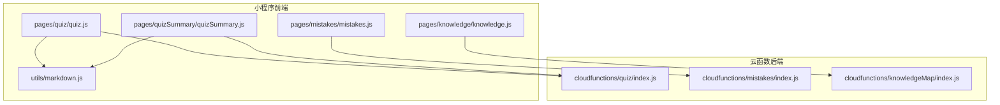

图表来源
- [miniprogram/pages/quiz/quiz.js](file://miniprogram/pages/quiz/quiz.js)
- [miniprogram/pages/quizSummary/quizSummary.js](file://miniprogram/pages/quizSummary/quizSummary.js)
- [miniprogram/pages/mistakes/mistakes.js](file://miniprogram/pages/mistakes/mistakes.js)
- [miniprogram/pages/knowledge/knowledge.js](file://miniprogram/pages/knowledge/knowledge.js)
- [miniprogram/utils/markdown.js](file://miniprogram/utils/markdown.js)
- [cloudfunctions/quiz/index.js](file://cloudfunctions/quiz/index.js)
- [cloudfunctions/mistakes/index.js](file://cloudfunctions/mistakes/index.js)
- [cloudfunctions/knowledgeMap/index.js](file://cloudfunctions/knowledgeMap/index.js)

章节来源
- [miniprogram/pages/quiz/quiz.js](file://miniprogram/pages/quiz/quiz.js)
- [miniprogram/pages/quizSummary/quizSummary.js](file://miniprogram/pages/quizSummary/quizSummary.js)
- [miniprogram/pages/mistakes/mistakes.js](file://miniprogram/pages/mistakes/mistakes.js)
- [miniprogram/pages/knowledge/knowledge.js](file://miniprogram/pages/knowledge/knowledge.js)
- [miniprogram/utils/markdown.js](file://miniprogram/utils/markdown.js)
- [cloudfunctions/quiz/index.js](file://cloudfunctions/quiz/index.js)
- [cloudfunctions/mistakes/index.js](file://cloudfunctions/mistakes/index.js)
- [cloudfunctions/knowledgeMap/index.js](file://cloudfunctions/knowledgeMap/index.js)

## 核心组件
本节聚焦题目管理的核心数据模型与关键流程，包括：
- 题目实体与字段设计
- 题型分类与答案结构
- 难度等级与评分权重
- 知识点与标签体系
- 检索与过滤条件
- 批量导入导出与版本管理
- 审核流程与状态机
- 质量评估与智能推荐

章节来源
- [cloudfunctions/quiz/index.js](file://cloudfunctions/quiz/index.js)
- [miniprogram/pages/quiz/quiz.js](file://miniprogram/pages/quiz/quiz.js)
- [miniprogram/pages/quizSummary/quizSummary.js](file://miniprogram/pages/quizSummary/quizSummary.js)
- [miniprogram/pages/mistakes/mistakes.js](file://miniprogram/pages/mistakes/mistakes.js)
- [cloudfunctions/mistakes/index.js](file://cloudfunctions/mistakes/index.js)
- [cloudfunctions/knowledgeMap/index.js](file://cloudfunctions/knowledgeMap/index.js)
- [miniprogram/pages/knowledge/knowledge.js](file://miniprogram/pages/knowledge/knowledge.js)
- [miniprogram/utils/markdown.js](file://miniprogram/utils/markdown.js)

## 架构总览
题目管理采用前后端分离的调用模式：小程序页面通过云函数访问题目数据，结合本地 Markdown 渲染进行内容展示；错题与知识图谱作为辅助能力，支撑复习与个性化学习路径。

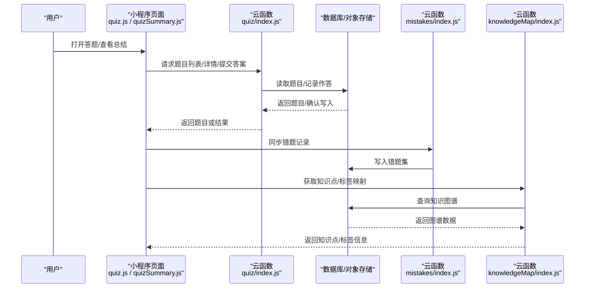

图表来源
- [miniprogram/pages/quiz/quiz.js](file://miniprogram/pages/quiz/quiz.js)
- [miniprogram/pages/quizSummary/quizSummary.js](file://miniprogram/pages/quizSummary/quizSummary.js)
- [cloudfunctions/quiz/index.js](file://cloudfunctions/quiz/index.js)
- [cloudfunctions/mistakes/index.js](file://cloudfunctions/mistakes/index.js)
- [cloudfunctions/knowledgeMap/index.js](file://cloudfunctions/knowledgeMap/index.js)

## 详细组件分析

### 题目数据模型与题型分类
- 题目实体建议包含以下字段：
  - 标识与元信息：id、title、content、type、difficulty、tags、knowledgeIds、version、status、createdAt、updatedAt
  - 题型字段：
    - 单选题：options（数组）、answer（单值）
    - 多选题：options（数组）、answer（多值集合）
    - 填空题：blanks（数组）、answers（对应答案集合）
  - 扩展字段：explanation、source、mediaUrls、stats（正确率、作答次数等）
- 题型校验规则：
  - 单选题：options 长度≥2，answer 在 options 中
  - 多选题：options 长度≥2，answer 为 options 子集且非空
  - 填空题：blanks 与 answers 一一对应，支持正则或标准化匹配
- 难度等级：
  - 建议使用枚举或数值区间，如 1-5 级，用于筛选与推荐加权
- 知识点与标签：
  - knowledgeIds 指向知识图谱节点，tags 用于自由分类与检索
- 版本管理：
  - version 字段递增，变更时更新 updatedAt，便于审计与回滚
- 审核状态：
  - status 使用状态机：草稿(draft)、待审(pending)、已发布(published)、已归档(archived)

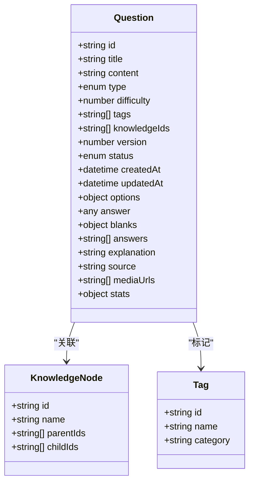

图表来源
- [cloudfunctions/quiz/index.js](file://cloudfunctions/quiz/index.js)
- [cloudfunctions/knowledgeMap/index.js](file://cloudfunctions/knowledgeMap/index.js)

章节来源
- [cloudfunctions/quiz/index.js](file://cloudfunctions/quiz/index.js)
- [cloudfunctions/knowledgeMap/index.js](file://cloudfunctions/knowledgeMap/index.js)

### 题目存储与检索机制
- 存储层：
  - 题目主表按 id 索引，支持按 type、difficulty、tags、knowledgeIds 组合查询
  - 统计字段 stats 可定期聚合更新，避免实时计算开销
- 检索与过滤：
  - 支持关键词检索（标题/内容/选项），模糊匹配
  - 支持多维过滤：题型、难度、标签、知识点、状态、时间范围
  - 分页与排序：按创建时间、热度、正确率等维度排序
- 缓存策略：
  - 热点题目与知识图谱局部缓存，降低重复查询成本

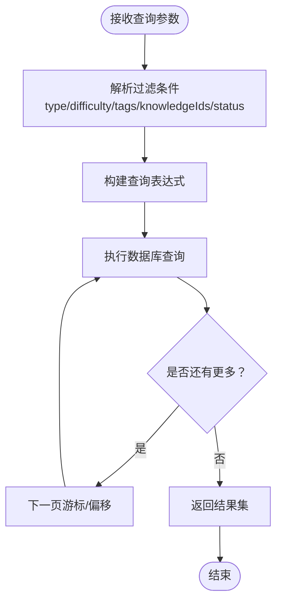

章节来源
- [cloudfunctions/quiz/index.js](file://cloudfunctions/quiz/index.js)

### 批量导入导出与版本管理
- 批量导入：
  - 支持 CSV/JSON 模板上传，服务端校验必填字段与题型约束
  - 导入过程分批次写入，失败项记录错误日志并返回明细
  - 导入完成后触发质量评估与自动打标（基于内容相似度与历史数据）
- 批量导出：
  - 支持按过滤条件导出当前数据集，生成结构化文件供离线编辑
- 版本管理：
  - 每次变更递增 version，保留历史快照，支持对比与回滚
  - 审核通过后发布新版本，旧版本归档

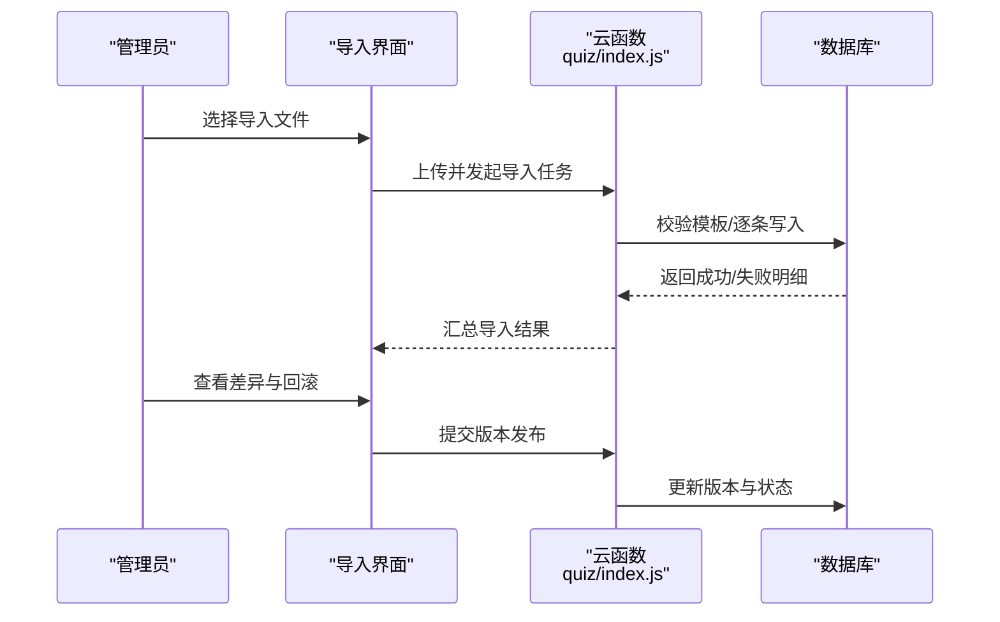

图表来源
- [cloudfunctions/quiz/index.js](file://cloudfunctions/quiz/index.js)

章节来源
- [cloudfunctions/quiz/index.js](file://cloudfunctions/quiz/index.js)

### 审核流程与状态机
- 状态定义：
  - 草稿(draft)：新建或编辑中的题目
  - 待审(pending)：提交审核
  - 已发布(published)：审核通过，对外可见
  - 已归档(archived)：不再参与检索与推荐
- 流转规则：
  - draft → pending：提交审核
  - pending → published：审核通过
  - pending → draft：审核驳回
  - published → archived：下线归档
- 审计记录：
  - 记录操作人、时间、原因，支持追溯

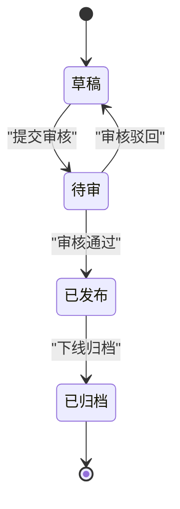

章节来源
- [cloudfunctions/quiz/index.js](file://cloudfunctions/quiz/index.js)

### 题目质量评估算法
- 指标维度：
  - 内容完整性：题干/选项/答案/解析齐全度
  - 歧义性检测：选项重叠、答案不唯一、语言模糊
  - 难度合理性：与同类题正确率偏差
  - 知识点覆盖：是否关联至少一个有效知识点
  - 标签一致性：标签与内容语义匹配度
- 评分方法：
  - 规则打分 + 统计修正：基础分由规则计算，结合历史作答统计进行修正
  - 阈值控制：低于阈值的题目进入人工复核队列
- 输出：
  - 质量分数、问题清单、改进建议

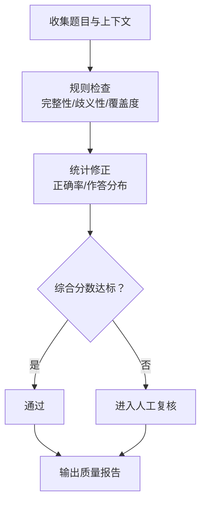

章节来源
- [cloudfunctions/quiz/index.js](file://cloudfunctions/quiz/index.js)

### 智能推荐策略
- 目标：
  - 根据用户能力、薄弱点与兴趣，动态推荐合适难度的题目
- 策略要点：
  - 冷启动：基于知识点与标签的均衡探索
  - 强化学习式调整：依据作答反馈更新偏好权重
  - 多样性约束：避免单一知识点或题型过度集中
  - 难度自适应：根据最近作答表现动态调整难度区间
- 数据来源：
  - 用户作答历史、错题集、知识点掌握度、题目统计

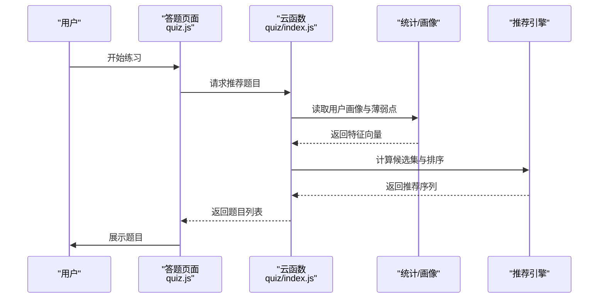

图表来源
- [miniprogram/pages/quiz/quiz.js](file://miniprogram/pages/quiz/quiz.js)
- [cloudfunctions/quiz/index.js](file://cloudfunctions/quiz/index.js)

章节来源
- [miniprogram/pages/quiz/quiz.js](file://miniprogram/pages/quiz/quiz.js)
- [cloudfunctions/quiz/index.js](file://cloudfunctions/quiz/index.js)

### 错题管理与复习闭环
- 错题采集：
  - 用户作答错误时，记录题目 id、作答时间、错误类型、知识点
- 错题聚合：
  - 按知识点/标签聚合，生成薄弱点视图
- 复习推荐：
  - 基于错题集与掌握度，推送针对性题目

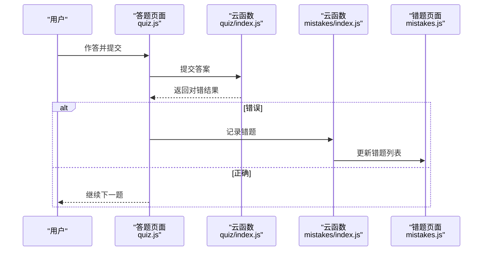

图表来源
- [miniprogram/pages/quiz/quiz.js](file://miniprogram/pages/quiz/quiz.js)
- [cloudfunctions/quiz/index.js](file://cloudfunctions/quiz/index.js)
- [miniprogram/pages/mistakes/mistakes.js](file://miniprogram/pages/mistakes/mistakes.js)
- [cloudfunctions/mistakes/index.js](file://cloudfunctions/mistakes/index.js)

章节来源
- [miniprogram/pages/quiz/quiz.js](file://miniprogram/pages/quiz/quiz.js)
- [cloudfunctions/quiz/index.js](file://cloudfunctions/quiz/index.js)
- [miniprogram/pages/mistakes/mistakes.js](file://miniprogram/pages/mistakes/mistakes.js)
- [cloudfunctions/mistakes/index.js](file://cloudfunctions/mistakes/index.js)

### 知识点与标签系统
- 知识点图谱：
  - 节点包含 id、name、父子关系，支持层级浏览与路径回溯
- 标签体系：
  - 自由标签与分类标签并存，便于灵活检索与聚合
- 关联维护：
  - 题目与知识点双向关联，支持批量绑定与解绑

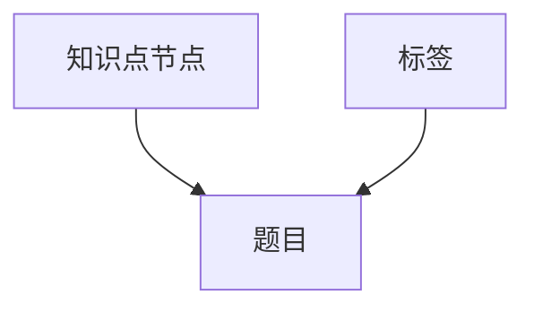

图表来源
- [cloudfunctions/knowledgeMap/index.js](file://cloudfunctions/knowledgeMap/index.js)
- [miniprogram/pages/knowledge/knowledge.js](file://miniprogram/pages/knowledge/knowledge.js)

章节来源
- [cloudfunctions/knowledgeMap/index.js](file://cloudfunctions/knowledgeMap/index.js)
- [miniprogram/pages/knowledge/knowledge.js](file://miniprogram/pages/knowledge/knowledge.js)

### 内容渲染与富文本支持
- Markdown 渲染：
  - 使用工具库将题目内容与解析渲染为富文本，提升可读性
- 媒体资源：
  - 支持图片、音频等多媒体嵌入，统一通过 URL 列表管理

章节来源
- [miniprogram/utils/markdown.js](file://miniprogram/utils/markdown.js)

## 依赖关系分析
- 前端依赖：
  - 答题与总结页面依赖云函数接口与 Markdown 工具
- 后端依赖：
  - 题目云函数依赖数据库与对象存储
  - 错题与知识图谱云函数分别维护各自的数据域
- 耦合与内聚：
  - 各云函数职责清晰，低耦合；前端按页面划分，高内聚

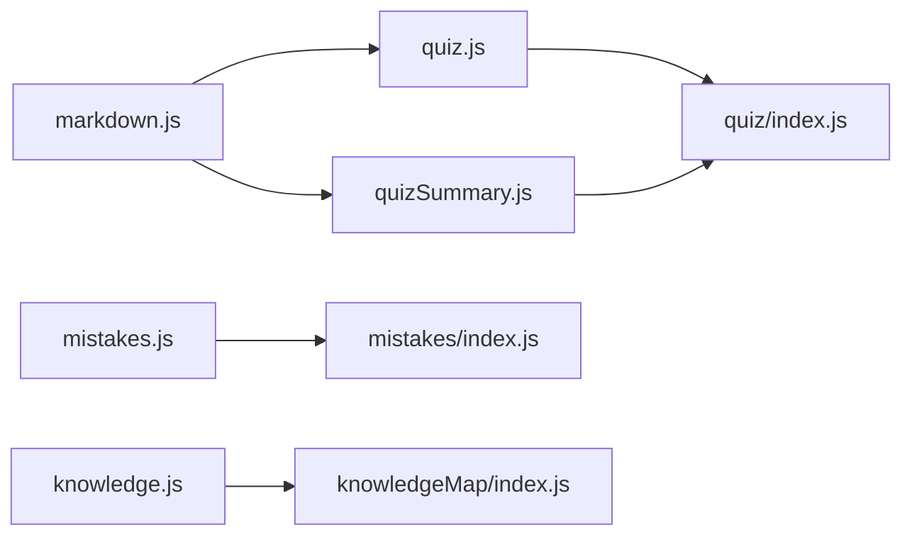

图表来源
- [miniprogram/pages/quiz/quiz.js](file://miniprogram/pages/quiz/quiz.js)
- [miniprogram/pages/quizSummary/quizSummary.js](file://miniprogram/pages/quizSummary/quizSummary.js)
- [miniprogram/pages/mistakes/mistakes.js](file://miniprogram/pages/mistakes/mistakes.js)
- [miniprogram/pages/knowledge/knowledge.js](file://miniprogram/pages/knowledge/knowledge.js)
- [miniprogram/utils/markdown.js](file://miniprogram/utils/markdown.js)
- [cloudfunctions/quiz/index.js](file://cloudfunctions/quiz/index.js)
- [cloudfunctions/mistakes/index.js](file://cloudfunctions/mistakes/index.js)
- [cloudfunctions/knowledgeMap/index.js](file://cloudfunctions/knowledgeMap/index.js)

章节来源
- [miniprogram/pages/quiz/quiz.js](file://miniprogram/pages/quiz/quiz.js)
- [miniprogram/pages/quizSummary/quizSummary.js](file://miniprogram/pages/quizSummary/quizSummary.js)
- [miniprogram/pages/mistakes/mistakes.js](file://miniprogram/pages/mistakes/mistakes.js)
- [miniprogram/pages/knowledge/knowledge.js](file://miniprogram/pages/knowledge/knowledge.js)
- [miniprogram/utils/markdown.js](file://miniprogram/utils/markdown.js)
- [cloudfunctions/quiz/index.js](file://cloudfunctions/quiz/index.js)
- [cloudfunctions/mistakes/index.js](file://cloudfunctions/mistakes/index.js)
- [cloudfunctions/knowledgeMap/index.js](file://cloudfunctions/knowledgeMap/index.js)

## 性能考虑
- 查询优化：
  - 合理索引：type、difficulty、tags、knowledgeIds、status
  - 分页与游标：避免全量拉取
- 缓存策略：
  - 热点题目与知识图谱局部缓存，减少重复 IO
- 异步处理：
  - 批量导入导出采用任务队列，避免阻塞主流程
- 统计聚合：
  - 定时任务更新 stats，降低在线计算压力

[本节为通用指导，无需具体文件引用]

## 故障排查指南
- 常见错误：
  - 题型校验失败：检查 options/answer/blanks/answers 结构与约束
  - 知识点未关联：确保 knowledgeIds 存在且有效
  - 标签缺失：补充必要标签以提升检索效果
- 定位步骤：
  - 查看云函数日志与返回码
  - 核对数据库记录与版本快照
  - 复现导入/导出流程，关注失败明细

章节来源
- [cloudfunctions/quiz/index.js](file://cloudfunctions/quiz/index.js)
- [cloudfunctions/mistakes/index.js](file://cloudfunctions/mistakes/index.js)

## 结论
题目管理模块以清晰的数据模型与状态机为基础，结合多维度检索、批量导入导出、版本管理与审核流程，构建了完整的题目生命周期管理能力。质量评估与智能推荐进一步提升了题目的可用性与学习的个性化体验。建议在后续迭代中持续完善统计指标与推荐策略，增强系统的智能化水平。

[本节为总结性内容，无需具体文件引用]

## 附录
- 术语说明：
  - 知识点：学科知识的最小单元，具有层级关系
  - 标签：对题目内容的自由分类标记
  - 版本：题目变更的历史快照，支持对比与回滚
- 最佳实践：
  - 严格题型校验与解析完整性检查
  - 保持标签与知识点的规范化命名
  - 定期复盘质量评估结果，优化题库结构

[本节为概念性内容，无需具体文件引用]