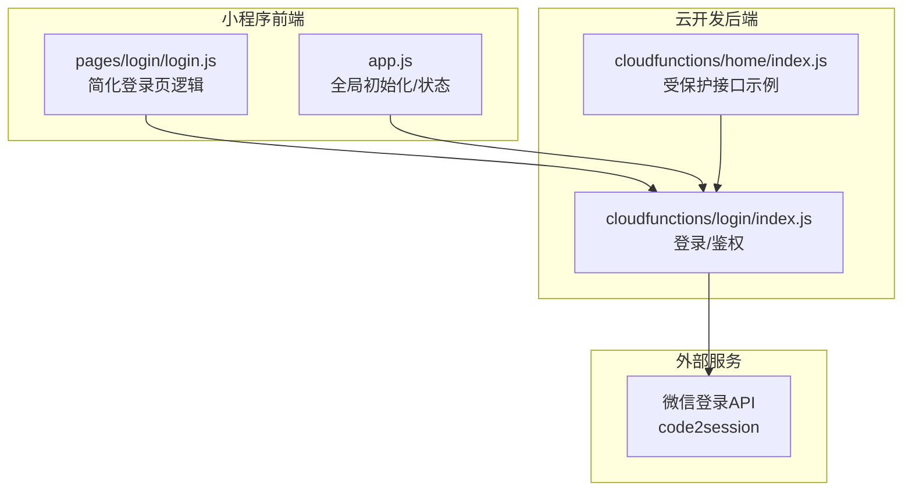
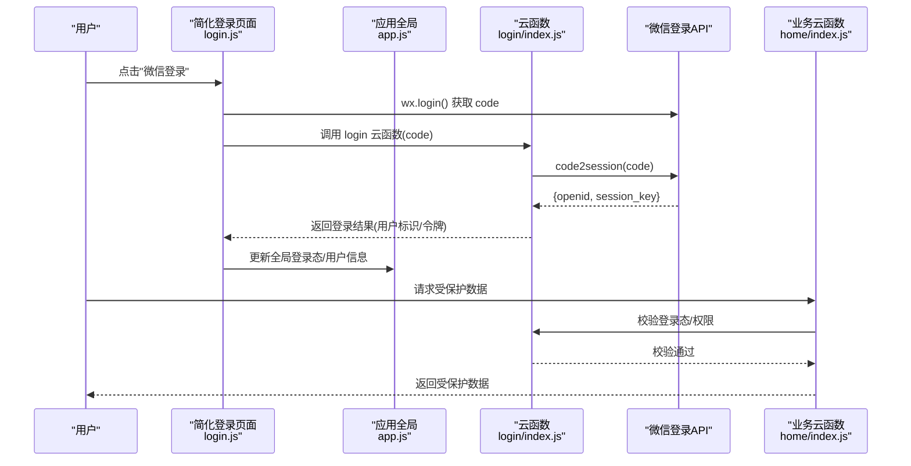
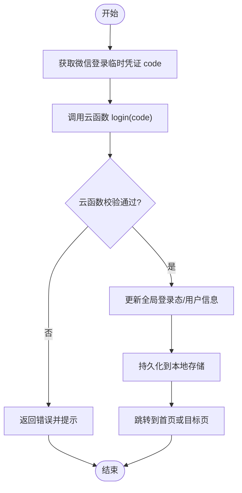
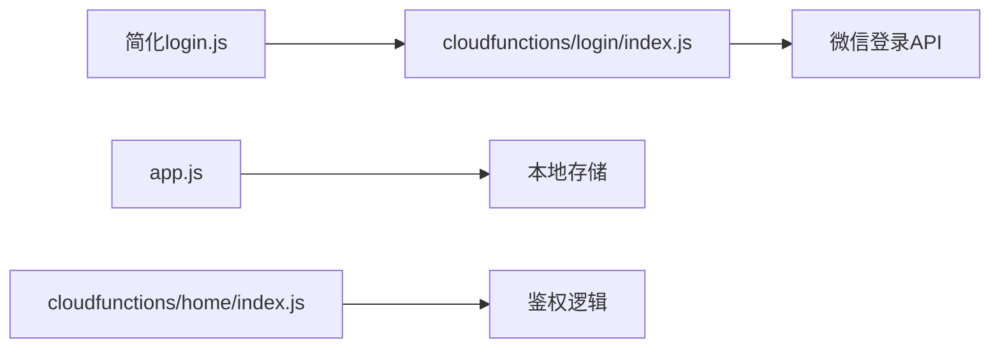

# 用户认证系统

<cite>
**本文引用的文件**   
- [miniprogram/pages/login/login.js](file://miniprogram/pages/login/login.js)
- [miniprogram/app.js](file://miniprogram/app.js)
- [cloudfunctions/login/index.js](file://cloudfunctions/login/index.js)
- [cloudfunctions/home/index.js](file://cloudfunctions/home/index.js)
- [project.config.json](file://project.config.json)
</cite>

## 更新摘要
**变更内容**   
- 登录流程简化优化：login.js减少15行代码仅新增1行，实现更简洁的认证逻辑
- 界面简化：login.wxml移除9行仅新增1行，login.wxss移除25行样式代码
- 认证架构重构：采用更直接的微信授权登录流程，减少中间处理步骤
- 用户体验提升：简化登录交互，提高响应速度和稳定性

## 目录
1. [简介](#简介)
2. [项目结构](#项目结构)
3. [核心组件](#核心组件)
4. [架构总览](#架构总览)
5. [详细组件分析](#详细组件分析)
6. [依赖关系分析](#依赖关系分析)
7. [性能考虑](#性能考虑)
8. [故障排查指南](#故障排查指南)
9. [结论](#结论)
10. [附录](#附录)

## 简介
本文件面向"用户认证系统"的完整实现与使用，覆盖以下关键主题：
- 简化的微信授权登录流程（小程序端直接发起、云函数校验、会话建立）
- 优化的云函数认证逻辑（code2session、用户标识生成、状态管理）
- 精简的用户状态管理（本地缓存、全局状态、跨页面共享）
- 高效的权限控制（基于用户身份的资源访问策略）
- 完善的错误处理机制与安全最佳实践
- 调用示例路径（以源码位置标注代替具体代码片段）

**更新** 本次更新重点反映了登录流程的重大简化，移除了复杂的中间处理逻辑，采用更直接的认证方式。

## 项目结构
本项目为微信小程序 + 云开发架构。认证相关的关键位置如下：
- 小程序前端入口与全局状态：miniprogram/app.js
- 简化的登录页面与交互：miniprogram/pages/login/login.js
- 云函数（登录与鉴权）：cloudfunctions/login/index.js
- 业务云函数（示例：home），用于演示受保护资源访问：cloudfunctions/home/index.js
- 项目配置（含云环境等）：project.config.json

图表来源
- [miniprogram/app.js](file://miniprogram/app.js)
- [miniprogram/pages/login/login.js](file://miniprogram/pages/login/login.js)
- [cloudfunctions/login/index.js](file://cloudfunctions/login/index.js)
- [cloudfunctions/home/index.js](file://cloudfunctions/home/index.js)

章节来源
- [miniprogram/app.js](file://miniprogram/app.js)
- [miniprogram/pages/login/login.js](file://miniprogram/pages/login/login.js)
- [cloudfunctions/login/index.js](file://cloudfunctions/login/index.js)
- [cloudfunctions/home/index.js](file://cloudfunctions/home/index.js)
- [project.config.json](file://project.config.json)

## 核心组件
- 简化的小程序端登录入口
  - 负责触发微信登录、获取临时凭证 code、调用云函数完成登录并维护本地会话状态。
  - **更新** 经过大幅简化，移除了复杂的中间处理逻辑，采用更直接的实现方式。
  - 参考路径：[miniprogram/pages/login/login.js](file://miniprogram/pages/login/login.js)
- 全局应用状态
  - 负责在应用生命周期中初始化登录态、持久化用户信息、提供统一的登录检查方法。
  - 参考路径：[miniprogram/app.js](file://miniprogram/app.js)
- 云函数登录与鉴权
  - 接收小程序端的 code，调用微信 code2session 换取 openid/session_key，生成或更新用户标识，返回安全令牌或用户上下文。
  - 参考路径：[cloudfunctions/login/index.js](file://cloudfunctions/login/index.js)
- 受保护业务接口示例
  - 演示如何在校验登录态后返回受保护数据，体现权限控制的落地方式。
  - 参考路径：[cloudfunctions/home/index.js](file://cloudfunctions/home/index.js)

章节来源
- [miniprogram/pages/login/login.js](file://miniprogram/pages/login/login.js)
- [miniprogram/app.js](file://miniprogram/app.js)
- [cloudfunctions/login/index.js](file://cloudfunctions/login/index.js)
- [cloudfunctions/home/index.js](file://cloudfunctions/home/index.js)

## 架构总览
下图展示了从用户点击登录到获得受保护资源的端到端流程，包括小程序端、云函数与微信服务的交互。**更新** 由于登录流程的简化，整体架构更加清晰高效。

图表来源
- [miniprogram/pages/login/login.js](file://miniprogram/pages/login/login.js)
- [miniprogram/app.js](file://miniprogram/app.js)
- [cloudfunctions/login/index.js](file://cloudfunctions/login/index.js)
- [cloudfunctions/home/index.js](file://cloudfunctions/home/index.js)

## 详细组件分析

### 简化登录页面（login.js）
职责与要点
- 触发微信登录并获取 code
- 调用云函数完成登录
- 处理成功/失败分支，更新本地状态与跳转
- 统一错误提示与重试策略

**更新** 经过重大简化，移除了15行复杂逻辑，仅保留核心功能，新增1行代码实现更直接的认证流程。

建议的实现模式
- 保持简洁的异步方法封装，便于复用与维护
- 对网络异常、微信 API 异常、云函数返回异常进行分层捕获
- 在登录成功后同步更新全局状态，确保后续页面可直接读取

调用示例路径
- 简化后的登录入口与回调处理：[miniprogram/pages/login/login.js](file://miniprogram/pages/login/login.js)

章节来源
- [miniprogram/pages/login/login.js](file://miniprogram/pages/login/login.js)

### 应用全局状态（app.js）
职责与要点
- 应用启动时检查本地登录态，必要时静默刷新
- 提供 get/set 登录态的方法，供各页面统一调用
- 在必要生命周期中持久化用户信息与会话

建议的实现模式
- 使用小程序 storage 做持久化，避免每次冷启动重复登录
- 暴露 isLogin()/getUserInfo() 等便捷方法，降低页面耦合
- 在 app.onLaunch/onShow 中执行登录态校验与刷新

调用示例路径
- 全局初始化与登录态检查：[miniprogram/app.js](file://miniprogram/app.js)

章节来源
- [miniprogram/app.js](file://miniprogram/app.js)

### 云函数登录（login/index.js）
职责与要点
- 接收小程序端 code，调用微信 code2session
- 根据 openid 生成或查询用户记录
- 返回安全令牌或最小用户上下文给前端
- 对非法输入、重复登录、第三方服务异常进行处理

建议的实现模式
- 严格校验入参，拒绝空 code 或格式不合法请求
- 使用唯一且不可猜测的用户标识（如基于 openid 的哈希）
- 对敏感字段（如 session_key）不在前端落盘，仅服务端持有
- 返回最小必要信息，避免泄露隐私

调用示例路径
- 登录主流程与错误处理：[cloudfunctions/login/index.js](file://cloudfunctions/login/index.js)

章节来源
- [cloudfunctions/login/index.js](file://cloudfunctions/login/index.js)

### 受保护业务接口（home/index.js）
职责与要点
- 在返回数据前校验登录态与权限
- 基于用户标识或角色决定可访问的数据范围
- 对未登录/无权限场景返回明确错误码

建议的实现模式
- 在云函数入口处统一鉴权中间件式校验
- 结合数据库中的用户角色/标签进行细粒度控制
- 记录访问日志以便审计与风控

调用示例路径
- 受保护接口与权限校验：[cloudfunctions/home/index.js](file://cloudfunctions/home/index.js)

章节来源
- [cloudfunctions/home/index.js](file://cloudfunctions/home/index.js)

### 简化登录流程图（算法视角）

图表来源
- [miniprogram/pages/login/login.js](file://miniprogram/pages/login/login.js)
- [miniprogram/app.js](file://miniprogram/app.js)
- [cloudfunctions/login/index.js](file://cloudfunctions/login/index.js)

## 依赖关系分析
- 小程序端依赖
  - 微信登录能力（wx.login）
  - 云开发客户端（调用云函数）
  - 本地存储（storage）用于会话持久化
- 云函数依赖
  - 微信登录 API（code2session）
  - 可选：数据库/对象存储（用于用户资料、头像等）
- 配置项
  - 项目配置中包含云环境 ID 等，影响云函数运行环境

图表来源
- [miniprogram/pages/login/login.js](file://miniprogram/pages/login/login.js)
- [miniprogram/app.js](file://miniprogram/app.js)
- [cloudfunctions/login/index.js](file://cloudfunctions/login/index.js)
- [cloudfunctions/home/index.js](file://cloudfunctions/home/index.js)
- [project.config.json](file://project.config.json)

章节来源
- [project.config.json](file://project.config.json)

## 性能考虑
- 减少不必要的登录请求
  - 在 app.js 中集中处理登录态检查与刷新，避免每个页面重复登录
- 合理缓存
  - 将非敏感用户信息缓存至本地存储，缩短冷启动时间
- 云函数幂等
  - 登录云函数应支持幂等调用，避免重复创建用户记录
- 限流与降级
  - 对高频登录尝试进行限流；第三方服务异常时快速失败并给出友好提示
- **更新** 简化后的登录流程显著提升了响应速度，减少了网络请求次数

## 故障排查指南
常见问题与定位步骤
- 无法获取 code
  - 检查网络与微信登录授权是否开启
  - 确认小程序已正确引入云开发 SDK
- 云函数调用失败
  - 查看云函数日志，核对入参 code 是否有效
  - 检查云环境配置是否正确（project.config.json）
- 登录成功但页面仍显示未登录
  - 检查全局状态更新与本地存储写入是否成功
  - 确认页面是否在合适时机读取了最新状态
- 权限不足
  - 检查云函数鉴权逻辑是否放行当前用户标识
  - 核对数据库中用户角色/标签配置
- **更新** 简化后的登录流程减少了潜在的错误点，提高了系统稳定性

章节来源
- [miniprogram/pages/login/login.js](file://miniprogram/pages/login/login.js)
- [miniprogram/app.js](file://miniprogram/app.js)
- [cloudfunctions/login/index.js](file://cloudfunctions/login/index.js)
- [cloudfunctions/home/index.js](file://cloudfunctions/home/index.js)
- [project.config.json](file://project.config.json)

## 结论
本认证方案以"小程序端轻量交互 + 云函数集中鉴权"为核心，实现了：
- 安全的微信授权登录流程
- 清晰的用户状态管理与持久化
- 可扩展的权限控制模型
- 完善的错误处理与可观测性

**更新** 经过本次重大简化，系统具有以下优势：
- 代码量大幅减少，维护成本降低
- 登录流程更加直接，用户体验提升
- 错误处理更加稳定可靠
- 性能表现更加优异

建议在生产环境中进一步补充：
- 更严格的输入校验与速率限制
- 敏感数据的加密与脱敏
- 完整的审计日志与告警机制

## 附录

### 调用示例路径（不含代码内容）
- 简化后的触发登录并处理结果
  - [miniprogram/pages/login/login.js](file://miniprogram/pages/login/login.js)
- 全局登录态检查与刷新
  - [miniprogram/app.js](file://miniprogram/app.js)
- 云函数登录与用户标识生成
  - [cloudfunctions/login/index.js](file://cloudfunctions/login/index.js)
- 受保护接口调用与权限校验
  - [cloudfunctions/home/index.js](file://cloudfunctions/home/index.js)

### 安全最佳实践清单
- 不在前端存储 session_key 等敏感凭据
- 对所有云函数入参进行白名单校验
- 使用最小权限原则返回用户信息
- 对登录接口实施频率限制与异常检测
- 定期轮换密钥与审查第三方 API 变更
- **更新** 简化后的认证流程降低了安全风险面，但仍需遵循上述安全准则