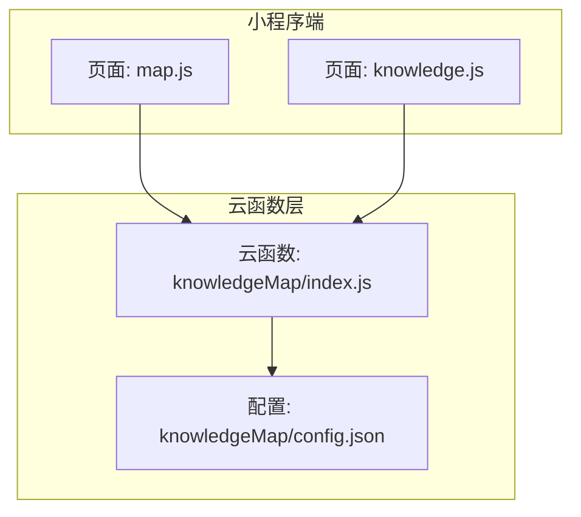
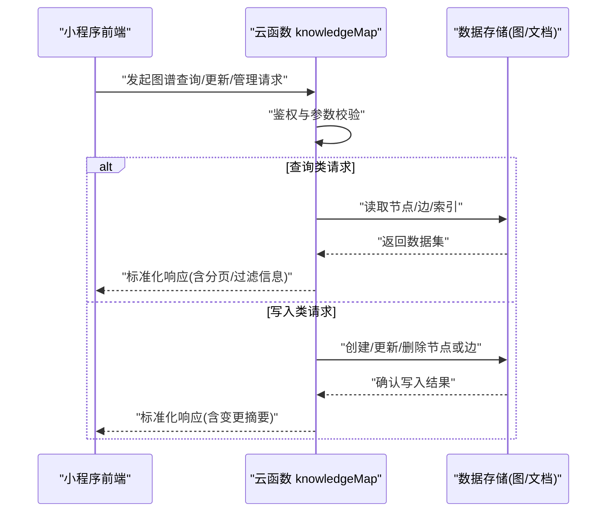
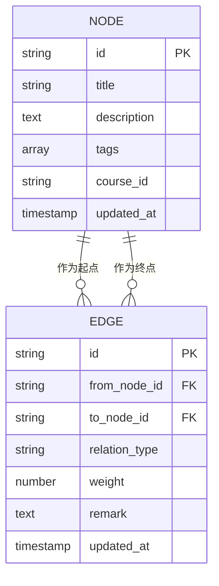
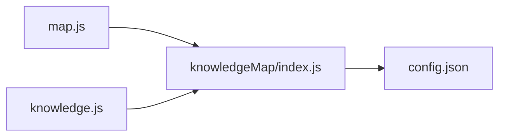

# API接口集成

<cite>
**本文引用的文件**   
- [cloudfunctions/knowledgeMap/index.js](file://cloudfunctions/knowledgeMap/index.js)
- [cloudfunctions/knowledgeMap/config.json](file://cloudfunctions/knowledgeMap/config.json)
- [miniprogram/pages/map/map.js](file://miniprogram/pages/map/map.js)
- [miniprogram/pages/knowledge/knowledge.js](file://miniprogram/pages/knowledge/knowledge.js)
</cite>

## 目录
1. [简介](#简介)
2. [项目结构](#项目结构)
3. [核心组件](#核心组件)
4. [架构总览](#架构总览)
5. [详细组件分析](#详细组件分析)
6. [依赖分析](#依赖分析)
7. [性能考虑](#性能考虑)
8. [故障排查指南](#故障排查指南)
9. [结论](#结论)
10. [附录](#附录) 

## 简介
本文件面向“知识图谱API接口集成”，聚焦云函数提供的图谱查询、更新与管理能力，结合小程序端调用路径，给出RESTful风格的设计说明、请求与响应格式约定、错误处理与权限控制机制。文档同时覆盖图谱数据的CRUD操作、批量导入导出与增量更新的实现要点，并提供调用示例、参数说明与最佳实践建议，帮助开发者快速、稳定地接入知识图谱相关功能。

## 项目结构
本项目采用“小程序前端 + 云函数后端”的常见分层：
- 小程序端负责页面交互与数据展示，通过云函数发起请求。
- 云函数提供图谱相关的业务逻辑与数据访问能力。
- 配置集中在各云函数的配置文件内，便于环境隔离与部署管理。

图表来源
- [cloudfunctions/knowledgeMap/index.js](file://cloudfunctions/knowledgeMap/index.js)
- [cloudfunctions/knowledgeMap/config.json](file://cloudfunctions/knowledgeMap/config.json)
- [miniprogram/pages/map/map.js](file://miniprogram/pages/map/map.js)
- [miniprogram/pages/knowledge/knowledge.js](file://miniprogram/pages/knowledge/knowledge.js)

章节来源
- [cloudfunctions/knowledgeMap/index.js](file://cloudfunctions/knowledgeMap/index.js)
- [cloudfunctions/knowledgeMap/config.json](file://cloudfunctions/knowledgeMap/config.json)
- [miniprogram/pages/map/map.js](file://miniprogram/pages/map/map.js)
- [miniprogram/pages/knowledge/knowledge.js](file://miniprogram/pages/knowledge/knowledge.js)

## 核心组件
- 云函数入口（knowledgeMap）
  - 职责：统一接收图谱相关请求，解析路由/动作，执行业务逻辑并返回标准化结果。
  - 关键点：鉴权上下文获取、参数校验、数据库/图存储访问、分页与过滤、事务与幂等控制。
- 小程序端调用方
  - 页面 map.js：负责图谱可视化与基础查询交互。
  - 页面 knowledge.js：负责知识点详情、编辑与同步。

章节来源
- [cloudfunctions/knowledgeMap/index.js](file://cloudfunctions/knowledgeMap/index.js)
- [miniprogram/pages/map/map.js](file://miniprogram/pages/map/map.js)
- [miniprogram/pages/knowledge/knowledge.js](file://miniprogram/pages/knowledge/knowledge.js)

## 架构总览
下图展示了从前端到云函数的典型调用链路，以及云函数内部对图谱数据的读写流程。

图表来源
- [cloudfunctions/knowledgeMap/index.js](file://cloudfunctions/knowledgeMap/index.js)
- [miniprogram/pages/map/map.js](file://miniprogram/pages/map/map.js)
- [miniprogram/pages/knowledge/knowledge.js](file://miniprogram/pages/knowledge/knowledge.js)

## 详细组件分析

### 云函数 knowledgeMap 接口规范
- 设计原则
  - RESTful风格：以资源为中心，使用HTTP动词表达操作语义；在云函数中通过请求体中的 action 字段映射为具体操作。
  - 统一响应：所有接口返回统一的 envelope，包含状态码、消息、数据体与追踪ID，便于前端一致化处理。
  - 鉴权与安全：基于登录态进行身份识别，按角色/范围限制可访问的资源集合。
  - 幂等与事务：写操作支持幂等键，关键路径使用事务保证一致性。
  - 分页与过滤：读操作默认分页，支持按标签、课程、时间等维度过滤。
- 通用请求头
  - Authorization：携带用户凭证（如Token），用于鉴权。
  - Content-Type：application/json。
  - X-Request-Id：可选，用于全链路追踪。
- 通用响应体
  - code：数字状态码（成功/失败）。
  - message：人类可读的消息。
  - data：业务数据对象。
  - trace_id：请求追踪标识。
- 鉴权与权限控制
  - 未登录：拒绝访问并返回鉴权错误。
  - 越权访问：根据资源归属与用户角色判断是否允许操作。
  - 敏感操作：需额外校验（如管理员标记、二次确认等）。
- 错误处理
  - 参数错误：返回明确的字段级错误提示。
  - 业务错误：返回可恢复的错误码与修复建议。
  - 系统错误：记录日志并返回通用错误码，避免泄露内部细节。
- 分页与过滤
  - 分页参数：page、pageSize、orderBy、sortDir。
  - 过滤参数：tag、courseId、keyword、timeRange 等。
- 幂等与并发
  - 幂等键：writeId 或 requestId，服务端去重。
  - 并发安全：写操作加锁或基于版本号的乐观锁。

章节来源
- [cloudfunctions/knowledgeMap/index.js](file://cloudfunctions/knowledgeMap/index.js)

### 图谱数据模型与关系
- 实体
  - 节点：表示知识点、概念、主题等，包含唯一标识、标题、描述、标签、关联课程、更新时间等。
  - 边：表示节点之间的关系，包含源节点、目标节点、关系类型、权重、备注等。
- 关系
  - 节点与边构成有向图，支持多标签、多课程聚合视图。
  - 索引：按标签、课程、关键词建立二级索引以提升查询性能。

图表来源
- [cloudfunctions/knowledgeMap/index.js](file://cloudfunctions/knowledgeMap/index.js)

### 图谱查询接口（Read）
- 资源定位
  - 根资源：/map
  - 子资源：/nodes、/edges、/relations
- 常用方法
  - GET /map/nodes：分页获取节点列表，支持过滤与排序。
  - GET /map/nodes/{id}：获取单个节点详情。
  - GET /map/edges：分页获取边列表，支持按关系类型过滤。
  - GET /map/relations/{nodeId}：获取某节点的邻接关系（入边/出边）。
- 请求参数
  - page、pageSize：分页。
  - filter：过滤条件（tags、courseId、keyword 等）。
  - sort：排序字段与方向。
- 响应数据
  - items：数据数组。
  - total：总数。
  - hasMore：是否有下一页。
- 错误码
  - 参数缺失/非法：返回参数错误码。
  - 资源不存在：返回对应错误码。
  - 鉴权失败：返回鉴权错误码。

章节来源
- [cloudfunctions/knowledgeMap/index.js](file://cloudfunctions/knowledgeMap/index.js)

### 图谱写入接口（Create/Update/Delete）
- 资源定位
  - POST /map/nodes：创建节点。
  - PUT /map/nodes/{id}：更新节点。
  - DELETE /map/nodes/{id}：删除节点。
  - POST /map/edges：创建边。
  - PUT /map/edges/{id}：更新边。
  - DELETE /map/edges/{id}：删除边。
- 请求体
  - 节点：title、description、tags、courseId 等。
  - 边：from_node_id、to_node_id、relation_type、weight、remark 等。
- 幂等与事务
  - writeId：确保重复提交不产生副作用。
  - 批量写入：在事务中执行，失败回滚。
- 响应数据
  - created/updated/deleted：布尔标志。
  - affected：受影响记录数。
  - conflicts：冲突信息（如唯一性约束）。

章节来源
- [cloudfunctions/knowledgeMap/index.js](file://cloudfunctions/knowledgeMap/index.js)

### 批量导入与导出（Batch Import/Export）
- 批量导入
  - POST /map/import
  - 支持JSON/CSV格式，包含节点与边的定义。
  - 支持增量模式：存在则更新，不存在则新增。
  - 返回导入统计与失败明细。
- 批量导出
  - GET /map/export?format=json|csv&filters=...
  - 支持按标签、课程、时间范围筛选。
  - 大文件导出采用异步任务+回调通知。

章节来源
- [cloudfunctions/knowledgeMap/index.js](file://cloudfunctions/knowledgeMap/index.js)

### 增量更新（Incremental Update）
- 策略
  - 基于时间戳或版本号：客户端携带 lastSyncTime 或 version。
  - 服务端返回自上次同步以来的变更集（新增/更新/删除）。
- 接口
  - GET /map/sync?lastSyncTime=...
  - 响应包含 nodesDelta、edgesDelta、nextSyncTime。
- 注意事项
  - 客户端合并策略：本地冲突解决规则（以服务端为准或人工介入）。
  - 断点续传：失败重试时携带上次同步游标。

章节来源
- [cloudfunctions/knowledgeMap/index.js](file://cloudfunctions/knowledgeMap/index.js)

### 小程序端调用示例与最佳实践
- 调用方式
  - 通过云函数入口发起请求，设置必要请求头与参数。
  - 统一封装错误处理与重试逻辑。
- 示例路径
  - 图谱页面：[map.js](file://miniprogram/pages/map/map.js)
  - 知识点页面：[knowledge.js](file://miniprogram/pages/knowledge/knowledge.js)
- 最佳实践
  - 缓存热点数据，减少重复请求。
  - 分页加载与懒渲染，提升首屏性能。
  - 网络异常退避重试与降级策略。
  - 输入校验与防抖，避免无效请求。

章节来源
- [miniprogram/pages/map/map.js](file://miniprogram/pages/map/map.js)
- [miniprogram/pages/knowledge/knowledge.js](file://miniprogram/pages/knowledge/knowledge.js)

## 依赖分析
- 模块耦合
  - 小程序页面仅依赖云函数入口，降低前后端耦合度。
  - 云函数内部按职责拆分：鉴权、参数校验、数据访问、响应封装。
- 外部依赖
  - 数据存储：图数据库或文档型数据库（由云函数配置决定）。
  - 认证服务：用于验证用户身份与权限。
- 潜在风险
  - 循环依赖：应避免跨模块直接引用。
  - 单点故障：关键接口需具备冗余与熔断。

图表来源
- [cloudfunctions/knowledgeMap/index.js](file://cloudfunctions/knowledgeMap/index.js)
- [cloudfunctions/knowledgeMap/config.json](file://cloudfunctions/knowledgeMap/config.json)
- [miniprogram/pages/map/map.js](file://miniprogram/pages/map/map.js)
- [miniprogram/pages/knowledge/knowledge.js](file://miniprogram/pages/knowledge/knowledge.js)

章节来源
- [cloudfunctions/knowledgeMap/index.js](file://cloudfunctions/knowledgeMap/index.js)
- [cloudfunctions/knowledgeMap/config.json](file://cloudfunctions/knowledgeMap/config.json)
- [miniprogram/pages/map/map.js](file://miniprogram/pages/map/map.js)
- [miniprogram/pages/knowledge/knowledge.js](file://miniprogram/pages/knowledge/knowledge.js)

## 性能考虑
- 查询优化
  - 合理使用索引与过滤条件，避免全表扫描。
  - 分页与限流，防止大数据量拖垮服务。
- 写入优化
  - 批量写入与事务合并，减少往返次数。
  - 幂等键与去重，避免重复计算。
- 缓存策略
  - 热点节点与关系缓存，缩短响应时间。
  - 失效策略：基于时间或事件触发刷新。
- 监控与告警
  - 记录关键指标：QPS、延迟、错误率。
  - 异常阈值告警，及时定位问题。

## 故障排查指南
- 常见问题
  - 鉴权失败：检查Authorization头与用户登录态。
  - 参数错误：核对必填字段与数据类型。
  - 资源不存在：确认ID有效且未被删除。
  - 写入冲突：检查唯一性约束与并发更新。
- 诊断步骤
  - 查看trace_id定位日志。
  - 复现最小用例，逐步缩小范围。
  - 对比期望与实际响应差异。
- 恢复措施
  - 重试与退避策略。
  - 回滚与补偿机制。
  - 降级与熔断保护。

章节来源
- [cloudfunctions/knowledgeMap/index.js](file://cloudfunctions/knowledgeMap/index.js)

## 结论
本接口规范围绕知识图谱的查询、更新与管理需求，提供了RESTful风格的统一设计、清晰的请求响应约定、完善的错误处理与权限控制机制，并覆盖了CRUD、批量导入导出与增量更新等关键场景。配合小程序端的调用示例与最佳实践，有助于构建稳定、高效、易维护的知识图谱集成方案。

## 附录
- 术语
  - 节点：图中的实体对象。
  - 边：节点之间的关系。
  - 幂等：多次执行与单次执行效果一致。
  - 增量同步：仅拉取自上次同步以来的变更。
- 参考
  - 云函数入口与配置：见本节开头所列文件。
  - 小程序调用示例：见页面JS文件。