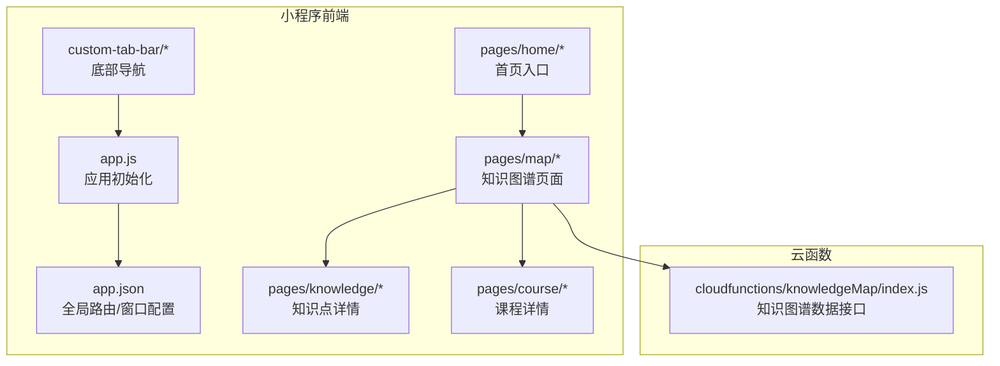
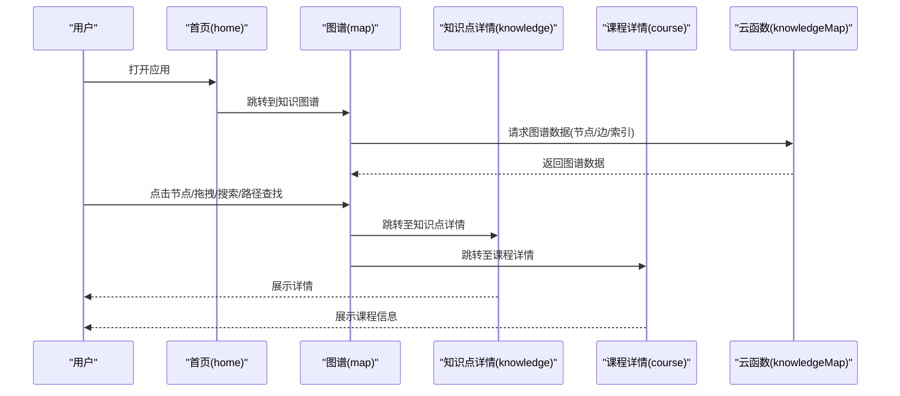
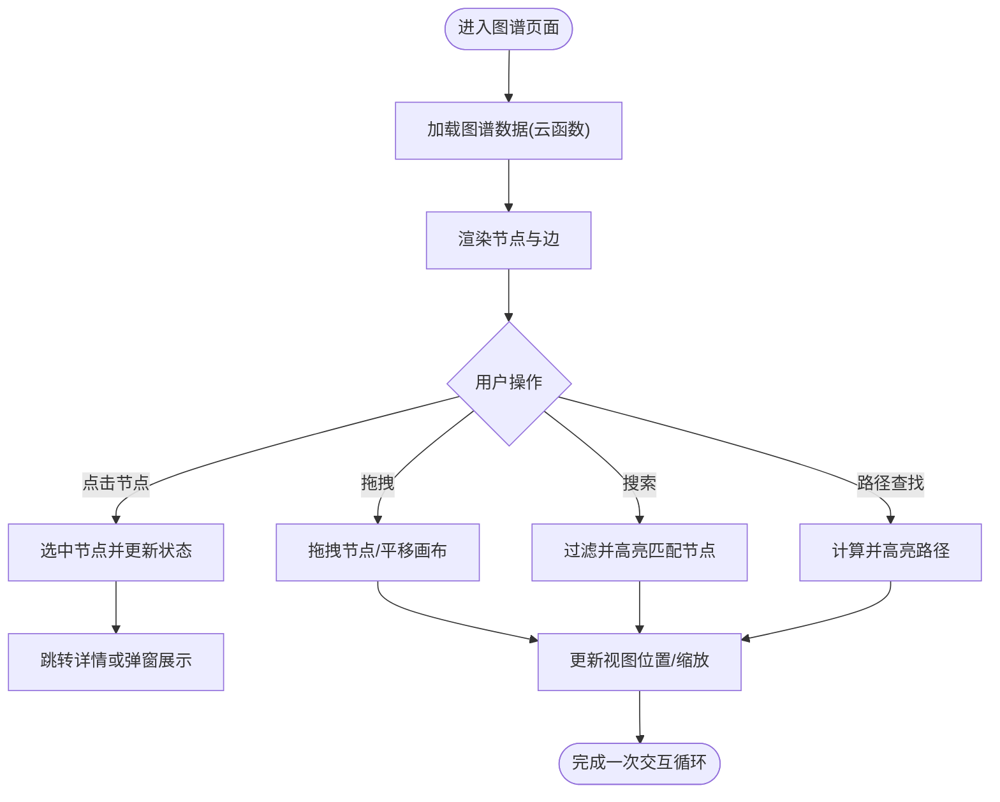
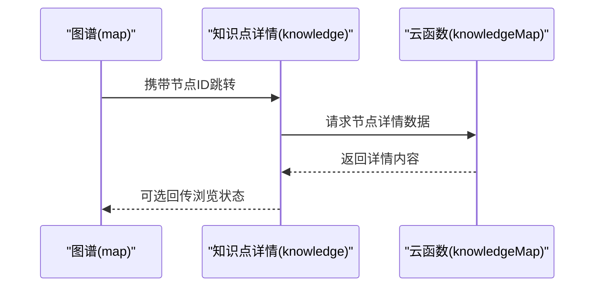
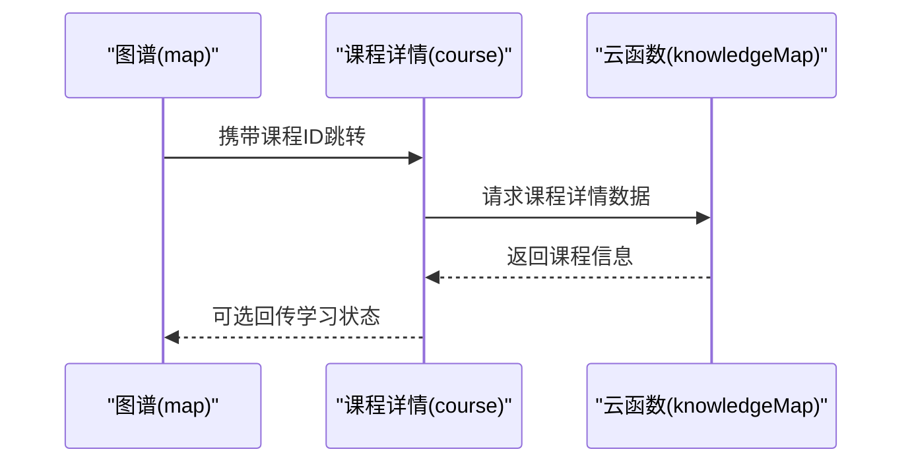
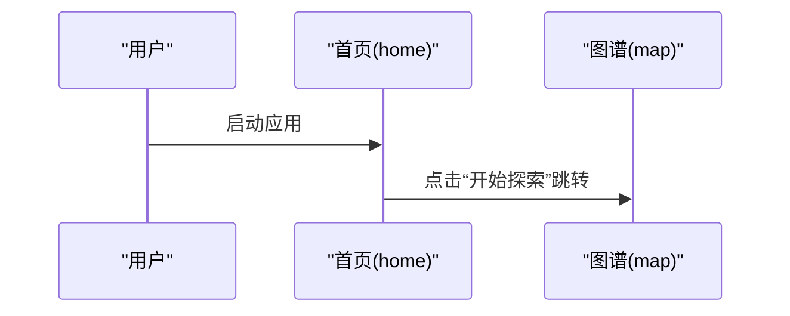
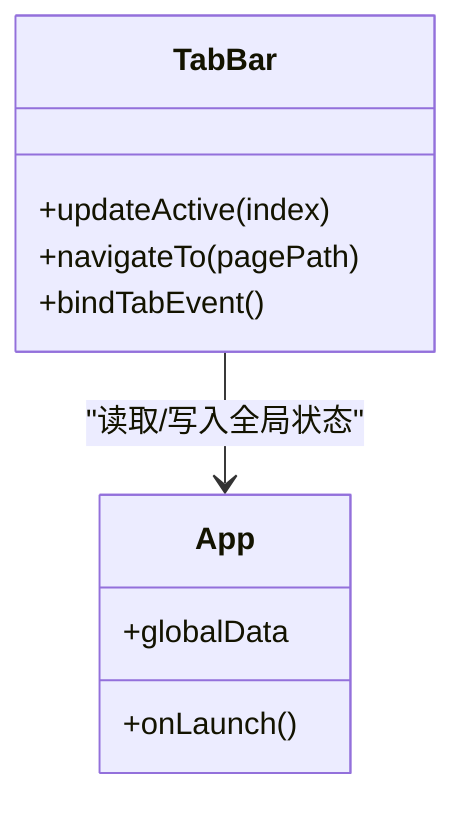
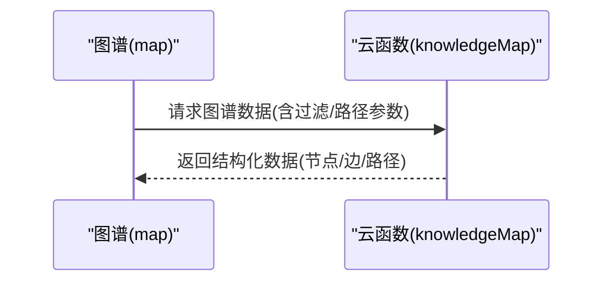
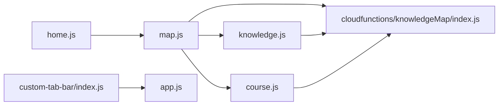

# 交互导航系统

<cite>
**本文引用的文件**   
- [app.json](file://miniprogram/app.json)
- [app.js](file://miniprogram/app.js)
- [map.js](file://miniprogram/pages/map/map.js)
- [map.wxml](file://miniprogram/pages/map/map.wxml)
- [map.wxss](file://miniprogram/pages/map/map.wxss)
- [knowledge.js](file://miniprogram/pages/knowledge/knowledge.js)
- [knowledge.wxml](file://miniprogram/pages/knowledge/knowledge.wxml)
- [course.js](file://miniprogram/pages/course/course.js)
- [course.wxml](file://miniprogram/pages/course/course.wxml)
- [home.js](file://miniprogram/pages/home/home.js)
- [home.wxml](file://miniprogram/pages/home/home.wxml)
- [custom-tab-bar/index.js](file://miniprogram/custom-tab-bar/index.js)
- [cloudfunctions/knowledgeMap/index.js](file://cloudfunctions/knowledgeMap/index.js)
</cite>

## 目录
1. [简介](#简介)
2. [项目结构](#项目结构)
3. [核心组件](#核心组件)
4. [架构总览](#架构总览)
5. [详细组件分析](#详细组件分析)
6. [依赖关系分析](#依赖关系分析)
7. [性能考虑](#性能考虑)
8. [故障排查指南](#故障排查指南)
9. [结论](#结论)
10. [附录](#附录)

## 简介
本文件面向“交互导航系统”，聚焦于用户与知识图谱的交互逻辑、导航流程与状态管理。文档覆盖以下关键能力：
- 节点点击、拖拽操作、搜索过滤与路径查找
- 手势识别、事件处理、路由跳转与页面状态同步
- 用户体验优化、无障碍访问与移动端适配最佳实践

该系统基于微信小程序前端（miniprogram）与云函数（cloudfunctions）协同实现，其中知识图谱数据由云端提供，前端负责可视化渲染与交互控制。

## 项目结构
本项目采用“页面+自定义组件+云函数”的分层组织方式：
- 小程序前端：miniprogram 下包含 pages（页面）、components（组件）、custom-tab-bar（底部导航）、utils（工具）等
- 云函数：cloudfunctions 下按功能域划分，如 knowledgeMap（知识图谱数据服务）
- 配置：project.config.json 为工程配置；miniprogram/app.json 定义应用级路由与窗口行为

图表来源
- [app.json](file://miniprogram/app.json)
- [app.js](file://miniprogram/app.js)
- [map.js](file://miniprogram/pages/map/map.js)
- [knowledge.js](file://miniprogram/pages/knowledge/knowledge.js)
- [course.js](file://miniprogram/pages/course/course.js)
- [home.js](file://miniprogram/pages/home/home.js)
- [custom-tab-bar/index.js](file://miniprogram/custom-tab-bar/index.js)
- [cloudfunctions/knowledgeMap/index.js](file://cloudfunctions/knowledgeMap/index.js)

章节来源
- [app.json](file://miniprogram/app.json)
- [app.js](file://miniprogram/app.js)

## 核心组件
- 知识图谱页面（map）：承载图谱可视化、节点交互（点击/拖拽）、搜索过滤、路径查找与视图平移缩放
- 知识点详情（knowledge）：展示选中节点的详细信息，支持从图谱跳转进入
- 课程详情（course）：关联课程资源，可从图谱或详情页跳转
- 首页（home）：作为入口页，引导至图谱或其他模块
- 自定义底部导航（custom-tab-bar）：统一主导航入口，支持高亮当前页
- 知识图谱云函数（knowledgeMap）：提供图谱节点、边、搜索与路径查询等数据接口

章节来源
- [map.js](file://miniprogram/pages/map/map.js)
- [map.wxml](file://miniprogram/pages/map/map.wxml)
- [map.wxss](file://miniprogram/pages/map/map.wxss)
- [knowledge.js](file://miniprogram/pages/knowledge/knowledge.js)
- [knowledge.wxml](file://miniprogram/pages/knowledge/knowledge.wxml)
- [course.js](file://miniprogram/pages/course/course.js)
- [course.wxml](file://miniprogram/pages/course/course.wxml)
- [home.js](file://miniprogram/pages/home/home.js)
- [home.wxml](file://miniprogram/pages/home/home.wxml)
- [custom-tab-bar/index.js](file://miniprogram/custom-tab-bar/index.js)
- [cloudfunctions/knowledgeMap/index.js](file://cloudfunctions/knowledgeMap/index.js)

## 架构总览
整体架构分为三层：
- 表现层（小程序页面与组件）：负责渲染与交互
- 业务层（页面逻辑与状态管理）：封装交互流程、事件处理、路由跳转与状态同步
- 数据层（云函数）：提供图谱数据、搜索与路径计算

图表来源
- [home.js](file://miniprogram/pages/home/home.js)
- [map.js](file://miniprogram/pages/map/map.js)
- [knowledge.js](file://miniprogram/pages/knowledge/knowledge.js)
- [course.js](file://miniprogram/pages/course/course.js)
- [cloudfunctions/knowledgeMap/index.js](file://cloudfunctions/knowledgeMap/index.js)

## 详细组件分析

### 知识图谱页面（map）
职责与能力：
- 数据加载：调用云函数获取图谱数据并缓存
- 可视化渲染：在画布或容器内绘制节点与边
- 交互处理：
  - 节点点击：选中节点并触发详情跳转或高亮
  - 拖拽操作：支持节点拖拽与画布平移/缩放
  - 搜索过滤：根据关键词匹配节点并高亮/定位
  - 路径查找：输入起点与终点，计算并高亮最短路径
- 状态管理：维护选中节点、搜索词、路径结果、视图变换参数等

图表来源
- [map.js](file://miniprogram/pages/map/map.js)
- [map.wxml](file://miniprogram/pages/map/map.wxml)
- [map.wxss](file://miniprogram/pages/map/map.wxss)
- [cloudfunctions/knowledgeMap/index.js](file://cloudfunctions/knowledgeMap/index.js)

章节来源
- [map.js](file://miniprogram/pages/map/map.js)
- [map.wxml](file://miniprogram/pages/map/map.wxml)
- [map.wxss](file://miniprogram/pages/map/map.wxss)

### 知识点详情（knowledge）
职责与能力：
- 接收来自图谱页面的节点标识，拉取并展示详细内容
- 提供返回按钮与分享等操作
- 与图谱页面保持状态同步（如选中态、最近浏览记录）

图表来源
- [knowledge.js](file://miniprogram/pages/knowledge/knowledge.js)
- [knowledge.wxml](file://miniprogram/pages/knowledge/knowledge.wxml)
- [cloudfunctions/knowledgeMap/index.js](file://cloudfunctions/knowledgeMap/index.js)

章节来源
- [knowledge.js](file://miniprogram/pages/knowledge/knowledge.js)
- [knowledge.wxml](file://miniprogram/pages/knowledge/knowledge.wxml)

### 课程详情（course）
职责与能力：
- 展示课程相关信息，支持从图谱或详情页跳转进入
- 与图谱页面共享上下文（如学习进度、收藏状态）

图表来源
- [course.js](file://miniprogram/pages/course/course.js)
- [course.wxml](file://miniprogram/pages/course/course.wxml)
- [cloudfunctions/knowledgeMap/index.js](file://cloudfunctions/knowledgeMap/index.js)

章节来源
- [course.js](file://miniprogram/pages/course/course.js)
- [course.wxml](file://miniprogram/pages/course/course.wxml)

### 首页（home）
职责与能力：
- 作为应用入口，提供快速导航到知识图谱与其他模块
- 可承载推荐内容或快捷入口

图表来源
- [home.js](file://miniprogram/pages/home/home.js)
- [home.wxml](file://miniprogram/pages/home/home.wxml)
- [map.js](file://miniprogram/pages/map/map.js)

章节来源
- [home.js](file://miniprogram/pages/home/home.js)
- [home.wxml](file://miniprogram/pages/home/home.wxml)

### 自定义底部导航（custom-tab-bar）
职责与能力：
- 统一管理主导航入口，支持高亮当前页
- 与 app.json 的路由配置联动，确保导航一致性

图表来源
- [custom-tab-bar/index.js](file://miniprogram/custom-tab-bar/index.js)
- [app.json](file://miniprogram/app.json)
- [app.js](file://miniprogram/app.js)

章节来源
- [custom-tab-bar/index.js](file://miniprogram/custom-tab-bar/index.js)
- [app.json](file://miniprogram/app.json)
- [app.js](file://miniprogram/app.js)

### 知识图谱云函数（knowledgeMap）
职责与能力：
- 提供图谱数据接口：节点列表、边关系、标签索引
- 支持搜索过滤：按名称/标签/描述模糊匹配
- 支持路径查找：给定起点与终点，返回最短路径或相关路径集合

图表来源
- [cloudfunctions/knowledgeMap/index.js](file://cloudfunctions/knowledgeMap/index.js)
- [map.js](file://miniprogram/pages/map/map.js)

章节来源
- [cloudfunctions/knowledgeMap/index.js](file://cloudfunctions/knowledgeMap/index.js)

## 依赖关系分析
- 页面间依赖：
  - home → map（入口跳转）
  - map → knowledge / course（详情跳转）
  - custom-tab-bar ↔ app（导航与状态同步）
- 前后端依赖：
  - map 与 knowledge/course 均依赖 knowledgeMap 云函数获取数据
- 配置依赖：
  - app.json 定义页面路由与窗口行为，影响导航与显示策略

图表来源
- [home.js](file://miniprogram/pages/home/home.js)
- [map.js](file://miniprogram/pages/map/map.js)
- [knowledge.js](file://miniprogram/pages/knowledge/knowledge.js)
- [course.js](file://miniprogram/pages/course/course.js)
- [custom-tab-bar/index.js](file://miniprogram/custom-tab-bar/index.js)
- [app.js](file://miniprogram/app.js)
- [cloudfunctions/knowledgeMap/index.js](file://cloudfunctions/knowledgeMap/index.js)

章节来源
- [app.json](file://miniprogram/app.json)
- [app.js](file://miniprogram/app.js)

## 性能考虑
- 数据加载与缓存
  - 首次加载图谱数据后本地缓存，减少重复请求
  - 分页或按需加载大图谱，避免一次性渲染过多节点
- 渲染优化
  - 使用虚拟节点或可见区域裁剪，降低重绘压力
  - 对频繁更新的属性（如高亮、选中）进行增量更新
- 交互响应
  - 防抖与节流：搜索输入与拖拽事件需做节流，避免卡顿
  - 路径计算尽量在云端执行，前端仅负责展示与交互
- 网络与错误恢复
  - 失败重试与降级策略（离线缓存、默认视图）
  - 超时与断网提示，提升鲁棒性

[本节为通用指导，不直接分析具体文件]

## 故障排查指南
常见问题与定位建议：
- 图谱数据为空或加载失败
  - 检查云函数是否部署成功与权限配置
  - 确认前端请求参数与后端接口契约一致
- 节点点击无响应
  - 校验事件绑定与命中测试（z-index、层级遮挡）
  - 检查选中态状态更新与视图刷新逻辑
- 拖拽卡顿或偏移异常
  - 确认坐标转换与边界约束是否正确
  - 检查节流/防抖阈值与帧率
- 搜索过滤不准确
  - 核对关键词匹配规则与索引字段
  - 验证大小写、空格与特殊字符处理
- 路径查找结果异常
  - 检查图连通性与权重设置
  - 确认起点/终点存在且有效

章节来源
- [map.js](file://miniprogram/pages/map/map.js)
- [cloudfunctions/knowledgeMap/index.js](file://cloudfunctions/knowledgeMap/index.js)

## 结论
本交互导航系统以“图谱页面”为核心，结合“详情页面”与“云函数数据服务”，实现了完整的知识图谱浏览与探索体验。通过合理的事件处理、状态管理与性能优化策略，系统在移动端具备良好可用性与扩展性。后续可在无障碍访问、多端适配与复杂路径算法方面持续完善。

[本节为总结性内容，不直接分析具体文件]

## 附录

### 用户体验优化最佳实践
- 视觉反馈：点击/拖拽/搜索均有即时反馈（高亮、动画、提示）
- 渐进式披露：先展示概览，再按需展开详情
- 容错设计：无效输入给出友好提示，并提供撤销/重置操作

### 无障碍访问建议
- 键盘与读屏支持：为关键交互元素添加语义化标签与焦点顺序
- 对比度与字体：保证文本可读性与主题切换
- 快捷键：提供常用操作的键盘映射（如回车确认、Esc取消）

### 移动端适配要点
- 触控手势：单指平移、双指缩放、长按弹出菜单
- 布局自适应：小屏优先，关键信息前置
- 性能调优：减少重排重绘，合理使用懒加载与缓存

[本节为通用指导，不直接分析具体文件]