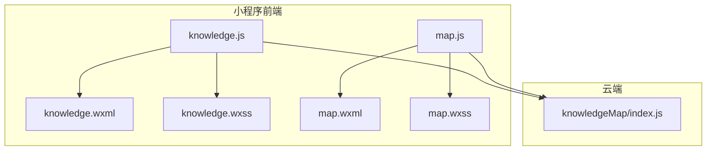
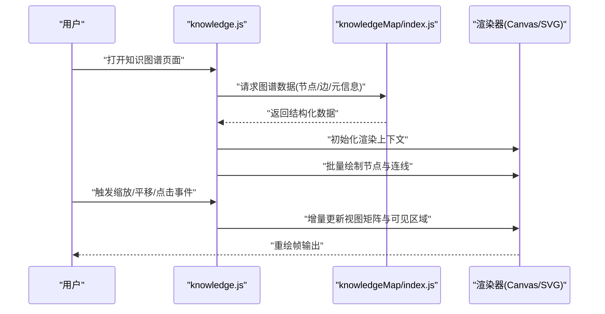
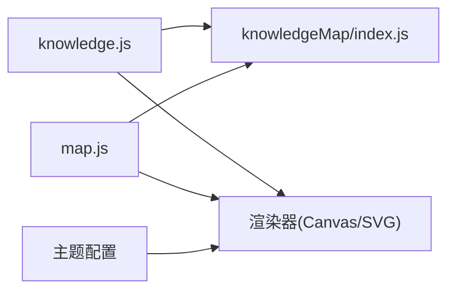

# 可视化渲染引擎

<cite>
**本文引用的文件**   
- [miniprogram/pages/knowledge/knowledge.js](file://miniprogram/pages/knowledge/knowledge.js)
- [miniprogram/pages/knowledge/knowledge.wxml](file://miniprogram/pages/knowledge/knowledge.wxml)
- [miniprogram/pages/knowledge/knowledge.wxss](file://miniprogram/pages/knowledge/knowledge.wxss)
- [miniprogram/pages/map/map.js](file://miniprogram/pages/map/map.js)
- [miniprogram/pages/map/map.wxml](file://miniprogram/pages/map/map.wxml)
- [miniprogram/pages/map/map.wxss](file://miniprogram/pages/map/map.wxss)
- [cloudfunctions/knowledgeMap/index.js](file://cloudfunctions/knowledgeMap/index.js)
</cite>

## 目录
1. [简介](#简介)
2. [项目结构](#项目结构)
3. [核心组件](#核心组件)
4. [架构总览](#架构总览)
5. [详细组件分析](#详细组件分析)
6. [依赖关系分析](#依赖关系分析)
7. [性能考量](#性能考量)
8. [故障排查指南](#故障排查指南)
9. [结论](#结论)
10. [附录](#附录)

## 简介
本文件面向“知识图谱”的前端可视化渲染引擎，聚焦微信小程序生态下的实现与优化。文档覆盖以下主题：
- 前端渲染实现：Canvas/SVG 技术选型、节点布局算法、连线绘制、缩放平移交互、动画效果
- 图形库集成：在小程序环境中如何引入并适配第三方图形库或自研渲染管线
- 性能优化策略：大规模数据处理方案、内存管理、渲染批处理与增量更新
- 样式与主题：自定义样式配置、主题切换、响应式适配
- 数据流与后端集成：云函数接口对接、数据加载与缓存策略

## 项目结构
本项目为微信小程序工程，包含页面、云函数与原型文件。与可视化渲染相关的代码主要分布在以下位置：
- 知识图谱页面：miniprogram/pages/knowledge/*
- 地图/图谱页面：miniprogram/pages/map/*
- 知识图谱云函数：cloudfunctions/knowledgeMap/index.js

图表来源
- [miniprogram/pages/knowledge/knowledge.js](file://miniprogram/pages/knowledge/knowledge.js)
- [miniprogram/pages/knowledge/knowledge.wxml](file://miniprogram/pages/knowledge/knowledge.wxml)
- [miniprogram/pages/knowledge/knowledge.wxss](file://miniprogram/pages/knowledge/knowledge.wxss)
- [miniprogram/pages/map/map.js](file://miniprogram/pages/map/map.js)
- [miniprogram/pages/map/map.wxml](file://miniprogram/pages/map/map.wxml)
- [miniprogram/pages/map/map.wxss](file://miniprogram/pages/map/map.wxss)
- [cloudfunctions/knowledgeMap/index.js](file://cloudfunctions/knowledgeMap/index.js)

章节来源
- [miniprogram/pages/knowledge/knowledge.js](file://miniprogram/pages/knowledge/knowledge.js)
- [miniprogram/pages/knowledge/knowledge.wxml](file://miniprogram/pages/knowledge/knowledge.wxml)
- [miniprogram/pages/knowledge/knowledge.wxss](file://miniprogram/pages/knowledge/knowledge.wxss)
- [miniprogram/pages/map/map.js](file://miniprogram/pages/map/map.js)
- [miniprogram/pages/map/map.wxml](file://miniprogram/pages/map/map.wxml)
- [miniprogram/pages/map/map.wxss](file://miniprogram/pages/map/map.wxss)
- [cloudfunctions/knowledgeMap/index.js](file://cloudfunctions/knowledgeMap/index.js)

## 核心组件
- 知识图谱页面（knowledge）
  - 负责知识图谱数据的请求、解析与渲染，提供节点点击、拖拽、缩放等交互能力
  - 通过 Canvas 或 SVG 进行绘制，结合小程序的 canvas 组件或 web-view 承载图形库
- 地图/图谱页面（map）
  - 作为通用可视化容器，可复用知识图谱渲染逻辑，支持多场景展示
- 云函数（knowledgeMap）
  - 提供图谱数据聚合、过滤与分页返回，减少前端计算压力

章节来源
- [miniprogram/pages/knowledge/knowledge.js](file://miniprogram/pages/knowledge/knowledge.js)
- [miniprogram/pages/map/map.js](file://miniprogram/pages/map/map.js)
- [cloudfunctions/knowledgeMap/index.js](file://cloudfunctions/knowledgeMap/index.js)

## 架构总览
整体采用“前端页面 + 云函数”的分层架构。前端负责渲染与交互，云函数负责数据准备与聚合。

图表来源
- [miniprogram/pages/knowledge/knowledge.js](file://miniprogram/pages/knowledge/knowledge.js)
- [cloudfunctions/knowledgeMap/index.js](file://cloudfunctions/knowledgeMap/index.js)

## 详细组件分析

### 知识图谱页面（knowledge）
- 职责
  - 数据加载：调用云函数获取图谱数据，并进行本地预处理（去重、索引构建、可见性裁剪）
  - 渲染管线：根据数据规模选择 Canvas 或 SVG；维护视图变换矩阵（缩放/平移）
  - 交互处理：监听触摸事件，实现拖拽节点、画布缩放平移、点击高亮
  - 动画系统：基于 requestAnimationFrame 或小程序帧回调驱动过渡动画
- 关键流程
  - 初始化：创建渲染上下文、设置视口尺寸、绑定事件
  - 数据接入：解析节点/边列表，构建邻接表与空间索引（如四叉树）
  - 布局计算：执行力导向或层次布局，生成初始坐标
  - 绘制循环：按层级绘制背景、连线、节点、标签；应用变换矩阵
  - 交互更新：根据手势更新视图矩阵，增量重绘可见区域
- 性能要点
  - 分片渲染：将大数据集拆分为多个批次，避免主线程阻塞
  - 可见性裁剪：仅绘制视口内元素，利用空间索引快速剔除不可见对象
  - 增量更新：变更时只重绘受影响区域，降低重绘成本
  - 纹理/位图缓存：对复杂节点图标进行离屏缓存，减少重复绘制

章节来源
- [miniprogram/pages/knowledge/knowledge.js](file://miniprogram/pages/knowledge/knowledge.js)
- [miniprogram/pages/knowledge/knowledge.wxml](file://miniprogram/pages/knowledge/knowledge.wxml)
- [miniprogram/pages/knowledge/knowledge.wxss](file://miniprogram/pages/knowledge/knowledge.wxss)

### 地图/图谱页面（map）
- 职责
  - 作为通用可视化容器，复用 knowledge 页面的渲染与交互逻辑
  - 支持多种数据源与布局策略，便于扩展新的图谱类型
- 关键流程
  - 初始化：注入数据适配器与渲染器实例
  - 事件转发：将用户手势转换为渲染器可识别的指令
  - 主题切换：读取主题配置，动态更新颜色、字体、阴影等样式
- 性能要点
  - 共享渲染上下文：多个页面共用同一渲染实例，减少资源占用
  - 懒加载：按需加载大图资源与复杂节点模板

章节来源
- [miniprogram/pages/map/map.js](file://miniprogram/pages/map/map.js)
- [miniprogram/pages/map/map.wxml](file://miniprogram/pages/map/map.wxml)
- [miniprogram/pages/map/map.wxss](file://miniprogram/pages/map/map.wxss)

### 云函数（knowledgeMap）
- 职责
  - 聚合图谱数据：从数据库或服务中拉取节点与边，进行关联与过滤
  - 分页与排序：支持按热度、时间、类别等维度分页返回
  - 缓存策略：对热点数据进行短期缓存，降低冷启动延迟
- 关键流程
  - 接收请求参数：页码、每页数量、筛选条件
  - 查询与聚合：执行数据库查询，组装节点/边结构
  - 返回结果：统一数据结构，附带元信息（总数、下一页标记）

章节来源
- [cloudfunctions/knowledgeMap/index.js](file://cloudfunctions/knowledgeMap/index.js)

## 依赖关系分析
- 前端页面与云函数解耦：通过标准 API 调用，便于替换数据源
- 渲染器与业务逻辑分离：渲染器仅关注绘制与交互，业务逻辑专注数据与状态
- 主题与样式配置独立：通过配置文件集中管理，支持运行时切换

图表来源
- [miniprogram/pages/knowledge/knowledge.js](file://miniprogram/pages/knowledge/knowledge.js)
- [miniprogram/pages/map/map.js](file://miniprogram/pages/map/map.js)
- [cloudfunctions/knowledgeMap/index.js](file://cloudfunctions/knowledgeMap/index.js)

## 性能考量
- 渲染技术选型
  - Canvas：适合大规模节点与频繁更新的场景，具备更好的绘制性能
  - SVG：适合少量节点且需要 DOM 级交互的场景，便于样式与事件处理
- 大规模数据处理
  - 数据分片：前后端协同分页，前端按批次渲染
  - 空间索引：使用四叉树或网格索引加速可见性判断与最近邻搜索
  - 增量更新：基于脏矩形或区域合并策略，最小化重绘范围
- 内存管理
  - 对象池：复用节点、边、路径等对象，减少 GC 压力
  - 资源卸载：离开页面时释放离屏缓冲与纹理缓存
  - 弱引用：对大对象使用弱引用，避免循环引用导致的泄漏
- 动画与帧率
  - 节流与防抖：对高频事件进行节流，避免过度重绘
  - 帧同步：使用 requestAnimationFrame 或小程序帧回调，保证动画流畅
  - 降级策略：低端设备自动降低粒子数、阴影强度与抗锯齿等级

[本节为通用指导，不直接分析具体文件]

## 故障排查指南
- 常见问题
  - 渲染卡顿：检查是否未启用可见性裁剪或分片渲染
  - 内存溢出：确认是否在页面销毁时释放了离屏缓冲与大对象
  - 交互异常：验证事件坐标系转换是否正确，尤其是缩放后的坐标映射
- 定位方法
  - 打印渲染统计：记录每帧绘制对象数量与耗时
  - 监控内存峰值：观察页面生命周期内的内存变化趋势
  - 复现路径：提供最小数据集与操作步骤，便于快速定位问题

[本节为通用指导，不直接分析具体文件]

## 结论
本渲染引擎以“前端页面 + 云函数”的架构为基础，围绕知识图谱的可视化需求，提供了可扩展的渲染管线与交互模型。通过合理的技术选型、数据分片、空间索引与增量更新策略，可在小程序环境下实现高性能的知识图谱展示。后续可进一步引入 GPU 加速、WebAssembly 与更丰富的主题系统，以提升体验与可维护性。

[本节为总结性内容，不直接分析具体文件]

## 附录
- 自定义样式配置
  - 集中定义颜色、字体、阴影、描边等样式变量，供渲染器与主题系统读取
  - 支持运行时切换主题，通过配置键值映射到实际样式属性
- 响应式适配
  - 根据屏幕密度与尺寸动态调整节点大小、标签字号与间距
  - 使用相对单位与视口比例，确保在不同设备上的一致性
- 主题切换实现
  - 主题配置文件与渲染器解耦，通过事件总线通知渲染器刷新样式
  - 支持暗色模式与高对比度模式，提升可访问性

[本节为概念性说明，不直接分析具体文件]