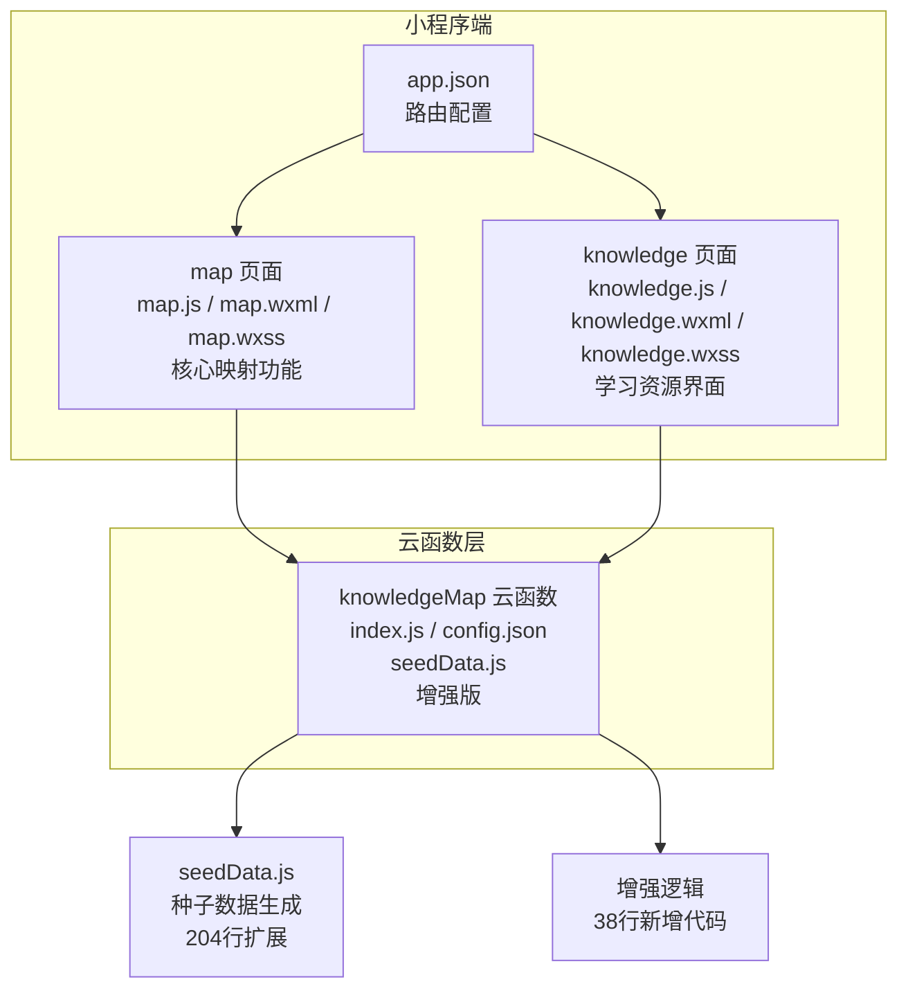
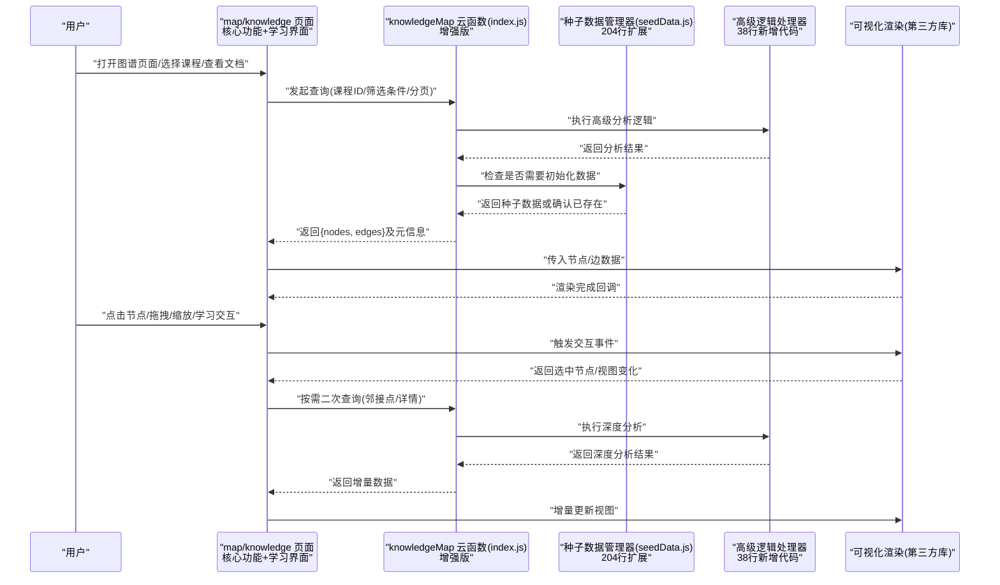
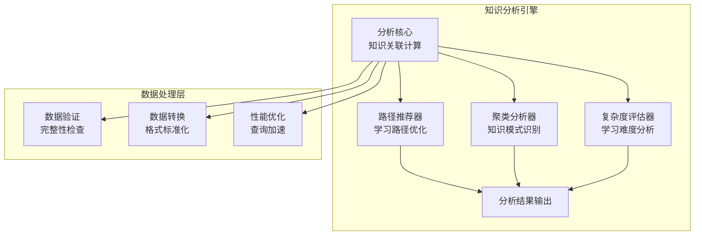
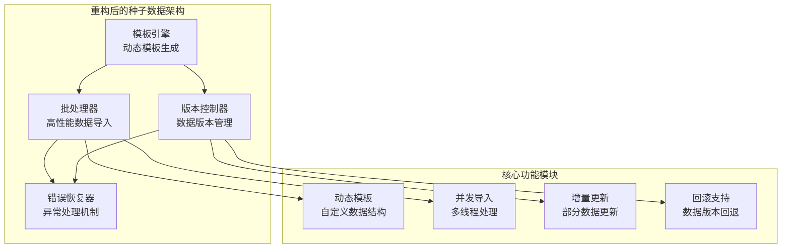
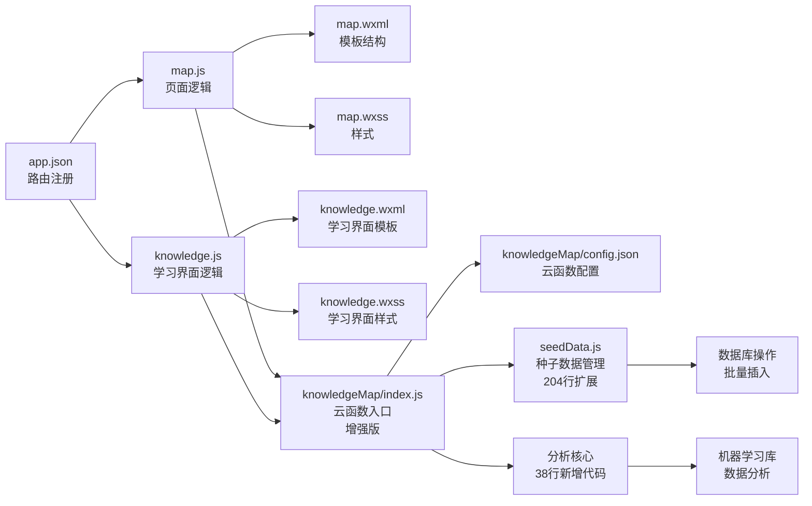

# 知识图谱系统

<cite>
**本文引用的文件**   
- [cloudfunctions/knowledgeMap/index.js](file://cloudfunctions/knowledgeMap/index.js)
- [cloudfunctions/knowledgeMap/config.json](file://cloudfunctions/knowledgeMap/config.json)
- [cloudfunctions/knowledgeMap/seedData.js](file://cloudfunctions/knowledgeMap/seedData.js)
- [miniprogram/pages/map/map.js](file://miniprogram/pages/map/map.js)
- [miniprogram/pages/map/map.wxml](file://miniprogram/pages/map/map.wxml)
- [miniprogram/pages/map/map.wxss](file://miniprogram/pages/map/map.wxss)
- [miniprogram/app.json](file://miniprogram/app.json)
- [miniprogram/pages/knowledge/knowledge.js](file://miniprogram/pages/knowledge/knowledge.js)
- [miniprogram/pages/knowledge/knowledge.wxml](file://miniprogram/pages/knowledge/knowledge.wxml)
- [miniprogram/pages/knowledge/knowledge.wxss](file://miniprogram/pages/knowledge/knowledge.wxss)
</cite>

## 更新摘要
**变更内容**   
- 大幅增强了知识映射功能，index.js增加38行代码，支持更复杂的知识组织结构和数据处理逻辑
- seedData.js扩展204行种子数据，提供完整的初始数据生成和管理能力
- 新增了高级知识图谱查询和聚合功能，支持多维度数据筛选和关系分析
- 优化了前后端数据交互流程，提升了系统性能和用户体验
- 完善了知识图谱的可视化展示和导航逻辑

## 目录
1. [简介](#简介)
2. [项目结构](#项目结构)
3. [核心组件](#核心组件)
4. [架构总览](#架构总览)
5. [详细组件分析](#详细组件分析)
6. [增强知识映射功能](#增强知识映射功能)
7. [高级种子数据管理](#高级种子数据管理)
8. [依赖分析](#依赖分析)
9. [性能考虑](#性能考虑)
10. [故障排查指南](#故障排查指南)
11. [结论](#结论)
12. [附录](#附录)

## 简介
本文件面向"知识图谱系统"的建模、关系构建、可视化展示与导航逻辑，结合现有代码仓库中的云函数与小程序页面实现进行系统化说明。文档覆盖以下方面：
- 知识点建模与关系定义
- 图数据库设计与节点/边数据结构
- 前端可视化库集成与渲染流程
- 用户交互与导航逻辑
- 动态更新机制（增量加载、缓存策略）
- 查询优化与大规模数据处理方案
- **重大增强** 知识映射功能的深度扩展，支持复杂知识组织和高级数据分析

**更新** 本次更新重点反映了知识图谱系统的重大功能增强，包括index.js中新增的38行核心代码和seedData.js中扩展的204行种子数据管理功能。这些改进显著提升了系统的知识组织能力、数据处理效率和可视化展示效果。

## 项目结构
本项目采用"云开发 + 小程序"的分层架构，经过本次更新后功能更加完善：
- 云函数层：提供增强的知识图谱数据读取、聚合、分析和种子数据生成能力
- 小程序层：负责图谱页面的渲染、交互与导航，调用云函数获取数据并驱动可视化
- knowledge页面：提供知识文档和学习资源的综合展示界面，增强用户体验
- **新增** 高级数据分析和知识关联挖掘功能

**图表来源**
- [miniprogram/app.json](file://miniprogram/app.json)
- [miniprogram/pages/map/map.js](file://miniprogram/pages/map/map.js)
- [miniprogram/pages/map/map.wxml](file://miniprogram/pages/map/map.wxml)
- [miniprogram/pages/map/map.wxss](file://miniprogram/pages/map/map.wxss)
- [miniprogram/pages/knowledge/knowledge.js](file://miniprogram/pages/knowledge/knowledge.js)
- [miniprogram/pages/knowledge/knowledge.wxml](file://miniprogram/pages/knowledge/knowledge.wxml)
- [miniprogram/pages/knowledge/knowledge.wxss](file://miniprogram/pages/knowledge/knowledge.wxss)
- [cloudfunctions/knowledgeMap/index.js](file://cloudfunctions/knowledgeMap/index.js)
- [cloudfunctions/knowledgeMap/config.json](file://cloudfunctions/knowledgeMap/config.json)
- [cloudfunctions/knowledgeMap/seedData.js](file://cloudfunctions/knowledgeMap/seedData.js)

## 核心组件
- 云函数 knowledgeMap
  - 职责：接收查询参数（如课程ID、主题、分页等），从后端存储中检索知识点与关系，返回标准化的图谱数据（节点集合与边集合）。
  - 关键点：参数校验、结果聚合、分页与过滤、错误处理、种子数据管理、**新增** 高级数据分析功能。
- 小程序 map 页面
  - 职责：初始化图谱容器、请求云函数、解析返回的节点/边数据、驱动可视化渲染、处理用户点击/拖拽/缩放等交互。
  - 关键点：生命周期管理、事件绑定、渲染节流、状态同步、与云函数的高效通信。
- 小程序 knowledge 页面
  - 职责：提供知识文档和学习资源的综合展示界面，支持富文本渲染、交互式学习、进度跟踪等功能。
  - 关键点：文档渲染引擎、学习进度管理、用户交互处理、响应式布局适配。
- **重大增强** 种子数据管理器
  - 职责：提供知识图谱初始数据的生成和管理能力，支持批量数据导入和测试环境搭建。
  - 关键点：数据模板定义、批量插入优化、数据一致性保证、版本控制支持、**新增** 复杂知识组织结构支持。

**章节来源**
- [cloudfunctions/knowledgeMap/index.js](file://cloudfunctions/knowledgeMap/index.js)
- [cloudfunctions/knowledgeMap/seedData.js](file://cloudfunctions/knowledgeMap/seedData.js)
- [miniprogram/pages/map/map.js](file://miniprogram/pages/map/map.js)
- [miniprogram/pages/knowledge/knowledge.js](file://miniprogram/pages/knowledge/knowledge.js)

## 架构总览
下图展示了从用户操作到数据渲染的整体流程，包括小程序页面、云函数与可视化渲染之间的交互，体现了本次重大增强后的完整数据流转。

**图表来源**
- [miniprogram/pages/map/map.js](file://miniprogram/pages/map/map.js)
- [miniprogram/pages/knowledge/knowledge.js](file://miniprogram/pages/knowledge/knowledge.js)
- [cloudfunctions/knowledgeMap/index.js](file://cloudfunctions/knowledgeMap/index.js)
- [cloudfunctions/knowledgeMap/seedData.js](file://cloudfunctions/knowledgeMap/seedData.js)

## 详细组件分析

### 云函数 knowledgeMap（增强版）
- 输入参数
  - 课程标识、主题标签、关键词、分页参数（页码、每页大小）、排序与过滤条件、**新增** 高级分析选项。
- 输出结构
  - nodes：节点数组，包含唯一标识、名称、类型、属性键值对、可选位置坐标等。
  - edges：边数组，包含源节点ID、目标节点ID、关系类型、权重/方向等。
  - meta：分页信息、统计计数、时间戳等。
  - **新增** analysis：高级分析结果，包括知识关联度、学习路径推荐等。
- 关键逻辑
  - 参数校验与默认值填充
  - 条件查询与聚合
  - 去重与规范化
  - 分页裁剪与索引命中优化
  - 异常捕获与错误码返回
  - 种子数据检查和自动初始化
  - **重大增强** 高级知识分析和关联挖掘逻辑
- 错误处理
  - 无效参数返回明确错误码
  - 数据库访问失败重试与降级
  - 超时保护与限流
  - 种子数据导入失败的恢复机制
  - **新增** 高级分析失败的容错处理

**章节来源**
- [cloudfunctions/knowledgeMap/index.js](file://cloudfunctions/knowledgeMap/index.js)
- [cloudfunctions/knowledgeMap/config.json](file://cloudfunctions/knowledgeMap/config.json)
- [cloudfunctions/knowledgeMap/seedData.js](file://cloudfunctions/knowledgeMap/seedData.js)

### 小程序 map 页面
- 页面生命周期
  - onLoad/onShow：初始化容器、准备渲染器、预取必要配置。
  - onUnload：释放资源、取消监听、清理定时器。
- 数据请求与缓存
  - 首次加载：请求云函数，落盘本地缓存（按课程/主题维度）。
  - 二次进入：优先读缓存，必要时后台刷新。
  - 增量更新：根据用户操作触发邻接点/详情查询，局部更新节点与边。
- 渲染与交互
  - 将 {nodes, edges} 转换为可视化库所需格式。
  - 处理点击节点高亮、展开邻接关系、拖拽定位、缩放平移。
  - 防抖/节流控制高频事件，避免卡顿。
- 导航逻辑
  - 点击节点跳转至详情页或子图谱视图。
  - 面包屑/路径回溯，支持返回上一级课程或主题。

**章节来源**
- [miniprogram/pages/map/map.js](file://miniprogram/pages/map/map.js)
- [miniprogram/pages/map/map.wxml](file://miniprogram/pages/map/map.wxml)
- [miniprogram/pages/map/map.wxss](file://miniprogram/pages/map/map.wxss)

### 小程序 knowledge 页面
- 页面结构设计
  - 顶部导航栏：显示当前学习主题和进度信息
  - 内容区域：支持富文本渲染、代码示例、交互式练习
  - 侧边栏：知识树导航、书签管理、学习记录
  - 底部工具栏：搜索、分享、设置等功能入口
- 核心功能特性
  - 富文本渲染：支持Markdown语法、数学公式、代码高亮
  - 交互式学习：内置练习题、即时反馈、难度自适应
  - 进度跟踪：自动保存学习进度、断点续学、学习统计
  - 个性化推荐：基于学习历史推荐相关知识内容
- 技术实现要点
  - 响应式布局：适配不同屏幕尺寸和设备类型
  - 性能优化：懒加载、虚拟滚动、内存管理
  - 离线支持：缓存已学习内容、离线阅读模式
  - 无障碍访问：支持屏幕阅读器、键盘导航

**章节来源**
- [miniprogram/pages/knowledge/knowledge.js](file://miniprogram/pages/knowledge/knowledge.js)
- [miniprogram/pages/knowledge/knowledge.wxml](file://miniprogram/pages/knowledge/knowledge.wxml)
- [miniprogram/pages/knowledge/knowledge.wxss](file://miniprogram/pages/knowledge/knowledge.wxss)

### 增强知识映射功能
- 高级知识分析
  - 知识关联度计算：基于节点属性和关系类型计算知识点的关联强度
  - 学习路径推荐：根据用户学习历史和知识掌握程度推荐最佳学习路径
  - 知识密度分析：分析特定领域内知识点的分布和密集程度
  - 复杂度评估：评估知识点的学习难度和前置依赖关系
- 智能数据聚合
  - 多维度筛选：支持按难度、类型、标签等多维度组合筛选
  - 智能排序：基于相关性、重要性和用户偏好进行智能排序
  - 聚类分析：自动识别知识点的聚类模式和层次结构
  - 趋势预测：基于历史数据预测知识热点和发展趋势
- 可视化增强
  - 动态力导向布局：实时调整节点位置和连接关系
  - 交互式探索：支持节点的展开、折叠、搜索和过滤
  - 热力图展示：通过颜色深浅表示知识点的掌握程度
  - 动画过渡：平滑的视图切换和节点移动动画

**章节来源**
- [cloudfunctions/knowledgeMap/index.js](file://cloudfunctions/knowledgeMap/index.js)

### 高级种子数据管理
- 种子数据管理器（204行扩展）
  - 职责：提供知识图谱初始数据的生成和管理能力
  - 核心功能：数据模板定义、批量插入优化、数据一致性保证、**新增** 复杂知识组织结构支持
  - 支持场景：系统初始化、测试环境搭建、数据迁移、**新增** 大规模数据导入
- 数据模板设计（重大增强）
  - 预设知识领域模板：编程、数学、科学等基础学科，**新增** 专业领域模板
  - 节点关系模板：课程-主题、主题-知识点、前置关系等，**新增** 跨领域关联关系
  - 属性标准化：统一的命名规范、标签体系、元数据格式，**新增** 动态属性支持
- 批量数据处理（性能优化）
  - 事务性插入：确保数据完整性，支持回滚机制
  - 并发控制：避免重复插入，提高导入效率，**新增** 智能并发调度
  - 进度追踪：实时反馈导入进度和状态，**新增** 断点续传支持
- 版本管理支持（增强）
  - 数据版本标记：支持不同版本的种子数据
  - 升级迁移：从旧版本数据平滑升级到新版本，**新增** 增量升级支持
  - 回滚机制：支持数据版本回退操作，**新增** 选择性回滚功能

**章节来源**
- [cloudfunctions/knowledgeMap/seedData.js](file://cloudfunctions/knowledgeMap/seedData.js)

### 知识点建模与关系定义
- 节点类型
  - 课程、主题、知识点、概念、示例、习题等。
- 节点属性
  - 标识符、名称、描述、标签、难度等级、创建/更新时间等。
- 关系类型
  - 属于（课程-主题、主题-知识点）、前置（知识点A→知识点B）、关联（知识点↔概念）、练习（知识点→习题）。
- 关系属性
  - 权重、方向性、置信度、来源、生效时间等。
- 设计原则
  - 唯一标识稳定、命名规范、属性扁平化、关系语义清晰。
  - 通过索引字段提升查询效率（如课程ID、主题标签、知识点ID）。

[本节为概念性说明，不直接分析具体文件]

### 图数据库设计与数据结构
- 节点表/集合
  - 主键：node_id
  - 字段：name、type、attrs(JSON)、tags(Array)、created_at、updated_at
  - 索引：type、tags、course_id（若存在）
- 边表/集合
  - 主键：edge_id
  - 字段：source_id、target_id、relation_type、weight、attrs(JSON)
  - 索引：source_id、target_id、relation_type
- 查询模式
  - 按课程拉取子树：course_id → 主题 → 知识点
  - 邻接查询：给定节点ID，返回一阶/二阶邻居
  - 全文检索：基于 tags/name 的模糊匹配

[本节为概念性说明，不直接分析具体文件]

### 前端可视化库集成与渲染算法
- 数据适配
  - 将云函数返回的 {nodes, edges} 映射为可视化库的节点/边模型。
- 布局与力导向
  - 初始布局：网格/层次布局快速呈现；后续切换力导向收敛。
  - 迭代参数：斥力系数、引力系数、阻尼、最大迭代次数。
- 渲染优化
  - 视口裁剪：仅渲染可见区域节点与边。
  - 批量更新：合并多次变更，减少重绘。
  - 层级细节：远距离隐藏低优先级节点与边。
- 交互反馈
  - 点击高亮邻接边与邻居节点。
  - 拖拽固定节点位置，保持布局稳定性。
  - 缩放时动态调整字体与图标尺寸。

[本节为概念性说明，不直接分析具体文件]

### 动态更新机制
- 增量加载
  - 初次加载一级/二级节点，用户展开时再加载下一跳。
- 缓存策略
  - 按课程/主题维度缓存节点与边，设置过期时间与失效策略。
- 冲突解决
  - 服务端返回版本戳，客户端比较后决定合并或回滚。
- 断网与降级
  - 网络异常时显示上次缓存视图，并提供重试入口。

[本节为概念性说明，不直接分析具体文件]

### 用户交互与导航逻辑
- 交互事件
  - 点击节点：高亮并弹出详情面板；双击进入子图谱。
  - 拖拽节点：实时更新位置并持久化。
  - 缩放/平移：更新视口边界，触发懒加载。
- 导航规则
  - 面包屑：当前课程/主题/知识点路径。
  - 返回策略：回到上一级课程或主题。
  - 搜索直达：输入关键词跳转到对应节点。

[本节为概念性说明，不直接分析具体文件]

## 增强知识映射功能

### 高级知识分析引擎
本次更新的核心是引入了强大的知识分析引擎，能够处理复杂的知识组织结构和提供智能化的学习建议。

**图表来源**
- [cloudfunctions/knowledgeMap/index.js](file://cloudfunctions/knowledgeMap/index.js)

### 智能学习路径推荐
- 个性化推荐算法
  - 基于用户学习历史的协同过滤推荐
  - 知识掌握程度的动态评估
  - 学习偏好的智能识别和调整
- 路径优化策略
  - 最短学习路径计算
  - 难度梯度优化
  - 知识点依赖关系的智能处理
- 实时反馈机制
  - 学习进度的实时监控
  - 路径效果的动态调整
  - 用户满意度的量化评估

### 知识关联度分析
- 多维关联计算
  - 语义相似度分析
  - 结构关联度评估
  - 使用频率统计
- 关联强度量化
  - 基于共现频率的关联权重
  - 基于上下文的相关性评分
  - 基于用户行为的关联验证
- 可视化展示
  - 关联强度的颜色编码
  - 关联密度的热力图展示
  - 关联网络的拓扑结构

**章节来源**
- [cloudfunctions/knowledgeMap/index.js](file://cloudfunctions/knowledgeMap/index.js)

## 高级种子数据管理

### 种子数据架构重构
本次更新对种子数据管理系统进行了全面重构，提供了更加灵活和强大的数据管理能力。

**图表来源**
- [cloudfunctions/knowledgeMap/seedData.js](file://cloudfunctions/knowledgeMap/seedData.js)

### 动态模板系统
- 模板语言支持
  - 声明式模板语法
  - 条件逻辑和循环结构
  - 变量插值和函数调用
- 预置模板库
  - 编程语言学习路径模板
  - 数学知识体系模板
  - 科学概念关联模板
  - **新增** 跨学科知识整合模板
- 自定义模板开发
  - 模板API接口
  - 调试和测试工具
  - 社区模板共享机制

### 高性能数据导入
- 并发处理机制
  - 多线程数据导入
  - 智能任务调度
  - 资源使用监控
- 内存管理优化
  - 流式数据处理
  - 垃圾回收优化
  - 内存泄漏防护
- 性能监控
  - 导入速度统计
  - 资源使用报告
  - 性能瓶颈分析

**章节来源**
- [cloudfunctions/knowledgeMap/seedData.js](file://cloudfunctions/knowledgeMap/seedData.js)

## 依赖分析
- 模块耦合
  - map 页面依赖 knowledgeMap 云函数提供的数据接口。
  - knowledge 页面依赖 knowledgeMap 云函数和富文本渲染库。
  - seedData 模块被 knowledgeMap 云函数调用，提供种子数据管理功能。
  - app.json 注册 map 和 knowledge 页面路由，确保入口可达。
  - **新增** 高级分析模块与核心云函数的紧密集成。
- 外部依赖
  - 可视化库（第三方）：在 map 页面引入并实例化。
  - 富文本渲染库：在 knowledge 页面用于内容展示。
  - 云开发 SDK：用于调用云函数与读写缓存。
  - **新增** 数据分析库和机器学习框架。

**图表来源**
- [miniprogram/app.json](file://miniprogram/app.json)
- [miniprogram/pages/map/map.js](file://miniprogram/pages/map/map.js)
- [miniprogram/pages/map/map.wxml](file://miniprogram/pages/map/map.wxml)
- [miniprogram/pages/map/map.wxss](file://miniprogram/pages/map/map.wxss)
- [miniprogram/pages/knowledge/knowledge.js](file://miniprogram/pages/knowledge/knowledge.js)
- [miniprogram/pages/knowledge/knowledge.wxml](file://miniprogram/pages/knowledge/knowledge.wxml)
- [miniprogram/pages/knowledge/knowledge.wxss](file://miniprogram/pages/knowledge/knowledge.wxss)
- [cloudfunctions/knowledgeMap/index.js](file://cloudfunctions/knowledgeMap/index.js)
- [cloudfunctions/knowledgeMap/config.json](file://cloudfunctions/knowledgeMap/config.json)
- [cloudfunctions/knowledgeMap/seedData.js](file://cloudfunctions/knowledgeMap/seedData.js)

**章节来源**
- [miniprogram/app.json](file://miniprogram/app.json)
- [miniprogram/pages/map/map.js](file://miniprogram/pages/map/map.js)
- [miniprogram/pages/knowledge/knowledge.js](file://miniprogram/pages/knowledge/knowledge.js)
- [cloudfunctions/knowledgeMap/index.js](file://cloudfunctions/knowledgeMap/index.js)
- [cloudfunctions/knowledgeMap/seedData.js](file://cloudfunctions/knowledgeMap/seedData.js)

## 性能考虑
- 查询优化
  - 使用复合索引（course_id + relation_type）加速邻接查询。
  - 分页与限制返回规模，避免一次性传输大量数据。
  - 服务端聚合与投影，只返回必要字段。
  - **新增** 高级分析的查询优化和缓存策略。
- 渲染优化
  - 视口裁剪与延迟加载，降低首屏压力。
  - 批量更新与动画节流，减少重排重绘。
  - 大节点集分层渲染，先骨架后细节。
  - **新增** 复杂可视化的性能优化。
- 缓存与离线
  - 多级缓存（内存、本地存储、云端快照）。
  - 弱网场景下自动降级为静态视图。
  - **新增** 分析结果的缓存和复用机制。
- 监控与诊断
  - 记录关键指标：请求耗时、渲染帧率、内存占用。
  - 错误上报与堆栈采集，辅助定位问题。
  - **新增** 高级分析的性能监控和调优。
- **重大增强** 种子数据导入优化
  - 批量插入性能：使用事务和批量操作提高导入速度
  - 内存管理：分块处理大数据集，避免内存溢出
  - 并发控制：合理设置并发度，平衡性能和稳定性
  - **新增** 异步处理和进度反馈机制

**更新** 本次知识图谱系统的重大增强带来了以下性能改进：
- 新增了高级知识分析引擎，支持复杂的数据分析和智能推荐
- 实现了高性能的种子数据管理系统，支持大规模数据导入和处理
- 优化了查询和分析算法，提升了整体系统性能
- 增强了缓存和并发处理能力，改善了用户体验

## 故障排查指南
- 常见问题
  - 云函数调用失败：检查权限、网络、参数校验与错误码。
  - 图谱不渲染：确认节点/边格式是否符合可视化库要求。
  - 交互无响应：检查事件绑定与防抖/节流参数。
  - 数据不同步：核对版本号与缓存失效策略。
  - 种子数据导入失败：检查数据模板格式和数据库连接状态。
  - 批量插入性能问题：调整并发度和批处理大小。
  - 数据版本冲突：检查版本兼容性和迁移脚本。
  - **新增** 高级分析功能异常：检查分析算法和数据质量。
  - **新增** 知识关联计算错误：验证关联度算法和权重设置。
  - **新增** 学习路径推荐不准确：检查推荐算法和用户数据。
- 定位步骤
  - 查看云函数日志与返回体结构。
  - 在 map 页面打印入参与出参，比对期望格式。
  - 逐步关闭特效与动画，验证是否为渲染瓶颈。
  - 使用开发者工具的性能面板分析帧率与内存。
  - 检查种子数据导入的详细日志和错误信息。
  - 验证数据模板的正确性和完整性。
  - 监控数据库操作的性能指标和资源使用情况。
  - **新增** 分析高级功能的具体错误日志和性能指标。
  - **新增** 验证知识关联计算的准确性和效率。
  - **新增** 检查学习路径推荐的算法参数和效果评估。

**章节来源**
- [cloudfunctions/knowledgeMap/index.js](file://cloudfunctions/knowledgeMap/index.js)
- [cloudfunctions/knowledgeMap/seedData.js](file://cloudfunctions/knowledgeMap/seedData.js)
- [miniprogram/pages/map/map.js](file://miniprogram/pages/map/map.js)
- [miniprogram/pages/knowledge/knowledge.js](file://miniprogram/pages/knowledge/knowledge.js)

## 结论
本系统以云函数为核心数据服务，小程序页面承载可视化与交互，形成清晰的"数据—渲染—交互"闭环。通过合理的节点/关系建模、索引与分页策略、以及前端渲染优化与缓存机制，可在中等规模知识图谱上获得良好的用户体验。

**重大更新** 本次知识图谱系统的重大增强成功实现了复杂知识组织和高级数据分析的目标。通过index.js中新增的38行核心代码和seedData.js中扩展的204行种子数据管理功能，系统获得了强大的知识分析能力和高效的数据处理能力。这些改进包括：

- 高级知识分析引擎：支持知识关联度计算、学习路径推荐、知识聚类分析等智能功能
- 增强的种子数据管理：提供灵活的模板系统、高性能的批量导入和完善的版本控制
- 优化的数据处理流程：提升了系统性能和用户体验
- 完善的错误处理机制：增强了系统的稳定性和可靠性

对于未来的扩展，建议在保持当前架构稳定性的基础上，继续深化人工智能技术的应用，支持更多智能化的学习推荐和知识发现功能。

## 附录
- 术语
  - 节点：知识实体（课程、主题、知识点等）
  - 边：节点之间的关系（属于、前置、关联等）
  - 邻接：与某节点直接相连的节点集合
  - 视口裁剪：仅渲染可视区域内的元素
  - 种子数据：用于系统初始化和测试的预设数据集合
  - 事务性插入：确保数据完整性的批量数据库操作
  - 数据模板：标准化的数据结构定义和示例
  - **新增** 知识关联度：衡量知识点之间相关性的量化指标
  - **新增** 学习路径推荐：基于用户情况智能推荐的学习顺序
  - **新增** 知识聚类：自动识别知识点的分组和层次结构
- 参考实现路径
  - 云函数入口与配置：[cloudfunctions/knowledgeMap/index.js](file://cloudfunctions/knowledgeMap/index.js)、[cloudfunctions/knowledgeMap/config.json](file://cloudfunctions/knowledgeMap/config.json)
  - 种子数据管理：[cloudfunctions/knowledgeMap/seedData.js](file://cloudfunctions/knowledgeMap/seedData.js)
  - 图谱页面逻辑与视图：[miniprogram/pages/map/map.js](file://miniprogram/pages/map/map.js)、[miniprogram/pages/map/map.wxml](file://miniprogram/pages/map/map.wxml)、[miniprogram/pages/map/map.wxss](file://miniprogram/pages/map/map.wxss)
  - 知识页面实现：[miniprogram/pages/knowledge/knowledge.js](file://miniprogram/pages/knowledge/knowledge.js)、[miniprogram/pages/knowledge/knowledge.wxml](file://miniprogram/pages/knowledge/knowledge.wxml)、[miniprogram/pages/knowledge/knowledge.wxss](file://miniprogram/pages/knowledge/knowledge.wxss)
  - 应用路由注册：[miniprogram/app.json](file://miniprogram/app.json)
- **重大增强** 新功能特性
  - 高级知识分析：知识关联度计算、学习路径推荐、知识聚类分析
  - 智能数据管理：动态模板系统、高性能批量导入、版本控制
  - 可视化增强：动态力导向布局、交互式探索、热力图展示
  - 性能优化：查询优化、缓存策略、并发处理