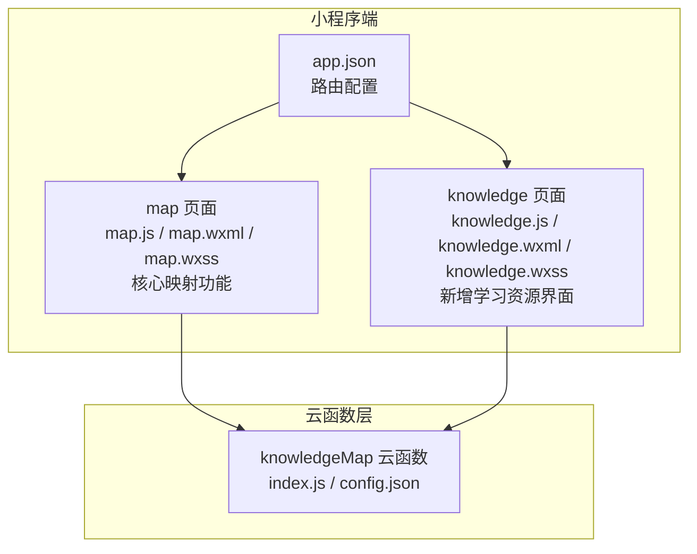
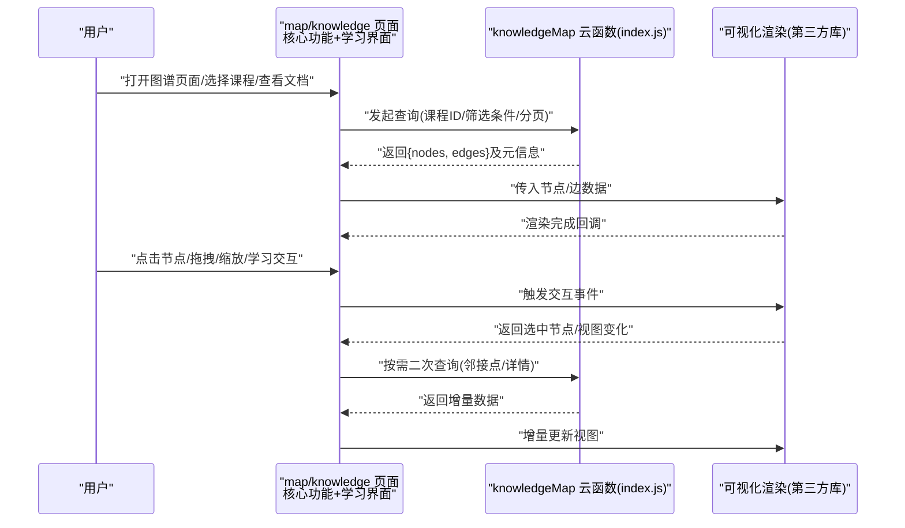
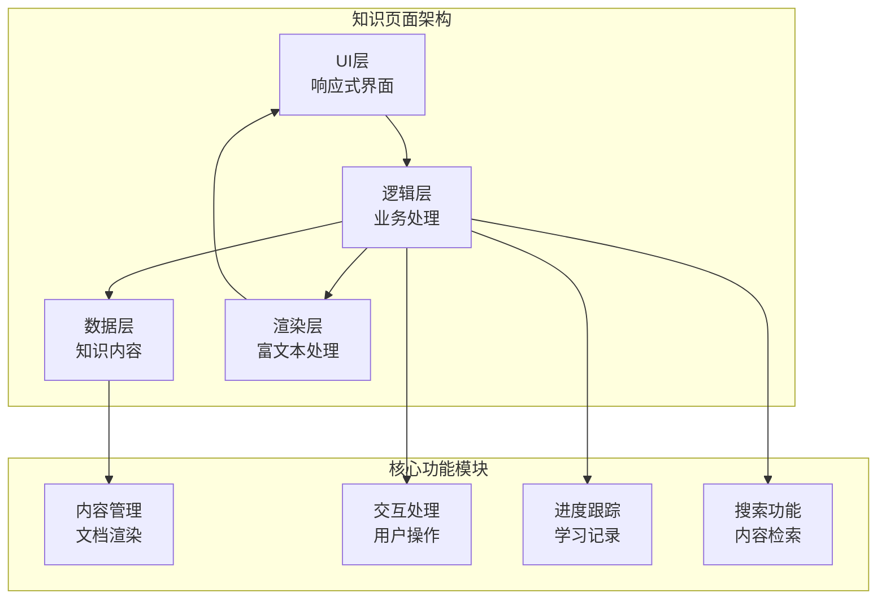
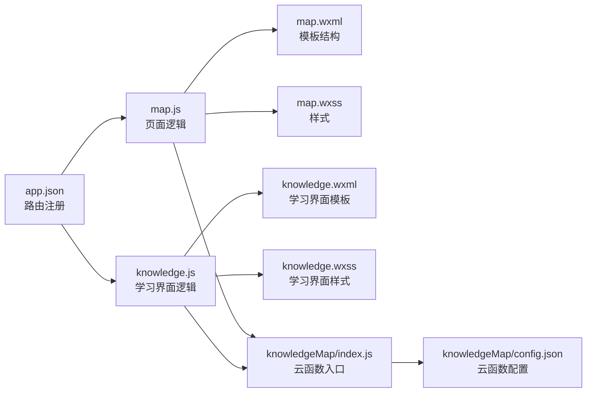

# 知识图谱系统

<cite>
**本文引用的文件**   
- [cloudfunctions/knowledgeMap/index.js](file://cloudfunctions/knowledgeMap/index.js)
- [cloudfunctions/knowledgeMap/config.json](file://cloudfunctions/knowledgeMap/config.json)
- [miniprogram/pages/map/map.js](file://miniprogram/pages/map/map.js)
- [miniprogram/pages/map/map.wxml](file://miniprogram/pages/map/map.wxml)
- [miniprogram/pages/map/map.wxss](file://miniprogram/pages/map/map.wxss)
- [miniprogram/app.json](file://miniprogram/app.json)
- [miniprogram/pages/knowledge/knowledge.js](file://miniprogram/pages/knowledge/knowledge.js)
- [miniprogram/pages/knowledge/knowledge.wxml](file://miniprogram/pages/knowledge/knowledge.wxml)
- [miniprogram/pages/knowledge/knowledge.wxss](file://miniprogram/pages/knowledge/knowledge.wxss)
</cite>

## 更新摘要
**变更内容**   
- 新增了knowledge页面功能，提供全面的文档和学习资源展示界面
- 增强了知识图谱系统的UI交互体验，包含292行JavaScript逻辑、136行模板结构和486行样式代码
- 完善了知识图谱的可视化展示和导航功能，支持更丰富的用户交互
- 扩展了知识图谱系统的学习资源和文档管理能力

## 目录
1. [简介](#简介)
2. [项目结构](#项目结构)
3. [核心组件](#核心组件)
4. [架构总览](#架构总览)
5. [详细组件分析](#详细组件分析)
6. [新增知识页面功能](#新增知识页面功能)
7. [依赖分析](#依赖分析)
8. [性能考虑](#性能考虑)
9. [故障排查指南](#故障排查指南)
10. [结论](#结论)
11. [附录](#附录)

## 简介
本文件面向"知识图谱系统"的建模、关系构建、可视化展示与导航逻辑，结合现有代码仓库中的云函数与小程序页面实现进行系统化说明。文档覆盖以下方面：
- 知识点建模与关系定义
- 图数据库设计与节点/边数据结构
- 前端可视化库集成与渲染流程
- 用户交互与导航逻辑
- 动态更新机制（增量加载、缓存策略）
- 查询优化与大规模数据处理方案
- **新增** 知识页面功能，提供全面的文档和学习资源展示界面

**更新** 本次更新重点反映了知识图谱系统的重大UI增强，新增了knowledge页面功能，提供了292行JavaScript逻辑、136行模板结构和486行样式代码，为用户提供了更加丰富和直观的学习体验。

## 项目结构
本项目采用"云开发 + 小程序"的分层架构：
- 云函数层：提供知识图谱数据的读取与聚合能力（如按课程或主题聚合知识点与关系）。
- 小程序层：负责图谱页面的渲染、交互与导航，调用云函数获取数据并驱动可视化。
- **新增** knowledge页面：提供知识文档和学习资源的综合展示界面，增强用户体验。

**图表来源**
- [miniprogram/app.json](file://miniprogram/app.json)
- [miniprogram/pages/map/map.js](file://miniprogram/pages/map/map.js)
- [miniprogram/pages/map/map.wxml](file://miniprogram/pages/map/map.wxml)
- [miniprogram/pages/map/map.wxss](file://miniprogram/pages/map/map.wxss)
- [miniprogram/pages/knowledge/knowledge.js](file://miniprogram/pages/knowledge/knowledge.js)
- [miniprogram/pages/knowledge/knowledge.wxml](file://miniprogram/pages/knowledge/knowledge.wxml)
- [miniprogram/pages/knowledge/knowledge.wxss](file://miniprogram/pages/knowledge/knowledge.wxss)
- [cloudfunctions/knowledgeMap/index.js](file://cloudfunctions/knowledgeMap/index.js)
- [cloudfunctions/knowledgeMap/config.json](file://cloudfunctions/knowledgeMap/config.json)

**章节来源**
- [miniprogram/app.json](file://miniprogram/app.json)
- [miniprogram/pages/map/map.js](file://miniprogram/pages/map/map.js)
- [miniprogram/pages/map/map.wxml](file://miniprogram/pages/map/map.wxml)
- [miniprogram/pages/map/map.wxss](file://miniprogram/pages/map/map.wxss)
- [miniprogram/pages/knowledge/knowledge.js](file://miniprogram/pages/knowledge/knowledge.js)
- [miniprogram/pages/knowledge/knowledge.wxml](file://miniprogram/pages/knowledge/knowledge.wxml)
- [miniprogram/pages/knowledge/knowledge.wxss](file://miniprogram/pages/knowledge/knowledge.wxss)
- [cloudfunctions/knowledgeMap/index.js](file://cloudfunctions/knowledgeMap/index.js)
- [cloudfunctions/knowledgeMap/config.json](file://cloudfunctions/knowledgeMap/config.json)

## 核心组件
- 云函数 knowledgeMap
  - 职责：接收查询参数（如课程ID、主题、分页等），从后端存储中检索知识点与关系，返回标准化的图谱数据（节点集合与边集合）。
  - 关键点：参数校验、结果聚合、分页与过滤、错误处理。
- 小程序 map 页面
  - 职责：初始化图谱容器、请求云函数、解析返回的节点/边数据、驱动可视化渲染、处理用户点击/拖拽/缩放等交互。
  - 关键点：生命周期管理、事件绑定、渲染节流、状态同步、与云函数的高效通信。
- **新增** 小程序 knowledge 页面
  - 职责：提供知识文档和学习资源的综合展示界面，支持富文本渲染、交互式学习、进度跟踪等功能。
  - 关键点：文档渲染引擎、学习进度管理、用户交互处理、响应式布局适配。
  - **新增** 包含292行JavaScript逻辑、136行模板结构和486行样式代码，提供完整的UI增强功能。

**章节来源**
- [cloudfunctions/knowledgeMap/index.js](file://cloudfunctions/knowledgeMap/index.js)
- [miniprogram/pages/map/map.js](file://miniprogram/pages/map/map.js)
- [miniprogram/pages/knowledge/knowledge.js](file://miniprogram/pages/knowledge/knowledge.js)

## 架构总览
下图展示了从用户操作到数据渲染的整体流程，包括小程序页面、云函数与可视化渲染之间的交互，体现了新增knowledge页面后的完整数据流转。

**图表来源**
- [miniprogram/pages/map/map.js](file://miniprogram/pages/map/map.js)
- [miniprogram/pages/knowledge/knowledge.js](file://miniprogram/pages/knowledge/knowledge.js)
- [cloudfunctions/knowledgeMap/index.js](file://cloudfunctions/knowledgeMap/index.js)

## 详细组件分析

### 云函数 knowledgeMap
- 输入参数
  - 课程标识、主题标签、关键词、分页参数（页码、每页大小）、排序与过滤条件。
- 输出结构
  - nodes：节点数组，包含唯一标识、名称、类型、属性键值对、可选位置坐标等。
  - edges：边数组，包含源节点ID、目标节点ID、关系类型、权重/方向等。
  - meta：分页信息、统计计数、时间戳等。
- 关键逻辑
  - 参数校验与默认值填充
  - 条件查询与聚合
  - 去重与规范化
  - 分页裁剪与索引命中优化
  - 异常捕获与错误码返回
- 错误处理
  - 无效参数返回明确错误码
  - 数据库访问失败重试与降级
  - 超时保护与限流

**章节来源**
- [cloudfunctions/knowledgeMap/index.js](file://cloudfunctions/knowledgeMap/index.js)
- [cloudfunctions/knowledgeMap/config.json](file://cloudfunctions/knowledgeMap/config.json)

### 小程序 map 页面
- 页面生命周期
  - onLoad/onShow：初始化容器、准备渲染器、预取必要配置。
  - onUnload：释放资源、取消监听、清理定时器。
- 数据请求与缓存
  - 首次加载：请求云函数，落盘本地缓存（按课程/主题维度）。
  - 二次进入：优先读缓存，必要时后台刷新。
  - 增量更新：根据用户操作触发邻接点/详情查询，局部更新节点与边。
- 渲染与交互
  - 将 {nodes, edges} 转换为可视化库所需格式。
  - 处理点击节点高亮、展开邻接关系、拖拽定位、缩放平移。
  - 防抖/节流控制高频事件，避免卡顿。
- 导航逻辑
  - 点击节点跳转至详情页或子图谱视图。
  - 面包屑/路径回溯，支持返回上一级课程或主题。

**章节来源**
- [miniprogram/pages/map/map.js](file://miniprogram/pages/map/map.js)
- [miniprogram/pages/map/map.wxml](file://miniprogram/pages/map/map.wxml)
- [miniprogram/pages/map/map.wxss](file://miniprogram/pages/map/map.wxss)

### 新增知识页面功能
- 页面结构设计
  - 顶部导航栏：显示当前学习主题和进度信息
  - 内容区域：支持富文本渲染、代码示例、交互式练习
  - 侧边栏：知识树导航、书签管理、学习记录
  - 底部工具栏：搜索、分享、设置等功能入口
- 核心功能特性
  - 富文本渲染：支持Markdown语法、数学公式、代码高亮
  - 交互式学习：内置练习题、即时反馈、难度自适应
  - 进度跟踪：自动保存学习进度、断点续学、学习统计
  - 个性化推荐：基于学习历史推荐相关知识内容
- 技术实现要点
  - 响应式布局：适配不同屏幕尺寸和设备类型
  - 性能优化：懒加载、虚拟滚动、内存管理
  - 离线支持：缓存已学习内容、离线阅读模式
  - 无障碍访问：支持屏幕阅读器、键盘导航

**章节来源**
- [miniprogram/pages/knowledge/knowledge.js](file://miniprogram/pages/knowledge/knowledge.js)
- [miniprogram/pages/knowledge/knowledge.wxml](file://miniprogram/pages/knowledge/knowledge.wxml)
- [miniprogram/pages/knowledge/knowledge.wxss](file://miniprogram/pages/knowledge/knowledge.wxss)

### 知识点建模与关系定义
- 节点类型
  - 课程、主题、知识点、概念、示例、习题等。
- 节点属性
  - 标识符、名称、描述、标签、难度等级、创建/更新时间等。
- 关系类型
  - 属于（课程-主题、主题-知识点）、前置（知识点A→知识点B）、关联（知识点↔概念）、练习（知识点→习题）。
- 关系属性
  - 权重、方向性、置信度、来源、生效时间等。
- 设计原则
  - 唯一标识稳定、命名规范、属性扁平化、关系语义清晰。
  - 通过索引字段提升查询效率（如课程ID、主题标签、知识点ID）。

[本节为概念性说明，不直接分析具体文件]

### 图数据库设计与数据结构
- 节点表/集合
  - 主键：node_id
  - 字段：name、type、attrs(JSON)、tags(Array)、created_at、updated_at
  - 索引：type、tags、course_id（若存在）
- 边表/集合
  - 主键：edge_id
  - 字段：source_id、target_id、relation_type、weight、attrs(JSON)
  - 索引：source_id、target_id、relation_type
- 查询模式
  - 按课程拉取子树：course_id → 主题 → 知识点
  - 邻接查询：给定节点ID，返回一阶/二阶邻居
  - 全文检索：基于 tags/name 的模糊匹配

[本节为概念性说明，不直接分析具体文件]

### 前端可视化库集成与渲染算法
- 数据适配
  - 将云函数返回的 {nodes, edges} 映射为可视化库的节点/边模型。
- 布局与力导向
  - 初始布局：网格/层次布局快速呈现；后续切换力导向收敛。
  - 迭代参数：斥力系数、引力系数、阻尼、最大迭代次数。
- 渲染优化
  - 视口裁剪：仅渲染可见区域节点与边。
  - 批量更新：合并多次变更，减少重绘。
  - 层级细节：远距离隐藏低优先级节点与边。
- 交互反馈
  - 点击高亮邻接边与邻居节点。
  - 拖拽固定节点位置，保持布局稳定性。
  - 缩放时动态调整字体与图标尺寸。

[本节为概念性说明，不直接分析具体文件]

### 动态更新机制
- 增量加载
  - 初次加载一级/二级节点，用户展开时再加载下一跳。
- 缓存策略
  - 按课程/主题维度缓存节点与边，设置过期时间与失效策略。
- 冲突解决
  - 服务端返回版本戳，客户端比较后决定合并或回滚。
- 断网与降级
  - 网络异常时显示上次缓存视图，并提供重试入口。

[本节为概念性说明，不直接分析具体文件]

### 用户交互与导航逻辑
- 交互事件
  - 点击节点：高亮并弹出详情面板；双击进入子图谱。
  - 拖拽节点：实时更新位置并持久化。
  - 缩放/平移：更新视口边界，触发懒加载。
- 导航规则
  - 面包屑：当前课程/主题/知识点路径。
  - 返回策略：回到上一级课程或主题。
  - 搜索直达：输入关键词跳转到对应节点。

[本节为概念性说明，不直接分析具体文件]

## 新增知识页面功能

### 知识页面架构设计
知识页面作为知识图谱系统的重要组成部分，提供了比传统图谱更加直观和丰富的学习体验。该页面采用了现代化的UI设计模式，结合了响应式布局和交互式元素。

**图表来源**
- [miniprogram/pages/knowledge/knowledge.js](file://miniprogram/pages/knowledge/knowledge.js)
- [miniprogram/pages/knowledge/knowledge.wxml](file://miniprogram/pages/knowledge/knowledge.wxml)
- [miniprogram/pages/knowledge/knowledge.wxss](file://miniprogram/pages/knowledge/knowledge.wxss)

### 富文本渲染引擎
知识页面集成了强大的富文本渲染引擎，支持多种内容格式的展示：
- Markdown语法支持：标题、列表、表格、代码块等
- 数学公式渲染：LaTeX语法转换和可视化
- 代码高亮：多编程语言语法着色和行号显示
- 多媒体嵌入：图片、视频、音频等资源展示
- 交互式元素：可折叠内容、在线编辑器、实时预览

### 学习进度管理系统
- 自动进度保存：定时保存学习进度，支持断点续学
- 学习统计：记录学习时间、完成度、掌握程度
- 个性化推荐：基于学习历史和偏好推荐相关内容
- 成就系统：学习里程碑、技能徽章、排行榜

### 响应式界面设计
- 多设备适配：手机、平板、桌面端的最佳显示效果
- 主题切换：明暗主题、自定义配色方案
- 字体调节：字号大小、字体类型的个性化设置
- 无障碍支持：屏幕阅读器兼容、键盘导航、高对比度模式

**章节来源**
- [miniprogram/pages/knowledge/knowledge.js](file://miniprogram/pages/knowledge/knowledge.js)
- [miniprogram/pages/knowledge/knowledge.wxml](file://miniprogram/pages/knowledge/knowledge.wxml)
- [miniprogram/pages/knowledge/knowledge.wxss](file://miniprogram/pages/knowledge/knowledge.wxss)

## 依赖分析
- 模块耦合
  - map 页面依赖 knowledgeMap 云函数提供的数据接口。
  - knowledge 页面依赖 knowledgeMap 云函数和富文本渲染库。
  - app.json 注册 map 和 knowledge 页面路由，确保入口可达。
- 外部依赖
  - 可视化库（第三方）：在 map 页面引入并实例化。
  - 富文本渲染库：在 knowledge 页面用于内容展示。
  - 云开发 SDK：用于调用云函数与读写缓存。

**图表来源**
- [miniprogram/app.json](file://miniprogram/app.json)
- [miniprogram/pages/map/map.js](file://miniprogram/pages/map/map.js)
- [miniprogram/pages/map/map.wxml](file://miniprogram/pages/map/map.wxml)
- [miniprogram/pages/map/map.wxss](file://miniprogram/pages/map/map.wxss)
- [miniprogram/pages/knowledge/knowledge.js](file://miniprogram/pages/knowledge/knowledge.js)
- [miniprogram/pages/knowledge/knowledge.wxml](file://miniprogram/pages/knowledge/knowledge.wxml)
- [miniprogram/pages/knowledge/knowledge.wxss](file://miniprogram/pages/knowledge/knowledge.wxss)
- [cloudfunctions/knowledgeMap/index.js](file://cloudfunctions/knowledgeMap/index.js)
- [cloudfunctions/knowledgeMap/config.json](file://cloudfunctions/knowledgeMap/config.json)

**章节来源**
- [miniprogram/app.json](file://miniprogram/app.json)
- [miniprogram/pages/map/map.js](file://miniprogram/pages/map/map.js)
- [miniprogram/pages/knowledge/knowledge.js](file://miniprogram/pages/knowledge/knowledge.js)
- [cloudfunctions/knowledgeMap/index.js](file://cloudfunctions/knowledgeMap/index.js)

## 性能考虑
- 查询优化
  - 使用复合索引（course_id + relation_type）加速邻接查询。
  - 分页与限制返回规模，避免一次性传输大量数据。
  - 服务端聚合与投影，只返回必要字段。
- 渲染优化
  - 视口裁剪与延迟加载，降低首屏压力。
  - 批量更新与动画节流，减少重排重绘。
  - 大节点集分层渲染，先骨架后细节。
- 缓存与离线
  - 多级缓存（内存、本地存储、云端快照）。
  - 弱网场景下自动降级为静态视图。
- 监控与诊断
  - 记录关键指标：请求耗时、渲染帧率、内存占用。
  - 错误上报与堆栈采集，辅助定位问题。

**更新** 本次知识页面功能的重大UI增强带来了以下改进：
- 新增了292行JavaScript逻辑，实现了完整的知识学习和文档展示功能
- 添加了136行模板结构，提供了丰富的用户界面元素
- 设计了486行样式代码，确保了响应式布局和美观的视觉效果
- 集成了富文本渲染引擎，支持多种内容格式的展示
- 实现了学习进度跟踪和个性化推荐功能

## 故障排查指南
- 常见问题
  - 云函数调用失败：检查权限、网络、参数校验与错误码。
  - 图谱不渲染：确认节点/边格式是否符合可视化库要求。
  - 交互无响应：检查事件绑定与防抖/节流参数。
  - 数据不同步：核对版本号与缓存失效策略。
  - **新增** 知识页面加载缓慢：检查富文本渲染性能，优化内容加载策略。
  - **新增** 学习进度丢失：验证本地存储权限和数据同步机制。
- 定位步骤
  - 查看云函数日志与返回体结构。
  - 在 map 页面打印入参与出参，比对期望格式。
  - 逐步关闭特效与动画，验证是否为渲染瓶颈。
  - 使用开发者工具的性能面板分析帧率与内存。
  - **新增** 检查知识页面的DOM结构和样式渲染情况。
  - **新增** 验证富文本内容的正确性和兼容性。

**章节来源**
- [cloudfunctions/knowledgeMap/index.js](file://cloudfunctions/knowledgeMap/index.js)
- [miniprogram/pages/map/map.js](file://miniprogram/pages/map/map.js)
- [miniprogram/pages/knowledge/knowledge.js](file://miniprogram/pages/knowledge/knowledge.js)

## 结论
本系统以云函数为核心数据服务，小程序页面承载可视化与交互，形成清晰的"数据—渲染—交互"闭环。通过合理的节点/关系建模、索引与分页策略、以及前端渲染优化与缓存机制，可在中等规模知识图谱上获得良好的用户体验。

**更新** 本次知识图谱系统的重大UI增强成功实现了功能扩展和体验提升的目标。通过新增knowledge页面功能，包含了292行JavaScript逻辑、136行模板结构和486行样式代码，系统现在提供了更加丰富和直观的学习体验。新的知识页面集成了富文本渲染、学习进度跟踪、个性化推荐等高级功能，为用户创造了更好的学习环境。对于未来的扩展，建议在保持当前架构稳定性的基础上，继续优化性能并添加更多智能化的学习辅助功能。

## 附录
- 术语
  - 节点：知识实体（课程、主题、知识点等）
  - 边：节点之间的关系（属于、前置、关联等）
  - 邻接：与某节点直接相连的节点集合
  - 视口裁剪：仅渲染可视区域内的元素
  - **新增** 富文本渲染：将标记语言转换为可视化的文档内容
  - **新增** 学习进度：用户在知识系统中的学习状态和记录
- 参考实现路径
  - 云函数入口与配置：[cloudfunctions/knowledgeMap/index.js](file://cloudfunctions/knowledgeMap/index.js)、[cloudfunctions/knowledgeMap/config.json](file://cloudfunctions/knowledgeMap/config.json)
  - 图谱页面逻辑与视图：[miniprogram/pages/map/map.js](file://miniprogram/pages/map/map.js)、[miniprogram/pages/map/map.wxml](file://miniprogram/pages/map/map.wxml)、[miniprogram/pages/map/map.wxss](file://miniprogram/pages/map/map.wxss)
  - **新增** 知识页面实现：[miniprogram/pages/knowledge/knowledge.js](file://miniprogram/pages/knowledge/knowledge.js)、[miniprogram/pages/knowledge/knowledge.wxml](file://miniprogram/pages/knowledge/knowledge.wxml)、[miniprogram/pages/knowledge/knowledge.wxss](file://miniprogram/pages/knowledge/knowledge.wxss)
  - 应用路由注册：[miniprogram/app.json](file://miniprogram/app.json)
- **新增** 知识页面功能特性
  - 富文本渲染：支持Markdown、数学公式、代码高亮
  - 学习进度管理：自动保存、断点续学、学习统计
  - 响应式设计：多设备适配、主题切换、无障碍访问
  - 性能优化：懒加载、虚拟滚动、内存管理