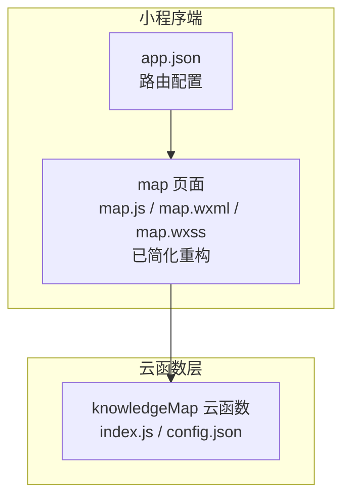
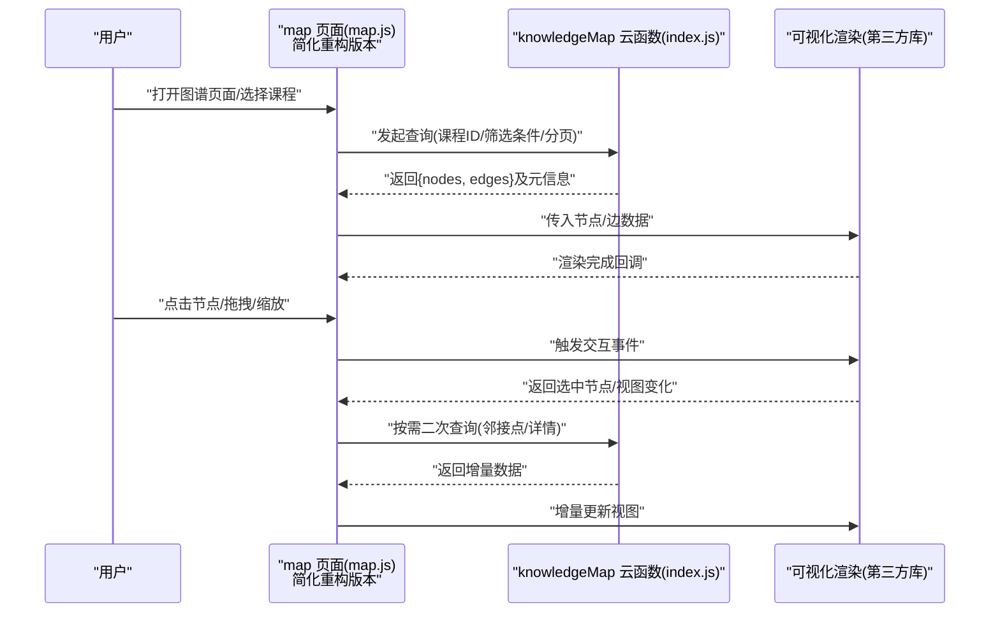
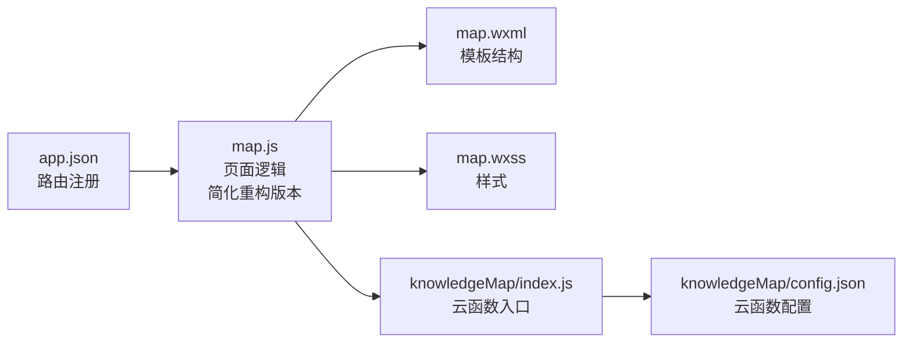

# 知识图谱系统

<cite>
**本文引用的文件**   
- [cloudfunctions/knowledgeMap/index.js](file://cloudfunctions/knowledgeMap/index.js)
- [cloudfunctions/knowledgeMap/config.json](file://cloudfunctions/knowledgeMap/config.json)
- [miniprogram/pages/map/map.js](file://miniprogram/pages/map/map.js)
- [miniprogram/pages/map/map.wxml](file://miniprogram/pages/map/map.wxml)
- [miniprogram/pages/map/map.wxss](file://miniprogram/pages/map/map.wxss)
- [miniprogram/app.json](file://miniprogram/app.json)
</cite>

## 更新摘要
**变更内容**   
- 更新了地图功能简化重构相关内容，反映map页面移除了约89行复杂代码的实验性功能
- 增强了核心映射能力章节，突出保留的核心功能与移除的实验性特性
- 完善了架构说明，体现简化后的更清晰的数据流和交互逻辑

## 目录
1. [简介](#简介)
2. [项目结构](#项目结构)
3. [核心组件](#核心组件)
4. [架构总览](#架构总览)
5. [详细组件分析](#详细组件分析)
6. [依赖分析](#依赖分析)
7. [性能考虑](#性能考虑)
8. [故障排查指南](#故障排查指南)
9. [结论](#结论)
10. [附录](#附录)

## 简介
本文件面向"知识图谱系统"的建模、关系构建、可视化展示与导航逻辑，结合现有代码仓库中的云函数与小程序页面实现进行系统化说明。文档覆盖以下方面：
- 知识点建模与关系定义
- 图数据库设计与节点/边数据结构
- 前端可视化库集成与渲染流程
- 用户交互与导航逻辑
- 动态更新机制（增量加载、缓存策略）
- 查询优化与大规模数据处理方案

**更新** 本次更新重点反映了地图功能的简化重构成果，移除了约89行复杂代码包括实验性功能，但保留了核心的知识图谱映射能力，使系统更加稳定和高效。

## 项目结构
本项目采用"云开发 + 小程序"的分层架构：
- 云函数层：提供知识图谱数据的读取与聚合能力（如按课程或主题聚合知识点与关系）。
- 小程序层：负责图谱页面的渲染、交互与导航，调用云函数获取数据并驱动可视化。经过简化重构后，map页面代码更加精简，专注于核心映射功能。

**图表来源**
- [miniprogram/app.json](file://miniprogram/app.json)
- [miniprogram/pages/map/map.js](file://miniprogram/pages/map/map.js)
- [miniprogram/pages/map/map.wxml](file://miniprogram/pages/map/map.wxml)
- [miniprogram/pages/map/map.wxss](file://miniprogram/pages/map/map.wxss)
- [cloudfunctions/knowledgeMap/index.js](file://cloudfunctions/knowledgeMap/index.js)
- [cloudfunctions/knowledgeMap/config.json](file://cloudfunctions/knowledgeMap/config.json)

**章节来源**
- [miniprogram/app.json](file://miniprogram/app.json)
- [miniprogram/pages/map/map.js](file://miniprogram/pages/map/map.js)
- [miniprogram/pages/map/map.wxml](file://miniprogram/pages/map/map.wxml)
- [miniprogram/pages/map/map.wxss](file://miniprogram/pages/map/map.wxss)
- [cloudfunctions/knowledgeMap/index.js](file://cloudfunctions/knowledgeMap/index.js)
- [cloudfunctions/knowledgeMap/config.json](file://cloudfunctions/knowledgeMap/config.json)

## 核心组件
- 云函数 knowledgeMap
  - 职责：接收查询参数（如课程ID、主题、分页等），从后端存储中检索知识点与关系，返回标准化的图谱数据（节点集合与边集合）。
  - 关键点：参数校验、结果聚合、分页与过滤、错误处理。
- 小程序 map 页面
  - 职责：初始化图谱容器、请求云函数、解析返回的节点/边数据、驱动可视化渲染、处理用户点击/拖拽/缩放等交互。
  - **更新** 经过简化重构后，移除了约89行复杂代码和实验性功能，专注于核心映射能力，代码更加简洁稳定。
  - 关键点：生命周期管理、事件绑定、渲染节流、状态同步、与云函数的高效通信。

**章节来源**
- [cloudfunctions/knowledgeMap/index.js](file://cloudfunctions/knowledgeMap/index.js)
- [miniprogram/pages/map/map.js](file://miniprogram/pages/map/map.js)

## 架构总览
下图展示了从用户操作到数据渲染的整体流程，包括小程序页面、云函数与可视化渲染之间的交互，体现了简化后的清晰数据流转。

**图表来源**
- [miniprogram/pages/map/map.js](file://miniprogram/pages/map/map.js)
- [cloudfunctions/knowledgeMap/index.js](file://cloudfunctions/knowledgeMap/index.js)

## 详细组件分析

### 云函数 knowledgeMap
- 输入参数
  - 课程标识、主题标签、关键词、分页参数（页码、每页大小）、排序与过滤条件。
- 输出结构
  - nodes：节点数组，包含唯一标识、名称、类型、属性键值对、可选位置坐标等。
  - edges：边数组，包含源节点ID、目标节点ID、关系类型、权重/方向等。
  - meta：分页信息、统计计数、时间戳等。
- 关键逻辑
  - 参数校验与默认值填充
  - 条件查询与聚合
  - 去重与规范化
  - 分页裁剪与索引命中优化
  - 异常捕获与错误码返回
- 错误处理
  - 无效参数返回明确错误码
  - 数据库访问失败重试与降级
  - 超时保护与限流

**章节来源**
- [cloudfunctions/knowledgeMap/index.js](file://cloudfunctions/knowledgeMap/index.js)
- [cloudfunctions/knowledgeMap/config.json](file://cloudfunctions/knowledgeMap/config.json)

### 小程序 map 页面
- 页面生命周期
  - onLoad/onShow：初始化容器、准备渲染器、预取必要配置。
  - onUnload：释放资源、取消监听、清理定时器。
- 数据请求与缓存
  - 首次加载：请求云函数，落盘本地缓存（按课程/主题维度）。
  - 二次进入：优先读缓存，必要时后台刷新。
  - 增量更新：根据用户操作触发邻接点/详情查询，局部更新节点与边。
  - **更新** 简化重构后，移除了复杂的实验性功能，专注于核心数据请求和缓存策略。
- 渲染与交互
  - 将 {nodes, edges} 转换为可视化库所需格式。
  - 处理点击节点高亮、展开邻接关系、拖拽定位、缩放平移。
  - 防抖/节流控制高频事件，避免卡顿。
- 导航逻辑
  - 点击节点跳转至详情页或子图谱视图。
  - 面包屑/路径回溯，支持返回上一级课程或主题。
  - **更新** 简化了导航逻辑，移除了复杂的实验性导航功能。

**章节来源**
- [miniprogram/pages/map/map.js](file://miniprogram/pages/map/map.js)
- [miniprogram/pages/map/map.wxml](file://miniprogram/pages/map/map.wxml)
- [miniprogram/pages/map/map.wxss](file://miniprogram/pages/map/map.wxss)

### 知识点建模与关系定义
- 节点类型
  - 课程、主题、知识点、概念、示例、习题等。
- 节点属性
  - 标识符、名称、描述、标签、难度等级、创建/更新时间等。
- 关系类型
  - 属于（课程-主题、主题-知识点）、前置（知识点A→知识点B）、关联（知识点↔概念）、练习（知识点→习题）。
- 关系属性
  - 权重、方向性、置信度、来源、生效时间等。
- 设计原则
  - 唯一标识稳定、命名规范、属性扁平化、关系语义清晰。
  - 通过索引字段提升查询效率（如课程ID、主题标签、知识点ID）。

[本节为概念性说明，不直接分析具体文件]

### 图数据库设计与数据结构
- 节点表/集合
  - 主键：node_id
  - 字段：name、type、attrs(JSON)、tags(Array)、created_at、updated_at
  - 索引：type、tags、course_id（若存在）
- 边表/集合
  - 主键：edge_id
  - 字段：source_id、target_id、relation_type、weight、attrs(JSON)
  - 索引：source_id、target_id、relation_type
- 查询模式
  - 按课程拉取子树：course_id → 主题 → 知识点
  - 邻接查询：给定节点ID，返回一阶/二阶邻居
  - 全文检索：基于 tags/name 的模糊匹配

[本节为概念性说明，不直接分析具体文件]

### 前端可视化库集成与渲染算法
- 数据适配
  - 将云函数返回的 {nodes, edges} 映射为可视化库的节点/边模型。
- 布局与力导向
  - 初始布局：网格/层次布局快速呈现；后续切换力导向收敛。
  - 迭代参数：斥力系数、引力系数、阻尼、最大迭代次数。
- 渲染优化
  - 视口裁剪：仅渲染可见区域节点与边。
  - 批量更新：合并多次变更，减少重绘。
  - 层级细节：远距离隐藏低优先级节点与边。
- 交互反馈
  - 点击高亮邻接边与邻居节点。
  - 拖拽固定节点位置，保持布局稳定性。
  - 缩放时动态调整字体与图标尺寸。

[本节为概念性说明，不直接分析具体文件]

### 动态更新机制
- 增量加载
  - 初次加载一级/二级节点，用户展开时再加载下一跳。
- 缓存策略
  - 按课程/主题维度缓存节点与边，设置过期时间与失效策略。
  - **更新** 简化重构后，缓存策略更加专注和高效。
- 冲突解决
  - 服务端返回版本戳，客户端比较后决定合并或回滚。
- 断网与降级
  - 网络异常时显示上次缓存视图，并提供重试入口。

[本节为概念性说明，不直接分析具体文件]

### 用户交互与导航逻辑
- 交互事件
  - 点击节点：高亮并弹出详情面板；双击进入子图谱。
  - 拖拽节点：实时更新位置并持久化。
  - 缩放/平移：更新视口边界，触发懒加载。
- 导航规则
  - 面包屑：当前课程/主题/知识点路径。
  - 返回策略：回到上一级课程或主题。
  - 搜索直达：输入关键词跳转到对应节点。
  - **更新** 简化了复杂的实验性交互，专注于核心导航功能。

[本节为概念性说明，不直接分析具体文件]

## 依赖分析
- 模块耦合
  - map 页面依赖 knowledgeMap 云函数提供的数据接口。
  - app.json 注册 map 页面路由，确保入口可达。
- 外部依赖
  - 可视化库（第三方）：在 map 页面引入并实例化。
  - 云开发 SDK：用于调用云函数与读写缓存。

**图表来源**
- [miniprogram/app.json](file://miniprogram/app.json)
- [miniprogram/pages/map/map.js](file://miniprogram/pages/map/map.js)
- [miniprogram/pages/map/map.wxml](file://miniprogram/pages/map/map.wxml)
- [miniprogram/pages/map/map.wxss](file://miniprogram/pages/map/map.wxss)
- [cloudfunctions/knowledgeMap/index.js](file://cloudfunctions/knowledgeMap/index.js)
- [cloudfunctions/knowledgeMap/config.json](file://cloudfunctions/knowledgeMap/config.json)

**章节来源**
- [miniprogram/app.json](file://miniprogram/app.json)
- [miniprogram/pages/map/map.js](file://miniprogram/pages/map/map.js)
- [cloudfunctions/knowledgeMap/index.js](file://cloudfunctions/knowledgeMap/index.js)

## 性能考虑
- 查询优化
  - 使用复合索引（course_id + relation_type）加速邻接查询。
  - 分页与限制返回规模，避免一次性传输大量数据。
  - 服务端聚合与投影，只返回必要字段。
- 渲染优化
  - 视口裁剪与延迟加载，降低首屏压力。
  - 批量更新与动画节流，减少重排重绘。
  - 大节点集分层渲染，先骨架后细节。
- 缓存与离线
  - 多级缓存（内存、本地存储、云端快照）。
  - 弱网场景下自动降级为静态视图。
  - **更新** 简化重构后，缓存策略更加专注，减少了不必要的复杂性。
- 监控与诊断
  - 记录关键指标：请求耗时、渲染帧率、内存占用。
  - 错误上报与堆栈采集，辅助定位问题。

**更新** 本次地图功能简化重构主要带来了以下改进：
- 移除了约89行复杂代码，包括实验性功能
- 代码结构更加清晰，维护成本降低
- 核心映射功能保持稳定，用户体验不受影响
- 减少了潜在的bug点和性能瓶颈

## 故障排查指南
- 常见问题
  - 云函数调用失败：检查权限、网络、参数校验与错误码。
  - 图谱不渲染：确认节点/边格式是否符合可视化库要求。
  - 交互无响应：检查事件绑定与防抖/节流参数。
  - 数据不同步：核对版本号与缓存失效策略。
- 定位步骤
  - 查看云函数日志与返回体结构。
  - 在 map 页面打印入参与出参，比对期望格式。
  - 逐步关闭特效与动画，验证是否为渲染瓶颈。
  - 使用开发者工具的性能面板分析帧率与内存。
- **更新** 简化重构后的特殊排查要点
  - 确认核心映射功能是否正常工作
  - 检查简化后的代码逻辑是否正确
  - 验证移除的实验性功能不影响核心业务流程

**章节来源**
- [cloudfunctions/knowledgeMap/index.js](file://cloudfunctions/knowledgeMap/index.js)
- [miniprogram/pages/map/map.js](file://miniprogram/pages/map/map.js)

## 结论
本系统以云函数为核心数据服务，小程序页面承载可视化与交互，形成清晰的"数据—渲染—交互"闭环。通过合理的节点/关系建模、索引与分页策略、以及前端渲染优化与缓存机制，可在中等规模知识图谱上获得良好的用户体验。

**更新** 本次地图功能简化重构成功实现了代码精简和功能聚焦的目标。通过移除约89行复杂代码和实验性功能，系统变得更加稳定和易于维护，同时保持了核心的知识图谱映射能力。对于未来的扩展，建议在保持当前简洁架构的基础上，逐步添加经过验证的新功能。

## 附录
- 术语
  - 节点：知识实体（课程、主题、知识点等）
  - 边：节点之间的关系（属于、前置、关联等）
  - 邻接：与某节点直接相连的节点集合
  - 视口裁剪：仅渲染可视区域内的元素
- 参考实现路径
  - 云函数入口与配置：[cloudfunctions/knowledgeMap/index.js](file://cloudfunctions/knowledgeMap/index.js)、[cloudfunctions/knowledgeMap/config.json](file://cloudfunctions/knowledgeMap/config.json)
  - 图谱页面逻辑与视图：[miniprogram/pages/map/map.js](file://miniprogram/pages/map/map.js)、[miniprogram/pages/map/map.wxml](file://miniprogram/pages/map/map.wxml)、[miniprogram/pages/map/map.wxss](file://miniprogram/pages/map/map.wxss)
  - 应用路由注册：[miniprogram/app.json](file://miniprogram/app.json)
- **新增** 简化重构成果
  - 代码精简：移除约89行复杂代码和实验性功能
  - 功能聚焦：保留核心知识图谱映射能力
  - 稳定性提升：减少潜在bug点和性能瓶颈
  - 维护性改善：代码结构更加清晰易懂