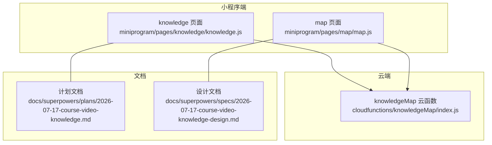
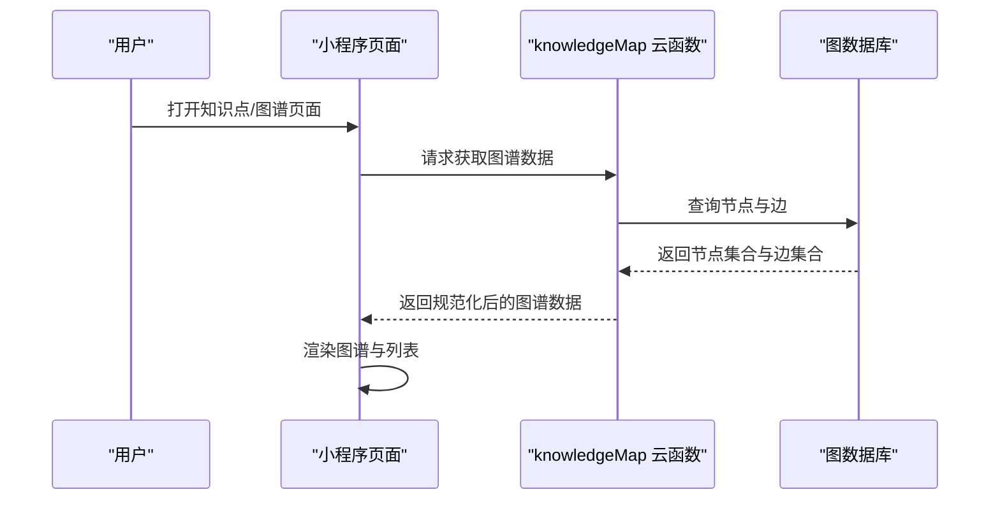
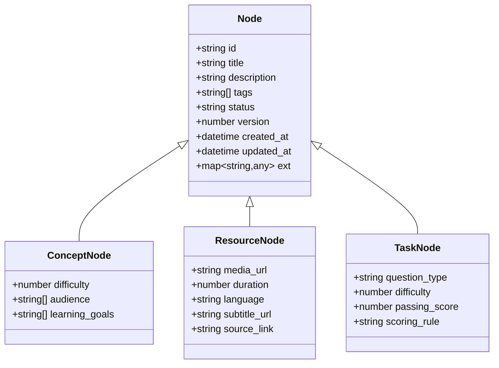
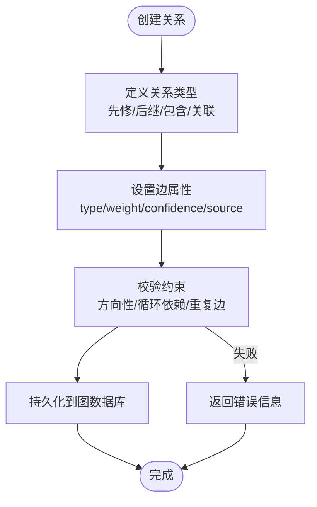
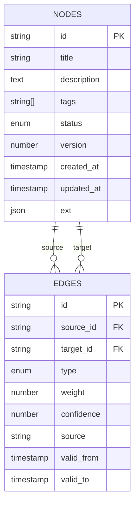
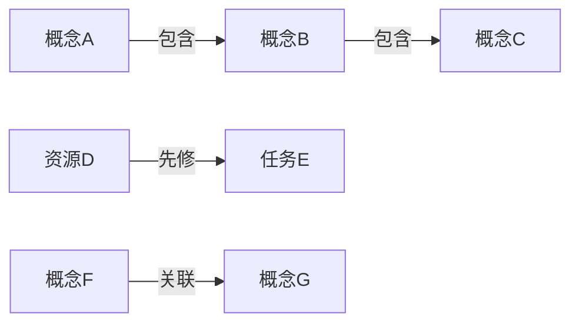
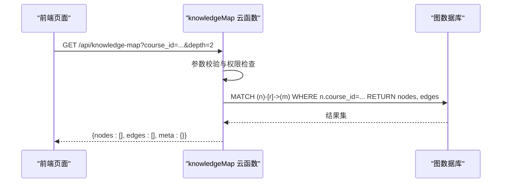
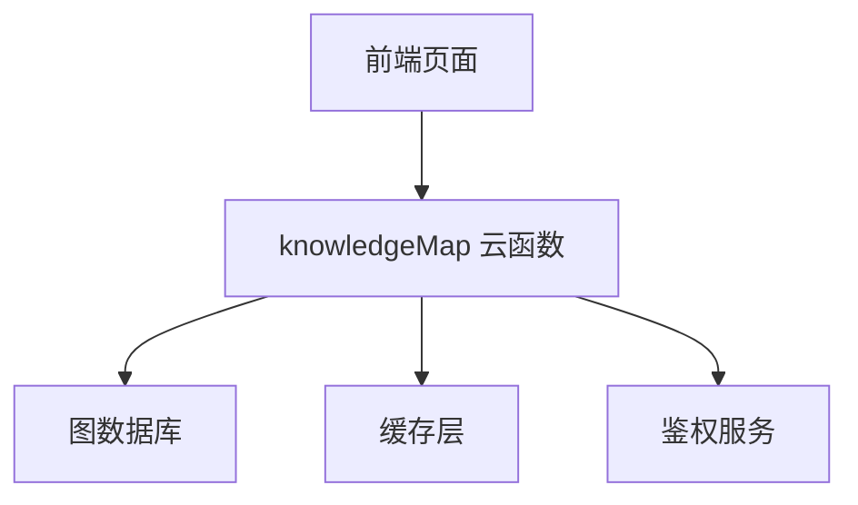

# 知识数据模型

<cite>
**本文引用的文件**   
- [cloudfunctions/knowledgeMap/index.js](file://cloudfunctions/knowledgeMap/index.js)
- [miniprogram/pages/knowledge/knowledge.js](file://miniprogram/pages/knowledge/knowledge.js)
- [miniprogram/pages/map/map.js](file://miniprogram/pages/map/map.js)
- [docs/superpowers/plans/2026-07-17-course-video-knowledge.md](file://docs/superpowers/plans/2026-07-17-course-video-knowledge.md)
- [docs/superpowers/specs/2026-07-17-course-video-knowledge-design.md](file://docs/superpowers/specs/2026-07-17-course-video-knowledge-design.md)
</cite>

## 目录
1. [简介](#简介)
2. [项目结构](#项目结构)
3. [核心组件](#核心组件)
4. [架构总览](#架构总览)
5. [详细组件分析](#详细组件分析)
6. [依赖关系分析](#依赖关系分析)
7. [性能考虑](#性能考虑)
8. [故障排查指南](#故障排查指南)
9. [结论](#结论)
10. [附录](#附录)

## 简介
本文件面向“知识数据模型”的设计与实现，聚焦知识点实体、节点类型、属性字段、关系边定义、数据验证规则，以及知识图谱的图数据库设计、索引策略与查询优化。文档同时覆盖层级关系、依赖关系与关联关系的建模方法，并提供数据表结构、字段说明与示例数据的参考规范，帮助读者快速理解并落地实施。

## 项目结构
围绕知识图谱相关能力，代码主要分布在云函数与小程序页面中：
- 云函数 knowledgeMap：提供知识图谱相关的后端接口（如获取图谱、创建/更新节点与边等）。
- 小程序页面 knowledge 与 map：前端展示与管理知识点、渲染知识图谱视图。
- 文档 specs/plans：包含课程视频与知识点的规划与设计说明，为数据模型提供业务上下文。

图表来源
- [cloudfunctions/knowledgeMap/index.js](file://cloudfunctions/knowledgeMap/index.js)
- [miniprogram/pages/knowledge/knowledge.js](file://miniprogram/pages/knowledge/knowledge.js)
- [miniprogram/pages/map/map.js](file://miniprogram/pages/map/map.js)
- [docs/superpowers/plans/2026-07-17-course-video-knowledge.md](file://docs/superpowers/plans/2026-07-17-course-video-knowledge.md)
- [docs/superpowers/specs/2026-07-17-course-video-knowledge-design.md](file://docs/superpowers/specs/2026-07-17-course-video-knowledge-design.md)

章节来源
- [cloudfunctions/knowledgeMap/index.js](file://cloudfunctions/knowledgeMap/index.js)
- [miniprogram/pages/knowledge/knowledge.js](file://miniprogram/pages/knowledge/knowledge.js)
- [miniprogram/pages/map/map.js](file://miniprogram/pages/map/map.js)
- [docs/superpowers/plans/2026-07-17-course-video-knowledge.md](file://docs/superpowers/plans/2026-07-17-course-video-knowledge.md)
- [docs/superpowers/specs/2026-07-17-course-video-knowledge-design.md](file://docs/superpowers/specs/2026-07-17-course-video-knowledge-design.md)

## 核心组件
- 知识点实体（Node）
  - 标识：唯一 ID（建议采用全局唯一字符串或自增数字）。
  - 基础属性：名称、描述、标签、状态、版本、时间戳等。
  - 扩展属性：根据节点类型动态扩展（如视频时长、难度等级、前置要求等）。
- 关系边（Edge）
  - 起点与终点：指向两个知识点节点的 ID。
  - 关系类型：如“先修”、“后继”、“包含”、“关联”等。
  - 权重与元数据：权重、置信度、来源、生效时间等。
- 图谱服务（Cloud Function）
  - 提供节点与边的 CRUD 接口、批量导入导出、按条件检索与路径查询。
- 前端视图（Pages）
  - 知识点列表与详情、图谱可视化渲染、交互编辑。

章节来源
- [cloudfunctions/knowledgeMap/index.js](file://cloudfunctions/knowledgeMap/index.js)
- [miniprogram/pages/knowledge/knowledge.js](file://miniprogram/pages/knowledge/knowledge.js)
- [miniprogram/pages/map/map.js](file://miniprogram/pages/map/map.js)

## 架构总览
整体采用“小程序前端 + 云函数后端 + 图数据库”的分层架构。前端负责用户交互与图谱渲染；云函数作为统一入口进行鉴权、参数校验与路由分发；图数据库存储节点与边，支持高效的多跳查询与路径计算。

图表来源
- [cloudfunctions/knowledgeMap/index.js](file://cloudfunctions/knowledgeMap/index.js)
- [miniprogram/pages/knowledge/knowledge.js](file://miniprogram/pages/knowledge/knowledge.js)
- [miniprogram/pages/map/map.js](file://miniprogram/pages/map/map.js)

## 详细组件分析

### 知识点实体与节点类型
- 节点类型
  - 概念节点：抽象知识点，用于构建知识体系骨架。
  - 资源节点：具体学习材料（如视频、文章、题目），承载可消费内容。
  - 任务节点：练习、测验、复习任务，驱动学习闭环。
- 通用属性
  - id：主键，全局唯一。
  - title：标题。
  - description：描述。
  - tags：标签数组，便于检索与聚合。
  - status：状态（草稿、已发布、归档等）。
  - version：版本号，支持变更追踪。
  - created_at / updated_at：时间戳。
- 类型特定属性
  - 概念节点：难度等级、适用人群、学习目标。
  - 资源节点：媒体 URL、时长、语言、字幕、来源链接。
  - 任务节点：题型、难度、评分规则、通过阈值。

图表来源
- [cloudfunctions/knowledgeMap/index.js](file://cloudfunctions/knowledgeMap/index.js)
- [docs/superpowers/specs/2026-07-17-course-video-knowledge-design.md](file://docs/superpowers/specs/2026-07-17-course-video-knowledge-design.md)

章节来源
- [cloudfunctions/knowledgeMap/index.js](file://cloudfunctions/knowledgeMap/index.js)
- [docs/superpowers/specs/2026-07-17-course-video-knowledge-design.md](file://docs/superpowers/specs/2026-07-17-course-video-knowledge-design.md)

### 关系边定义与语义
- 关系类型
  - 先修/后继：表示学习顺序与依赖。
  - 包含/组成：表示知识结构的层次组织。
  - 关联：表示跨主题的知识联系。
- 边属性
  - type：关系类型。
  - weight：权重，影响排序与推荐。
  - confidence：置信度，用于质量评估。
  - source：来源（人工标注、自动抽取等）。
  - valid_from / valid_to：有效期范围。

图表来源
- [cloudfunctions/knowledgeMap/index.js](file://cloudfunctions/knowledgeMap/index.js)
- [docs/superpowers/specs/2026-07-17-course-video-knowledge-design.md](file://docs/superpowers/specs/2026-07-17-course-video-knowledge-design.md)

章节来源
- [cloudfunctions/knowledgeMap/index.js](file://cloudfunctions/knowledgeMap/index.js)
- [docs/superpowers/specs/2026-07-17-course-video-knowledge-design.md](file://docs/superpowers/specs/2026-07-17-course-video-knowledge-design.md)

### 数据验证规则
- 必填字段
  - 节点：id、title、status。
  - 边：source_id、target_id、type。
- 格式校验
  - 时间戳：ISO 8601 或 Unix 毫秒。
  - 数值：difficulty、weight 在合理区间。
  - 枚举：status、type 取值受限。
- 一致性校验
  - 目标节点存在性检查。
  - 避免自环边与重复边。
  - 先修关系禁止形成有向环（需拓扑检测）。
- 权限校验
  - 仅允许授权角色对节点/边进行写操作。

章节来源
- [cloudfunctions/knowledgeMap/index.js](file://cloudfunctions/knowledgeMap/index.js)
- [docs/superpowers/specs/2026-07-17-course-video-knowledge-design.md](file://docs/superpowers/specs/2026-07-17-course-video-knowledge-design.md)

### 图数据库设计与索引策略
- 节点表（Nodes）
  - 字段：id（主键）、title、description、tags、status、version、created_at、updated_at、ext（JSON）。
  - 索引：id（唯一）、status、tags（多值索引）、created_at、updated_at。
- 边表（Edges）
  - 字段：id（主键）、source_id（外键）、target_id（外键）、type、weight、confidence、source、valid_from、valid_to。
  - 索引：source_id、target_id、type、(source_id, target_id, type) 复合索引。
- 查询优化
  - 热点查询缓存：常用图谱片段使用 Redis 缓存。
  - 分页与裁剪：限制返回深度与节点数量。
  - 预聚合：对高频统计（如节点度数、连通分量）进行离线计算与增量更新。

图表来源
- [cloudfunctions/knowledgeMap/index.js](file://cloudfunctions/knowledgeMap/index.js)
- [docs/superpowers/specs/2026-07-17-course-video-knowledge-design.md](file://docs/superpowers/specs/2026-07-17-course-video-knowledge-design.md)

章节来源
- [cloudfunctions/knowledgeMap/index.js](file://cloudfunctions/knowledgeMap/index.js)
- [docs/superpowers/specs/2026-07-17-course-video-knowledge-design.md](file://docs/superpowers/specs/2026-07-17-course-video-knowledge-design.md)

### 层级关系、依赖关系与关联关系建模
- 层级关系（包含/组成）
  - 使用“包含”边将大概念拆分为子概念，形成树状或 DAG 结构。
  - 建议维护“路径长度”与“层级深度”属性，便于导航与进度计算。
- 依赖关系（先修/后继）
  - 使用“先修”边表达学习顺序，确保无环；可通过拓扑排序生成学习路径。
  - 结合“权重”与“置信度”调整推荐优先级。
- 关联关系（跨主题）
  - 使用“关联”边连接不同主题下的知识点，支持横向拓展与迁移学习。
  - 可附加“场景”与“用途”元数据，增强可解释性。

图表来源
- [cloudfunctions/knowledgeMap/index.js](file://cloudfunctions/knowledgeMap/index.js)
- [docs/superpowers/plans/2026-07-17-course-video-knowledge.md](file://docs/superpowers/plans/2026-07-17-course-video-knowledge.md)

章节来源
- [cloudfunctions/knowledgeMap/index.js](file://cloudfunctions/knowledgeMap/index.js)
- [docs/superpowers/plans/2026-07-17-course-video-knowledge.md](file://docs/superpowers/plans/2026-07-17-course-video-knowledge.md)

### API 工作流（以获取图谱为例）

图表来源
- [cloudfunctions/knowledgeMap/index.js](file://cloudfunctions/knowledgeMap/index.js)
- [miniprogram/pages/knowledge/knowledge.js](file://miniprogram/pages/knowledge/knowledge.js)
- [miniprogram/pages/map/map.js](file://miniprogram/pages/map/map.js)

章节来源
- [cloudfunctions/knowledgeMap/index.js](file://cloudfunctions/knowledgeMap/index.js)
- [miniprogram/pages/knowledge/knowledge.js](file://miniprogram/pages/knowledge/knowledge.js)
- [miniprogram/pages/map/map.js](file://miniprogram/pages/map/map.js)

## 依赖关系分析
- 模块耦合
  - 前端页面依赖云函数提供的 REST 接口；云函数依赖图数据库的查询能力。
  - 文档为模型演进提供依据，前后端与云函数需保持契约一致。
- 外部依赖
  - 图数据库：支持节点与边的存储与多跳查询。
  - 缓存层：Redis 用于热点图谱片段缓存。
  - 鉴权服务：基于小程序登录态与云函数环境进行访问控制。

图表来源
- [cloudfunctions/knowledgeMap/index.js](file://cloudfunctions/knowledgeMap/index.js)
- [miniprogram/pages/knowledge/knowledge.js](file://miniprogram/pages/knowledge/knowledge.js)
- [miniprogram/pages/map/map.js](file://miniprogram/pages/map/map.js)

章节来源
- [cloudfunctions/knowledgeMap/index.js](file://cloudfunctions/knowledgeMap/index.js)
- [miniprogram/pages/knowledge/knowledge.js](file://miniprogram/pages/knowledge/knowledge.js)
- [miniprogram/pages/map/map.js](file://miniprogram/pages/map/map.js)

## 性能考虑
- 查询裁剪
  - 限制返回深度与节点数量，避免大图全量加载。
  - 按需加载邻接节点，采用懒加载与滚动触发。
- 索引与缓存
  - 针对高频过滤字段建立索引（status、tags、type）。
  - 热点图谱片段缓存至 Redis，设置合理的过期策略。
- 批处理与异步
  - 大规模导入采用分批写入与异步任务队列。
  - 复杂路径计算离线执行，结果入库供在线查询。

## 故障排查指南
- 常见问题
  - 节点不存在：检查 source_id/target_id 是否有效。
  - 循环依赖：先修关系出现环导致路径计算失败，需回滚并提示修正。
  - 权限不足：确认当前用户具备写权限。
- 日志与监控
  - 记录关键操作的入参与出参（脱敏）。
  - 监控慢查询与异常堆栈，定位瓶颈。
- 恢复策略
  - 提供快照与回滚机制，确保数据一致性。
  - 对不可恢复错误进行告警与人工介入。

章节来源
- [cloudfunctions/knowledgeMap/index.js](file://cloudfunctions/knowledgeMap/index.js)
- [docs/superpowers/specs/2026-07-17-course-video-knowledge-design.md](file://docs/superpowers/specs/2026-07-17-course-video-knowledge-design.md)

## 结论
本模型以“节点+边”为核心，明确区分概念、资源与任务三类节点，并通过先修/包含/关联等边类型表达知识的层级、依赖与跨域联系。配合严格的验证规则、完善的索引与缓存策略，可在保证数据一致性的前提下，支撑高效的图谱查询与可视化展示。建议在后续迭代中持续完善元数据规范与自动化校验工具，提升数据质量与系统稳定性。

## 附录

### 数据表结构与字段说明（参考）
- 节点表（Nodes）
  - id：主键，唯一标识。
  - title：标题。
  - description：描述。
  - tags：标签数组。
  - status：状态（草稿/已发布/归档）。
  - version：版本号。
  - created_at / updated_at：时间戳。
  - ext：扩展 JSON，存放类型特定属性。
- 边表（Edges）
  - id：主键。
  - source_id / target_id：起止节点 ID。
  - type：关系类型（先修/后继/包含/关联）。
  - weight / confidence：权重与置信度。
  - source：数据来源。
  - valid_from / valid_to：有效期。

章节来源
- [cloudfunctions/knowledgeMap/index.js](file://cloudfunctions/knowledgeMap/index.js)
- [docs/superpowers/specs/2026-07-17-course-video-knowledge-design.md](file://docs/superpowers/specs/2026-07-17-course-video-knowledge-design.md)

### 示例数据（示意）
- 节点示例
  - 概念节点：id="K001", title="线性代数基础", tags=["数学","基础"], status="已发布"。
  - 资源节点：id="R001", title="向量空间讲解视频", media_url="https://...", duration=1200。
  - 任务节点：id="T001", title="矩阵运算练习", question_type="选择题", passing_score=60。
- 边示例
  - 先修：source_id="K001", target_id="T001", type="先修", weight=0.8。
  - 包含：source_id="K001", target_id="K002", type="包含", weight=1.0。
  - 关联：source_id="R001", target_id="K002", type="关联", confidence=0.9。

章节来源
- [cloudfunctions/knowledgeMap/index.js](file://cloudfunctions/knowledgeMap/index.js)
- [docs/superpowers/plans/2026-07-17-course-video-knowledge.md](file://docs/superpowers/plans/2026-07-17-course-video-knowledge.md)