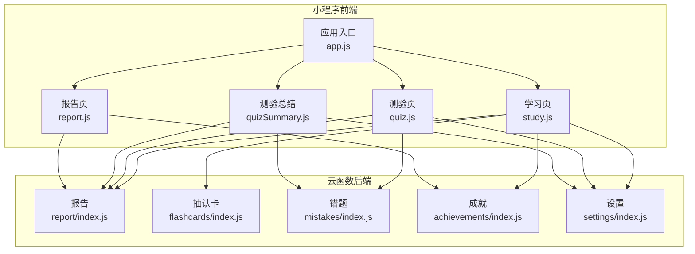
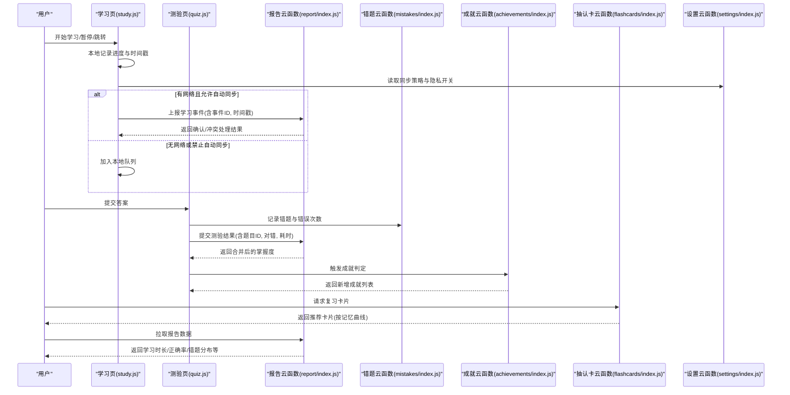
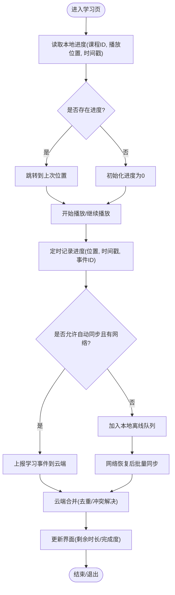
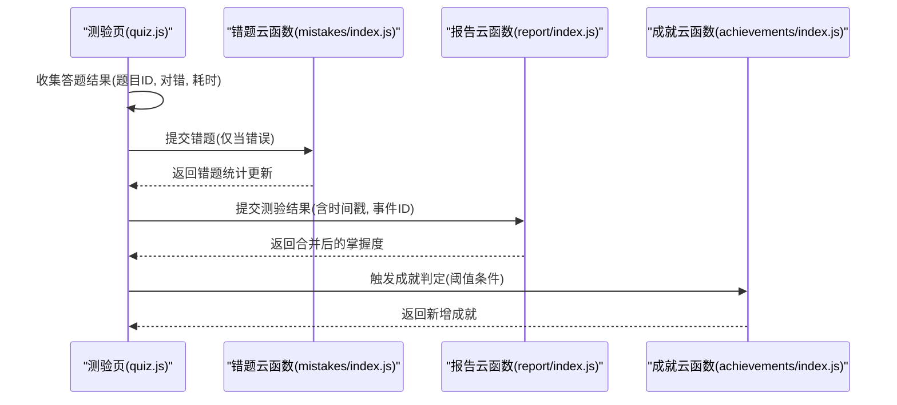
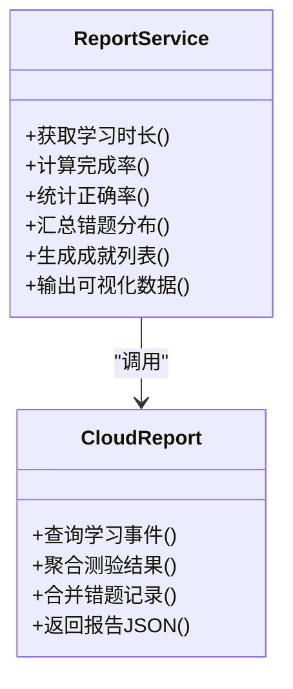
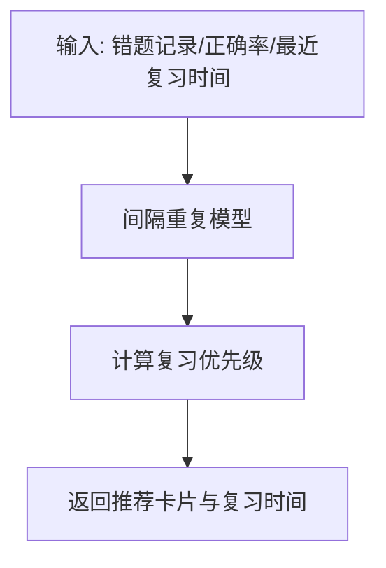
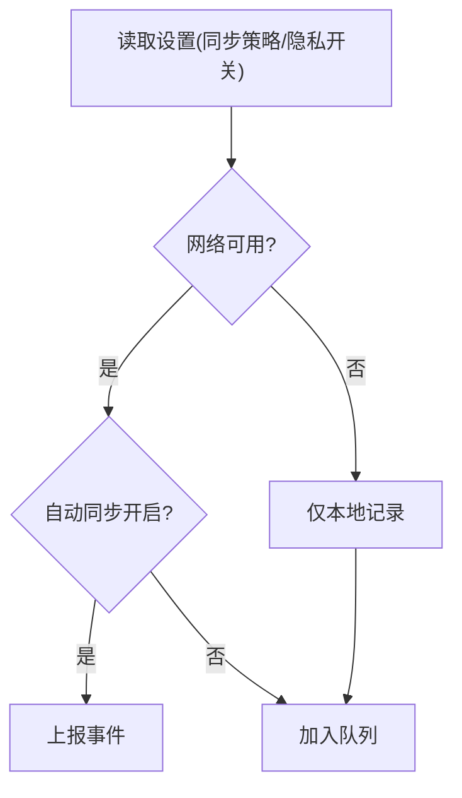
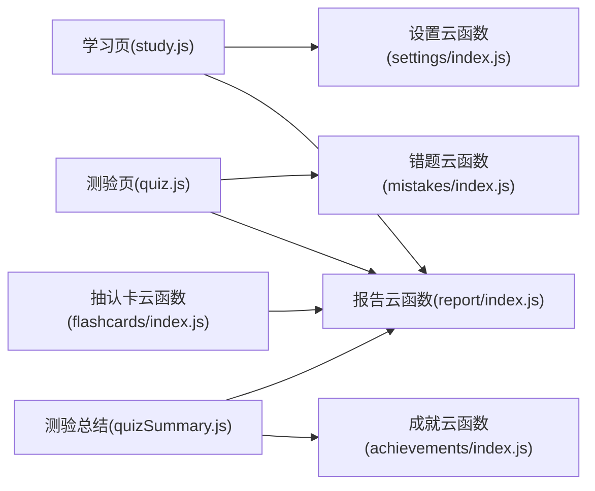

# 学习进度跟踪

<cite>
**本文引用的文件**   
- [miniprogram/pages/study/study.js](file://miniprogram/pages/study/study.js)
- [miniprogram/pages/study/study.wxml](file://miniprogram/pages/study/study.wxml)
- [miniprogram/pages/quiz/quiz.js](file://miniprogram/pages/quiz/quiz.js)
- [miniprogram/pages/quizSummary/quizSummary.js](file://miniprogram/pages/quizSummary/quizSummary.js)
- [cloudfunctions/report/index.js](file://cloudfunctions/report/index.js)
- [cloudfunctions/flashcards/index.js](file://cloudfunctions/flashcards/index.js)
- [cloudfunctions/mistakes/index.js](file://cloudfunctions/mistakes/index.js)
- [cloudfunctions/achievements/index.js](file://cloudfunctions/achievements/index.js)
- [cloudfunctions/settings/index.js](file://cloudfunctions/settings/index.js)
- [miniprogram/app.js](file://miniprogram/app.js)
</cite>

## 目录
1. [简介](#简介)
2. [项目结构](#项目结构)
3. [核心组件](#核心组件)
4. [架构总览](#架构总览)
5. [详细组件分析](#详细组件分析)
6. [依赖分析](#依赖分析)
7. [性能考虑](#性能考虑)
8. [故障排查指南](#故障排查指南)
9. [结论](#结论)
10. [附录](#附录)

## 简介
本文件围绕“学习进度跟踪系统”的本地记录、云端同步与持久化机制展开，重点覆盖以下能力：
- 进度断点续学：支持在视频/课程页面恢复上次播放位置。
- 离线学习：在无网络时仍可记录学习行为，并在恢复网络后自动或手动同步。
- 多设备同步：基于用户身份与时间戳的冲突解决策略，确保跨设备一致性。
- 进度计算逻辑：包括观看时长、完成度、测验得分等指标的计算方法。
- 时间戳管理：统一的时间源与幂等写入，避免重复统计。
- 统计分析：学习时长、正确率、错题分布、成就解锁等可视化展示。
- 隐私保护：最小化采集、可配置开关、数据脱敏与传输加密。

## 项目结构
本项目采用小程序前端 + 云函数后端的双端架构。学习进度相关的前端页面主要位于 miniprogram/pages 下，后端聚合能力通过 cloudfunctions 提供。关键路径如下：
- 学习页（视频/课程）：用于记录观看进度与断点续学
- 测验页与总结页：用于记录答题结果并更新知识掌握度
- 报告页：汇总统计数据与可视化
- 云函数：提供报告、错题、抽认卡、成就、设置等能力

图表来源
- [miniprogram/pages/study/study.js](file://miniprogram/pages/study/study.js)
- [miniprogram/pages/quiz/quiz.js](file://miniprogram/pages/quiz/quiz.js)
- [miniprogram/pages/quizSummary/quizSummary.js](file://miniprogram/pages/quizSummary/quizSummary.js)
- [cloudfunctions/report/index.js](file://cloudfunctions/report/index.js)
- [cloudfunctions/flashcards/index.js](file://cloudfunctions/flashcards/index.js)
- [cloudfunctions/mistakes/index.js](file://cloudfunctions/mistakes/index.js)
- [cloudfunctions/achievements/index.js](file://cloudfunctions/achievements/index.js)
- [cloudfunctions/settings/index.js](file://cloudfunctions/settings/index.js)
- [miniprogram/app.js](file://miniprogram/app.js)

章节来源
- [miniprogram/pages/study/study.js](file://miniprogram/pages/study/study.js)
- [miniprogram/pages/quiz/quiz.js](file://miniprogram/pages/quiz/quiz.js)
- [miniprogram/pages/quizSummary/quizSummary.js](file://miniprogram/pages/quizSummary/quizSummary.js)
- [cloudfunctions/report/index.js](file://cloudfunctions/report/index.js)
- [cloudfunctions/flashcards/index.js](file://cloudfunctions/flashcards/index.js)
- [cloudfunctions/mistakes/index.js](file://cloudfunctions/mistakes/index.js)
- [cloudfunctions/achievements/index.js](file://cloudfunctions/achievements/index.js)
- [cloudfunctions/settings/index.js](file://cloudfunctions/settings/index.js)
- [miniprogram/app.js](file://miniprogram/app.js)

## 核心组件
- 学习页（study.js）：负责记录观看进度、保存断点、上报学习事件、拉取设置项（如是否开启自动同步）。
- 测验页（quiz.js）：收集答题结果，提交到云端以更新错题集与掌握度。
- 测验总结（quizSummary.js）：汇总本次测验成绩，触发成就判定与报告刷新。
- 报告（report 云函数）：聚合学习时长、完成率、正确率、错题分布等指标，供前端渲染。
- 抽认卡（flashcards 云函数）：根据记忆曲线与历史表现推荐复习卡片。
- 错题（mistakes 云函数）：维护错题清单与错误次数、最近错误时间等。
- 成就（achievements 云函数）：根据学习里程碑发放成就。
- 设置（settings 云函数）：管理用户偏好（如同步策略、隐私选项）。

章节来源
- [miniprogram/pages/study/study.js](file://miniprogram/pages/study/study.js)
- [miniprogram/pages/quiz/quiz.js](file://miniprogram/pages/quiz/quiz.js)
- [miniprogram/pages/quizSummary/quizSummary.js](file://miniprogram/pages/quizSummary/quizSummary.js)
- [cloudfunctions/report/index.js](file://cloudfunctions/report/index.js)
- [cloudfunctions/flashcards/index.js](file://cloudfunctions/flashcards/index.js)
- [cloudfunctions/mistakes/index.js](file://cloudfunctions/mistakes/index.js)
- [cloudfunctions/achievements/index.js](file://cloudfunctions/achievements/index.js)
- [cloudfunctions/settings/index.js](file://cloudfunctions/settings/index.js)

## 架构总览
整体流程分为“本地记录 → 队列缓存 → 云端合并 → 状态回写”。关键要点：
- 本地优先：所有学习行为先落盘，保证离线可用。
- 幂等写入：每条事件携带唯一 ID 与时间戳，云端去重。
- 冲突解决：以“最后修改时间优先”为主，结合业务规则（如测验结果不可覆盖更高分）。
- 增量同步：仅上传变更片段，减少带宽与存储压力。
- 可视化与反馈：报告页聚合指标，成就与提示增强动机。

图表来源
- [miniprogram/pages/study/study.js](file://miniprogram/pages/study/study.js)
- [miniprogram/pages/quiz/quiz.js](file://miniprogram/pages/quiz/quiz.js)
- [cloudfunctions/report/index.js](file://cloudfunctions/report/index.js)
- [cloudfunctions/mistakes/index.js](file://cloudfunctions/mistakes/index.js)
- [cloudfunctions/achievements/index.js](file://cloudfunctions/achievements/index.js)
- [cloudfunctions/flashcards/index.js](file://cloudfunctions/flashcards/index.js)
- [cloudfunctions/settings/index.js](file://cloudfunctions/settings/index.js)

## 详细组件分析

### 学习页（断点续学与本地持久化）
- 断点续学：在进入学习页时从本地存储读取上次播放位置；若存在则自动跳转到对应时间点。
- 本地持久化：使用小程序本地存储保存当前课程ID、播放进度、最后更新时间戳。
- 同步策略：依据设置项决定是“实时上报”还是“批量延迟上报”，在网络异常时进入离线队列。
- 幂等性：每次上报附带事件唯一ID，防止重复计数。
- 冲突处理：云端以“最后修改时间优先”合并，遇到边界情况（如同时段多次跳转）取最大有效值。

图表来源
- [miniprogram/pages/study/study.js](file://miniprogram/pages/study/study.js)
- [cloudfunctions/settings/index.js](file://cloudfunctions/settings/index.js)

章节来源
- [miniprogram/pages/study/study.js](file://miniprogram/pages/study/study.js)
- [cloudfunctions/settings/index.js](file://cloudfunctions/settings/index.js)

### 测验与总结（掌握度与错题管理）
- 答题记录：每题记录是否正确、作答耗时、题目ID，形成结构化事件。
- 错题沉淀：将错误题目写入错题库，累计错误次数与最近错误时间。
- 掌握度更新：根据历史正确率与间隔重复算法更新知识点掌握度。
- 成就触发：达到一定正确率或连续正确数时，触发成就判定。
- 总结展示：汇总本次测验成绩、薄弱知识点、建议复习内容。

图表来源
- [miniprogram/pages/quiz/quiz.js](file://miniprogram/pages/quiz/quiz.js)
- [miniprogram/pages/quizSummary/quizSummary.js](file://miniprogram/pages/quizSummary/quizSummary.js)
- [cloudfunctions/mistakes/index.js](file://cloudfunctions/mistakes/index.js)
- [cloudfunctions/report/index.js](file://cloudfunctions/report/index.js)
- [cloudfunctions/achievements/index.js](file://cloudfunctions/achievements/index.js)

章节来源
- [miniprogram/pages/quiz/quiz.js](file://miniprogram/pages/quiz/quiz.js)
- [miniprogram/pages/quizSummary/quizSummary.js](file://miniprogram/pages/quizSummary/quizSummary.js)
- [cloudfunctions/mistakes/index.js](file://cloudfunctions/mistakes/index.js)
- [cloudfunctions/report/index.js](file://cloudfunctions/report/index.js)
- [cloudfunctions/achievements/index.js](file://cloudfunctions/achievements/index.js)

### 报告与可视化（统计分析）
- 指标维度：学习时长、完成率、正确率、错题分布、成就数量、复习推荐。
- 数据来源：聚合学习事件、测验结果、错题记录与成就信息。
- 可视化：折线图（趋势）、饼图（分布）、柱状图（对比），由前端渲染。
- 刷新策略：按需拉取或定时刷新，支持增量更新。

图表来源
- [cloudfunctions/report/index.js](file://cloudfunctions/report/index.js)

章节来源
- [cloudfunctions/report/index.js](file://cloudfunctions/report/index.js)

### 抽认卡与复习推荐（间隔重复）
- 推荐策略：基于艾宾浩斯遗忘曲线与历史表现动态调整复习间隔。
- 数据输入：错题记录、正确率、最近复习时间。
- 输出：下次复习时间与卡片优先级排序。

图表来源
- [cloudfunctions/flashcards/index.js](file://cloudfunctions/flashcards/index.js)

章节来源
- [cloudfunctions/flashcards/index.js](file://cloudfunctions/flashcards/index.js)

### 设置与隐私控制
- 同步策略：自动/手动、网络条件限制（Wi-Fi/移动网络）。
- 隐私开关：是否允许上报学习行为、是否允许个性化推荐。
- 默认值：未设置时采用保守策略（本地优先、低频率上报）。

图表来源
- [cloudfunctions/settings/index.js](file://cloudfunctions/settings/index.js)

章节来源
- [cloudfunctions/settings/index.js](file://cloudfunctions/settings/index.js)

## 依赖分析
- 前端依赖：
  - 学习页依赖设置云函数以获取同步策略。
  - 测验页依赖错题与报告云函数进行数据更新与汇总。
  - 总结页依赖成就与报告云函数进行成果展示。
- 后端依赖：
  - 报告云函数聚合学习事件、测验结果、错题与成就。
  - 抽认卡云函数依赖错题与报告数据进行推荐。
  - 设置云函数独立提供用户偏好。

图表来源
- [miniprogram/pages/study/study.js](file://miniprogram/pages/study/study.js)
- [miniprogram/pages/quiz/quiz.js](file://miniprogram/pages/quiz/quiz.js)
- [miniprogram/pages/quizSummary/quizSummary.js](file://miniprogram/pages/quizSummary/quizSummary.js)
- [cloudfunctions/report/index.js](file://cloudfunctions/report/index.js)
- [cloudfunctions/flashcards/index.js](file://cloudfunctions/flashcards/index.js)
- [cloudfunctions/mistakes/index.js](file://cloudfunctions/mistakes/index.js)
- [cloudfunctions/achievements/index.js](file://cloudfunctions/achievements/index.js)
- [cloudfunctions/settings/index.js](file://cloudfunctions/settings/index.js)

章节来源
- [miniprogram/pages/study/study.js](file://miniprogram/pages/study/study.js)
- [miniprogram/pages/quiz/quiz.js](file://miniprogram/pages/quiz/quiz.js)
- [miniprogram/pages/quizSummary/quizSummary.js](file://miniprogram/pages/quizSummary/quizSummary.js)
- [cloudfunctions/report/index.js](file://cloudfunctions/report/index.js)
- [cloudfunctions/flashcards/index.js](file://cloudfunctions/flashcards/index.js)
- [cloudfunctions/mistakes/index.js](file://cloudfunctions/mistakes/index.js)
- [cloudfunctions/achievements/index.js](file://cloudfunctions/achievements/index.js)
- [cloudfunctions/settings/index.js](file://cloudfunctions/settings/index.js)

## 性能考虑
- 本地优先与批量上报：减少网络往返，提升响应速度。
- 增量同步：仅上传变更字段，降低带宽占用。
- 去重与幂等：事件ID与时间戳避免重复统计与冗余写入。
- 异步队列：后台任务处理，不阻塞主线程。
- 缓存与预取：对报告与推荐数据进行短期缓存，提高加载速度。
- 资源优化：图片与脚本按需加载，减少首屏体积。

[本节为通用指导，无需特定文件来源]

## 故障排查指南
- 断点续学无效：
  - 检查本地存储中是否存在进度记录与时间戳。
  - 确认设置项中是否关闭了自动同步导致无法更新云端。
- 多设备不同步：
  - 核对事件ID是否唯一，时间戳是否一致。
  - 查看云端合并日志，确认冲突解决策略是否生效。
- 报告数据缺失：
  - 确认测验结果与学习事件是否成功上报。
  - 检查报告云函数的聚合逻辑与权限。
- 成就未触发：
  - 验证阈值条件与成就判定逻辑。
  - 检查成就云函数返回的新增成就列表。

章节来源
- [miniprogram/pages/study/study.js](file://miniprogram/pages/study/study.js)
- [cloudfunctions/report/index.js](file://cloudfunctions/report/index.js)
- [cloudfunctions/achievements/index.js](file://cloudfunctions/achievements/index.js)
- [cloudfunctions/settings/index.js](file://cloudfunctions/settings/index.js)

## 结论
本系统通过“本地优先、幂等写入、增量同步、冲突合并”的策略，实现了稳定的学习进度跟踪与多设备一致性。配合报告与成就体系，为用户提供清晰的反馈与激励。未来可进一步优化推荐算法与隐私保护机制，提升用户体验与数据安全。

[本节为总结性内容，无需特定文件来源]

## 附录
- 术语说明：
  - 事件ID：用于标识一次学习或测验行为的唯一标识。
  - 时间戳：记录行为发生的时间，用于冲突解决与顺序判断。
  - 掌握度：基于历史表现计算的知识点掌握水平。
  - 间隔重复：根据遗忘曲线安排复习时间的算法。
- 最佳实践：
  - 始终为事件分配唯一ID与时间戳。
  - 在弱网环境下启用批量上报与重试机制。
  - 对用户敏感信息进行脱敏与最小化采集。

[本节为补充说明，无需特定文件来源]