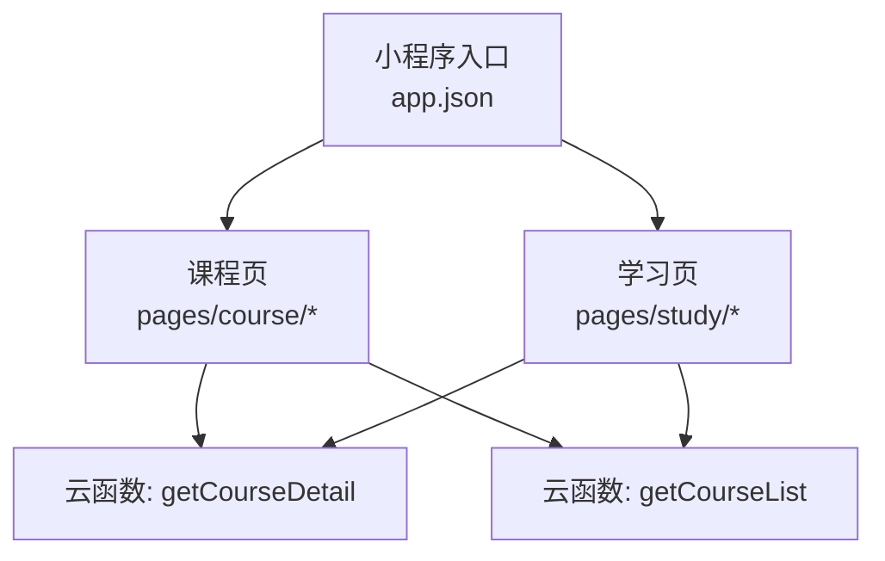
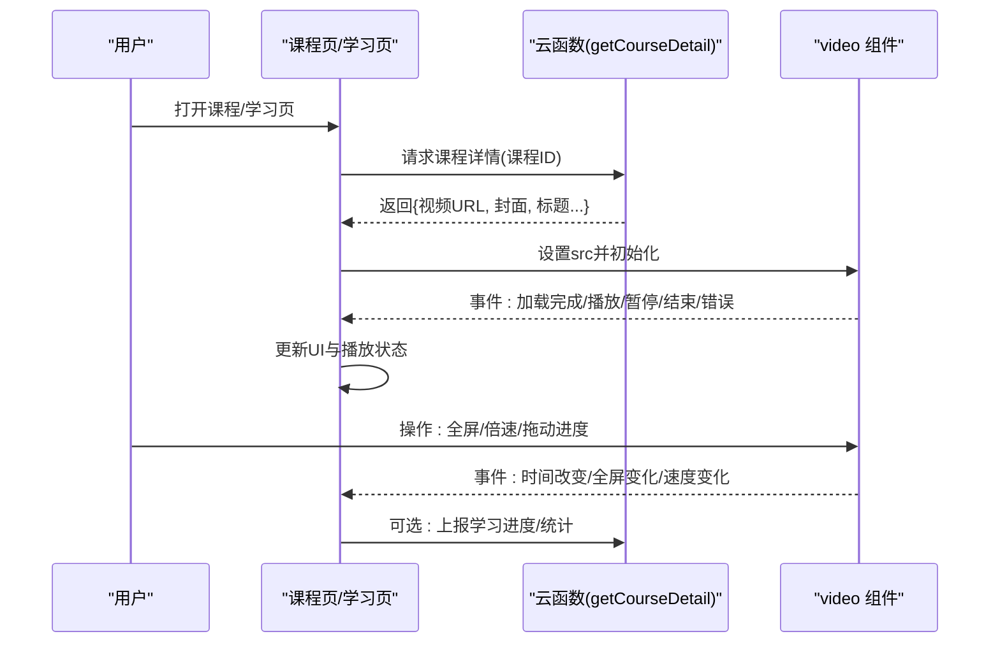
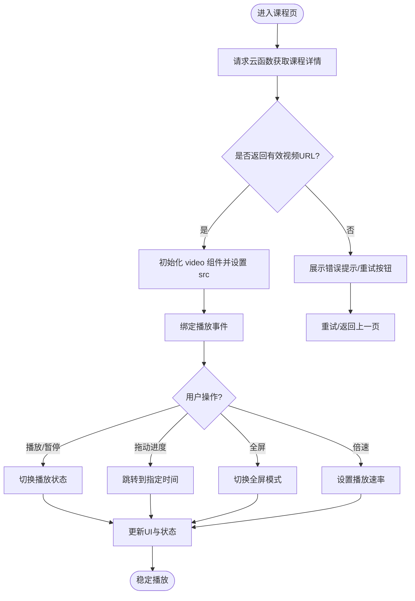
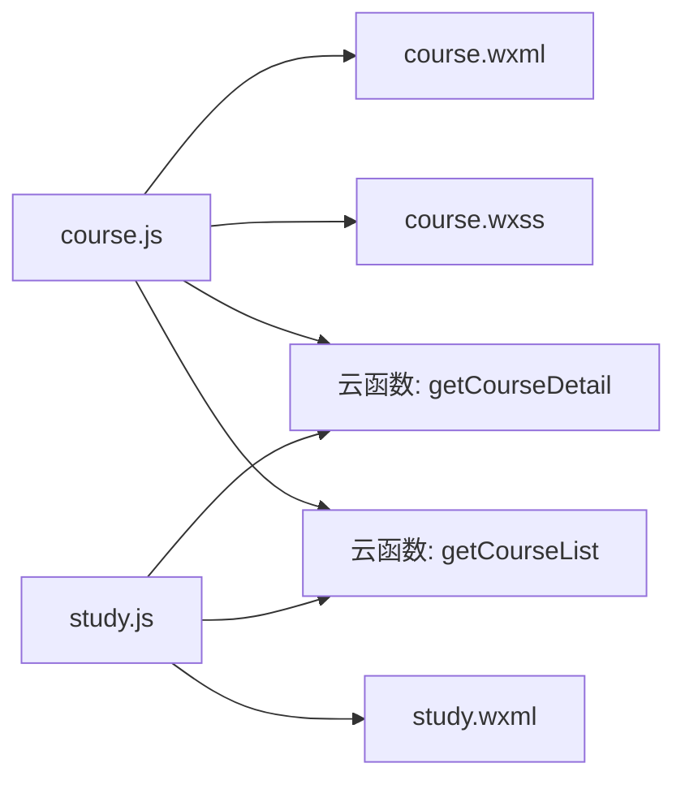

# 视频播放系统

<cite>
**本文引用的文件**   
- [app.json](file://miniprogram/app.json)
- [project.config.json](file://project.config.json)
- [course/course.js](file://miniprogram/pages/course/course.js)
- [course/course.wxml](file://miniprogram/pages/course/course.wxml)
- [course/course.wxss](file://miniprogram/pages/course/course.wxss)
- [study/study.js](file://miniprogram/pages/study/study.js)
- [study/study.wxml](file://miniprogram/pages/study/study.wxml)
- [cloudfunctions/getCourseDetail/index.js](file://cloudfunctions/getCourseDetail/index.js)
- [cloudfunctions/getCourseList/index.js](file://cloudfunctions/getCourseList/index.js)
- [docs/superpowers/plans/2026-07-17-course-video-knowledge.md](file://docs/superpowers/plans/2026-07-17-course-video-knowledge.md)
- [docs/superpowers/specs/2026-07-17-course-video-knowledge-design.md](file://docs/superpowers/specs/2026-07-17-course-video-knowledge-design.md)
</cite>

## 目录
1. [简介](#简介)
2. [项目结构](#项目结构)
3. [核心组件](#核心组件)
4. [架构总览](#架构总览)
5. [详细组件分析](#详细组件分析)
6. [依赖关系分析](#依赖关系分析)
7. [性能与优化](#性能与优化)
8. [故障排查指南](#故障排查指南)
9. [结论](#结论)
10. [附录](#附录)

## 简介
本文件面向微信小程序“视频播放系统”的集成与实现，覆盖播放器配置、控制界面定制、播放状态管理、流加载优化、缓冲策略、错误重试机制、事件监听、全屏切换、倍速播放等高级能力，并提供资源管理与CDN配置的最佳实践。文档同时给出常见问题的定位与解决方案（黑屏、卡顿、兼容性），并基于仓库中的页面与云函数进行落地说明。

## 项目结构
本项目为微信小程序工程，视频相关逻辑主要分布在课程与学习页面中，并通过云函数获取课程详情与列表数据。关键路径如下：
- 小程序入口与全局配置：app.json、project.config.json
- 课程页（含视频播放）：pages/course/*
- 学习页（可能包含播放进度或学习记录）：pages/study/*
- 云函数：getCourseDetail、getCourseList
- 设计文档：docs/superpowers/*

图表来源
- [app.json](file://miniprogram/app.json)
- [course/course.js](file://miniprogram/pages/course/course.js)
- [study/study.js](file://miniprogram/pages/study/study.js)
- [cloudfunctions/getCourseDetail/index.js](file://cloudfunctions/getCourseDetail/index.js)
- [cloudfunctions/getCourseList/index.js](file://cloudfunctions/getCourseList/index.js)

章节来源
- [app.json](file://miniprogram/app.json)
- [project.config.json](file://project.config.json)

## 核心组件
- 视频播放器容器：通过小程序原生 video 组件承载视频流，负责渲染、解码、缓冲与基础控制。
- 课程页控制器：组织视频源、控制 UI、处理用户交互与播放状态同步。
- 学习页控制器：维护学习进度、回放位置与学习行为上报。
- 云函数接口：提供课程详情与列表数据，返回视频地址、封面、标题等信息。

章节来源
- [course/course.js](file://miniprogram/pages/course/course.js)
- [course/course.wxml](file://miniprogram/pages/course/course.wxml)
- [course/course.wxss](file://miniprogram/pages/course/course.wxss)
- [study/study.js](file://miniprogram/pages/study/study.js)
- [study/study.wxml](file://miniprogram/pages/study/study.wxml)
- [cloudfunctions/getCourseDetail/index.js](file://cloudfunctions/getCourseDetail/index.js)
- [cloudfunctions/getCourseList/index.js](file://cloudfunctions/getCourseList/index.js)

## 架构总览
整体流程：课程/学习页请求云函数获取课程信息，拿到视频地址后初始化播放器；播放器在生命周期内触发事件，页面层更新UI与状态；必要时调用云函数上报学习进度或统计数据。

图表来源
- [course/course.js](file://miniprogram/pages/course/course.js)
- [study/study.js](file://miniprogram/pages/study/study.js)
- [cloudfunctions/getCourseDetail/index.js](file://cloudfunctions/getCourseDetail/index.js)

## 详细组件分析

### 课程页播放器集成
- 播放器配置
  - 使用 video 组件绑定 src 为云函数返回的视频地址。
  - 根据业务需要开启/关闭默认控件、是否自动播放、是否显示封面图等属性。
- 控制界面定制
  - 通过自定义按钮覆盖默认控件，实现播放/暂停、进度条、音量、清晰度切换等。
  - 样式文件用于布局与主题适配。
- 播放状态管理
  - 监听 play/pause/timeupdate/ended/error 等事件，同步到页面状态。
  - 将当前播放位置持久化，支持断点续播。
- 高级功能
  - 全屏切换：监听全屏事件，调整布局与控件可见性。
  - 倍速播放：根据用户选择设置播放速率，并在 UI 上反馈。
  - 事件监听：统一封装事件回调，避免重复绑定与内存泄漏。

图表来源
- [course/course.js](file://miniprogram/pages/course/course.js)
- [course/course.wxml](file://miniprogram/pages/course/course.wxml)
- [course/course.wxss](file://miniprogram/pages/course/course.wxss)

章节来源
- [course/course.js](file://miniprogram/pages/course/course.js)
- [course/course.wxml](file://miniprogram/pages/course/course.wxml)
- [course/course.wxss](file://miniprogram/pages/course/course.wxss)

### 学习页进度与记录
- 学习进度
  - 监听 timeupdate 事件，周期性保存当前播放位置。
  - 进入页面时恢复上次播放位置，提升体验。
- 学习行为上报
  - 在关键节点（开始播放、暂停、结束、跳转）上报学习行为，便于分析与激励。
- 与其他模块联动
  - 与成就、错题、报告等模块共享学习数据，形成闭环。

章节来源
- [study/study.js](file://miniprogram/pages/study/study.js)
- [study/study.wxml](file://miniprogram/pages/study/study.wxml)

### 云函数接口
- getCourseDetail
  - 输入：课程ID
  - 输出：课程基本信息、视频地址、封面图、时长等
- getCourseList
  - 输入：分页参数、筛选条件
  - 输出：课程列表（含缩略信息与视频地址）

章节来源
- [cloudfunctions/getCourseDetail/index.js](file://cloudfunctions/getCourseDetail/index.js)
- [cloudfunctions/getCourseList/index.js](file://cloudfunctions/getCourseList/index.js)

## 依赖关系分析
- 页面与云函数
  - 课程页/学习页依赖 getCourseDetail 获取单课详情，依赖 getCourseList 获取课程列表。
- 页面内部依赖
  - course.js 与 course.wxml/wxss 强耦合，负责逻辑与视图。
  - study.js 与 study.wxml 负责学习进度与记录。
- 外部依赖
  - 视频CDN/点播服务（由云函数返回的地址决定）。
  - 微信原生 video 组件能力。

图表来源
- [course/course.js](file://miniprogram/pages/course/course.js)
- [course/course.wxml](file://miniprogram/pages/course/course.wxml)
- [course/course.wxss](file://miniprogram/pages/course/course.wxss)
- [study/study.js](file://miniprogram/pages/study/study.js)
- [study/study.wxml](file://miniprogram/pages/study/study.wxml)
- [cloudfunctions/getCourseDetail/index.js](file://cloudfunctions/getCourseDetail/index.js)
- [cloudfunctions/getCourseList/index.js](file://cloudfunctions/getCourseList/index.js)

章节来源
- [course/course.js](file://miniprogram/pages/course/course.js)
- [study/study.js](file://miniprogram/pages/study/study.js)
- [cloudfunctions/getCourseDetail/index.js](file://cloudfunctions/getCourseDetail/index.js)
- [cloudfunctions/getCourseList/index.js](file://cloudfunctions/getCourseList/index.js)

## 性能与优化
- 流加载优化
  - 优先使用HTTPS与就近CDN节点，缩短首帧时间。
  - 合理设置预加载与缓冲阈值，减少卡顿。
- 缓冲策略
  - 在网络波动场景下，适当增大缓冲时长以提升稳定性。
  - 对长视频采用分段加载与按需拉取策略。
- 错误重试机制
  - 网络错误与鉴权失败时，指数退避重试，限制最大重试次数。
  - 失败时降级至低清晰度或转码版本。
- 播放性能优化
  - 避免频繁创建/销毁播放器实例，复用实例并释放资源。
  - 在页面隐藏时暂停播放，降低CPU与功耗。
- 资源管理与CDN配置
  - 视频地址带鉴权签名与过期时间，防止盗链。
  - 多清晰度与自适应码率，结合网络状况动态切换。
- 最佳实践
  - 首帧优化：预取关键帧与元数据。
  - 监控埋点：收集首帧耗时、卡顿率、错误率等指标。
  - 灰度发布：新编码格式或CDN策略小流量验证。

[本节为通用指导，不直接分析具体文件]

## 故障排查指南
- 黑屏
  - 检查视频URL是否可访问、域名是否在合法列表中。
  - 确认已正确设置 video 组件的 src 与必要属性。
  - 查看控制台错误日志与网络请求状态。
- 卡顿
  - 评估网络带宽与抖动，尝试切换更低清晰度。
  - 调整缓冲策略与预加载参数。
  - 检查是否存在大量DOM重绘或主线程阻塞。
- 兼容性问题
  - 不同机型/系统版本的 video 能力差异，需做能力检测与降级。
  - 横竖屏切换时的布局适配与控件遮挡问题。
- 常见问题定位步骤
  - 复现路径：最小化用例复现。
  - 日志采集：关键事件与错误堆栈。
  - 回归验证：修复后在不同设备与网络环境下验证。

[本节为通用指导，不直接分析具体文件]

## 结论
本视频播放系统以小程序原生 video 为核心，结合课程/学习页面与云函数接口，实现了完整的播放链路。通过合理的缓冲策略、错误重试与CDN优化，可在复杂网络环境下保持稳定播放。建议持续完善监控与灰度策略，进一步提升用户体验与系统可靠性。

[本节为总结，不直接分析具体文件]

## 附录
- 设计规划与规格
  - 课程视频知识规划与设计文档可作为产品与技术对齐依据。

章节来源
- [docs/superpowers/plans/2026-07-17-course-video-knowledge.md](file://docs/superpowers/plans/2026-07-17-course-video-knowledge.md)
- [docs/superpowers/specs/2026-07-17-course-video-knowledge-design.md](file://docs/superpowers/specs/2026-07-17-course-video-knowledge-design.md)