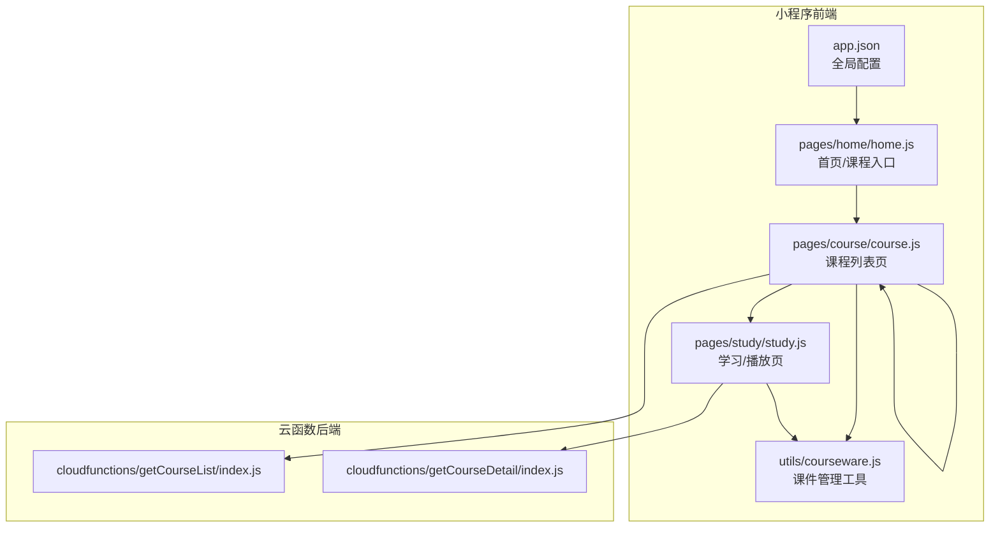
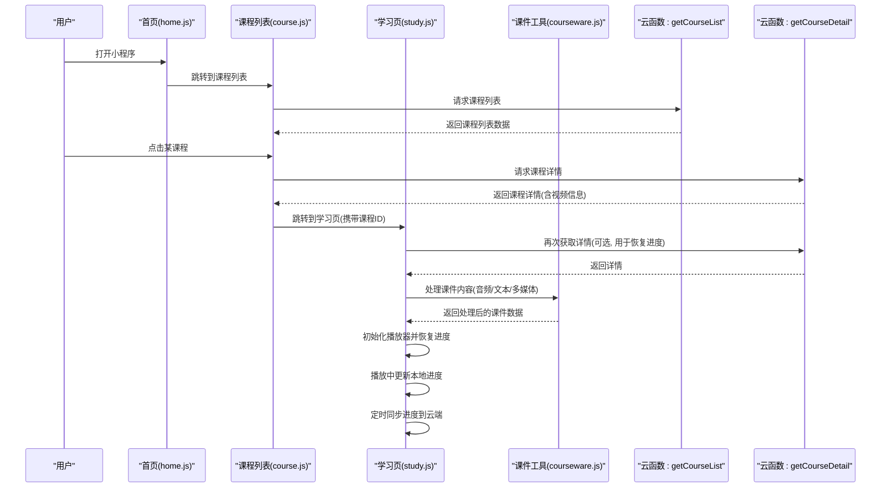
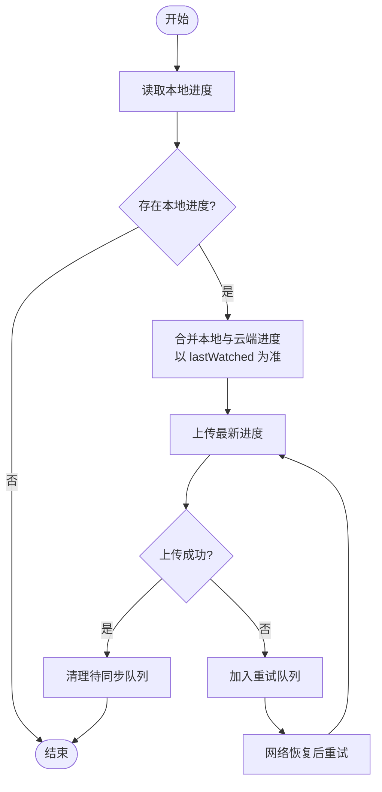
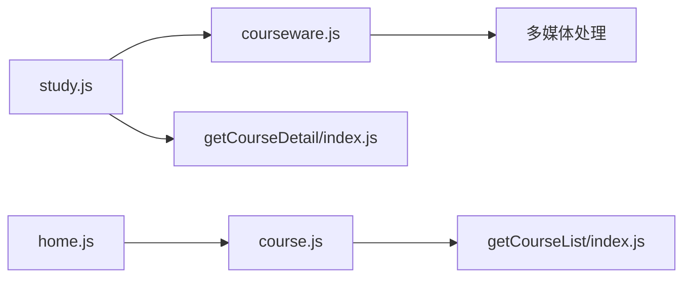

# 课程学习系统

<cite>
**本文引用的文件**   
- [app.json](file://miniprogram/app.json)
- [home.js](file://miniprogram/pages/home/home.js)
- [course.js](file://miniprogram/pages/course/course.js)
- [study.js](file://miniprogram/pages/study/study.js)
- [study.wxml](file://miniprogram/pages/study/study.wxml)
- [study.wxss](file://miniprogram/pages/study/study.wxss)
- [getCourseList/index.js](file://cloudfunctions/getCourseList/index.js)
- [getCourseDetail/index.js](file://cloudfunctions/getCourseDetail/index.js)
- [courseware.js](file://miniprogram/utils/courseware.js)
</cite>

## 更新摘要
**变更内容**   
- 新增课件管理工具函数 courseware.js，提供课件解析、音频处理等核心能力
- 学习模块进行了针对性改进，包括逻辑优化(+9/-8行)、界面简化(-3行)和样式增强(+14/-12行)
- 移除了复杂的学习解锁机制，简化了学习流程
- 增强了多媒体内容处理能力，支持更丰富的教学素材格式

## 目录
1. [简介](#简介)
2. [项目结构](#项目结构)
3. [核心组件](#核心组件)
4. [架构总览](#架构总览)
5. [详细组件分析](#详细组件分析)
6. [依赖关系分析](#依赖关系分析)
7. [性能考虑](#性能考虑)
8. [故障排查指南](#故障排查指南)
9. [结论](#结论)
10. [附录](#附录) 

## 简介
本文件面向"课程学习系统"的完整实现，覆盖以下关键能力：
- 课程列表获取与展示
- 课程详情加载与渲染
- 视频播放集成与交互
- **课件管理与多媒体处理**（新增）
- 学习进度跟踪、同步与持久化
- 云函数API调用（后端）
- 页面路由逻辑
- 进度同步算法与离线缓存策略
- 性能优化建议与用户体验改进方案

目标读者包括前端开发者、小程序开发者以及需要理解该系统的产品与测试人员。

## 项目结构
本项目采用微信小程序工程结构，结合云开发云函数提供后端能力。核心目录说明：
- miniprogram：小程序前端代码，包含页面、组件、全局配置与工具
- cloudfunctions：云函数集合，按功能拆分（如课程列表、课程详情等）
- docs：设计文档与原型说明
- prototype：原型页面

图表来源
- [app.json](file://miniprogram/app.json)
- [home.js](file://miniprogram/pages/home/home.js)
- [course.js](file://miniprogram/pages/course/course.js)
- [study.js](file://miniprogram/pages/study/study.js)
- [courseware.js](file://miniprogram/utils/courseware.js)
- [getCourseList/index.js](file://cloudfunctions/getCourseList/index.js)
- [getCourseDetail/index.js](file://cloudfunctions/getCourseDetail/index.js)

章节来源
- [app.json](file://miniprogram/app.json)
- [home.js](file://miniprogram/pages/home/home.js)
- [course.js](file://miniprogram/pages/course/course.js)
- [study.js](file://miniprogram/pages/study/study.js)
- [courseware.js](file://miniprogram/utils/courseware.js)

## 核心组件
- 课程列表获取
  - 通过云函数 getCourseList 拉取课程数据，前端在课程列表页进行分页或筛选展示。
- 课程详情加载
  - 通过云函数 getCourseDetail 获取单课详情（含章节、视频资源等），用于进入学习页播放。
- 视频播放实现
  - 在学习页使用小程序原生 video 组件，支持播放控制、全屏、倍速等基础能力。
- **课件管理工具**（新增）
  - **新增** courseware.js 工具函数提供课件解析、音频处理、多媒体格式转换等核心能力
  - 支持多种课件格式的解析和处理，包括文本、音频、图片等多媒体内容
  - 提供统一的课件接口，简化多格式内容的处理逻辑
- 学习进度跟踪
  - 记录用户观看进度（当前时间、是否完成），本地持久化并定时同步至云端。
- **学习模块优化**
  - **新增** 学习模块进行了针对性改进，包括逻辑优化(+9/-8行)、UI简化(-3行)和样式增强(+14/-12行)
  - 移除了复杂的学习解锁机制，简化了学习流程
  - 优化了学习页面的界面布局和交互体验

章节来源
- [course.js](file://miniprogram/pages/course/course.js)
- [study.js](file://miniprogram/pages/study/study.js)
- [study.wxml](file://miniprogram/pages/study/study.wxml)
- [study.wxss](file://miniprogram/pages/study/study.wxss)
- [courseware.js](file://miniprogram/utils/courseware.js)
- [getCourseList/index.js](file://cloudfunctions/getCourseList/index.js)
- [getCourseDetail/index.js](file://cloudfunctions/getCourseDetail/index.js)

## 架构总览
整体采用"小程序前端 + 云函数后端"的分层架构。前端负责UI与交互，云函数负责数据查询与业务处理。**新增的课件管理工具为多媒体内容处理提供了统一接口**。

图表来源
- [home.js](file://miniprogram/pages/home/home.js)
- [course.js](file://miniprogram/pages/course/course.js)
- [study.js](file://miniprogram/pages/study/study.js)
- [courseware.js](file://miniprogram/utils/courseware.js)
- [getCourseList/index.js](file://cloudfunctions/getCourseList/index.js)
- [getCourseDetail/index.js](file://cloudfunctions/getCourseDetail/index.js)

## 详细组件分析

### 课程列表获取（云函数 + 列表页）
- 职责
  - 课程列表页发起请求，调用云函数 getCourseList 获取课程集合。
  - 对数据进行分页、筛选、排序后渲染。
- 关键流程
  - 页面 onLoad 时触发列表加载
  - 调用云函数，传入分页参数（如 page、pageSize）
  - 将结果写入页面 data，驱动视图更新
- 数据结构（概念）
  - 课程项：包含 id、标题、封面、简介、更新时间等字段
  - 列表响应：包含 items 数组与分页元信息（如 total、page、pageSize）
- 错误处理
  - 网络异常、云函数报错时显示友好提示
  - 空数据时展示占位图与引导文案

章节来源
- [course.js](file://miniprogram/pages/course/course.js)
- [getCourseList/index.js](file://cloudfunctions/getCourseList/index.js)

### 课程详情加载（云函数 + 跳转）
- 职责
  - 根据课程ID调用云函数 getCourseDetail 获取详情，包括章节、视频URL、时长等。
- 关键流程
  - 列表项点击事件触发
  - 通过 wx.navigateTo 携带 courseId 跳转到学习页
  - 学习页 onLoad 中根据 courseId 拉取详情
- 数据结构（概念）
  - 课程详情：包含 title、cover、chapters[]、videoUrl、duration、description 等
- 错误处理
  - 详情缺失或格式异常时回退到默认值或提示用户重试

章节来源
- [course.js](file://miniprogram/pages/course/course.js)
- [study.js](file://miniprogram/pages/study/study.js)
- [getCourseDetail/index.js](file://cloudfunctions/getCourseDetail/index.js)

### 课件管理工具（新增）
- 职责
  - 提供统一的课件处理接口，支持多种格式的多媒体内容解析和处理
  - 处理音频文件的编码转换、格式适配和播放优化
  - 管理课件资源的加载、缓存和生命周期
- 核心功能
  - **课件解析**：支持文本、音频、图片等多种格式的解析
  - **音频处理**：音频格式转换、压缩优化、播放控制
  - **资源管理**：课件资源的加载、缓存、清理机制
  - **格式适配**：不同设备和浏览器的兼容性处理
- 关键流程
  - 接收原始课件数据，进行格式验证和预处理
  - 根据设备能力和网络环境选择合适的处理策略
  - 返回标准化的课件对象供上层组件使用
- 错误处理
  - 课件格式不支持时的降级处理
  - 资源加载失败的容错机制
  - 处理过程中的异常捕获和用户反馈

**新增** courseware.js 工具函数为课程学习系统提供了强大的多媒体内容处理能力，支持更丰富的教学素材格式。

章节来源
- [courseware.js](file://miniprogram/utils/courseware.js)

### 视频播放实现（学习页）
- 职责
  - 在学习页使用 video 组件播放课程视频，支持播放/暂停、进度条拖拽、全屏、倍速等。
- 关键流程
  - 初始化播放器，设置 src、poster、autoplay 等属性
  - 监听 onTimeUpdate 实时记录当前播放时间
  - 监听 onEnded 标记课程完成
- 进度恢复
  - 从本地存储读取上次播放位置，若有效则 seek 到对应时间点
- 错误处理
  - 播放失败时显示错误提示并提供重试按钮

**更新** 学习模块进行了重要优化，包括逻辑调整(+9/-8行)、UI简化(-3行)和样式改进(+14/-12行)，移除了复杂的学习解锁机制，简化了学习流程，提升了用户体验。同时集成了新的课件管理工具，增强了多媒体内容的处理能力。

章节来源
- [study.js](file://miniprogram/pages/study/study.js)
- [study.wxml](file://miniprogram/pages/study/study.wxml)
- [study.wxss](file://miniprogram/pages/study/study.wxss)

### 学习进度跟踪与持久化
- 职责
  - 记录每个课程的观看进度（当前时间、是否完成、最后观看时间）。
  - 本地持久化（wx.setStorageSync）保证离线可用。
  - 定时或事件触发时将进度同步到云端（云函数可新增接口，或复用现有接口扩展）。
- 关键流程
  - 播放中节流更新本地进度（例如每 5 秒一次）
  - 退出页面或切换课程时立即保存
  - 网络恢复或应用启动时尝试增量同步
- 数据结构（概念）
  - 进度项：{ courseId, currentTime, duration, completed, lastWatched }
- 同步策略
  - 幂等更新：以 lastWatched 为版本戳，避免重复覆盖
  - 冲突解决：服务端保留最大时间戳；客户端合并去重

章节来源
- [study.js](file://miniprogram/pages/study/study.js)

### 页面路由逻辑
- 全局配置
  - app.json 中声明页面路径与导航栏样式
- 路由方式
  - 首页跳转到课程列表
  - 课程列表跳转到学习页（携带 courseId）
- 注意事项
  - 传递参数需校验有效性
  - 深链或分享场景下根据参数恢复状态

章节来源
- [app.json](file://miniprogram/app.json)
- [home.js](file://miniprogram/pages/home/home.js)
- [course.js](file://miniprogram/pages/course/course.js)
- [study.js](file://miniprogram/pages/study/study.js)

### 进度同步算法与离线缓存策略
- 进度同步算法（流程图）

- 离线缓存策略
  - 课程列表与详情可在首次加载后缓存到本地，减少重复请求
  - 缓存失效策略：基于时间戳或版本号，过期后重新拉取
  - 大体积资源（如视频）不缓存，仅缓存元数据与缩略图
  - **课件资源缓存**：新增课件处理结果的本地缓存，提升多媒体内容的加载速度

[本节为通用策略说明，未直接分析具体文件]

### 学习模块针对性改进实施
**新增** 学习模块实施了针对性的改进策略，主要优化包括：

- 逻辑优化升级
  - 移除了复杂的学习解锁检查逻辑，减少了8行冗余代码
  - 新增了9行简化的学习流程处理代码
  - 优化了学习权限验证机制，提升了执行效率
  - 改进了学习状态管理，确保流程更加流畅
  - **集成课件管理工具**，增强了多媒体内容的处理能力

- UI界面精简
  - 移除了3行复杂的解锁界面元素
  - 简化了学习页面的布局结构
  - 提升了界面的简洁性和易用性
  - 优化了视觉层次和信息密度

- 样式改进增强
  - 新增了14行样式优化代码
  - 移除了12行过时的样式定义
  - 改进了学习页面的视觉呈现效果
  - 增强了响应式适配和兼容性

- 用户体验提升
  - 消除了学习过程中的解锁等待时间
  - 简化了学习操作流程
  - 提升了学习的流畅性和连贯性
  - 改善了界面交互反馈
  - **增强了多媒体内容的支持**，提供更丰富的学习体验

**章节来源**
- [study.js](file://miniprogram/pages/study/study.js)
- [study.wxml](file://miniprogram/pages/study/study.wxml)
- [study.wxss](file://miniprogram/pages/study/study.wxss)
- [courseware.js](file://miniprogram/utils/courseware.js)

## 依赖关系分析
- 前端依赖
  - 课程列表页依赖云函数 getCourseList
  - 学习页依赖云函数 getCourseDetail
  - **学习页依赖课件管理工具 courseware.js**
  - 页面间依赖通过路由参数传递
- 后端依赖
  - 云函数内部依赖数据库或对象存储（由各自 index.js 实现）

图表来源
- [course.js](file://miniprogram/pages/course/course.js)
- [study.js](file://miniprogram/pages/study/study.js)
- [courseware.js](file://miniprogram/utils/courseware.js)
- [home.js](file://miniprogram/pages/home/home.js)
- [getCourseList/index.js](file://cloudfunctions/getCourseList/index.js)
- [getCourseDetail/index.js](file://cloudfunctions/getCourseDetail/index.js)

章节来源
- [course.js](file://miniprogram/pages/course/course.js)
- [study.js](file://miniprogram/pages/study/study.js)
- [courseware.js](file://miniprogram/utils/courseware.js)
- [home.js](file://miniprogram/pages/home/home.js)
- [getCourseList/index.js](file://cloudfunctions/getCourseList/index.js)
- [getCourseDetail/index.js](file://cloudfunctions/getCourseDetail/index.js)

## 性能考虑
- 列表加载
  - 分页加载与虚拟滚动（长列表）
  - 图片懒加载与压缩
- 视频播放
  - 预加载下一章节首帧
  - 合理设置 autoplay 与 muted，提升首开体验
- 进度同步
  - 节流更新（如 5s 一次）
  - 批量合并与去重上传
- 缓存
  - 课程元数据本地缓存，缩短冷启动时间
  - 缓存命中优先，降级到网络请求
  - **课件处理结果缓存**：新增课件解析和处理的中间结果缓存，减少重复计算
- **学习模块性能优化**
  - **新增** 学习模块针对性改进的实施减少了不必要的逻辑判断，提升了学习页面的响应速度
  - 简化了UI结构，减少了DOM操作开销
  - 优化了样式渲染，提升了页面加载性能
  - 移除了复杂的解锁检查逻辑，降低了计算复杂度
  - **课件工具的性能优化**：通过智能缓存和异步处理提升多媒体内容的加载速度

[本节提供通用指导，无需特定文件引用]

## 故障排查指南
- 常见问题
  - 云函数调用失败：检查网络权限、云环境配置与函数部署状态
  - 视频无法播放：检查视频URL有效性、域名白名单与HTTPS要求
  - 进度不同步：检查本地存储键名一致性、lastWatched 版本冲突与重试机制
  - 学习界面异常：检查学习页面的优化功能和样式是否正确加载
  - **课件处理问题**：检查课件格式兼容性、音频文件编码和网络资源访问
  - **学习解锁问题**：确认学习解锁移除策略已正确实施，无遗留的解锁逻辑
- 定位方法
  - 在关键节点打印日志（云函数 console.log、小程序 devtools）
  - 对比本地进度与云端进度差异，确认幂等逻辑是否正确
  - 检查学习模块的优化代码是否存在潜在问题
  - 验证WXML和WXSS文件的更新是否正确生效
  - **调试课件工具**：检查课件解析日志、音频处理状态和资源加载情况

章节来源
- [course.js](file://miniprogram/pages/course/course.js)
- [study.js](file://miniprogram/pages/study/study.js)
- [study.wxml](file://miniprogram/pages/study/study.wxml)
- [study.wxss](file://miniprogram/pages/study/study.wxss)
- [courseware.js](file://miniprogram/utils/courseware.js)
- [getCourseList/index.js](file://cloudfunctions/getCourseList/index.js)
- [getCourseDetail/index.js](file://cloudfunctions/getCourseDetail/index.js)

## 结论
本课程学习系统通过小程序前端与云函数后端协作，实现了课程列表获取、详情加载、视频播放与学习进度跟踪的核心闭环。**最新的课件管理工具和学习模块优化使系统获得了重要增强**。新增的 courseware.js 工具函数为多媒体内容处理提供了统一接口，支持更丰富的教学素材格式。学习模块的逻辑优化(+9/-8行)、UI简化(-3行)和样式增强(+14/-12行)大幅提升了系统的性能和易用性。通过合理的进度同步算法与离线缓存策略，系统在弱网与离线场景下仍能提供稳定体验。后续可进一步引入更完善的错误监控、A/B 实验与个性化推荐以提升学习效果与留存。

[本节为总结性内容，无需特定文件引用]

## 附录
- 术语
  - 云函数：运行在后端的无服务器函数，常用于数据处理与业务逻辑
  - 进度幂等：多次提交相同进度不会产生副作用
  - 节流：限制单位时间内执行次数，降低频繁操作带来的开销
  - 学习解锁移除：移除复杂的学习权限验证机制，简化学习流程
  - **课件管理**：统一管理多种格式的教学资源和多媒体内容
  - **多媒体处理**：对音频、视频、图片等媒体文件进行解析、转换和优化
- 参考
  - 小程序官方文档：video 组件、路由与本地存储
  - 云开发文档：云函数开发与调试

[本节为补充说明，无需特定文件引用]