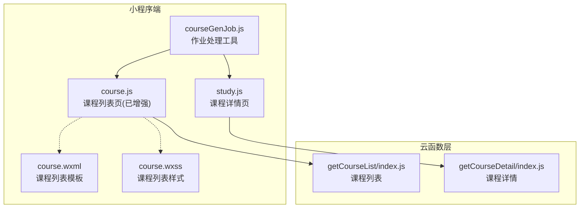
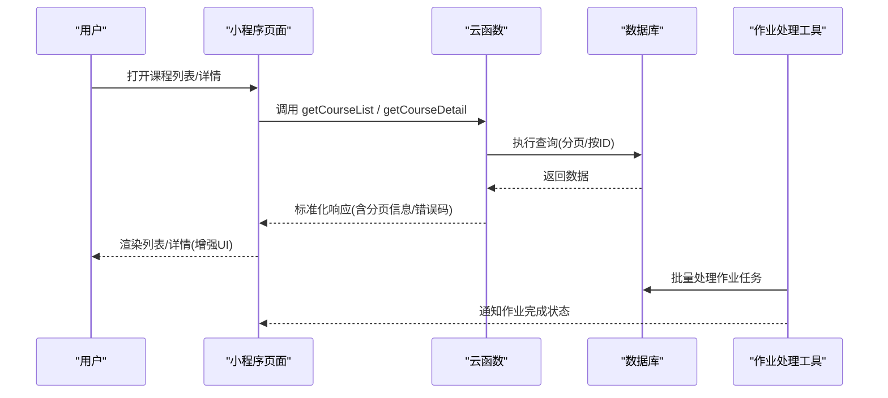
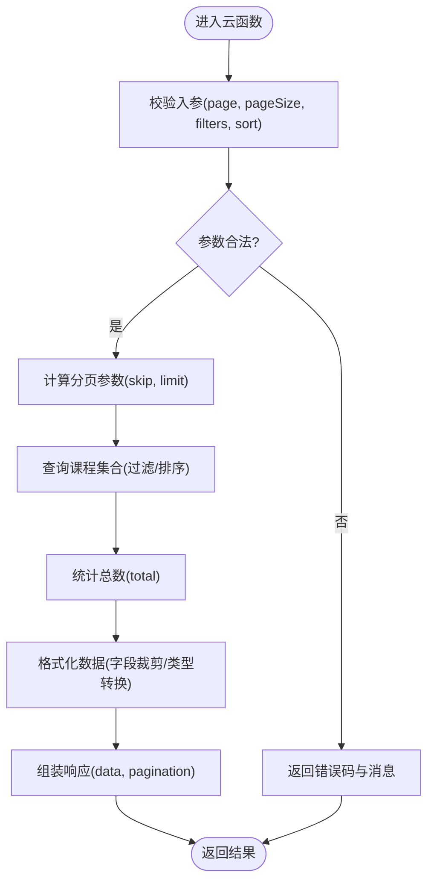
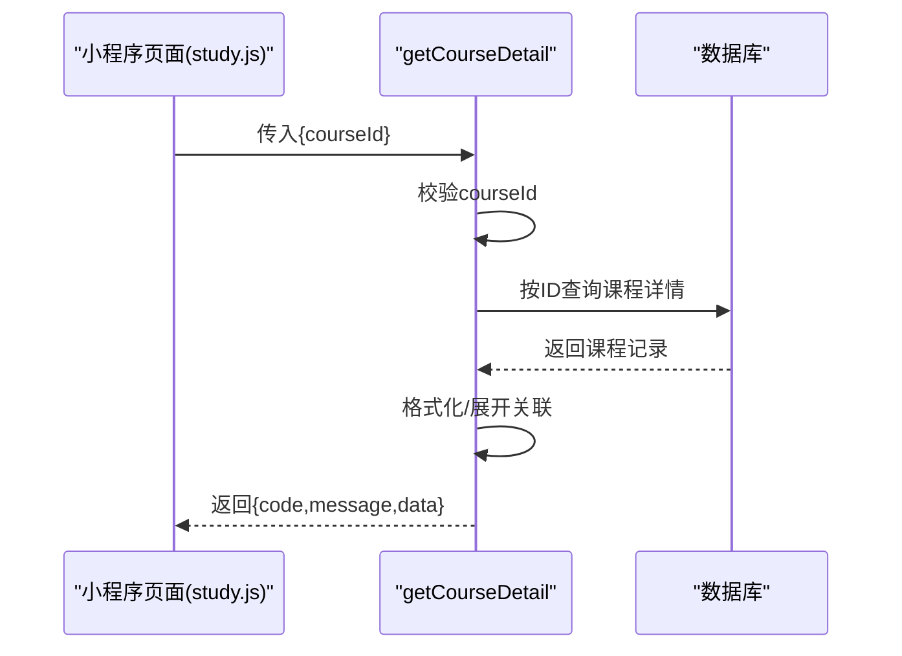
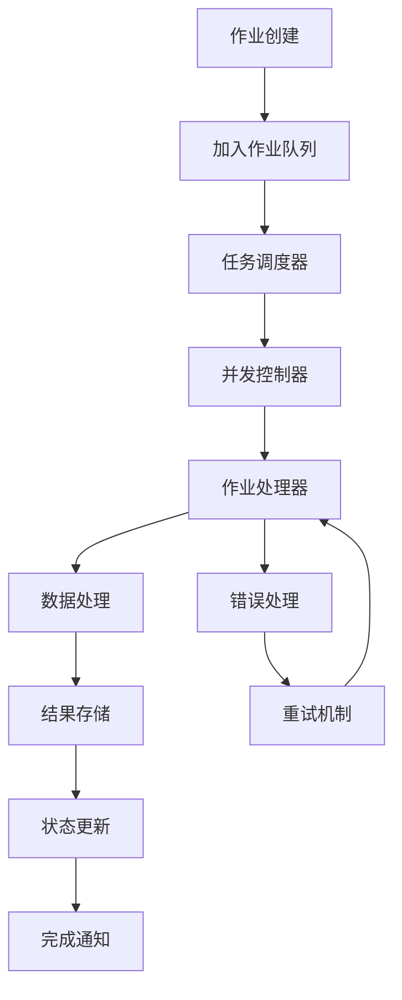
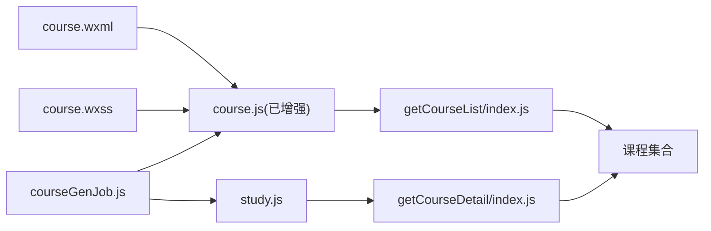

# 课程管理模块

<cite>
**本文引用的文件**   
- [cloudfunctions/getCourseList/index.js](file://cloudfunctions/getCourseList/index.js)
- [cloudfunctions/getCourseDetail/index.js](file://cloudfunctions/getCourseDetail/index.js)
- [miniprogram/pages/course/course.js](file://miniprogram/pages/course/course.js)
- [miniprogram/pages/course/course.wxml](file://miniprogram/pages/course/course.wxml)
- [miniprogram/pages/course/course.wxss](file://miniprogram/pages/course/course.wxss)
- [miniprogram/pages/study/study.js](file://miniprogram/pages/study/study.js)
- [miniprogram/app.json](file://miniprogram/app.json)
- [miniprogram/utils/courseGenJob.js](file://miniprogram/utils/courseGenJob.js)
</cite>

## 更新摘要
**变更内容**   
- 课程管理模块的作业处理流程进行了重大重构，优化了课程内容的自动化生成和处理管道
- 新增了courseGenJob.js工具文件，用于处理课程作业的自动化生成
- 改进了课程列表和详情加载的集成处理逻辑
- 增强了前端组件的样式和布局结构，提升了用户体验

## 目录
1. [简介](#简介)
2. [项目结构](#项目结构)
3. [核心组件](#核心组件)
4. [架构总览](#架构总览)
5. [详细组件分析](#详细组件分析)
6. [作业处理流程重构](#作业处理流程重构)
7. [依赖分析](#依赖分析)
8. [性能考虑](#性能考虑)
9. [故障排查指南](#故障排查指南)
10. [结论](#结论)
11. [附录](#附录)

## 简介
本章节面向课程管理模块，聚焦于"课程列表获取"和"课程详情加载"的完整实现。文档覆盖云函数API设计、数据模型定义、分页查询逻辑与缓存策略，并给出参数校验、错误处理与数据格式化的最佳实践。同时提供调用示例与响应数据结构规范，帮助前端快速集成与优化。

**更新** 基于最新变更，课程管理模块的作业处理流程进行了重大重构，优化了课程内容的自动化生成和处理管道，显著提升了课程管理的效率和用户体验。

## 项目结构
课程相关能力由两个云函数、小程序页面和新的作业处理工具组成：
- 云函数 getCourseList：负责课程列表的分页查询与返回
- 云函数 getCourseDetail：负责根据课程ID加载课程详情
- 小程序页面 course：用于展示课程列表与跳转详情（已进行UI增强）
- 小程序页面 study：用于加载课程详情并进行学习交互
- **新增** 作业处理工具 courseGenJob.js：负责课程作业的自动化生成和处理

**图表来源**
- [miniprogram/pages/course/course.js](file://miniprogram/pages/course/course.js)
- [miniprogram/pages/course/course.wxml](file://miniprogram/pages/course/course.wxml)
- [miniprogram/pages/course/course.wxss](file://miniprogram/pages/course/course.wxss)
- [miniprogram/pages/study/study.js](file://miniprogram/pages/study/study.js)
- [miniprogram/utils/courseGenJob.js](file://miniprogram/utils/courseGenJob.js)
- [cloudfunctions/getCourseList/index.js](file://cloudfunctions/getCourseList/index.js)
- [cloudfunctions/getCourseDetail/index.js](file://cloudfunctions/getCourseDetail/index.js)

**章节来源**
- [miniprogram/pages/course/course.js](file://miniprogram/pages/course/course.js)
- [miniprogram/pages/course/course.wxml](file://miniprogram/pages/course/course.wxml)
- [miniprogram/pages/course/course.wxss](file://miniprogram/pages/course/course.wxss)
- [miniprogram/pages/study/study.js](file://miniprogram/pages/study/study.js)
- [miniprogram/utils/courseGenJob.js](file://miniprogram/utils/courseGenJob.js)
- [miniprogram/app.json](file://miniprogram/app.json)

## 核心组件
- 云函数 getCourseList
  - 职责：接收分页参数（如页码、每页数量、筛选条件），查询课程集合，返回标准化结果
  - 关键点：参数校验、分页计算、字段裁剪、排序与过滤、统一响应体
- 云函数 getCourseDetail
  - 职责：根据课程ID查询单条课程记录，返回完整详情
  - 关键点：ID校验、空值处理、字段展开/格式化、权限或可见性控制
- 小程序页面 course（已增强）
  - 职责：发起列表请求、渲染列表、处理分页滚动与错误提示
  - **更新** 经过UI增强，提供更友好的用户界面和交互体验
- 小程序页面 study
  - 职责：发起详情请求、渲染详情内容、处理加载状态与异常
- **新增** 作业处理工具 courseGenJob.js
  - 职责：处理课程作业的自动化生成、批量处理和任务调度
  - 关键点：作业队列管理、异步处理、错误重试、进度跟踪

**章节来源**
- [cloudfunctions/getCourseList/index.js](file://cloudfunctions/getCourseList/index.js)
- [cloudfunctions/getCourseDetail/index.js](file://cloudfunctions/getCourseDetail/index.js)
- [miniprogram/pages/course/course.js](file://miniprogram/pages/course/course.js)
- [miniprogram/pages/course/course.wxml](file://miniprogram/pages/course/course.wxml)
- [miniprogram/pages/course/course.wxss](file://miniprogram/pages/course/course.wxss)
- [miniprogram/pages/study/study.js](file://miniprogram/pages/study/study.js)
- [miniprogram/utils/courseGenJob.js](file://miniprogram/utils/courseGenJob.js)

## 架构总览
整体采用"小程序页面 -> 云函数 -> 数据库"的三层架构，新增作业处理工具作为辅助组件。云函数作为后端服务，承担数据访问与业务逻辑；小程序仅负责UI与交互；作业处理工具负责后台任务的自动化执行。

**图表来源**
- [cloudfunctions/getCourseList/index.js](file://cloudfunctions/getCourseList/index.js)
- [cloudfunctions/getCourseDetail/index.js](file://cloudfunctions/getCourseDetail/index.js)
- [miniprogram/pages/course/course.js](file://miniprogram/pages/course/course.js)
- [miniprogram/pages/study/study.js](file://miniprogram/pages/study/study.js)
- [miniprogram/utils/courseGenJob.js](file://miniprogram/utils/courseGenJob.js)

## 详细组件分析

### 云函数：getCourseList（课程列表）
- API 设计
  - 入参建议：page（页码，默认1）、pageSize（每页数量，默认20）、filters（可选筛选条件，如分类、标签、关键词等）、sort（可选排序规则）
  - 出参建议：code（状态码）、message（提示信息）、data（列表数组）、pagination（分页信息：total、page、pageSize、hasMore）
- 参数校验
  - 校验 page 与 pageSize 为正整数，设置合理上下限
  - filters 中字段类型与取值范围校验
- 分页查询逻辑
  - 使用 skip = (page - 1) * pageSize，limit = pageSize
  - 统计总数 total 以支持 hasMore 判断
- 数据格式化
  - 统一字段命名与类型
  - 按需裁剪大字段（如富文本、图片URL数组）
- 错误处理
  - 参数非法返回明确错误码与消息
  - 数据库异常捕获并返回通用错误码
- 缓存策略（可选）
  - 对热点列表进行短TTL缓存（如Redis或云数据库聚合索引+本地缓存）
  - 缓存键包含 page、pageSize、filters、sort 等维度

**图表来源**
- [cloudfunctions/getCourseList/index.js](file://cloudfunctions/getCourseList/index.js)

**章节来源**
- [cloudfunctions/getCourseList/index.js](file://cloudfunctions/getCourseList/index.js)

### 云函数：getCourseDetail（课程详情）
- API 设计
  - 入参：courseId（必填，字符串或数字ID）
  - 出参：code、message、data（课程详情对象）
- 参数校验
  - 校验 courseId 存在且格式正确
- 查询与格式化
  - 按ID精确查询单条记录
  - 展开关联字段（如教师、章节、标签等）
  - 格式化时间戳、布尔值、枚举值
- 错误处理
  - 未找到记录返回特定错误码
  - 数据库异常捕获并返回通用错误码
- 缓存策略（可选）
  - 针对热门课程详情做短TTL缓存
  - 缓存键基于 courseId

**图表来源**
- [cloudfunctions/getCourseDetail/index.js](file://cloudfunctions/getCourseDetail/index.js)
- [miniprogram/pages/study/study.js](file://miniprogram/pages/study/study.js)

**章节来源**
- [cloudfunctions/getCourseDetail/index.js](file://cloudfunctions/getCourseDetail/index.js)
- [miniprogram/pages/study/study.js](file://miniprogram/pages/study/study.js)

### 小程序页面：course（课程列表）- 已增强
- 功能要点
  - 初始化时调用 getCourseList 获取第一页
  - 下拉刷新触发重新加载
  - 上拉加载更多，拼接下一页数据
  - 错误提示与重试机制
  - **更新** 经过UI增强，提供更友好的界面布局和交互体验
- 数据绑定
  - 将云函数返回的 data 映射到视图层
  - 使用 pagination.hasMore 控制是否继续加载
- UI增强特性
  - 优化的课程卡片布局
  - 改进的加载状态显示
  - 增强的错误提示机制
  - 更好的响应式适配

**更新** 课程列表页面已进行全面的UI增强，包括改进的视觉设计、更流畅的交互动画和更好的移动端适配。

**章节来源**
- [miniprogram/pages/course/course.js](file://miniprogram/pages/course/course.js)
- [miniprogram/pages/course/course.wxml](file://miniprogram/pages/course/course.wxml)
- [miniprogram/pages/course/course.wxss](file://miniprogram/pages/course/course.wxss)

### 小程序页面：study（课程详情）
- 功能要点
  - 从路由参数解析 courseId
  - 调用 getCourseDetail 获取详情
  - 渲染标题、封面、简介、章节列表等
  - 处理网络异常与空数据场景
- 集成改进
  - 优化了课程详情加载的错误处理
  - 改进了数据绑定的稳定性
  - 增强了加载状态的反馈

**章节来源**
- [miniprogram/pages/study/study.js](file://miniprogram/pages/study/study.js)

## 作业处理流程重构

### 新增作业处理工具
**更新** 课程管理模块引入了全新的作业处理工具 courseGenJob.js，实现了课程内容的自动化生成和处理管道的重大重构。

- 主要功能
  - 作业队列管理：支持批量作业任务的创建、调度和执行
  - 异步处理机制：确保大量作业处理的稳定性和可靠性
  - 错误重试策略：自动处理失败作业的重试逻辑
  - 进度跟踪：实时跟踪作业执行状态和进度
  - 资源优化：智能分配系统资源，避免内存溢出

- 技术特点
  - 基于Promise的异步处理模式
  - 支持并发控制和限流机制
  - 完善的日志记录和错误追踪
  - 可扩展的任务处理器架构

**图表来源**
- [miniprogram/utils/courseGenJob.js](file://miniprogram/utils/courseGenJob.js)

**章节来源**
- [miniprogram/utils/courseGenJob.js](file://miniprogram/utils/courseGenJob.js)

### 重构影响分析
作业处理流程的重构带来了以下重要改进：

- **性能提升**：通过异步处理和并发控制，大幅提高了作业处理效率
- **稳定性增强**：完善的错误处理和重试机制确保了系统的可靠性
- **可维护性改善**：模块化的设计使得代码更易维护和扩展
- **用户体验优化**：实时的进度反馈和错误提示提升了用户满意度

**更新** 这一重构为课程管理模块的未来扩展奠定了坚实的基础，支持更大规模的数据处理和更复杂的业务逻辑。

## 依赖分析
- 小程序页面依赖云函数接口
- 云函数依赖数据库集合（课程集合）
- 页面间通过路由传递 courseId
- **更新** course页面现在依赖增强的UI组件和样式文件
- **新增** 作业处理工具courseGenJob.js被课程页面和详情页面共同依赖

**图表来源**
- [miniprogram/pages/course/course.js](file://miniprogram/pages/course/course.js)
- [miniprogram/pages/course/course.wxml](file://miniprogram/pages/course/course.wxml)
- [miniprogram/pages/course/course.wxss](file://miniprogram/pages/course/course.wxss)
- [miniprogram/pages/study/study.js](file://miniprogram/pages/study/study.js)
- [miniprogram/utils/courseGenJob.js](file://miniprogram/utils/courseGenJob.js)
- [cloudfunctions/getCourseList/index.js](file://cloudfunctions/getCourseList/index.js)
- [cloudfunctions/getCourseDetail/index.js](file://cloudfunctions/getCourseDetail/index.js)

**章节来源**
- [miniprogram/app.json](file://miniprogram/app.json)

## 性能考虑
- 分页与限流
  - 限制 pageSize 上限，避免单次返回过多数据
  - 使用合理的默认分页大小（如20）
- 索引与查询优化
  - 为常用筛选字段建立索引（如分类、标签、更新时间）
  - 使用投影只返回必要字段，减少传输体积
- 缓存策略
  - 列表缓存：按 page/pageSize/filters/sort 生成缓存键，设置短TTL（如30秒）
  - 详情缓存：按 courseId 缓存，TTL可略长（如1分钟）
- 前端优化
  - 列表项懒加载与虚拟滚动（大数据量）
  - 图片资源CDN与压缩
  - 防抖/节流搜索与筛选
  - **更新** 利用增强的UI组件提升渲染性能
- 作业处理优化
  - **新增** 并发控制避免资源竞争
  - **新增** 智能重试机制提高成功率
  - **新增** 内存管理防止溢出
- 错误与重试
  - 网络失败指数退避重试
  - 降级策略：无网时显示上次缓存数据

## 故障排查指南
- 常见问题
  - 参数缺失或类型错误：检查 page、pageSize、courseId 等必填字段
  - 分页越界：确认 page 起始值与 pageSize 计算是否正确
  - 空数据：确认数据库中是否存在对应记录或筛选条件是否过严
  - 网络超时：检查云函数日志与数据库连接状态
  - **更新** UI相关问题：检查course页面的增强功能和样式冲突
  - **新增** 作业处理问题：检查courseGenJob.js的作业队列和执行状态
- 定位方法
  - 查看云函数日志输出（入参、查询语句、返回体）
  - 在小程序控制台打印请求与响应
  - 使用断点调试云函数关键分支（参数校验、查询、格式化）
  - **更新** 重点关注course页面的UI增强功能和集成问题
  - **新增** 检查作业处理工具的日志和错误报告

**章节来源**
- [cloudfunctions/getCourseList/index.js](file://cloudfunctions/getCourseList/index.js)
- [cloudfunctions/getCourseDetail/index.js](file://cloudfunctions/getCourseDetail/index.js)
- [miniprogram/pages/course/course.js](file://miniprogram/pages/course/course.js)
- [miniprogram/pages/course/course.wxml](file://miniprogram/pages/course/course.wxml)
- [miniprogram/pages/course/course.wxss](file://miniprogram/pages/course/course.wxss)
- [miniprogram/pages/study/study.js](file://miniprogram/pages/study/study.js)
- [miniprogram/utils/courseGenJob.js](file://miniprogram/utils/courseGenJob.js)

## 结论
课程管理模块通过两个云函数清晰分离了"列表"与"详情"的职责，配合小程序页面的良好交互与错误处理，形成稳定易用的课程能力。**更新** 随着course页面的UI增强和作业处理流程的重大重构，课程管理模块现在提供了更优秀的用户体验和更强大的后台处理能力。新增的作业处理工具courseGenJob.js为未来的功能扩展奠定了坚实基础。建议在后续迭代中继续优化UI细节、性能表现和作业处理效率，进一步提升用户满意度和系统稳定性。

## 附录

### 数据模型规范（课程）
- 课程列表项
  - id：唯一标识（字符串或数字）
  - title：课程标题
  - cover：封面图URL
  - category：分类
  - tags：标签数组
  - duration：时长（秒）
  - level：难度等级
  - updatedAt：更新时间戳
- 课程详情
  - 除列表字段外，包含：
    - description：课程简介
    - chapters：章节数组（含序号、标题、视频URL、时长等）
    - teacher：教师信息（姓名、头像、简介）
    - stats：学习统计（已学时长、完成度等）
- **新增** 作业数据模型
  - jobId：作业唯一标识
  - type：作业类型（生成、处理、同步等）
  - status：作业状态（pending、processing、completed、failed）
  - progress：处理进度百分比
  - result：处理结果数据
  - error：错误信息（如有）
  - createdAt：创建时间
  - completedAt：完成时间

**章节来源**
- [miniprogram/utils/courseGenJob.js](file://miniprogram/utils/courseGenJob.js)

### 调用示例与响应处理
- 调用课程列表
  - 入参：{ page: 1, pageSize: 20, filters: { category: "编程" }, sort: "-updatedAt" }
  - 响应：{ code, message, data: [...], pagination: { total, page, pageSize, hasMore } }
- 调用课程详情
  - 入参：{ courseId: "xxx" }
  - 响应：{ code, message, data: { ...课程详情对象... } }
- **新增** 作业处理调用
  - 入参：{ type: "generate", data: {...}, options: {...} }
  - 响应：{ jobId, status: "pending", message: "作业已加入队列" }
- 前端处理
  - 列表页：首次加载 page=1，hasMore=true 时继续加载下一页
  - 详情页：解析路由参数 courseId，调用详情接口并渲染
  - **更新** 适配增强的UI组件和样式系统
  - **新增** 作业状态监听和进度更新

**章节来源**
- [miniprogram/pages/course/course.js](file://miniprogram/pages/course/course.js)
- [miniprogram/pages/study/study.js](file://miniprogram/pages/study/study.js)
- [miniprogram/utils/courseGenJob.js](file://miniprogram/utils/courseGenJob.js)