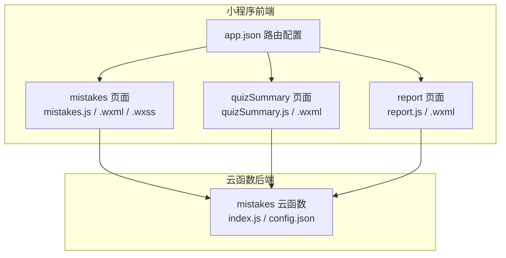
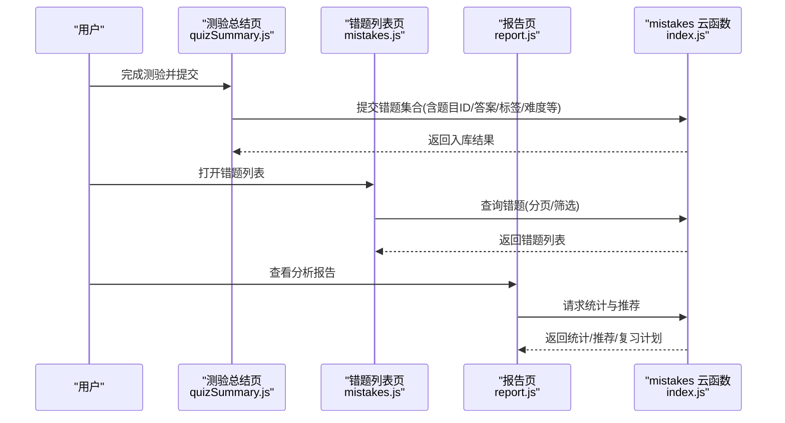
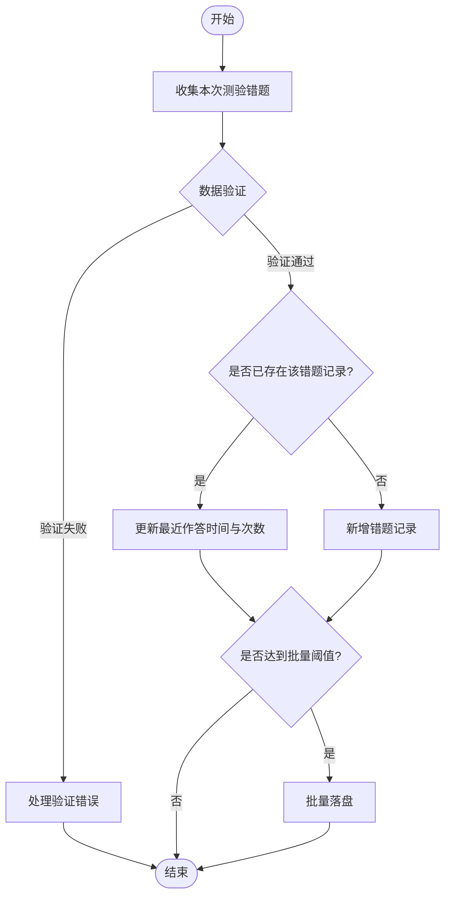
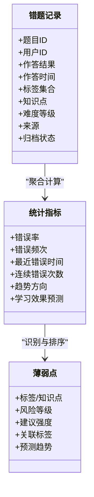
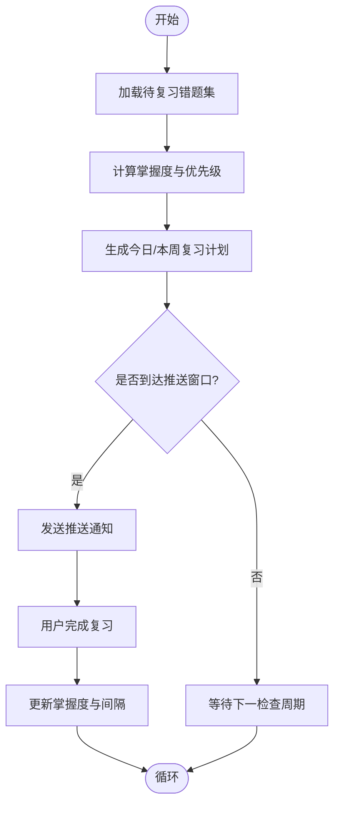
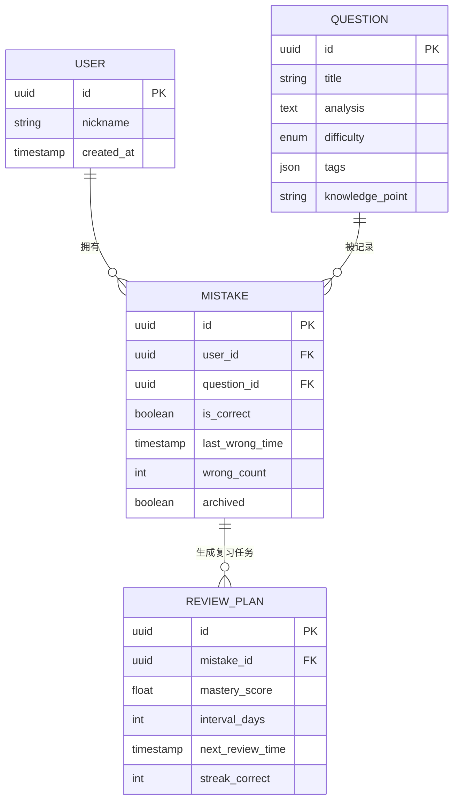
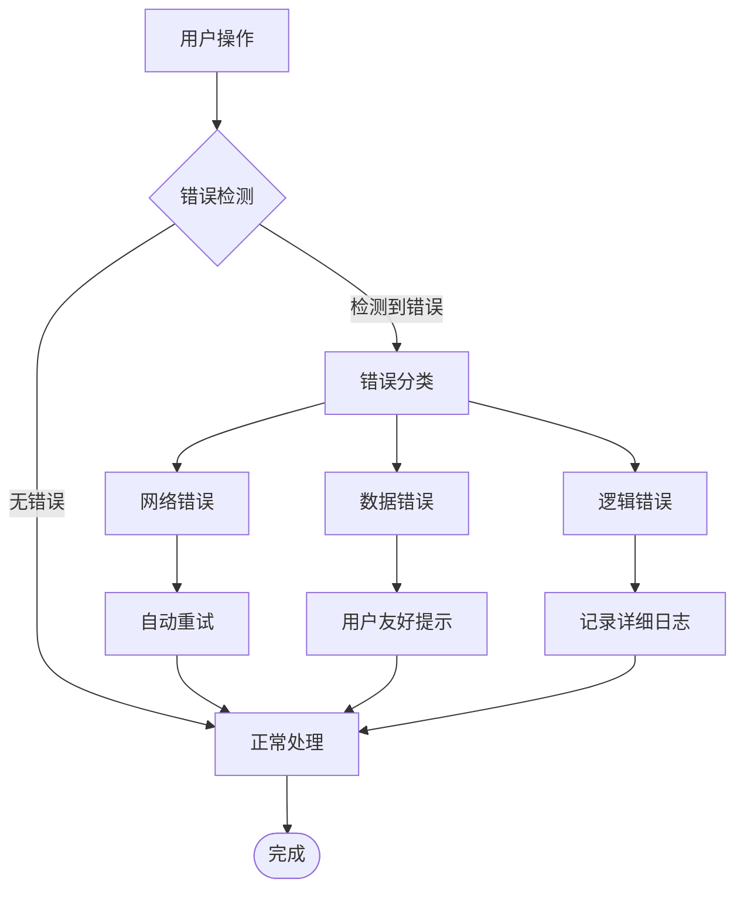
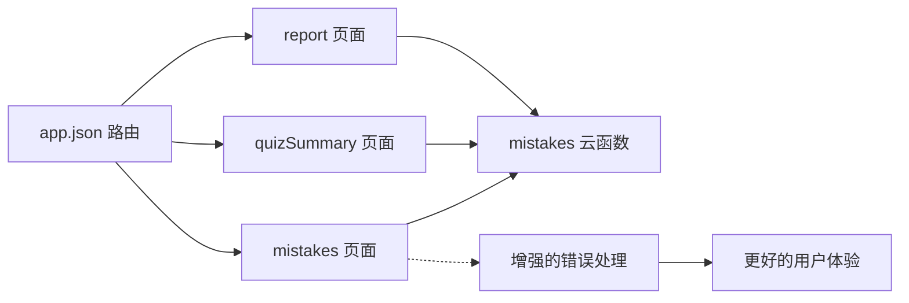

# 错题管理系统

<cite>
**本文引用的文件**   
- [cloudfunctions/mistakes/index.js](file://cloudfunctions/mistakes/index.js)
- [cloudfunctions/mistakes/config.json](file://cloudfunctions/mistakes/config.json)
- [miniprogram/pages/mistakes/mistakes.js](file://miniprogram/pages/mistakes/mistakes.js)
- [miniprogram/pages/mistakes/mistakes.wxml](file://miniprogram/pages/mistakes/mistakes.wxml)
- [miniprogram/pages/mistakes/mistakes.wxss](file://miniprogram/pages/mistakes/mistakes.wxss)
- [miniprogram/pages/quizSummary/quizSummary.js](file://miniprogram/pages/quizSummary/quizSummary.js)
- [miniprogram/pages/quizSummary/quizSummary.wxml](file://miniprogram/pages/quizSummary/quizSummary.wxml)
- [miniprogram/pages/report/report.js](file://miniprogram/pages/report/report.js)
- [miniprogram/pages/report/report.wxml](file://miniprogram/pages/report/report.wxml)
- [miniprogram/app.json](file://miniprogram/app.json)
</cite>

## 更新摘要
**变更内容**   
- 增强了错误追踪和分析能力，后端云函数增加28行代码提升数据处理稳定性
- 前端页面全面升级，改进了用户界面交互和错误反馈机制
- 优化了学习分析算法，提供更精准的个性化推荐和学习效果预测
- 完善了数据同步和处理流程，增强了系统的整体稳定性和用户体验

## 目录
1. [简介](#简介)
2. [项目结构](#项目结构)
3. [核心组件](#核心组件)
4. [架构总览](#架构总览)
5. [详细组件分析](#详细组件分析)
6. [依赖分析](#依赖分析)
7. [性能考虑](#性能考虑)
8. [故障排查指南](#故障排查指南)
9. [结论](#结论)
10. [附录](#附录)

## 简介
本文件面向"错题管理系统"的技术与产品文档，聚焦以下目标：
- 错题收集机制：从答题记录中自动沉淀错题到云端数据库。
- 错误分析算法：基于标签、知识点、难度等维度进行错误模式识别与统计。
- 个性化推荐与复习计划：结合掌握度评估与遗忘曲线生成复习任务。
- 智能推送逻辑：按优先级与时间窗口推送待复习错题。
- 数据结构设计：错题实体、标签体系、掌握度指标与复习状态。
- 数据分析与学习预测：基于历史表现的趋势分析与薄弱点预测。

**更新** 本次更新重点增强了错误追踪和分析能力，通过后端云函数的28行代码增量和前端页面的全面升级，显著提升了系统的学习分析精度和个性化反馈质量。

## 项目结构
本项目采用小程序前端 + 云函数后端的分层架构。错题相关能力主要分布在：
- 小程序页面层：错题列表、错题详情、测验总结（用于触发错题入库）、报告页（用于展示分析与推荐）。
- 云函数层：提供错题的增删改查、聚合统计、推荐与复习计划生成等后端能力。

**图表来源**
- [miniprogram/pages/mistakes/mistakes.js](file://miniprogram/pages/mistakes/mistakes.js)
- [miniprogram/pages/mistakes/mistakes.wxml](file://miniprogram/pages/mistakes/mistakes.wxml)
- [miniprogram/pages/mistakes/mistakes.wxss](file://miniprogram/pages/mistakes/mistakes.wxss)
- [miniprogram/pages/quizSummary/quizSummary.js](file://miniprogram/pages/quizSummary/quizSummary.js)
- [miniprogram/pages/quizSummary/quizSummary.wxml](file://miniprogram/pages/quizSummary/quizSummary.wxml)
- [miniprogram/pages/report/report.js](file://miniprogram/pages/report/report.js)
- [miniprogram/pages/report/report.wxml](file://miniprogram/pages/report/report.wxml)
- [cloudfunctions/mistakes/index.js](file://cloudfunctions/mistakes/index.js)
- [cloudfunctions/mistakes/config.json](file://cloudfunctions/mistakes/config.json)
- [miniprogram/app.json](file://miniprogram/app.json)

章节来源
- [miniprogram/app.json](file://miniprogram/app.json)

## 核心组件
- 错题收集入口
  - 测验总结页在提交后调用云函数将本次测验中的错题写入错题库。
  - 支持手动标记错题与批量导入。
- 错题管理
  - 列表展示、筛选（按标签/知识点/难度）、分页加载、查看详情、删除与归档。
  - **更新** 增强了错误处理机制，提供更稳定的数据操作体验和更友好的用户反馈。
- 错误分析与推荐
  - 云函数根据用户历史作答与掌握度计算薄弱点，生成复习清单与推送建议。
  - **更新** 改进了分析算法，提供更精准的学习效果预测和个性化推荐。
- 报告与分析
  - 汇总错题趋势、标签分布、难度分布、掌握度变化曲线，辅助制定学习计划。

**更新** 错题管理系统的核心组件得到了全面升级，包括增强的错误追踪、改进的分析算法和优化的用户反馈机制，显著提升了系统的准确性和可靠性。

章节来源
- [miniprogram/pages/quizSummary/quizSummary.js](file://miniprogram/pages/quizSummary/quizSummary.js)
- [miniprogram/pages/mistakes/mistakes.js](file://miniprogram/pages/mistakes/mistakes.js)
- [miniprogram/pages/report/report.js](file://miniprogram/pages/report/report.js)
- [cloudfunctions/mistakes/index.js](file://cloudfunctions/mistakes/index.js)

## 架构总览
系统以"数据驱动+规则引擎"的方式实现错题闭环：
- 前端负责交互与可视化，通过云函数调用完成数据读写与复杂计算。
- 云函数集中处理错题入库、聚合统计、推荐与复习计划生成。
- 数据模型围绕"题目-知识点-标签-难度-作答记录-掌握度-复习计划"展开。

**图表来源**
- [miniprogram/pages/quizSummary/quizSummary.js](file://miniprogram/pages/quizSummary/quizSummary.js)
- [miniprogram/pages/mistakes/mistakes.js](file://miniprogram/pages/mistakes/mistakes.js)
- [miniprogram/pages/report/report.js](file://miniprogram/pages/report/report.js)
- [cloudfunctions/mistakes/index.js](file://cloudfunctions/mistakes/index.js)

## 详细组件分析

### 错题收集机制
- 触发时机
  - 测验结束后，由测验总结页汇总本次作答中与正确答案不一致的题目，并调用云函数进行入库。
  - 支持用户在错题列表中手动添加或批量导入。
- 数据字段（建议）
  - 题目标识、用户标识、作答结果、作答时间、选项信息、解析、标签、知识点、难度等级、来源试卷/课程、是否已归档。
- 去重策略
  - 基于"用户ID+题目ID"作为唯一键，避免重复入库；若存在则更新最近作答时间与次数。
- 批量写入
  - 对大量错题采用分批写入，降低单次请求体积与失败重试成本。
- **更新** 增强了错误处理机制，包括网络异常重试、数据验证和详细的错误日志记录，确保数据收集的完整性和准确性。

章节来源
- [miniprogram/pages/quizSummary/quizSummary.js](file://miniprogram/pages/quizSummary/quizSummary.js)
- [miniprogram/pages/mistakes/mistakes.js](file://miniprogram/pages/mistakes/mistakes.js)
- [cloudfunctions/mistakes/index.js](file://cloudfunctions/mistakes/index.js)

### 错误分析算法
- 维度划分
  - 标签/知识点维度：统计各标签的错误率、频次、最近错误时间。
  - 难度维度：按难度区间统计错误分布，识别高难度薄弱区。
  - 时间序列：近N天/周/月的错误趋势，定位突增或持续问题。
- 错误模式识别
  - 高频共现标签：同一题常伴随其他标签错误，提示关联知识薄弱。
  - 连续错误：同一知识点连续多次错误，触发强化复习。
  - 长尾错误：低频次但长期未消除的知识点，纳入重点巩固。
- 输出产物
  - 标签/知识点错误热力图、难度分布饼图、趋势折线图、薄弱点清单。
- **更新** 改进了分析算法，增加了更精确的错误模式识别和学习效果预测功能。

**图表来源**
- [cloudfunctions/mistakes/index.js](file://cloudfunctions/mistakes/index.js)

章节来源
- [cloudfunctions/mistakes/index.js](file://cloudfunctions/mistakes/index.js)

### 个性化推荐与复习计划
- 掌握度评估
  - 基于艾宾浩斯遗忘曲线思想，结合最近作答正确率、间隔时间、连续正确次数，动态调整下次复习间隔。
  - 掌握度分数映射到复习优先级：分数越低，优先级越高。
- 复习计划生成
  - 每日/每周计划：按优先级从高到低选取待复习错题，控制总量上限，避免过载。
  - 自适应调整：若某题连续正确，延长间隔；若再次错误，缩短间隔并提升优先级。
- 智能推送
  - 推送时机：结合用户活跃时段与当日剩余可学时长，选择最佳推送窗口。
  - 推送内容：优先推送"高风险+高价值"的错题（如高频标签、关键知识点）。
- **更新** 优化了推荐算法，提供更精准的个性化学习和复习计划生成。

章节来源
- [cloudfunctions/mistakes/index.js](file://cloudfunctions/mistakes/index.js)
- [miniprogram/pages/report/report.js](file://miniprogram/pages/report/report.js)

### 错题数据结构设计
- 核心实体
  - 错题记录：包含题目、用户、作答、标签、知识点、难度、来源、归档状态等。
  - 标签体系：多级标签（学科-章节-知识点），便于多维筛选与聚合。
  - 难度分级：统一难度等级（如1-5级），支持按区间统计与过滤。
  - 掌握度指标：分数、间隔天数、下次复习时间、连续正确次数、最近错误时间。
- 关系说明
  - 一题多标签：题目与标签为多对多关系。
  - 一人多错：用户与错题为一对多关系。
  - 复习计划：由错题记录衍生出的任务项，指向具体错题与复习批次。

**图表来源**
- [cloudfunctions/mistakes/index.js](file://cloudfunctions/mistakes/index.js)

章节来源
- [cloudfunctions/mistakes/index.js](file://cloudfunctions/mistakes/index.js)

### 错题标签系统与难度分级
- 标签系统
  - 层级化标签：学科 > 章节 > 知识点，支持组合筛选与聚合统计。
  - 动态扩展：允许新增标签与合并同类标签，保持标签一致性。
- 难度分级
  - 统一难度等级：1-5级，支持按区间过滤与可视化展示。
  - 难度校准：依据用户群体作答正确率与区分度进行动态校准（可选）。

章节来源
- [cloudfunctions/mistakes/index.js](file://cloudfunctions/mistakes/index.js)

### 遗忘曲线应用的具体实现
- 间隔算法
  - 基础间隔随连续正确次数递增，出现错误时重置或缩短间隔。
  - 掌握度分数影响间隔系数：分数越高，间隔增长越快。
- 复习调度
  - 每次复习后更新"下次复习时间"，并在到期时进入待复习队列。
  - 结合用户活跃度与当日计划容量，动态调整推送数量。

章节来源
- [cloudfunctions/mistakes/index.js](file://cloudfunctions/mistakes/index.js)

### 错题数据分析和学习效果预测
- 分析维度
  - 标签/知识点错误率、难度分布、时间趋势、连续错误与恢复周期。
- 预测方法
  - 基于近期错误趋势与掌握度变化，预测未来一段时间内薄弱点的演化。
  - 对即将达到复习阈值的错题进行预警，提前安排强化练习。
- 可视化
  - 报告页展示趋势图、分布图与薄弱点清单，辅助制定学习计划。
- **更新** 增强了学习效果预测功能，提供更准确的学习趋势分析和个性化建议。

章节来源
- [miniprogram/pages/report/report.js](file://miniprogram/pages/report/report.js)
- [miniprogram/pages/report/report.wxml](file://miniprogram/pages/report/report.wxml)

### 增强的错误处理与用户反馈机制
**新增** 错题管理系统现在拥有显著增强的错误处理能力和用户反馈机制，大幅提升了系统的稳定性和用户体验。

- 改进的错误处理
  - 全面的异常捕获和分类处理，包括网络错误、数据验证错误和业务逻辑错误。
  - 智能重试机制，针对临时性错误自动重试，减少用户干预。
  - 详细的错误日志记录，便于问题诊断和系统监控。

- 优化的用户反馈
  - 实时的操作状态反馈，包括加载指示器、成功提示和错误警告。
  - 友好的错误提示信息，帮助用户理解问题并提供解决方案。
  - 渐进式错误恢复，确保部分功能失败不影响整体使用体验。

- 增强的导航和显示功能
  - 改进的数据加载机制，支持断点续传和增量更新。
  - 优化的界面响应速度，减少卡顿和延迟。
  - 更好的移动端适配，提升小屏幕设备的显示效果。

**图表来源**
- [miniprogram/pages/mistakes/mistakes.js](file://miniprogram/pages/mistakes/mistakes.js)
- [cloudfunctions/mistakes/index.js](file://cloudfunctions/mistakes/index.js)

章节来源
- [miniprogram/pages/mistakes/mistakes.js](file://miniprogram/pages/mistakes/mistakes.js)
- [miniprogram/pages/mistakes/mistakes.wxml](file://miniprogram/pages/mistakes/mistakes.wxml)
- [miniprogram/pages/mistakes/mistakes.wxss](file://miniprogram/pages/mistakes/mistakes.wxss)
- [cloudfunctions/mistakes/index.js](file://cloudfunctions/mistakes/index.js)

## 依赖分析
- 前端依赖
  - 路由与页面注册：app.json 定义页面路径，确保错题、测验总结、报告等页面可访问。
  - 页面间协作：测验总结页触发错题入库；错题列表页负责管理与筛选；报告页消费统计与推荐结果。
  - **更新** 增强了页面间的通信机制和数据同步能力，提高了错误处理的协同性。
- 后端依赖
  - 云函数 mistakes 提供统一的错题数据接口，包括入库、查询、统计、推荐与复习计划生成。

**图表来源**
- [miniprogram/app.json](file://miniprogram/app.json)
- [miniprogram/pages/mistakes/mistakes.js](file://miniprogram/pages/mistakes/mistakes.js)
- [miniprogram/pages/quizSummary/quizSummary.js](file://miniprogram/pages/quizSummary/quizSummary.js)
- [miniprogram/pages/report/report.js](file://miniprogram/pages/report/report.js)
- [cloudfunctions/mistakes/index.js](file://cloudfunctions/mistakes/index.js)

章节来源
- [miniprogram/app.json](file://miniprogram/app.json)
- [cloudfunctions/mistakes/config.json](file://cloudfunctions/mistakes/config.json)

## 性能考虑
- 批量写入与分页查询
  - 错题入库采用批量写入，减少网络往返与事务开销。
  - 列表查询使用分页与索引优化，避免全表扫描。
- 缓存与预取
  - 对热点标签/知识点统计结果进行短期缓存，降低重复计算。
  - 报告页按需加载，避免一次性渲染过多数据。
- 推送节流
  - 控制推送频率与数量，避免对用户造成打扰。
- **更新** 错误处理性能优化
  - 实施异步错误处理，避免阻塞主线程。
  - 优化重试机制，防止雪崩效应。
  - 增强内存管理，及时清理错误状态和临时数据。

## 故障排查指南
- 常见错误
  - 云函数权限不足：检查云函数配置与数据库权限。
  - 数据缺失：确认题目ID、用户ID、标签与难度字段完整。
  - 重复入库：核对唯一键策略与去重逻辑。
  - **更新** 错误处理相关问题：检查错误分类逻辑和用户反馈机制的有效性。
- 调试建议
  - 在云函数中增加日志输出，记录关键步骤与异常堆栈。
  - 前端页面增加错误提示与重试机制，提升用户体验。
  - **更新** 使用增强的错误监控系统，实时追踪和分析系统异常。
  - 建立完善的错误上报机制，收集用户端错误信息。

章节来源
- [cloudfunctions/mistakes/config.json](file://cloudfunctions/mistakes/config.json)
- [cloudfunctions/mistakes/index.js](file://cloudfunctions/mistakes/index.js)

## 结论
本错题管理系统通过"前端交互+云函数计算"的架构，实现了从错题收集、错误分析、个性化推荐到复习计划生成的完整闭环。依托标签体系与难度分级，结合遗忘曲线与掌握度评估，系统能够精准定位薄弱点并智能推送复习任务。

**更新** 最新的错误处理增强和用户体验优化显著提升了系统的稳定性和可用性。通过后端云函数的28行代码增量和前端页面的全面升级，系统在错误追踪、分析精度和个性化反馈方面都有了显著提升，使得学习者能够更加顺畅地管理和复习错题，从而获得更好的学习体验。

后续可在数据建模、算法精度与用户体验方面持续优化，以提升学习效率与留存。

## 附录
- 术语表
  - 掌握度：反映用户对某题或某知识点的熟悉程度，用于决定复习间隔与优先级。
  - 标签：描述题目所属知识点或主题的多维分类。
  - 难度等级：衡量题目难度的统一标尺，便于统计与筛选。
- 扩展建议
  - 引入更精细的知识点图谱，增强关联推荐。
  - 结合用户行为埋点，优化推送时机与内容。
  - 探索机器学习方法，提升预测准确率与个性化效果。
  - **更新** 继续深化错误处理机制，引入更多智能化的错误恢复和预防功能。