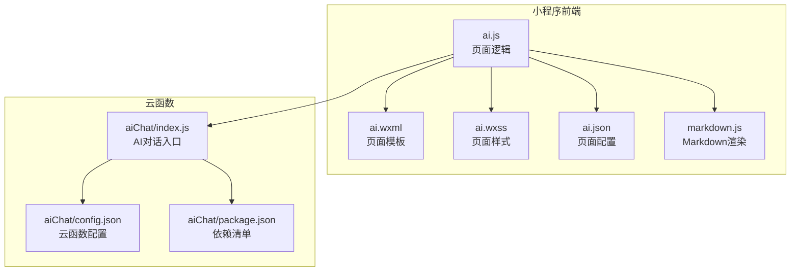
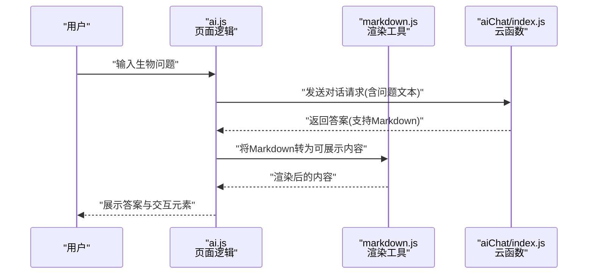
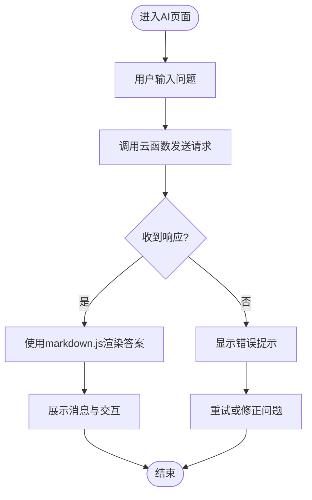
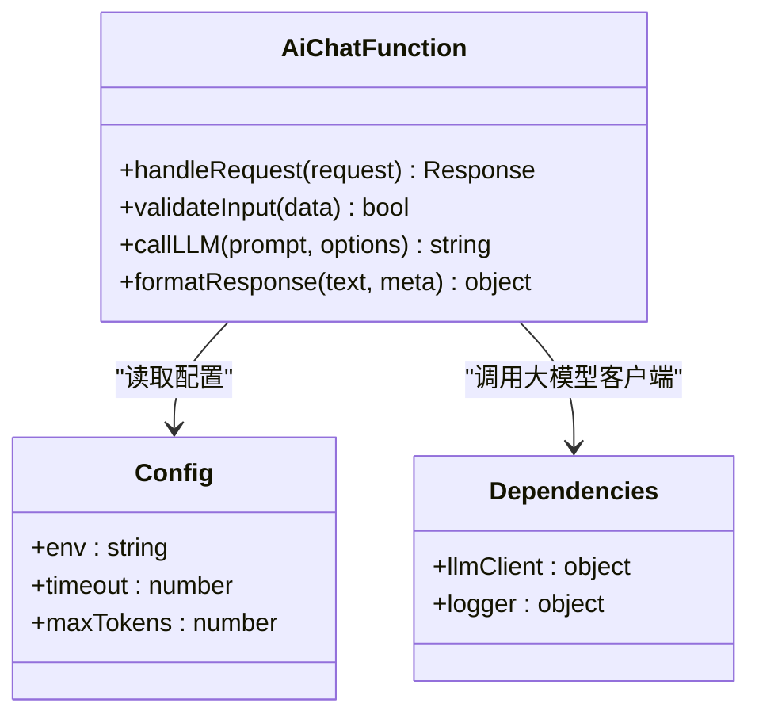
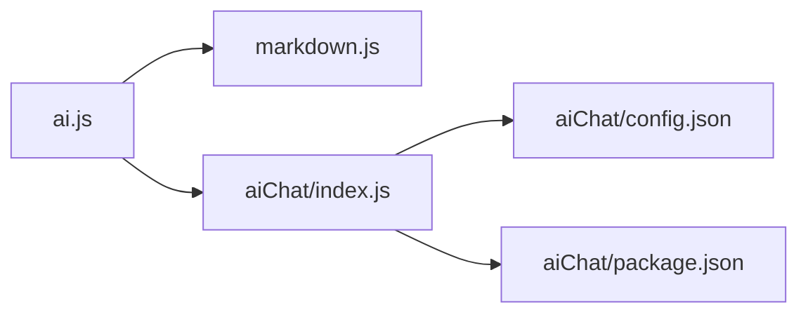

# AI智能助手

<cite>
**本文引用的文件**   
- [ai.js](file://miniprogram/pages/ai/ai.js)
- [ai.wxml](file://miniprogram/pages/ai/ai.wxml)
- [ai.wxss](file://miniprogram/pages/ai/ai.wxss)
- [ai.json](file://miniprogram/pages/ai/ai.json)
- [index.js](file://cloudfunctions/aiChat/index.js)
- [config.json](file://cloudfunctions/aiChat/config.json)
- [package.json](file://cloudfunctions/aiChat/package.json)
- [markdown.js](file://miniprogram/utils/markdown.js)
</cite>

## 目录
1. [简介](#简介)
2. [项目结构](#项目结构)
3. [核心组件](#核心组件)
4. [架构总览](#架构总览)
5. [详细组件分析](#详细组件分析)
6. [依赖分析](#依赖分析)
7. [性能考虑](#性能考虑)
8. [故障排查指南](#故障排查指南)
9. [结论](#结论)
10. [附录](#附录)

## 简介
本指南面向生物学科学习者，系统介绍AI智能助手的各项功能与使用技巧。你将学会：
- 如何向AI提问生物学科问题（概念解释、解题指导、学习建议等）
- 描述问题的最佳实践与结果解读方法
- 常见学习场景的提问示例与回答分析方法
- 结合小程序与云函数实现的高效学习闭环

## 项目结构
本项目为微信小程序+云开发架构，AI对话能力由前端页面与云端函数协同完成。关键路径如下：
- 前端：AI聊天页面（页面逻辑、模板、样式、配置）
- 工具：Markdown渲染工具
- 后端：AI聊天云函数（接收请求、调用大模型、返回结构化结果）

图表来源
- [ai.js](file://miniprogram/pages/ai/ai.js)
- [ai.wxml](file://miniprogram/pages/ai/ai.wxml)
- [ai.wxss](file://miniprogram/pages/ai/ai.wxss)
- [ai.json](file://miniprogram/pages/ai/ai.json)
- [markdown.js](file://miniprogram/utils/markdown.js)
- [index.js](file://cloudfunctions/aiChat/index.js)
- [config.json](file://cloudfunctions/aiChat/config.json)
- [package.json](file://cloudfunctions/aiChat/package.json)

章节来源
- [ai.js](file://miniprogram/pages/ai/ai.js)
- [ai.wxml](file://miniprogram/pages/ai/ai.wxml)
- [ai.wxss](file://miniprogram/pages/ai/ai.wxss)
- [ai.json](file://miniprogram/pages/ai/ai.json)
- [markdown.js](file://miniprogram/utils/markdown.js)
- [index.js](file://cloudfunctions/aiChat/index.js)
- [config.json](file://cloudfunctions/aiChat/config.json)
- [package.json](file://cloudfunctions/aiChat/package.json)

## 核心组件
- 前端AI聊天页面
  - 负责用户输入、消息列表展示、加载状态、错误提示、Markdown渲染
  - 通过云函数发起对话请求并处理响应
- 云函数AI对话
  - 接收前端请求参数（如用户问题、上下文等）
  - 调用大模型服务生成答案
  - 返回结构化数据供前端渲染

章节来源
- [ai.js](file://miniprogram/pages/ai/ai.js)
- [index.js](file://cloudfunctions/aiChat/index.js)

## 架构总览
下图展示了从用户输入到答案展示的端到端流程，以及前后端职责划分。

图表来源
- [ai.js](file://miniprogram/pages/ai/ai.js)
- [markdown.js](file://miniprogram/utils/markdown.js)
- [index.js](file://cloudfunctions/aiChat/index.js)

## 详细组件分析

### 前端AI聊天页面（ai.js / ai.wxml / ai.wxss / ai.json）
- 职责
  - 管理对话历史、当前输入、加载与错误状态
  - 调用云函数进行问答
  - 使用Markdown渲染工具对答案进行格式化展示
- 交互要点
  - 输入框与发送按钮
  - 消息气泡（用户/AI）
  - 加载中动画与错误提示
  - 复制、展开/折叠等辅助操作（如有）
- 渲染链路
  - 云函数返回Markdown文本
  - markdown.js将其转换为小程序可渲染节点
  - 页面更新视图

图表来源
- [ai.js](file://miniprogram/pages/ai/ai.js)
- [markdown.js](file://miniprogram/utils/markdown.js)

章节来源
- [ai.js](file://miniprogram/pages/ai/ai.js)
- [ai.wxml](file://miniprogram/pages/ai/ai.wxml)
- [ai.wxss](file://miniprogram/pages/ai/ai.wxss)
- [ai.json](file://miniprogram/pages/ai/ai.json)
- [markdown.js](file://miniprogram/utils/markdown.js)

### 云函数AI对话（aiChat/index.js）
- 职责
  - 解析前端传入的请求体（如问题、上下文、可选参数）
  - 调用大模型接口生成答案
  - 返回统一格式的数据（包含答案文本、元信息等）
- 配置与依赖
  - config.json：云函数运行环境配置
  - package.json：第三方依赖声明
- 安全与健壮性
  - 校验必要字段
  - 异常捕获与错误码返回
  - 限流与超时控制（视具体实现）

图表来源
- [index.js](file://cloudfunctions/aiChat/index.js)
- [config.json](file://cloudfunctions/aiChat/config.json)
- [package.json](file://cloudfunctions/aiChat/package.json)

章节来源
- [index.js](file://cloudfunctions/aiChat/index.js)
- [config.json](file://cloudfunctions/aiChat/config.json)
- [package.json](file://cloudfunctions/aiChat/package.json)

## 依赖分析
- 前端依赖
  - 页面逻辑依赖Markdown渲染工具以正确展示富文本答案
  - 页面模板与样式决定UI呈现与交互体验
- 后端依赖
  - 云函数依赖外部大模型SDK/HTTP客户端
  - 依赖配置文件与环境变量（如密钥、超时、最大令牌数等）

图表来源
- [ai.js](file://miniprogram/pages/ai/ai.js)
- [markdown.js](file://miniprogram/utils/markdown.js)
- [index.js](file://cloudfunctions/aiChat/index.js)
- [config.json](file://cloudfunctions/aiChat/config.json)
- [package.json](file://cloudfunctions/aiChat/package.json)

章节来源
- [ai.js](file://miniprogram/pages/ai/ai.js)
- [markdown.js](file://miniprogram/utils/markdown.js)
- [index.js](file://cloudfunctions/aiChat/index.js)
- [config.json](file://cloudfunctions/aiChat/config.json)
- [package.json](file://cloudfunctions/aiChat/package.json)

## 性能考虑
- 前端优化
  - 分页或虚拟列表展示长对话历史
  - 增量渲染与防抖输入，减少频繁重绘
  - 图片与多媒体资源懒加载
- 网络与并发
  - 合理设置请求超时与重试策略
  - 避免重复请求，合并相同问题
- 后端优化
  - 缓存高频问答结果（注意时效性与隐私）
  - 流式输出以降低首屏等待时间（若支持）
  - 限制单次最大令牌数以控制成本与延迟

[本节为通用性能建议，不直接分析具体文件]

## 故障排查指南
- 常见问题定位
  - 无法连接云函数：检查网络、云函数部署状态与权限
  - 答案乱码或格式错乱：确认Markdown渲染是否启用、字符编码是否正确
  - 长时间加载：检查大模型服务可用性、超时配置与重试次数
- 日志与调试
  - 前端控制台查看请求与响应
  - 云函数日志查看错误堆栈与入参
- 快速恢复
  - 刷新页面并重试
  - 简化问题描述后再次尝试
  - 切换网络环境或重启应用

章节来源
- [ai.js](file://miniprogram/pages/ai/ai.js)
- [index.js](file://cloudfunctions/aiChat/index.js)

## 结论
通过“前端页面+云函数”的协作，AI智能助手能够高效解答生物学科问题，并提供结构化、可渲染的答案。遵循本文的最佳实践与提问技巧，可显著提升学习效率与准确性。

[本节为总结性内容，不直接分析具体文件]

## 附录

### 生物学科提问最佳实践
- 明确目标
  - 说明学习目标（理解概念/解题/复习/拓展）
  - 指定年级或教材范围（如高中生物必修一）
- 提供背景
  - 给出已知条件、相关知识点、已尝试的方法
  - 附上题目图片或关键信息（文字化描述）
- 结构化表达
  - 分点列出问题，避免一次性抛出过多子问题
  - 标注优先级（先解决哪一部分）
- 期望输出
  - 要求步骤详解、公式推导、图示说明、易错点提醒
  - 如需对比表格或思维导图，明确说明

### 结果解读方法
- 核对关键点
  - 概念定义是否准确、术语是否规范
  - 推理链条是否完整、是否有跳跃
- 验证与巩固
  - 用例题或变式题检验答案适用性
  - 对照教材或权威资料进行二次确认
- 记录与复盘
  - 保存优质回答，建立个人知识库
  - 标注易错点与反思笔记

### 常见学习场景与提问示例
- 概念解释
  - “请用通俗语言解释细胞呼吸的过程，并列出关键酶与能量变化。”
  - “比较有氧呼吸与无氧呼吸的异同，给出适用场景。”
- 解题指导
  - “请逐步讲解这道遗传概率题，指出每一步的依据与易错点。”
  - “针对该实验设计题，帮我完善对照组与变量控制方案。”
- 学习建议
  - “我计划两周内复习光合作用与呼吸作用，请给出每日任务与重点清单。”
  - “针对选择题失分较多，推荐练习题型与错题整理方法。”
- 复习与自测
  - “围绕DNA复制与转录，出5道中等难度题目并附解析。”
  - “请根据我的错题，生成一份针对性复习提纲。”

### 使用技巧与注意事项
- 多轮追问
  - 先获取框架，再深入细节；遇到模糊处立即追问
- 约束输出
  - 指定长度、格式（表格/流程图）、难度等级
- 安全与合规
  - 不上传个人隐私信息
  - 重要考试前以教材与教师讲解为准，AI作为辅助

[本节为通用指导，不直接分析具体文件]