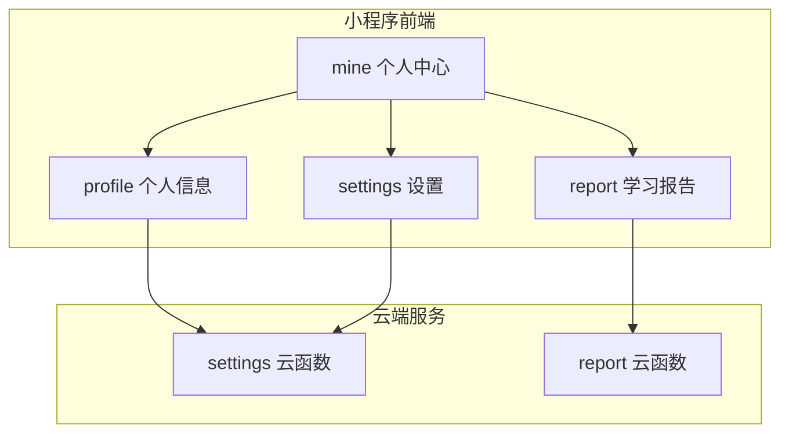
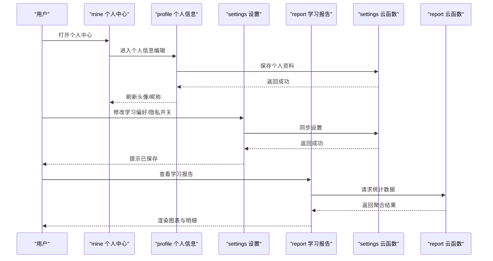
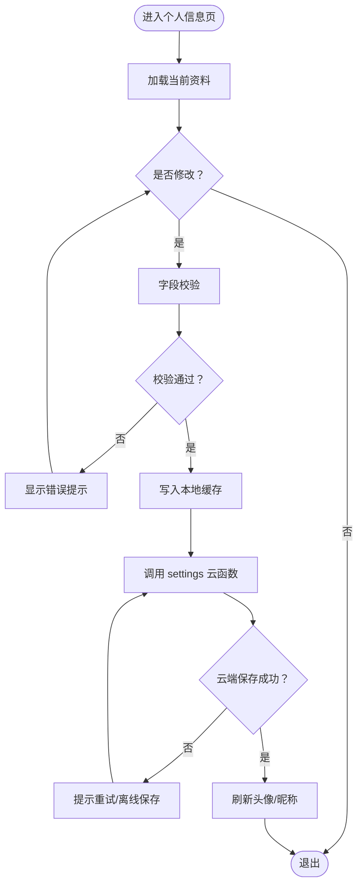
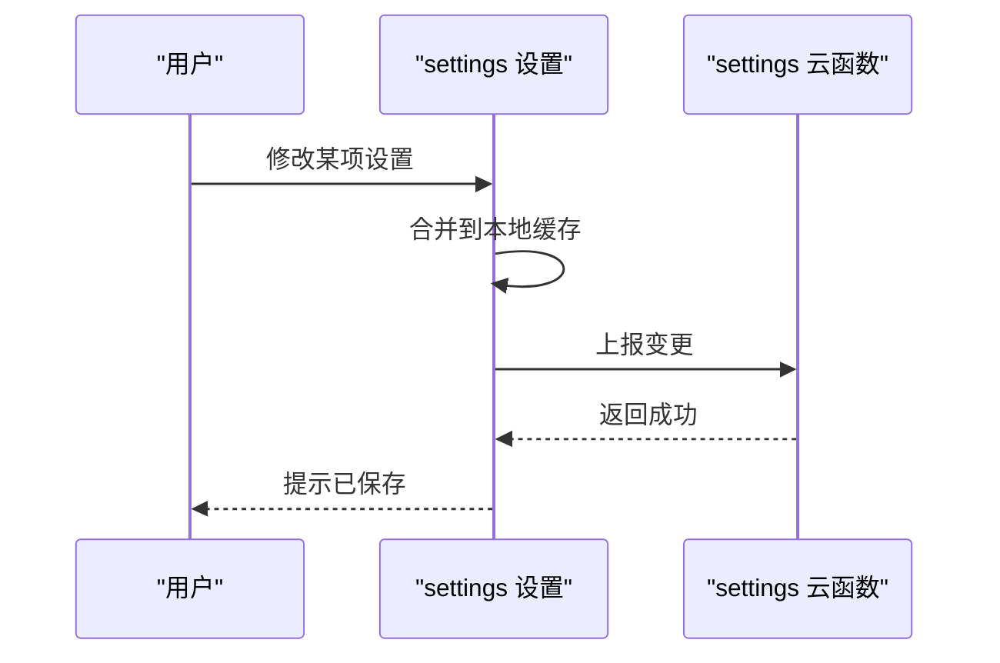
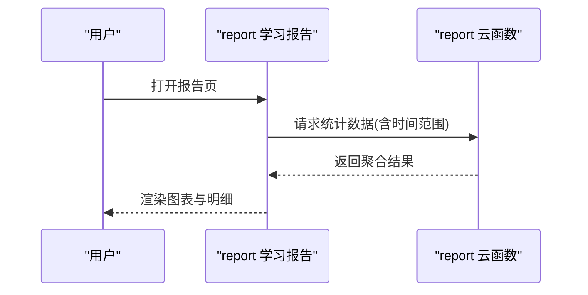
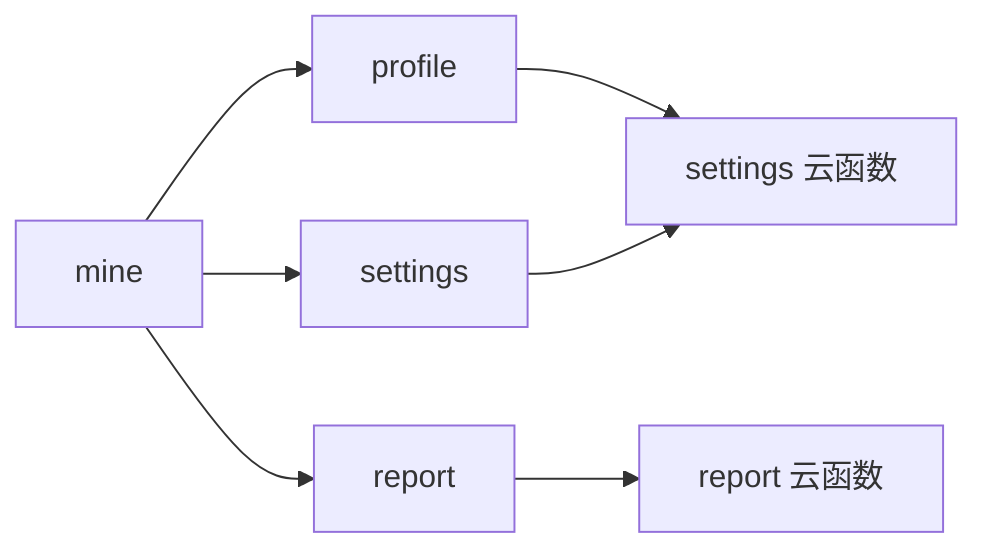

# 个人中心

<cite>
**本文引用的文件**   
- [miniprogram/pages/mine/mine.js](file://miniprogram/pages/mine/mine.js)
- [miniprogram/pages/mine/mine.wxml](file://miniprogram/pages/mine/mine.wxml)
- [miniprogram/pages/mine/mine.wxss](file://miniprogram/pages/mine/mine.wxss)
- [miniprogram/pages/profile/profile.js](file://miniprogram/pages/profile/profile.js)
- [miniprogram/pages/profile/profile.wxml](file://miniprogram/pages/profile/profile.wxml)
- [miniprogram/pages/settings/settings.js](file://miniprogram/pages/settings/settings.js)
- [miniprogram/pages/settings/settings.wxml](file://miniprogram/pages/settings/settings.wxml)
- [miniprogram/pages/report/report.js](file://miniprogram/pages/report/report.js)
- [miniprogram/pages/report/report.wxml](file://miniprogram/pages/report/report.wxml)
- [cloudfunctions/settings/index.js](file://cloudfunctions/settings/index.js)
- [cloudfunctions/report/index.js](file://cloudfunctions/report/index.js)
</cite>

## 目录
1. [简介](#简介)
2. [项目结构](#项目结构)
3. [核心组件](#核心组件)
4. [架构总览](#架构总览)
5. [详细组件分析](#详细组件分析)
6. [依赖分析](#依赖分析)
7. [性能考虑](#性能考虑)
8. [故障排查指南](#故障排查指南)
9. [结论](#结论)
10. [附录](#附录)

## 简介
本章节面向“个人中心”相关功能，覆盖个人信息管理、学习偏好设置、数据同步、隐私保护、学习数据统计与报告查看、账户安全设置等。文档以小程序前端页面与云函数为边界，提供从用户操作到数据落库的端到端说明，并给出个性化配置建议与最佳实践，帮助用户打造专属学习环境与管理个人学习数据。

## 项目结构
个人中心涉及的前端页面与后端云函数如下：
- 个人中心入口页：mine（展示头像、昵称、统计概览、功能入口）
- 个人信息编辑页：profile（编辑头像、昵称、签名等）
- 设置页：settings（学习偏好、通知、主题、隐私与安全开关）
- 学习报告页：report（学习时长、正确率、错题分布、趋势图）
- 云端服务：settings 云函数（保存/读取设置）、report 云函数（聚合统计数据）

图表来源
- [miniprogram/pages/mine/mine.js](file://miniprogram/pages/mine/mine.js)
- [miniprogram/pages/profile/profile.js](file://miniprogram/pages/profile/profile.js)
- [miniprogram/pages/settings/settings.js](file://miniprogram/pages/settings/settings.js)
- [miniprogram/pages/report/report.js](file://miniprogram/pages/report/report.js)
- [cloudfunctions/settings/index.js](file://cloudfunctions/settings/index.js)
- [cloudfunctions/report/index.js](file://cloudfunctions/report/index.js)

章节来源
- [miniprogram/pages/mine/mine.js](file://miniprogram/pages/mine/mine.js)
- [miniprogram/pages/mine/mine.wxml](file://miniprogram/pages/mine/mine.wxml)
- [miniprogram/pages/mine/mine.wxss](file://miniprogram/pages/mine/mine.wxss)
- [miniprogram/pages/profile/profile.js](file://miniprogram/pages/profile/profile.js)
- [miniprogram/pages/profile/profile.wxml](file://miniprogram/pages/profile/profile.wxml)
- [miniprogram/pages/settings/settings.js](file://miniprogram/pages/settings/settings.js)
- [miniprogram/pages/settings/settings.wxml](file://miniprogram/pages/settings/settings.wxml)
- [miniprogram/pages/report/report.js](file://miniprogram/pages/report/report.js)
- [miniprogram/pages/report/report.wxml](file://miniprogram/pages/report/report.wxml)
- [cloudfunctions/settings/index.js](file://cloudfunctions/settings/index.js)
- [cloudfunctions/report/index.js](file://cloudfunctions/report/index.js)

## 核心组件
- 个人中心入口（mine）
  - 作用：展示用户基本信息与常用入口；承载跳转至 profile、settings、report 等子模块。
  - 关键交互：点击头像/昵称进入个人信息编辑；点击设置项进入偏好与安全配置；点击报告进入学习数据分析。
- 个人信息（profile）
  - 作用：维护头像、昵称、个性签名等基础资料；支持本地缓存与云端同步。
  - 关键流程：选择图片/输入文本 -> 校验 -> 调用 settings 云函数持久化 -> 更新 UI。
- 设置（settings）
  - 作用：集中管理学习偏好（如每日目标、提醒时间、字体大小、深色模式）、通知开关、隐私与安全选项（登录方式、密码策略、设备管理）。
  - 关键流程：切换开关/修改值 -> 写入本地缓存 -> 调用 settings 云函数同步 -> 即时生效或下次启动生效。
- 学习报告（report）
  - 作用：汇总学习时长、练习正确率、错题分布、趋势变化等指标，辅助复盘与规划。
  - 关键流程：拉取 report 云函数聚合结果 -> 渲染图表与列表 -> 支持按日/周/月筛选。

章节来源
- [miniprogram/pages/mine/mine.js](file://miniprogram/pages/mine/mine.js)
- [miniprogram/pages/profile/profile.js](file://miniprogram/pages/profile/profile.js)
- [miniprogram/pages/settings/settings.js](file://miniprogram/pages/settings/settings.js)
- [miniprogram/pages/report/report.js](file://miniprogram/pages/report/report.js)
- [cloudfunctions/settings/index.js](file://cloudfunctions/settings/index.js)
- [cloudfunctions/report/index.js](file://cloudfunctions/report/index.js)

## 架构总览
个人中心采用“前端页面 + 云函数”的分层架构。前端负责交互与展示，云函数负责数据聚合与持久化。通过统一的接口约定，实现跨端一致体验与可扩展的数据模型。

图表来源
- [miniprogram/pages/mine/mine.js](file://miniprogram/pages/mine/mine.js)
- [miniprogram/pages/profile/profile.js](file://miniprogram/pages/profile/profile.js)
- [miniprogram/pages/settings/settings.js](file://miniprogram/pages/settings/settings.js)
- [miniprogram/pages/report/report.js](file://miniprogram/pages/report/report.js)
- [cloudfunctions/settings/index.js](file://cloudfunctions/settings/index.js)
- [cloudfunctions/report/index.js](file://cloudfunctions/report/index.js)

## 详细组件分析

### 个人信息管理（profile）
- 功能要点
  - 头像上传：支持从相册选择或拍照，压缩后上传，失败重试。
  - 昵称/签名：长度与字符集校验，敏感词过滤。
  - 数据同步：先写本地缓存提升响应速度，再异步同步至云端。
- 交互流程
  - 进入页面加载当前资料 -> 用户编辑 -> 提交校验 -> 调用 settings 云函数 -> 成功后刷新 UI。
- 错误处理
  - 网络异常：提示重试或离线保存。
  - 权限拒绝：引导用户开启相册/相机权限。
  - 服务端错误：统一错误码映射与友好提示。

图表来源
- [miniprogram/pages/profile/profile.js](file://miniprogram/pages/profile/profile.js)
- [miniprogram/pages/profile/profile.wxml](file://miniprogram/pages/profile/profile.wxml)
- [cloudfunctions/settings/index.js](file://cloudfunctions/settings/index.js)

章节来源
- [miniprogram/pages/profile/profile.js](file://miniprogram/pages/profile/profile.js)
- [miniprogram/pages/profile/profile.wxml](file://miniprogram/pages/profile/profile.wxml)
- [cloudfunctions/settings/index.js](file://cloudfunctions/settings/index.js)

### 学习偏好设置（settings）
- 功能要点
  - 学习偏好：每日学习时长目标、提醒时间、字体大小、深色模式、自动播放下一题等。
  - 通知管理：消息推送开关、免打扰时段。
  - 隐私与安全：登录方式、密码策略、设备管理与会话清理。
- 数据流
  - 前端将设置项序列化为对象，调用 settings 云函数持久化；读取时优先本地缓存，缺失则回源。
- 最佳实践
  - 增量更新：仅发送变更字段，减少带宽。
  - 幂等设计：重复提交不产生副作用。
  - 灰度生效：部分设置可延迟到下次启动生效，避免运行时状态抖动。

图表来源
- [miniprogram/pages/settings/settings.js](file://miniprogram/pages/settings/settings.js)
- [miniprogram/pages/settings/settings.wxml](file://miniprogram/pages/settings/settings.wxml)
- [cloudfunctions/settings/index.js](file://cloudfunctions/settings/index.js)

章节来源
- [miniprogram/pages/settings/settings.js](file://miniprogram/pages/settings/settings.js)
- [miniprogram/pages/settings/settings.wxml](file://miniprogram/pages/settings/settings.wxml)
- [cloudfunctions/settings/index.js](file://cloudfunctions/settings/index.js)

### 学习数据统计与报告（report）
- 功能要点
  - 指标维度：学习时长、练习次数、正确率、错题分布、知识点掌握度、趋势曲线。
  - 筛选能力：按日/周/月/自定义区间查看。
  - 可视化：柱状图、折线图、饼图等。
- 数据获取
  - 前端向 report 云函数发起查询，云函数聚合多表数据并返回结构化结果。
- 使用建议
  - 每周复盘：关注趋势而非单日波动。
  - 错题闭环：结合错题本进行针对性复习。
  - 目标对齐：将每日目标与报告对比，动态调整计划。

图表来源
- [miniprogram/pages/report/report.js](file://miniprogram/pages/report/report.js)
- [miniprogram/pages/report/report.wxml](file://miniprogram/pages/report/report.wxml)
- [cloudfunctions/report/index.js](file://cloudfunctions/report/index.js)

章节来源
- [miniprogram/pages/report/report.js](file://miniprogram/pages/report/report.js)
- [miniprogram/pages/report/report.wxml](file://miniprogram/pages/report/report.wxml)
- [cloudfunctions/report/index.js](file://cloudfunctions/report/index.js)

### 个人中心入口（mine）
- 功能要点
  - 展示用户头像、昵称、等级/积分等概览信息。
  - 提供快捷入口：个人信息、设置、学习报告、成就、错题本等。
- 交互逻辑
  - 首次进入拉取用户信息与最近学习摘要；点击卡片跳转到对应页面。
- 注意事项
  - 空状态处理：未登录或未初始化时的占位与引导。
  - 性能优化：懒加载非关键数据，首屏快速呈现。

章节来源
- [miniprogram/pages/mine/mine.js](file://miniprogram/pages/mine/mine.js)
- [miniprogram/pages/mine/mine.wxml](file://miniprogram/pages/mine/mine.wxml)
- [miniprogram/pages/mine/mine.wxss](file://miniprogram/pages/mine/mine.wxss)

## 依赖分析
- 前端页面依赖关系
  - mine 作为入口，依赖 profile、settings、report 三个子模块。
  - profile 与 settings 均依赖 settings 云函数进行数据持久化。
  - report 依赖 report 云函数进行数据聚合。
- 外部依赖
  - 云开发环境：用于鉴权、存储与数据库访问。
  - 图片资源：头像与图标资源由 CDN 或云存储托管。

图表来源
- [miniprogram/pages/mine/mine.js](file://miniprogram/pages/mine/mine.js)
- [miniprogram/pages/profile/profile.js](file://miniprogram/pages/profile/profile.js)
- [miniprogram/pages/settings/settings.js](file://miniprogram/pages/settings/settings.js)
- [miniprogram/pages/report/report.js](file://miniprogram/pages/report/report.js)
- [cloudfunctions/settings/index.js](file://cloudfunctions/settings/index.js)
- [cloudfunctions/report/index.js](file://cloudfunctions/report/index.js)

章节来源
- [miniprogram/pages/mine/mine.js](file://miniprogram/pages/mine/mine.js)
- [miniprogram/pages/profile/profile.js](file://miniprogram/pages/profile/profile.js)
- [miniprogram/pages/settings/settings.js](file://miniprogram/pages/settings/settings.js)
- [miniprogram/pages/report/report.js](file://miniprogram/pages/report/report.js)
- [cloudfunctions/settings/index.js](file://cloudfunctions/settings/index.js)
- [cloudfunctions/report/index.js](file://cloudfunctions/report/index.js)

## 性能考虑
- 首屏优化
  - 按需加载：mine 仅加载必要信息，其他数据在用户触发时再拉取。
  - 骨架屏与占位：在网络慢时提升感知速度。
- 缓存策略
  - 本地缓存优先：settings 与 profile 数据先读缓存，再异步回源。
  - 失效策略：设置变更后主动失效相关缓存，保证一致性。
- 网络与并发
  - 批量请求：合并多个小请求，降低往返次数。
  - 重试与退避：对不稳定接口实施指数退避重试。
- 渲染优化
  - 列表分页与虚拟滚动：报告明细长列表时分页加载。
  - 图片压缩与懒加载：头像与缩略图按需加载与压缩。

[本节为通用指导，无需代码来源]

## 故障排查指南
- 常见问题
  - 头像无法上传：检查相册/相机权限；确认网络与存储空间；尝试重新授权。
  - 设置未生效：确认本地缓存是否被覆盖；检查云端返回码；必要时清除缓存重试。
  - 报告数据为空：确认时间范围是否正确；检查是否有学习行为记录；核对云函数日志。
- 定位步骤
  - 前端：查看控制台日志与网络请求，确认参数与返回值。
  - 云端：查看云函数运行日志，定位错误堆栈与业务异常。
  - 数据：核对数据库记录与缓存键名，确保读写一致。
- 恢复建议
  - 降级策略：云端不可用时启用离线模式，待恢复后补传。
  - 幂等重放：对关键操作增加唯一标识，防止重复提交导致数据不一致。

章节来源
- [miniprogram/pages/profile/profile.js](file://miniprogram/pages/profile/profile.js)
- [miniprogram/pages/settings/settings.js](file://miniprogram/pages/settings/settings.js)
- [miniprogram/pages/report/report.js](file://miniprogram/pages/report/report.js)
- [cloudfunctions/settings/index.js](file://cloudfunctions/settings/index.js)
- [cloudfunctions/report/index.js](file://cloudfunctions/report/index.js)

## 结论
个人中心围绕“个人信息—偏好设置—数据报告”形成闭环，配合云函数实现稳定可靠的数据同步与分析。遵循本文的最佳实践与排障建议，可有效提升用户体验与数据准确性，帮助用户构建高效、个性化的学习环境。

[本节为总结性内容，无需代码来源]

## 附录
- 个性化配置建议
  - 每日目标：根据历史数据设定渐进式目标，避免过高导致挫败感。
  - 提醒时间：结合作息习惯设置，保持固定节奏。
  - 深色模式：夜间学习开启，减轻视觉疲劳。
  - 字体大小：依据视力与设备尺寸调优，提高可读性。
- 隐私与安全最佳实践
  - 定期审查登录设备，移除不再使用的设备。
  - 开启二次验证（若支持），增强账户安全。
  - 谨慎授予相册/相机权限，仅在需要时使用。
- 数据管理建议
  - 定期导出学习报告，建立个人学习档案。
  - 利用错题本与知识图谱进行定向复习。
  - 关注长期趋势，避免短期波动影响决策。

[本节为通用指导，无需代码来源]