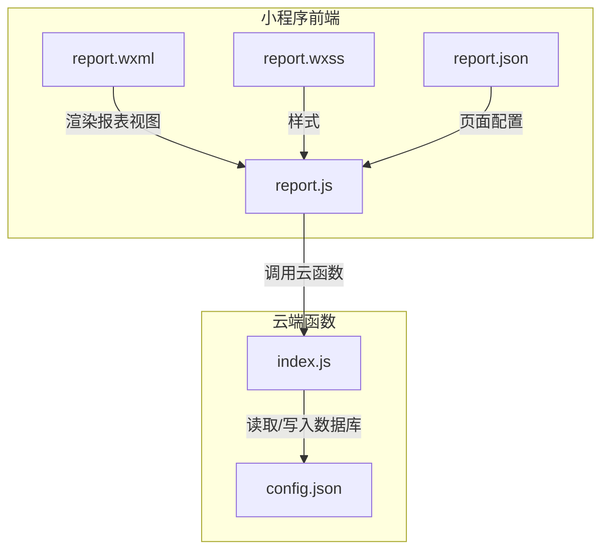
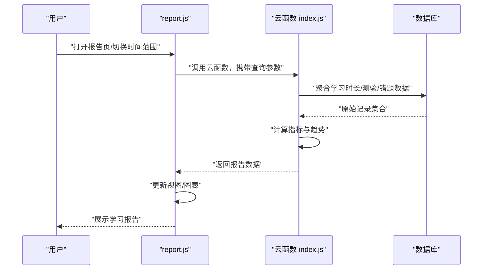
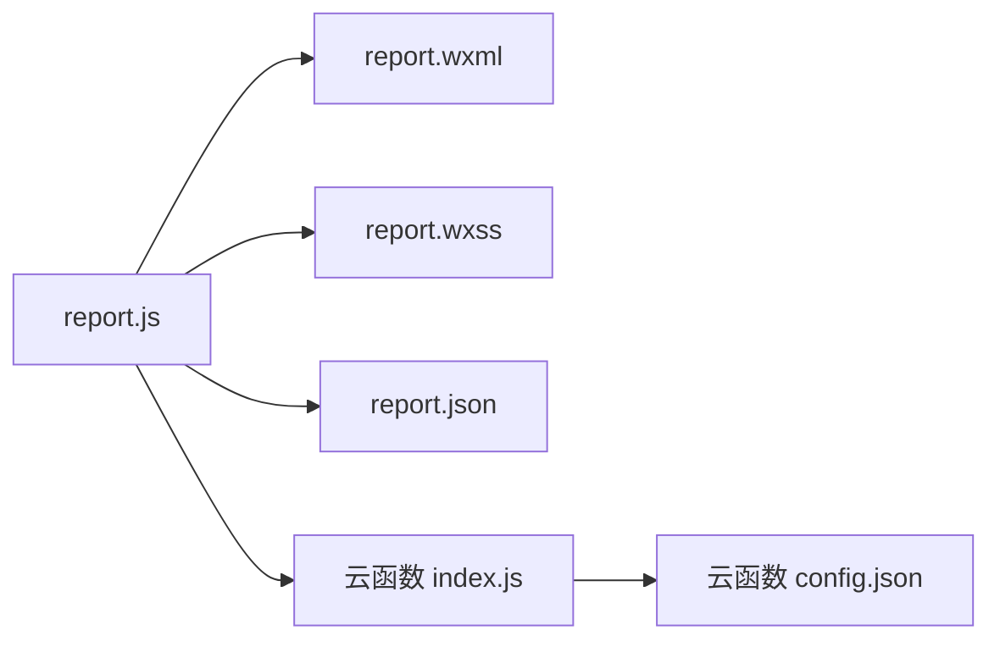

# 学习报告

<cite>
**本文引用的文件**   
- [report.js](file://miniprogram/pages/report/report.js)
- [report.wxml](file://miniprogram/pages/report/report.wxml)
- [report.wxss](file://miniprogram/pages/report/report.wxss)
- [report.json](file://miniprogram/pages/report/report.json)
- [index.js（云函数 report）](file://cloudfunctions/report/index.js)
- [config.json（云函数 report）](file://cloudfunctions/report/config.json)
</cite>

## 目录
1. [简介](#简介)
2. [项目结构](#项目结构)
3. [核心组件](#核心组件)
4. [架构总览](#架构总览)
5. [详细组件分析](#详细组件分析)
6. [依赖分析](#依赖分析)
7. [性能考虑](#性能考虑)
8. [故障排查指南](#故障排查指南)
9. [结论](#结论)
10. [附录](#附录)

## 简介
本章节面向学习者与管理者，系统介绍“学习报告”与“数据统计”功能的使用方法、指标含义与评估方法。内容覆盖：
- 学习时长统计：累计学习时长、近N日趋势、课程维度分布
- 知识掌握度分析：知识点正确率、复习间隔表现、薄弱点识别
- 进步趋势图表：按周/月维度的能力曲线与里程碑
- 薄弱环节识别：错误集中领域、易错题型、建议强化清单
- 数据解读与量化评估：如何理解指标、如何设定目标
- 基于数据的改进建议：学习计划优化策略与效率提升技巧

## 项目结构
学习报告功能由小程序前端页面与云端函数共同实现：
- 前端页面位于 miniprogram/pages/report，负责展示报表、交互与本地缓存
- 云端函数位于 cloudfunctions/report，负责聚合学习行为数据并生成报告

图示来源
- [report.js](file://miniprogram/pages/report/report.js)
- [report.wxml](file://miniprogram/pages/report/report.wxml)
- [report.wxss](file://miniprogram/pages/report/report.wxss)
- [report.json](file://miniprogram/pages/report/report.json)
- [index.js（云函数 report）](file://cloudfunctions/report/index.js)
- [config.json（云函数 report）](file://cloudfunctions/report/config.json)

章节来源
- [report.js](file://miniprogram/pages/report/report.js)
- [report.wxml](file://miniprogram/pages/report/report.wxml)
- [report.wxss](file://miniprogram/pages/report/report.wxss)
- [report.json](file://miniprogram/pages/report/report.json)
- [index.js（云函数 report）](file://cloudfunctions/report/index.js)
- [config.json（云函数 report）](file://cloudfunctions/report/config.json)

## 核心组件
- 报告页面控制器（report.js）
  - 负责发起云函数请求、解析返回数据、更新视图状态、处理用户筛选与刷新
- 报告视图模板（report.wxml）
  - 定义报表卡片、图表容器、时间范围选择器、导出入口等UI元素
- 报告样式（report.wxss）
  - 控制卡片布局、图表区域、响应式适配
- 页面配置（report.json）
  - 声明导航栏标题、自定义tabBar、下拉刷新等页面级配置
- 云端函数（cloudfunctions/report/index.js）
  - 接收查询参数（如时间范围、课程/知识点过滤），聚合学习记录、测验结果、错题数据，计算指标并返回结构化报告
- 云函数配置（cloudfunctions/report/config.json）
  - 声明云函数运行环境与权限

章节来源
- [report.js](file://miniprogram/pages/report/report.js)
- [report.wxml](file://miniprogram/pages/report/report.wxml)
- [report.wxss](file://miniprogram/pages/report/report.wxss)
- [report.json](file://miniprogram/pages/report/report.json)
- [index.js（云函数 report）](file://cloudfunctions/report/index.js)
- [config.json（云函数 report）](file://cloudfunctions/report/config.json)

## 架构总览
学习报告的数据流遵循“前端触发—云端聚合—返回结构化数据—前端渲染”的闭环。

图示来源
- [report.js](file://miniprogram/pages/report/report.js)
- [index.js（云函数 report）](file://cloudfunctions/report/index.js)

## 详细组件分析

### 报告页面控制器（report.js）
职责与流程
- 初始化与生命周期
  - 页面加载时根据默认时间范围拉取报告数据
  - 支持下拉刷新与手动刷新
- 数据获取与解析
  - 调用云函数获取报告数据
  - 校验返回字段完整性，缺失则提示重试
- 视图更新
  - 将数据映射到卡片、图表与列表
  - 处理空数据与异常分支
- 交互逻辑
  - 时间范围切换（近7天/近30天/自定义）
  - 课程/知识点筛选
  - 导出或分享（若已实现）

关键路径参考
- 页面初始化与数据拉取：[report.js](file://miniprogram/pages/report/report.js)
- 事件处理与状态更新：[report.js](file://miniprogram/pages/report/report.js)

章节来源
- [report.js](file://miniprogram/pages/report/report.js)

### 报告视图模板（report.wxml）
职责与结构
- 顶部概览卡片：学习时长、正确率、薄弱点数量
- 趋势图表区：折线/柱状图容器
- 筛选控件：时间范围、课程/知识点下拉
- 详情列表：知识点掌握度、错题明细
- 操作按钮：刷新、导出、分享

关键路径参考
- 模板结构与数据绑定：[report.wxml](file://miniprogram/pages/report/report.wxml)

章节来源
- [report.wxml](file://miniprogram/pages/report/report.wxml)

### 报告样式（report.wxss）
职责与要点
- 卡片化布局与间距规范
- 图表区域自适应与占位
- 移动端触控友好（按钮尺寸、点击热区）
- 主题与可读性（对比度、字号层级）

关键路径参考
- 样式规则与媒体查询：[report.wxss](file://miniprogram/pages/report/report.wxss)

章节来源
- [report.wxss](file://miniprogram/pages/report/report.wxss)

### 页面配置（report.json）
职责与要点
- 导航栏标题与颜色
- 是否启用下拉刷新
- 自定义tabBar关联（如有）

关键路径参考
- 页面级配置项：[report.json](file://miniprogram/pages/report/report.json)

章节来源
- [report.json](file://miniprogram/pages/report/report.json)

### 云端函数（cloudfunctions/report/index.js）
职责与流程
- 接收查询参数：时间范围、课程ID、知识点标签、分页等
- 数据聚合：
  - 学习时长：按课程/知识点汇总有效学习时长
  - 测验表现：正确率、平均用时、难度分布
  - 错题分析：错误次数、重复错误、易错知识点
- 指标计算：
  - 掌握度评分（结合正确率与复习间隔）
  - 进步趋势（滑动窗口/移动平均）
  - 薄弱点识别（阈值+排序）
- 返回结构化报告：供前端直接渲染

关键路径参考
- 接口处理与数据聚合：[index.js（云函数 report）](file://cloudfunctions/report/index.js)

章节来源
- [index.js（云函数 report）](file://cloudfunctions/report/index.js)

### 云函数配置（cloudfunctions/report/config.json）
职责与要点
- 运行环境版本、超时、内存
- 数据库/存储访问权限声明

关键路径参考
- 云函数运行配置：[config.json（云函数 report）](file://cloudfunctions/report/config.json)

章节来源
- [config.json（云函数 report）](file://cloudfunctions/report/config.json)

## 依赖分析
- 前端依赖
  - report.js 依赖 report.wxml 与 report.wxss 完成渲染
  - report.json 提供页面级配置
- 后端依赖
  - 云函数 index.js 依赖 config.json 的环境与权限
  - 云函数通过数据库/存储服务聚合学习行为与测验数据

图示来源
- [report.js](file://miniprogram/pages/report/report.js)
- [report.wxml](file://miniprogram/pages/report/report.wxml)
- [report.wxss](file://miniprogram/pages/report/report.wxss)
- [report.json](file://miniprogram/pages/report/report.json)
- [index.js（云函数 report）](file://cloudfunctions/report/index.js)
- [config.json（云函数 report）](file://cloudfunctions/report/config.json)

章节来源
- [report.js](file://miniprogram/pages/report/report.js)
- [report.wxml](file://miniprogram/pages/report/report.wxml)
- [report.wxss](file://miniprogram/pages/report/report.wxss)
- [report.json](file://miniprogram/pages/report/report.json)
- [index.js（云函数 report）](file://cloudfunctions/report/index.js)
- [config.json（云函数 report）](file://cloudfunctions/report/config.json)

## 性能考虑
- 减少不必要的重绘
  - 使用局部更新而非整页刷新
  - 图表数据增量更新
- 缓存策略
  - 对相同时间范围的报告进行短期缓存
  - 网络失败时回退到最近一次成功数据
- 云端聚合优化
  - 在云函数侧做预聚合与索引优化
  - 分页与懒加载长列表

## 故障排查指南
常见问题与定位步骤
- 页面空白或无数据
  - 检查 report.js 中云函数调用是否成功
  - 查看控制台错误日志与网络请求状态
  - 确认时间范围与筛选条件是否合法
- 图表不显示
  - 确认 report.wxml 中图表容器是否存在且可见
  - 检查 report.wxss 是否隐藏了图表区域
- 云函数报错
  - 查看云函数日志，核对 config.json 权限与环境
  - 验证数据库查询条件与字段名

章节来源
- [report.js](file://miniprogram/pages/report/report.js)
- [report.wxml](file://miniprogram/pages/report/report.wxml)
- [report.wxss](file://miniprogram/pages/report/report.wxss)
- [index.js（云函数 report）](file://cloudfunctions/report/index.js)
- [config.json（云函数 report）](file://cloudfunctions/report/config.json)

## 结论
学习报告通过将学习时长、测验表现与错题数据进行统一聚合与可视化，帮助学习者快速把握自身进度、识别薄弱点并制定针对性改进计划。配合合理的筛选与趋势分析，可有效提升学习效率与目标达成率。

## 附录

### 使用方法与操作步骤
- 打开“学习报告”页面
  - 进入报告页后，默认展示最近一段时间的学习概览
- 调整时间范围
  - 选择“近7天/近30天/自定义”，系统将重新拉取对应区间数据
- 筛选课程与知识点
  - 通过下拉菜单限定关注范围，聚焦特定课程或知识点
- 查看关键指标
  - 学习时长：累计时长与趋势
  - 掌握度：知识点正确率与复习间隔表现
  - 薄弱点：错误集中领域与重复错误
- 导出与分享
  - 如需保存或分享，可使用页面提供的导出/分享入口（若已实现）

章节来源
- [report.js](file://miniprogram/pages/report/report.js)
- [report.wxml](file://miniprogram/pages/report/report.wxml)

### 指标含义与量化评估方法
- 学习时长统计
  - 累计学习时长：所选时间范围内有效学习时长总和
  - 日均时长：累计时长除以天数，反映学习节奏
  - 课程分布：各课程时长占比，辅助资源分配
- 知识掌握度分析
  - 知识点正确率：该知识点答题正确的比例
  - 复习间隔表现：随复习次数变化的正确率变化
  - 综合掌握度：结合正确率与复习间隔的加权评分
- 进步趋势图表
  - 周/月趋势：以移动平均平滑波动，观察长期方向
  - 里程碑标记：达到阈值时的节点标注
- 薄弱环节识别
  - 错误集中度：错误次数与占比高的知识点
  - 重复错误：多次未掌握的知识点优先强化

章节来源
- [index.js（云函数 report）](file://cloudfunctions/report/index.js)

### 基于数据的改进建议与实用技巧
- 学习计划优化
  - 依据薄弱点优先级安排复习顺序
  - 为高权重课程分配更多学习时间
- 学习效率提升
  - 利用趋势图判断最佳复习时机
  - 针对重复错误采用间隔重复与变式练习
- 目标管理
  - 设定可量化的周/月目标，对照趋势图复盘
  - 将大目标拆解为知识点小目标，逐项推进

章节来源
- [index.js（云函数 report）](file://cloudfunctions/report/index.js)