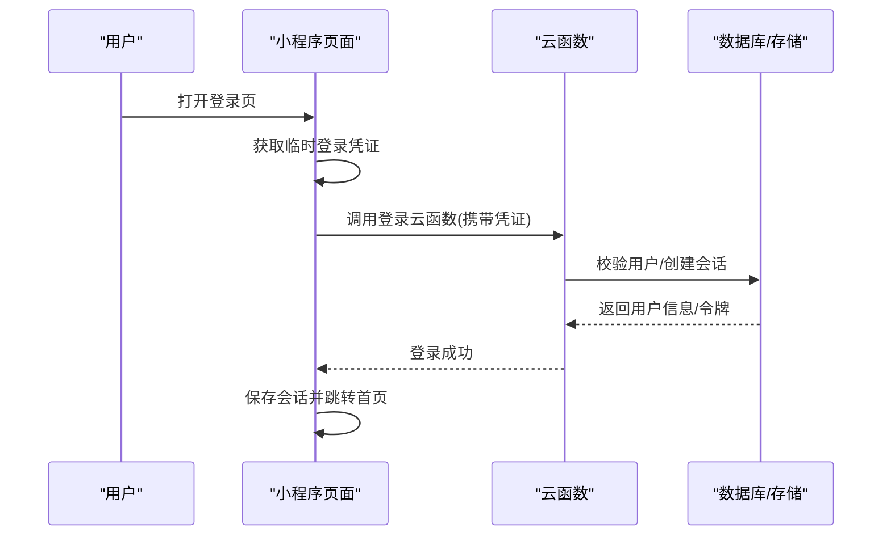
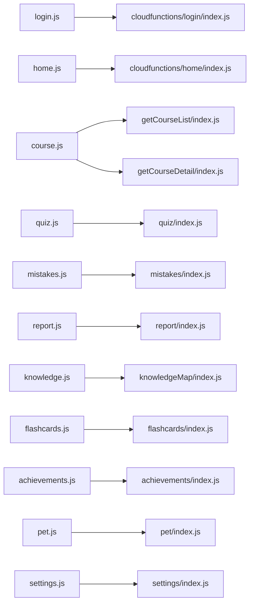

# 常见问题解答

<cite>
**本文引用的文件**   
- [miniprogram/app.js](file://miniprogram/app.js)
- [miniprogram/app.json](file://miniprogram/app.json)
- [miniprogram/pages/login/login.js](file://miniprogram/pages/login/login.js)
- [cloudfunctions/login/index.js](file://cloudfunctions/login/index.js)
- [miniprogram/pages/home/home.js](file://miniprogram/pages/home/home.js)
- [cloudfunctions/home/index.js](file://cloudfunctions/home/index.js)
- [miniprogram/pages/course/course.js](file://miniprogram/pages/course/course.js)
- [cloudfunctions/getCourseList/index.js](file://cloudfunctions/getCourseList/index.js)
- [cloudfunctions/getCourseDetail/index.js](file://cloudfunctions/getCourseDetail/index.js)
- [miniprogram/pages/quiz/quiz.js](file://miniprogram/pages/quiz/quiz.js)
- [cloudfunctions/quiz/index.js](file://cloudfunctions/quiz/index.js)
- [miniprogram/pages/mistakes/mistakes.js](file://miniprogram/pages/mistakes/mistakes.js)
- [cloudfunctions/mistakes/index.js](file://cloudfunctions/mistakes/index.js)
- [miniprogram/pages/report/report.js](file://miniprogram/pages/report/report.js)
- [cloudfunctions/report/index.js](file://cloudfunctions/report/index.js)
- [miniprogram/pages/knowledge/knowledge.js](file://miniprogram/pages/knowledge/knowledge.js)
- [cloudfunctions/knowledgeMap/index.js](file://cloudfunctions/knowledgeMap/index.js)
- [miniprogram/pages/flashcards/flashcards.js](file://miniprogram/pages/flashcards/flashcards.js)
- [cloudfunctions/flashcards/index.js](file://cloudfunctions/flashcards/index.js)
- [miniprogram/pages/achievements/achievements.js](file://miniprogram/pages/achievements/achievements.js)
- [cloudfunctions/achievements/index.js](file://cloudfunctions/achievements/index.js)
- [miniprogram/pages/pet/pet.js](file://miniprogram/pages/pet/pet.js)
- [cloudfunctions/pet/index.js](file://cloudfunctions/pet/index.js)
- [miniprogram/pages/settings/settings.js](file://miniprogram/pages/settings/settings.js)
- [cloudfunctions/settings/index.js](file://cloudfunctions/settings/index.js)
- [miniprogram/custom-tab-bar/index.js](file://miniprogram/custom-tab-bar/index.js)
</cite>

## 目录
1. [简介](#简介)
2. [项目结构](#项目结构)
3. [核心组件](#核心组件)
4. [架构总览](#架构总览)
5. [详细组件分析](#详细组件分析)
6. [依赖分析](#依赖分析)
7. [性能考虑](#性能考虑)
8. [故障排查指南](#故障排查指南)
9. [结论](#结论)
10. [附录](#附录)

## 简介
本“常见问题解答”面向小程序用户与运维人员，围绕登录注册、功能使用、技术故障排查与性能优化等高频问题，提供可操作的诊断步骤与解决方案。文档基于仓库中的前端页面与云函数实现进行归纳，确保建议与实际代码路径一致，便于快速定位与修复。

## 项目结构
本项目为微信小程序 + 云开发（Cloud Functions）架构：
- 小程序端位于 miniprogram 目录，包含应用入口、页面与自定义 TabBar。
- 云端逻辑位于 cloudfunctions 目录，按功能模块划分（如 login、home、course、quiz、mistakes、report、knowledgeMap、flashcards、achievements、pet、settings）。
- 配置与站点地图位于根目录 project.config.json 与 sitemap.json。

```mermaid
graph TB
subgraph "小程序端"
APP["app.js<br/>应用初始化"]
TAB["custom-tab-bar/index.js<br/>自定义TabBar"]
LOGIN["pages/login/login.js<br/>登录页"]
HOME["pages/home/home.js<br/>首页"]
COURSE["pages/course/course.js<br/>课程详情"]
QUIZ["pages/quiz/quiz.js<br/>答题"]
MISTAKES["pages/mistakes/mistakes.js<br/>错题集"]
REPORT["pages/report/report.js<br/>报告"]
KNOW["pages/knowledge/knowledge.js<br/>知识图谱"]
FLASH["pages/flashcards/flashcards.js<br/>闪卡"]
ACH["pages/achievements/achievements.js<br/>成就"]
PET["pages/pet/pet.js<br/>宠物"]
SET["pages/settings/settings.js<br/>设置"]
end
subgraph "云函数"
CF_LOGIN["cloudfunctions/login/index.js"]
CF_HOME["cloudfunctions/home/index.js"]
CF_COURSE_LIST["cloudfunctions/getCourseList/index.js"]
CF_COURSE_DETAIL["cloudfunctions/getCourseDetail/index.js"]
CF_QUIZ["cloudfunctions/quiz/index.js"]
CF_MISTAKES["cloudfunctions/mistakes/index.js"]
CF_REPORT["cloudfunctions/report/index.js"]
CF_KNOW["cloudfunctions/knowledgeMap/index.js"]
CF_FLASH["cloudfunctions/flashcards/index.js"]
CF_ACH["cloudfunctions/achievements/index.js"]
CF_PET["cloudfunctions/pet/index.js"]
CF_SET["cloudfunctions/settings/index.js"]
end
APP --> LOGIN
APP --> HOME
APP --> COURSE
APP --> QUIZ
APP --> MISTAKES
APP --> REPORT
APP --> KNOW
APP --> FLASH
APP --> ACH
APP --> PET
APP --> SET
APP --> TAB
LOGIN --> CF_LOGIN
HOME --> CF_HOME
COURSE --> CF_COURSE_LIST
COURSE --> CF_COURSE_DETAIL
QUIZ --> CF_QUIZ
MISTAKES --> CF_MISTAKES
REPORT --> CF_REPORT
KNOW --> CF_KNOW
FLASH --> CF_FLASH
ACH --> CF_ACH
PET --> CF_PET
SET --> CF_SET
```

图表来源
- [miniprogram/app.js](file://miniprogram/app.js)
- [miniprogram/custom-tab-bar/index.js](file://miniprogram/custom-tab-bar/index.js)
- [miniprogram/pages/login/login.js](file://miniprogram/pages/login/login.js)
- [miniprogram/pages/home/home.js](file://miniprogram/pages/home/home.js)
- [miniprogram/pages/course/course.js](file://miniprogram/pages/course/course.js)
- [miniprogram/pages/quiz/quiz.js](file://miniprogram/pages/quiz/quiz.js)
- [miniprogram/pages/mistakes/mistakes.js](file://miniprogram/pages/mistakes/mistakes.js)
- [miniprogram/pages/report/report.js](file://miniprogram/pages/report/report.js)
- [miniprogram/pages/knowledge/knowledge.js](file://miniprogram/pages/knowledge/knowledge.js)
- [miniprogram/pages/flashcards/flashcards.js](file://miniprogram/pages/flashcards/flashcards.js)
- [miniprogram/pages/achievements/achievements.js](file://miniprogram/pages/achievements/achievements.js)
- [miniprogram/pages/pet/pet.js](file://miniprogram/pages/pet/pet.js)
- [miniprogram/pages/settings/settings.js](file://miniprogram/pages/settings/settings.js)
- [cloudfunctions/login/index.js](file://cloudfunctions/login/index.js)
- [cloudfunctions/home/index.js](file://cloudfunctions/home/index.js)
- [cloudfunctions/getCourseList/index.js](file://cloudfunctions/getCourseList/index.js)
- [cloudfunctions/getCourseDetail/index.js](file://cloudfunctions/getCourseDetail/index.js)
- [cloudfunctions/quiz/index.js](file://cloudfunctions/quiz/index.js)
- [cloudfunctions/mistakes/index.js](file://cloudfunctions/mistakes/index.js)
- [cloudfunctions/report/index.js](file://cloudfunctions/report/index.js)
- [cloudfunctions/knowledgeMap/index.js](file://cloudfunctions/knowledgeMap/index.js)
- [cloudfunctions/flashcards/index.js](file://cloudfunctions/flashcards/index.js)
- [cloudfunctions/achievements/index.js](file://cloudfunctions/achievements/index.js)
- [cloudfunctions/pet/index.js](file://cloudfunctions/pet/index.js)
- [cloudfunctions/settings/index.js](file://cloudfunctions/settings/index.js)

章节来源
- [miniprogram/app.js](file://miniprogram/app.js)
- [miniprogram/app.json](file://miniprogram/app.json)
- [miniprogram/custom-tab-bar/index.js](file://miniprogram/custom-tab-bar/index.js)

## 核心组件
- 应用初始化与全局状态：负责启动流程、权限与网络环境检查、全局数据缓存。
- 登录认证：小程序端调用 wx.login 获取临时凭证，再请求云函数完成鉴权与会话建立。
- 首页数据加载：拉取个性化推荐或基础数据，展示卡片列表与导航入口。
- 课程浏览与详情：分页获取课程列表，按需加载课程详情。
- 答题与错题：提交答题结果，记录错题并支持复习。
- 学习报告：汇总学习进度与成绩，生成可视化报告。
- 知识图谱：渲染知识点关系图，支持缩放与交互。
- 闪卡记忆：随机抽取卡片，记录掌握度。
- 成就系统：根据行为解锁成就。
- 宠物养成：关联学习行为，更新宠物状态。
- 设置：管理通知、主题、隐私等偏好。

章节来源
- [miniprogram/pages/login/login.js](file://miniprogram/pages/login/login.js)
- [cloudfunctions/login/index.js](file://cloudfunctions/login/index.js)
- [miniprogram/pages/home/home.js](file://miniprogram/pages/home/home.js)
- [cloudfunctions/home/index.js](file://cloudfunctions/home/index.js)
- [miniprogram/pages/course/course.js](file://miniprogram/pages/course/course.js)
- [cloudfunctions/getCourseList/index.js](file://cloudfunctions/getCourseList/index.js)
- [cloudfunctions/getCourseDetail/index.js](file://cloudfunctions/getCourseDetail/index.js)
- [miniprogram/pages/quiz/quiz.js](file://miniprogram/pages/quiz/quiz.js)
- [cloudfunctions/quiz/index.js](file://cloudfunctions/quiz/index.js)
- [miniprogram/pages/mistakes/mistakes.js](file://miniprogram/pages/mistakes/mistakes.js)
- [cloudfunctions/mistakes/index.js](file://cloudfunctions/mistakes/index.js)
- [miniprogram/pages/report/report.js](file://miniprogram/pages/report/report.js)
- [cloudfunctions/report/index.js](file://cloudfunctions/report/index.js)
- [miniprogram/pages/knowledge/knowledge.js](file://miniprogram/pages/knowledge/knowledge.js)
- [cloudfunctions/knowledgeMap/index.js](file://cloudfunctions/knowledgeMap/index.js)
- [miniprogram/pages/flashcards/flashcards.js](file://miniprogram/pages/flashcards/flashcards.js)
- [cloudfunctions/flashcards/index.js](file://cloudfunctions/flashcards/index.js)
- [miniprogram/pages/achievements/achievements.js](file://miniprogram/pages/achievements/achievements.js)
- [cloudfunctions/achievements/index.js](file://cloudfunctions/achievements/index.js)
- [miniprogram/pages/pet/pet.js](file://miniprogram/pages/pet/pet.js)
- [cloudfunctions/pet/index.js](file://cloudfunctions/pet/index.js)
- [miniprogram/pages/settings/settings.js](file://miniprogram/pages/settings/settings.js)
- [cloudfunctions/settings/index.js](file://cloudfunctions/settings/index.js)

## 架构总览
整体采用“小程序前端 + 云函数后端”的解耦模式。前端通过统一接口调用云函数，云函数负责业务逻辑与数据持久化。关键交互包括登录鉴权、数据查询与写入、统计上报等。

图表来源
- [miniprogram/pages/login/login.js](file://miniprogram/pages/login/login.js)
- [cloudfunctions/login/index.js](file://cloudfunctions/login/index.js)

## 详细组件分析

### 登录与注册
常见问题
- 无法登录或反复提示登录失败
- 首次注册后未自动进入首页
- 切换账号后数据不同步

可能原因
- 网络不可用或超时
- 微信授权未同意或已过期
- 云函数未部署或权限不足
- 本地会话缓存异常

诊断步骤
- 确认设备网络可用，尝试切换 Wi-Fi/移动数据
- 在小程序开发者工具中查看控制台错误日志与网络请求
- 检查是否授予必要权限（如手机号、头像等）
- 重新登录并观察是否出现相同错误
- 若为多端同步问题，退出登录后重新登录以刷新会话

解决建议
- 清理小程序缓存并重启
- 检查云函数部署状态与运行日志
- 避免频繁重复登录，必要时等待重试间隔

章节来源
- [miniprogram/pages/login/login.js](file://miniprogram/pages/login/login.js)
- [cloudfunctions/login/index.js](file://cloudfunctions/login/index.js)

### 首页加载与数据展示
常见问题
- 首页空白或加载缓慢
- 推荐内容不更新
- 部分卡片点击无响应

可能原因
- 云函数返回空数据或字段缺失
- 页面渲染条件未满足
- 网络请求被拦截或超时

诊断步骤
- 打开首页时开启调试面板，查看网络请求是否成功
- 检查云函数日志是否有报错或空结果
- 验证页面数据绑定字段是否与返回结构一致
- 尝试下拉刷新或重新进入页面

解决建议
- 增加空数据占位与重试按钮
- 对云函数返回做容错处理，保证 UI 稳定
- 合理分页与懒加载，减少首屏压力

章节来源
- [miniprogram/pages/home/home.js](file://miniprogram/pages/home/home.js)
- [cloudfunctions/home/index.js](file://cloudfunctions/home/index.js)

### 课程列表与详情
常见问题
- 课程列表加载失败
- 详情页图片/视频无法播放
- 翻页卡顿

可能原因
- 列表接口参数错误或分页异常
- 媒体资源跨域或链接失效
- 大量数据一次性渲染导致卡顿

诊断步骤
- 检查列表接口返回结构与分页参数
- 单独测试媒体链接是否可访问
- 在开发者工具中观察渲染耗时与内存占用

解决建议
- 使用分页与虚拟列表优化长列表
- 对媒体资源进行预加载与错误回退
- 对接口返回进行健壮性校验与降级展示

章节来源
- [miniprogram/pages/course/course.js](file://miniprogram/pages/course/course.js)
- [cloudfunctions/getCourseList/index.js](file://cloudfunctions/getCourseList/index.js)
- [cloudfunctions/getCourseDetail/index.js](file://cloudfunctions/getCourseDetail/index.js)

### 答题与错题集
常见问题
- 提交答案后无反馈
- 错题未正确记录
- 复习列表不完整

可能原因
- 答题接口超时或返回码异常
- 错题集合并与用户 ID 不一致
- 数据同步延迟

诊断步骤
- 查看答题提交的网络请求与云函数日志
- 核对返回的错误码与提示信息
- 检查错题集合的用户标识与时间戳
- 多次提交同一题目验证一致性

解决建议
- 增加提交重试与幂等设计
- 明确错误码含义并提供友好提示
- 对批量写入进行分批与去重

章节来源
- [miniprogram/pages/quiz/quiz.js](file://miniprogram/pages/quiz/quiz.js)
- [cloudfunctions/quiz/index.js](file://cloudfunctions/quiz/index.js)
- [miniprogram/pages/mistakes/mistakes.js](file://miniprogram/pages/mistakes/mistakes.js)
- [cloudfunctions/mistakes/index.js](file://cloudfunctions/mistakes/index.js)

### 学习报告
常见问题
- 报告为空或数据不准确
- 图表渲染异常

可能原因
- 统计口径不一致或数据源缺失
- 前端图表库初始化失败

诊断步骤
- 对比原始答题与错题数据，验证计算逻辑
- 检查图表容器尺寸与数据格式
- 查看控制台是否有图表相关错误

解决建议
- 统一统计口径并在云函数侧聚合
- 对空数据提供默认视图与说明
- 增加图表加载失败的降级方案

章节来源
- [miniprogram/pages/report/report.js](file://miniprogram/pages/report/report.js)
- [cloudfunctions/report/index.js](file://cloudfunctions/report/index.js)

### 知识图谱
常见问题
- 图谱节点重叠或布局混乱
- 缩放拖拽卡顿

可能原因
- 节点数量过多且未做简化
- 布局算法复杂度高

诊断步骤
- 评估节点规模与边密度
- 在开发者工具中观察帧率与内存
- 检查是否启用了必要的虚拟化或采样策略

解决建议
- 按层级或重要性筛选节点
- 使用力导向布局的近似算法与增量更新
- 对大图进行分片加载与懒渲染

章节来源
- [miniprogram/pages/knowledge/knowledge.js](file://miniprogram/pages/knowledge/knowledge.js)
- [cloudfunctions/knowledgeMap/index.js](file://cloudfunctions/knowledgeMap/index.js)

### 闪卡记忆
常见问题
- 卡片顺序固定不随机
- 掌握度不更新

可能原因
- 随机种子未变化或排序逻辑有误
- 掌握度写入失败

诊断步骤
- 检查随机算法与排序稳定性
- 查看掌握度更新的接口调用与返回
- 对比前后两次练习的结果差异

解决建议
- 引入时间戳或会话 ID 作为随机种子
- 对掌握度更新进行重试与幂等
- 提供手动修正入口

章节来源
- [miniprogram/pages/flashcards/flashcards.js](file://miniprogram/pages/flashcards/flashcards.js)
- [cloudfunctions/flashcards/index.js](file://cloudfunctions/flashcards/index.js)

### 成就系统与宠物
常见问题
- 达成条件后未解锁成就
- 宠物状态不随学习行为变化

可能原因
- 条件判断逻辑与数据源不一致
- 事件触发时机不正确

诊断步骤
- 对照成就规则与用户行为数据
- 检查宠物状态更新的事件监听与回调
- 查看云函数日志中的条件判定结果

解决建议
- 将条件判断集中在云函数，保证一致性
- 对事件进行去抖与合并，避免重复触发
- 提供成就解锁的动画与提示

章节来源
- [miniprogram/pages/achievements/achievements.js](file://miniprogram/pages/achievements/achievements.js)
- [cloudfunctions/achievements/index.js](file://cloudfunctions/achievements/index.js)
- [miniprogram/pages/pet/pet.js](file://miniprogram/pages/pet/pet.js)
- [cloudfunctions/pet/index.js](file://cloudfunctions/pet/index.js)

### 设置与个性化
常见问题
- 设置项不生效
- 主题切换后样式错乱

可能原因
- 本地缓存未更新
- 样式变量未正确覆盖

诊断步骤
- 检查设置项的读写与缓存键名
- 验证主题切换时的样式注入顺序
- 重启小程序后复测

解决建议
- 设置变更后主动刷新相关页面
- 使用 CSS 变量统一管理主题
- 对关键设置提供恢复默认选项

章节来源
- [miniprogram/pages/settings/settings.js](file://miniprogram/pages/settings/settings.js)
- [cloudfunctions/settings/index.js](file://cloudfunctions/settings/index.js)

### 自定义 TabBar
常见问题
- 底部 Tab 图标不显示或错位
- 选中态不更新

可能原因
- 图标路径错误或尺寸不符
- 选中态数据未同步到 TabBar

诊断步骤
- 检查图标资源路径与尺寸
- 在开发者工具中预览 TabBar 渲染
- 验证选中态的数据绑定与更新时机

解决建议
- 统一图标规范与命名
- 在页面切换时显式更新 TabBar 状态
- 对异常状态提供回退到默认 TabBar

章节来源
- [miniprogram/custom-tab-bar/index.js](file://miniprogram/custom-tab-bar/index.js)

## 依赖分析
- 小程序端各页面依赖对应云函数，形成清晰的“页面-云函数”映射。
- 登录为全局前置依赖，其他功能均依赖会话有效。
- 数据层由云函数统一维护，避免前端直接操作数据库。

图表来源
- [miniprogram/pages/login/login.js](file://miniprogram/pages/login/login.js)
- [miniprogram/pages/home/home.js](file://miniprogram/pages/home/home.js)
- [miniprogram/pages/course/course.js](file://miniprogram/pages/course/course.js)
- [miniprogram/pages/quiz/quiz.js](file://miniprogram/pages/quiz/quiz.js)
- [miniprogram/pages/mistakes/mistakes.js](file://miniprogram/pages/mistakes/mistakes.js)
- [miniprogram/pages/report/report.js](file://miniprogram/pages/report/report.js)
- [miniprogram/pages/knowledge/knowledge.js](file://miniprogram/pages/knowledge/knowledge.js)
- [miniprogram/pages/flashcards/flashcards.js](file://miniprogram/pages/flashcards/flashcards.js)
- [miniprogram/pages/achievements/achievements.js](file://miniprogram/pages/achievements/achievements.js)
- [miniprogram/pages/pet/pet.js](file://miniprogram/pages/pet/pet.js)
- [miniprogram/pages/settings/settings.js](file://miniprogram/pages/settings/settings.js)
- [cloudfunctions/login/index.js](file://cloudfunctions/login/index.js)
- [cloudfunctions/home/index.js](file://cloudfunctions/home/index.js)
- [cloudfunctions/getCourseList/index.js](file://cloudfunctions/getCourseList/index.js)
- [cloudfunctions/getCourseDetail/index.js](file://cloudfunctions/getCourseDetail/index.js)
- [cloudfunctions/quiz/index.js](file://cloudfunctions/quiz/index.js)
- [cloudfunctions/mistakes/index.js](file://cloudfunctions/mistakes/index.js)
- [cloudfunctions/report/index.js](file://cloudfunctions/report/index.js)
- [cloudfunctions/knowledgeMap/index.js](file://cloudfunctions/knowledgeMap/index.js)
- [cloudfunctions/flashcards/index.js](file://cloudfunctions/flashcards/index.js)
- [cloudfunctions/achievements/index.js](file://cloudfunctions/achievements/index.js)
- [cloudfunctions/pet/index.js](file://cloudfunctions/pet/index.js)
- [cloudfunctions/settings/index.js](file://cloudfunctions/settings/index.js)

章节来源
- [miniprogram/app.js](file://miniprogram/app.js)
- [miniprogram/app.json](file://miniprogram/app.json)

## 性能考虑
- 首屏优化：减少初始请求数量，优先加载关键数据；非关键资源延迟加载。
- 列表与大图：使用分页、虚拟滚动与图片懒加载，降低内存占用。
- 网络重试与超时：对不稳定接口增加指数退避重试与超时控制。
- 数据缓存：对静态或低频变更数据启用本地缓存，缩短二次访问时延。
- 云函数冷启动：合理拆分函数与预热策略，提升响应速度。

[本节为通用指导，无需源码引用]

## 故障排查指南
通用排查流程
- 确认网络连通性与权限授权
- 打开开发者工具控制台，查看错误日志与网络请求
- 针对具体页面，检查对应云函数日志与返回结构
- 复现步骤最小化，逐步定位问题范围

界面显示异常
- 检查数据绑定字段与返回结构是否一致
- 验证样式资源路径与尺寸规范
- 对空数据与异常状态提供兜底 UI

数据同步失败
- 核对用户标识与会话有效性
- 检查写入接口的幂等与重试机制
- 对比前后端数据一致性，必要时人工校正

网络问题
- 切换网络环境测试
- 检查代理与防火墙设置
- 对超时与断网场景增加提示与重试

章节来源
- [miniprogram/pages/login/login.js](file://miniprogram/pages/login/login.js)
- [cloudfunctions/login/index.js](file://cloudfunctions/login/index.js)
- [miniprogram/pages/home/home.js](file://miniprogram/pages/home/home.js)
- [cloudfunctions/home/index.js](file://cloudfunctions/home/index.js)
- [miniprogram/pages/course/course.js](file://miniprogram/pages/course/course.js)
- [cloudfunctions/getCourseList/index.js](file://cloudfunctions/getCourseList/index.js)
- [cloudfunctions/getCourseDetail/index.js](file://cloudfunctions/getCourseDetail/index.js)
- [miniprogram/pages/quiz/quiz.js](file://miniprogram/pages/quiz/quiz.js)
- [cloudfunctions/quiz/index.js](file://cloudfunctions/quiz/index.js)
- [miniprogram/pages/mistakes/mistakes.js](file://miniprogram/pages/mistakes/mistakes.js)
- [cloudfunctions/mistakes/index.js](file://cloudfunctions/mistakes/index.js)
- [miniprogram/pages/report/report.js](file://miniprogram/pages/report/report.js)
- [cloudfunctions/report/index.js](file://cloudfunctions/report/index.js)
- [miniprogram/pages/knowledge/knowledge.js](file://miniprogram/pages/knowledge/knowledge.js)
- [cloudfunctions/knowledgeMap/index.js](file://cloudfunctions/knowledgeMap/index.js)
- [miniprogram/pages/flashcards/flashcards.js](file://miniprogram/pages/flashcards/flashcards.js)
- [cloudfunctions/flashcards/index.js](file://cloudfunctions/flashcards/index.js)
- [miniprogram/pages/achievements/achievements.js](file://miniprogram/pages/achievements/achievements.js)
- [cloudfunctions/achievements/index.js](file://cloudfunctions/achievements/index.js)
- [miniprogram/pages/pet/pet.js](file://miniprogram/pages/pet/pet.js)
- [cloudfunctions/pet/index.js](file://cloudfunctions/pet/index.js)
- [miniprogram/pages/settings/settings.js](file://miniprogram/pages/settings/settings.js)
- [cloudfunctions/settings/index.js](file://cloudfunctions/settings/index.js)

## 结论
通过将常见问题与具体页面、云函数一一对应，用户可以依据本文提供的诊断步骤快速定位并解决问题。建议在后续迭代中持续完善错误码体系、日志埋点与用户提示，进一步提升自助排障能力与用户体验。

[本节为总结，无需源码引用]

## 附录
- 术语说明
  - 云函数：运行在云端的 Node.js 函数，用于处理业务逻辑与数据访问。
  - 会话：登录成功后生成的用户身份标识，用于后续请求鉴权。
  - 幂等：多次执行同一操作不会产生副作用。

[本节为补充说明，无需源码引用]