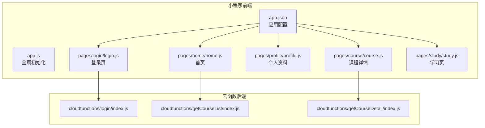
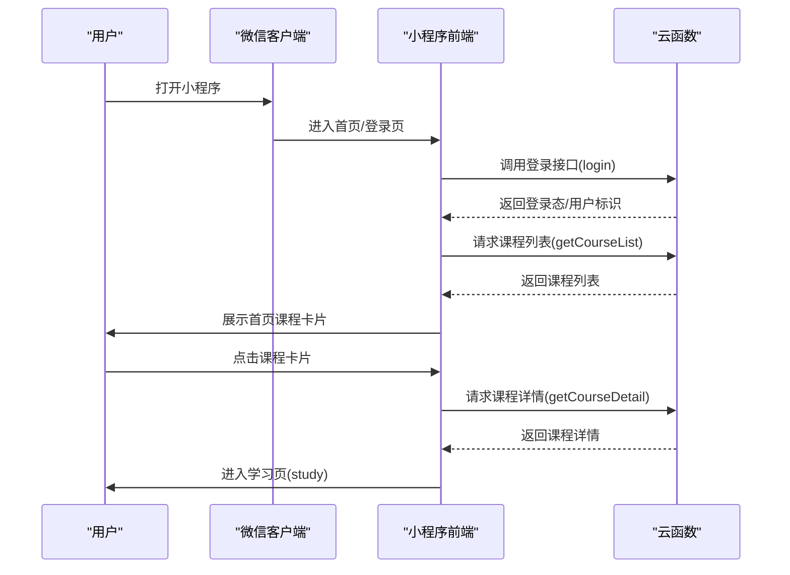
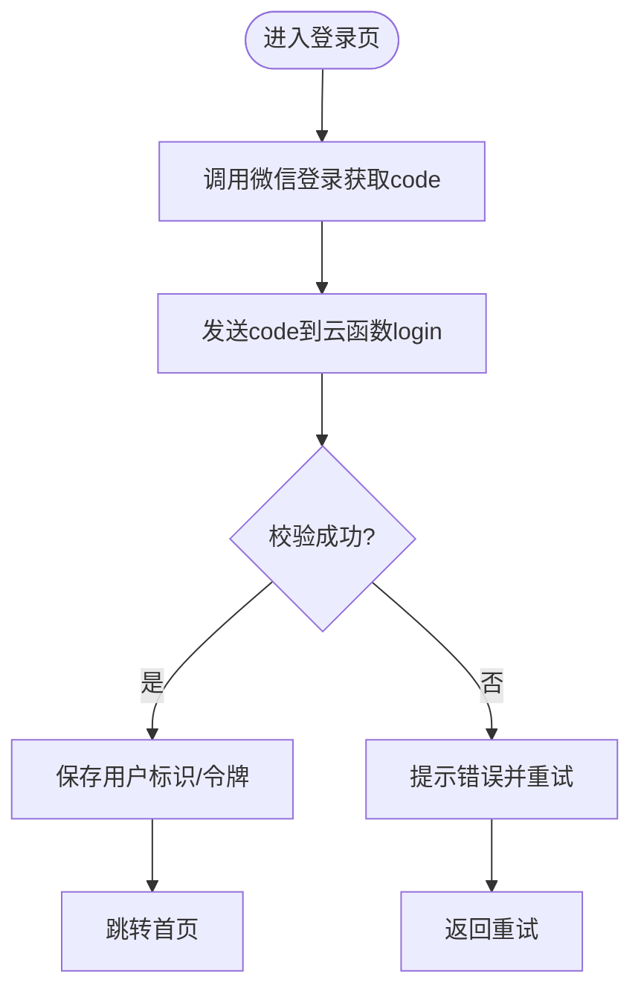
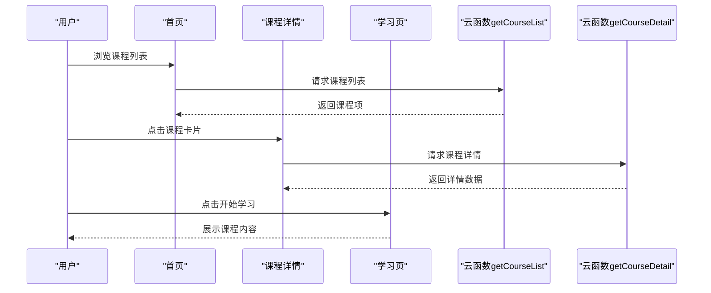
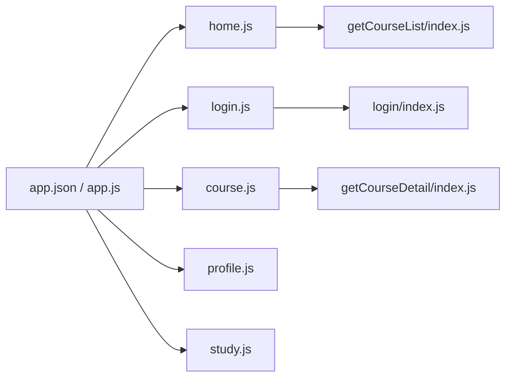

# 快速开始

<cite>
**本文引用的文件**   
- [app.json](file://miniprogram/app.json)
- [app.js](file://miniprogram/app.js)
- [home.js](file://miniprogram/pages/home/home.js)
- [login.js](file://miniprogram/pages/login/login.js)
- [profile.js](file://miniprogram/pages/profile/profile.js)
- [course.js](file://miniprogram/pages/course/course.js)
- [study.js](file://miniprogram/pages/study/study.js)
- [getCourseList/index.js](file://cloudfunctions/getCourseList/index.js)
- [getCourseDetail/index.js](file://cloudfunctions/getCourseDetail/index.js)
- [login/index.js](file://cloudfunctions/login/index.js)
</cite>

## 目录
1. [简介](#简介)
2. [项目结构](#项目结构)
3. [核心组件](#核心组件)
4. [架构总览](#架构总览)
5. [详细组件分析](#详细组件分析)
6. [依赖分析](#依赖分析)
7. [性能考虑](#性能考虑)
8. [故障排查指南](#故障排查指南)
9. [结论](#结论)
10. [附录](#附录) 

## 简介
本指南面向零基础用户，帮助你在5分钟内完成小程序安装、微信授权登录、个人信息完善、首页功能概览，并引导你完成第一个课程的学习。文档同时提供常见问题解决方案，确保你能顺畅上手。

## 项目结构
本项目为微信小程序 + 云开发（Cloud Functions）的轻量学习应用。前端页面位于 miniprogram 目录，后端逻辑以云函数形式部署在 cloudfunctions 目录。关键入口与页面如下：
- 应用配置与全局初始化：app.json、app.js
- 主要页面：首页 home、登录 login、个人资料 profile、课程 course、学习 study
- 云函数：登录 login、获取课程列表 getCourseList、获取课程详情 getCourseDetail

图表来源
- [app.json:1-200](file://miniprogram/app.json#L1-L200)
- [app.js:1-200](file://miniprogram/app.js#L1-L200)
- [home.js:1-200](file://miniprogram/pages/home/home.js#L1-L200)
- [login.js:1-200](file://miniprogram/pages/login/login.js#L1-L200)
- [profile.js:1-200](file://miniprogram/pages/profile/profile.js#L1-L200)
- [course.js:1-200](file://miniprogram/pages/course/course.js#L1-L200)
- [study.js:1-200](file://miniprogram/pages/study/study.js#L1-L200)
- [login/index.js:1-200](file://cloudfunctions/login/index.js#L1-L200)
- [getCourseList/index.js:1-200](file://cloudfunctions/getCourseList/index.js#L1-L200)
- [getCourseDetail/index.js:1-200](file://cloudfunctions/getCourseDetail/index.js#L1-L200)

章节来源
- [app.json:1-200](file://miniprogram/app.json#L1-L200)
- [app.js:1-200](file://miniprogram/app.js#L1-L200)

## 核心组件
- 应用配置与路由：通过 app.json 定义页面路由、底部导航等，决定小程序启动后的默认页面与可用页面集合。
- 全局初始化：app.js 负责初始化全局状态、权限与必要的环境准备。
- 登录流程：login.js 调用微信登录能力，结合云函数 login/index.js 完成身份校验与会话建立。
- 首页数据加载：home.js 调用云函数 getCourseList/index.js 拉取课程列表，展示推荐或热门课程。
- 课程详情与学习：course.js 使用 getCourseDetail/index.js 获取课程详情；study.js 承载具体学习内容。
- 个人资料：profile.js 用于完善头像、昵称等信息，便于个性化体验。

章节来源
- [app.json:1-200](file://miniprogram/app.json#L1-L200)
- [app.js:1-200](file://miniprogram/app.js#L1-L200)
- [login.js:1-200](file://miniprogram/pages/login/login.js#L1-L200)
- [login/index.js:1-200](file://cloudfunctions/login/index.js#L1-L200)
- [home.js:1-200](file://miniprogram/pages/home/home.js#L1-L200)
- [getCourseList/index.js:1-200](file://cloudfunctions/getCourseList/index.js#L1-L200)
- [course.js:1-200](file://miniprogram/pages/course/course.js#L1-L200)
- [getCourseDetail/index.js:1-200](file://cloudfunctions/getCourseDetail/index.js#L1-L200)
- [study.js:1-200](file://miniprogram/pages/study/study.js#L1-L200)
- [profile.js:1-200](file://miniprogram/pages/profile/profile.js#L1-L200)

## 架构总览
下图展示了“注册/登录 → 首页 → 课程详情 → 学习”的主路径，以及前后端交互关系。

图表来源
- [login.js:1-200](file://miniprogram/pages/login/login.js#L1-L200)
- [login/index.js:1-200](file://cloudfunctions/login/index.js#L1-L200)
- [home.js:1-200](file://miniprogram/pages/home/home.js#L1-L200)
- [getCourseList/index.js:1-200](file://cloudfunctions/getCourseList/index.js#L1-L200)
- [course.js:1-200](file://miniprogram/pages/course/course.js#L1-L200)
- [getCourseDetail/index.js:1-200](file://cloudfunctions/getCourseDetail/index.js#L1-L200)
- [study.js:1-200](file://miniprogram/pages/study/study.js#L1-L200)

## 详细组件分析

### 安装与首次运行
- 使用微信开发者工具导入项目根目录。
- 确认已启用云开发环境，并在项目设置中绑定对应环境。
- 编译并预览，默认将进入首页或登录页（由 app.json 的路由配置决定）。

章节来源
- [app.json:1-200](file://miniprogram/app.json#L1-L200)

### 微信授权登录流程
- 用户在登录页触发登录，小程序调用微信登录能力获取临时凭证。
- 前端将凭证发送至云函数 login/index.js 进行校验与会话创建。
- 成功后返回用户标识与必要的令牌，前端保存至本地存储以便后续请求携带。

图表来源
- [login.js:1-200](file://miniprogram/pages/login/login.js#L1-L200)
- [login/index.js:1-200](file://cloudfunctions/login/index.js#L1-L200)

章节来源
- [login.js:1-200](file://miniprogram/pages/login/login.js#L1-L200)
- [login/index.js:1-200](file://cloudfunctions/login/index.js#L1-L200)

### 个人信息完善
- 登录后进入个人中心或从首页入口进入个人资料页。
- 支持修改头像、昵称等基础信息，提交后同步至云端。
- 若未登录，系统会引导先完成登录。

章节来源
- [profile.js:1-200](file://miniprogram/pages/profile/profile.js#L1-L200)

### 首页功能介绍
- 首页展示课程列表，包含推荐、热门或分类入口。
- 数据来源为云函数 getCourseList/index.js，按分页或筛选条件返回。
- 点击课程卡片可进入课程详情页。

章节来源
- [home.js:1-200](file://miniprogram/pages/home/home.js#L1-L200)
- [getCourseList/index.js:1-200](file://cloudfunctions/getCourseList/index.js#L1-L200)

### 第一个课程学习引导
- 在首页选择任意课程卡片，进入课程详情页。
- 课程详情由云函数 getCourseDetail/index.js 提供，包含标题、简介、章节列表等。
- 点击“开始学习”进入学习页 study.js，跟随内容逐步学习。

图表来源
- [home.js:1-200](file://miniprogram/pages/home/home.js#L1-L200)
- [getCourseList/index.js:1-200](file://cloudfunctions/getCourseList/index.js#L1-L200)
- [course.js:1-200](file://miniprogram/pages/course/course.js#L1-L200)
- [getCourseDetail/index.js:1-200](file://cloudfunctions/getCourseDetail/index.js#L1-L200)
- [study.js:1-200](file://miniprogram/pages/study/study.js#L1-L200)

章节来源
- [course.js:1-200](file://miniprogram/pages/course/course.js#L1-L200)
- [study.js:1-200](file://miniprogram/pages/study/study.js#L1-L200)

## 依赖分析
- 前端依赖：
  - 页面层：home.js、login.js、profile.js、course.js、study.js
  - 应用层：app.json、app.js
- 后端依赖：
  - 云函数：login/index.js、getCourseList/index.js、getCourseDetail/index.js
- 耦合关系：
  - 登录流程强依赖 login 云函数，用于建立会话。
  - 首页与课程详情分别依赖对应的云函数，形成清晰的前后端边界。

图表来源
- [home.js:1-200](file://miniprogram/pages/home/home.js#L1-L200)
- [course.js:1-200](file://miniprogram/pages/course/course.js#L1-L200)
- [login.js:1-200](file://miniprogram/pages/login/login.js#L1-L200)
- [profile.js:1-200](file://miniprogram/pages/profile/profile.js#L1-L200)
- [study.js:1-200](file://miniprogram/pages/study/study.js#L1-L200)
- [getCourseList/index.js:1-200](file://cloudfunctions/getCourseList/index.js#L1-L200)
- [getCourseDetail/index.js:1-200](file://cloudfunctions/getCourseDetail/index.js#L1-L200)
- [login/index.js:1-200](file://cloudfunctions/login/index.js#L1-L200)
- [app.json:1-200](file://miniprogram/app.json#L1-L200)
- [app.js:1-200](file://miniprogram/app.js#L1-L200)

章节来源
- [app.json:1-200](file://miniprogram/app.json#L1-L200)
- [app.js:1-200](file://miniprogram/app.js#L1-L200)
- [home.js:1-200](file://miniprogram/pages/home/home.js#L1-L200)
- [login.js:1-200](file://miniprogram/pages/login/login.js#L1-L200)
- [profile.js:1-200](file://miniprogram/pages/profile/profile.js#L1-L200)
- [course.js:1-200](file://miniprogram/pages/course/course.js#L1-L200)
- [study.js:1-200](file://miniprogram/pages/study/study.js#L1-L200)
- [getCourseList/index.js:1-200](file://cloudfunctions/getCourseList/index.js#L1-L200)
- [getCourseDetail/index.js:1-200](file://cloudfunctions/getCourseDetail/index.js#L1-L200)
- [login/index.js:1-200](file://cloudfunctions/login/index.js#L1-L200)

## 性能考虑
- 列表分页与懒加载：首页课程列表建议采用分页加载，减少首屏数据量。
- 缓存策略：对不频繁变化的课程列表进行短期缓存，降低重复请求。
- 图片优化：课程封面图建议使用压缩与CDN加速，提升加载速度。
- 云函数冷启动：合理拆分云函数职责，避免单函数过重导致冷启动延迟。

[本节为通用指导，无需代码来源]

## 故障排查指南
- 无法登录
  - 检查是否已在开发者工具中开启云开发环境并正确绑定。
  - 确认网络连通性与微信授权弹窗是否正常弹出。
  - 查看登录页与云函数日志，定位 code 传递与校验失败原因。
- 首页无课程数据
  - 检查 getCourseList 云函数是否部署成功且返回数据结构符合预期。
  - 确认首页是否正确处理空列表与异常分支。
- 课程详情空白
  - 核对课程ID是否正确传入 getCourseDetail。
  - 检查云函数返回字段是否与课程详情页渲染字段一致。
- 个人信息无法保存
  - 确认个人资料页的数据提交逻辑与后端接口契约一致。
  - 检查权限与存储写入是否被拦截。

章节来源
- [login.js:1-200](file://miniprogram/pages/login/login.js#L1-L200)
- [login/index.js:1-200](file://cloudfunctions/login/index.js#L1-L200)
- [home.js:1-200](file://miniprogram/pages/home/home.js#L1-L200)
- [getCourseList/index.js:1-200](file://cloudfunctions/getCourseList/index.js#L1-L200)
- [course.js:1-200](file://miniprogram/pages/course/course.js#L1-L200)
- [getCourseDetail/index.js:1-200](file://cloudfunctions/getCourseDetail/index.js#L1-L200)
- [profile.js:1-200](file://miniprogram/pages/profile/profile.js#L1-L200)

## 结论
通过以上步骤，你可以在5分钟内完成小程序安装、登录、完善个人信息，并顺利进入首页开始第一个课程的学习。建议在后续使用中关注列表分页、缓存与图片优化，以获得更流畅的体验。

## 附录
- 截图说明
  - 安装与导入：在微信开发者工具中选择“导入项目”，指向项目根目录。
  - 登录页：显示微信一键登录按钮，点击后完成授权。
  - 首页：展示课程卡片列表，点击任一卡片进入详情。
  - 课程详情：显示课程标题、简介与“开始学习”按钮。
  - 学习页：呈现课程内容与进度指示。
- 常见问题
  - 云函数未部署：请在控制台完成部署并重新编译。
  - 权限不足：检查云开发数据库与存储权限配置。
  - 网络异常：切换网络或重启开发者工具后重试。

[本节为概念性补充，无需代码来源]