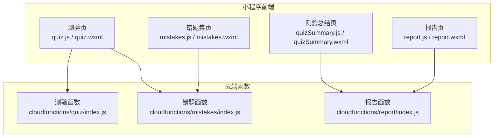
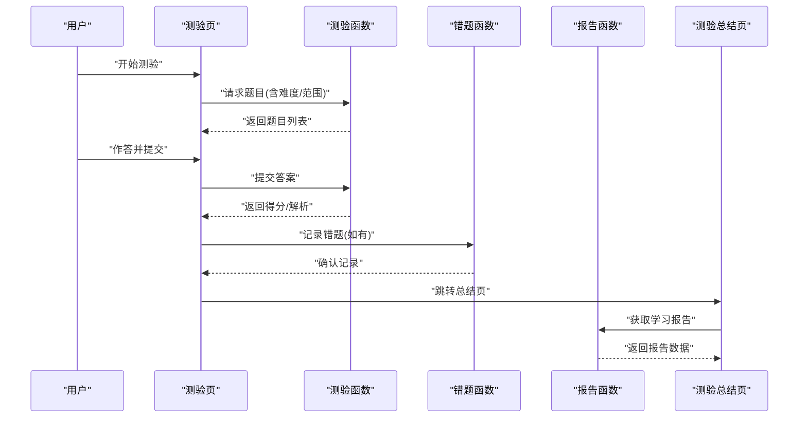
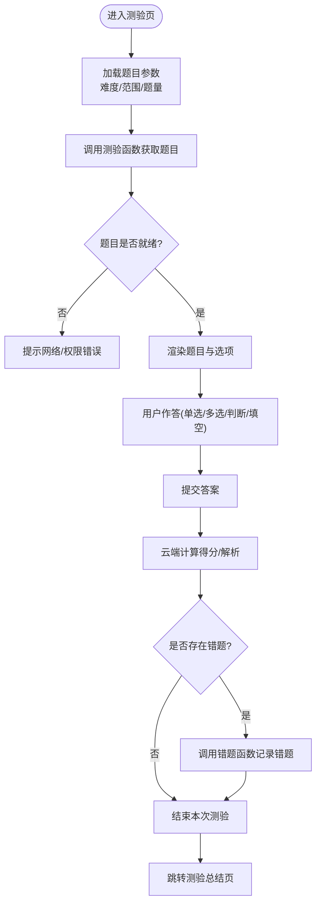
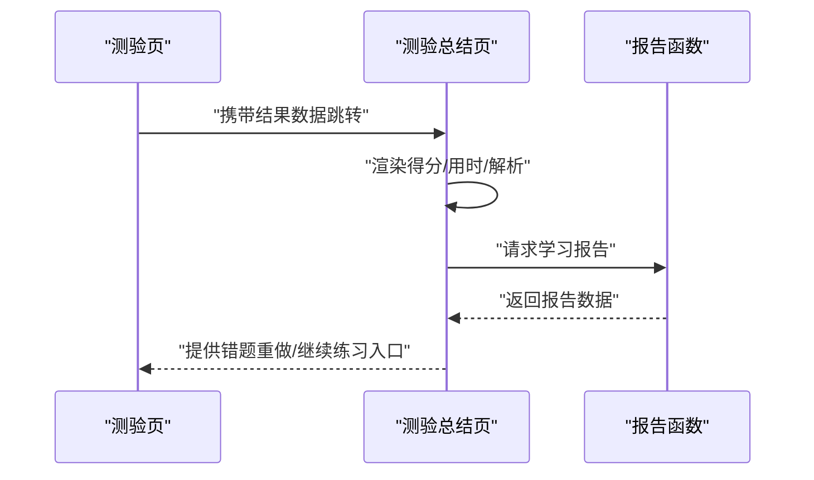
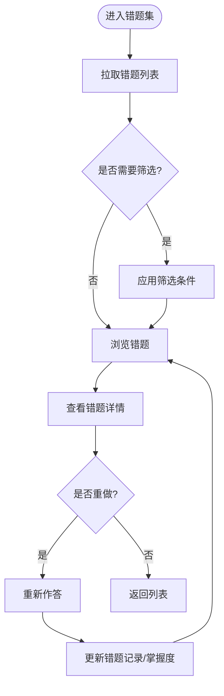
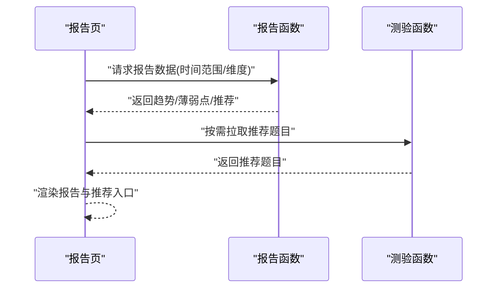
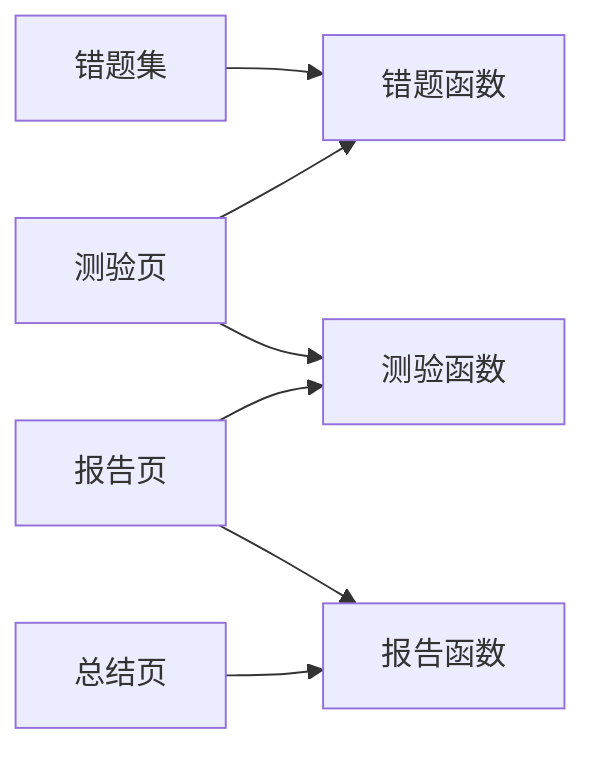

# 测验练习

<cite>
**本文引用的文件**   
- [miniprogram/pages/quiz/quiz.js](file://miniprogram/pages/quiz/quiz.js)
- [miniprogram/pages/quiz/quiz.wxml](file://miniprogram/pages/quiz/quiz.wxml)
- [miniprogram/pages/quizSummary/quizSummary.js](file://miniprogram/pages/quizSummary/quizSummary.js)
- [miniprogram/pages/quizSummary/quizSummary.wxml](file://miniprogram/pages/quizSummary/quizSummary.wxml)
- [cloudfunctions/quiz/index.js](file://cloudfunctions/quiz/index.js)
- [cloudfunctions/mistakes/index.js](file://cloudfunctions/mistakes/index.js)
- [cloudfunctions/report/index.js](file://cloudfunctions/report/index.js)
- [miniprogram/pages/mistakes/mistakes.js](file://miniprogram/pages/mistakes/mistakes.js)
- [miniprogram/pages/mistakes/mistakes.wxml](file://miniprogram/pages/mistakes/mistakes.wxml)
- [miniprogram/pages/report/report.js](file://miniprogram/pages/report/report.js)
- [miniprogram/pages/report/report.wxml](file://miniprogram/pages/report/report.wxml)
</cite>

## 目录
1. [简介](#简介)
2. [项目结构](#项目结构)
3. [核心组件](#核心组件)
4. [架构总览](#架构总览)
5. [详细组件分析](#详细组件分析)
6. [依赖关系分析](#依赖关系分析)
7. [性能与体验优化建议](#性能与体验优化建议)
8. [故障排查指南](#故障排查指南)
9. [结论](#结论)
10. [附录：使用指南与技巧](#附录使用指南与技巧)

## 简介
本文件面向学习者与教师，系统化说明在线测验与练习功能的使用方法，包括题目类型、答题流程、成绩分析与错题回顾、难度设置与个性化推荐、薄弱点识别机制，以及复习策略与应试技巧。文档同时给出前后端交互的架构说明与关键流程图，帮助读者快速上手并高效提升学习成绩。

## 项目结构
围绕“测验练习”能力，前端小程序页面与云端函数协同工作：
- 前端页面
  - 测验页：负责题目渲染、选项交互、计时与提交
  - 测验总结页：展示得分、正确率、用时等结果
  - 错题集页：浏览历史错题、按知识点筛选与重做
  - 报告页：可视化学习报告（趋势、薄弱点）
- 云端函数
  - 测验服务：拉取题目、提交答案、计算分数
  - 错题服务：记录错题、生成错题列表
  - 报告服务：聚合数据生成学习报告

图表来源
- [miniprogram/pages/quiz/quiz.js](file://miniprogram/pages/quiz/quiz.js)
- [miniprogram/pages/quiz/quiz.wxml](file://miniprogram/pages/quiz/quiz.wxml)
- [miniprogram/pages/quizSummary/quizSummary.js](file://miniprogram/pages/quizSummary/quizSummary.js)
- [miniprogram/pages/quizSummary/quizSummary.wxml](file://miniprogram/pages/quizSummary/quizSummary.wxml)
- [miniprogram/pages/mistakes/mistakes.js](file://miniprogram/pages/mistakes/mistakes.js)
- [miniprogram/pages/mistakes/mistakes.wxml](file://miniprogram/pages/mistakes/mistakes.wxml)
- [miniprogram/pages/report/report.js](file://miniprogram/pages/report/report.js)
- [miniprogram/pages/report/report.wxml](file://miniprogram/pages/report/report.wxml)
- [cloudfunctions/quiz/index.js](file://cloudfunctions/quiz/index.js)
- [cloudfunctions/mistakes/index.js](file://cloudfunctions/mistakes/index.js)
- [cloudfunctions/report/index.js](file://cloudfunctions/report/index.js)

章节来源
- [miniprogram/pages/quiz/quiz.js](file://miniprogram/pages/quiz/quiz.js)
- [miniprogram/pages/quiz/quiz.wxml](file://miniprogram/pages/quiz/quiz.wxml)
- [miniprogram/pages/quizSummary/quizSummary.js](file://miniprogram/pages/quizSummary/quizSummary.js)
- [miniprogram/pages/quizSummary/quizSummary.wxml](file://miniprogram/pages/quizSummary/quizSummary.wxml)
- [miniprogram/pages/mistakes/mistakes.js](file://miniprogram/pages/mistakes/mistakes.js)
- [miniprogram/pages/mistakes/mistakes.wxml](file://miniprogram/pages/mistakes/mistakes.wxml)
- [miniprogram/pages/report/report.js](file://miniprogram/pages/report/report.js)
- [miniprogram/pages/report/report.wxml](file://miniprogram/pages/report/report.wxml)
- [cloudfunctions/quiz/index.js](file://cloudfunctions/quiz/index.js)
- [cloudfunctions/mistakes/index.js](file://cloudfunctions/mistakes/index.js)
- [cloudfunctions/report/index.js](file://cloudfunctions/report/index.js)

## 核心组件
- 测验页
  - 职责：加载题目、渲染题型、处理单选/多选/判断/填空等交互、计时与提交、跳转总结页
  - 关键点：题目数据结构、选项状态管理、提交校验、错误提示
- 测验总结页
  - 职责：汇总得分、正确率、用时、各题解析入口
  - 关键点：结果统计、错题标记、返回或继续练习
- 错题集页
  - 职责：展示历史错题、按知识点/日期筛选、一键重做
  - 关键点：错题去重、排序、重做触发
- 报告页
  - 职责：展示学习趋势、薄弱知识点、掌握度曲线
  - 关键点：数据聚合、图表渲染、导出分享

章节来源
- [miniprogram/pages/quiz/quiz.js](file://miniprogram/pages/quiz/quiz.js)
- [miniprogram/pages/quiz/quiz.wxml](file://miniprogram/pages/quiz/quiz.wxml)
- [miniprogram/pages/quizSummary/quizSummary.js](file://miniprogram/pages/quizSummary/quizSummary.js)
- [miniprogram/pages/quizSummary/quizSummary.wxml](file://miniprogram/pages/quizSummary/quizSummary.wxml)
- [miniprogram/pages/mistakes/mistakes.js](file://miniprogram/pages/mistakes/mistakes.js)
- [miniprogram/pages/mistakes/mistakes.wxml](file://miniprogram/pages/mistakes/mistakes.wxml)
- [miniprogram/pages/report/report.js](file://miniprogram/pages/report/report.js)
- [miniprogram/pages/report/report.wxml](file://miniprogram/pages/report/report.wxml)

## 架构总览
测验练习采用“小程序前端 + 云端函数”的轻量架构。前端负责交互与展示，云端函数负责题目分发、作答记录、错题管理与报告生成。

图表来源
- [miniprogram/pages/quiz/quiz.js](file://miniprogram/pages/quiz/quiz.js)
- [miniprogram/pages/quiz/quiz.wxml](file://miniprogram/pages/quiz/quiz.wxml)
- [miniprogram/pages/quizSummary/quizSummary.js](file://miniprogram/pages/quizSummary/quizSummary.js)
- [miniprogram/pages/quizSummary/quizSummary.wxml](file://miniprogram/pages/quizSummary/quizSummary.wxml)
- [cloudfunctions/quiz/index.js](file://cloudfunctions/quiz/index.js)
- [cloudfunctions/mistakes/index.js](file://cloudfunctions/mistakes/index.js)
- [cloudfunctions/report/index.js](file://cloudfunctions/report/index.js)

## 详细组件分析

### 测验页（quiz）
- 功能要点
  - 题目加载：根据难度、知识点范围、题量等参数调用云端函数获取题目
  - 题型支持：单选题、多选题、判断题、填空题（由后端题目字段控制）
  - 交互逻辑：选项选择、多选勾选、判断正误、填空输入、倒计时与自动提交
  - 提交与反馈：提交后计算得分、解析展示、错题入库
- 关键流程
  - 初始化 → 拉取题目 → 渲染界面 → 用户作答 → 提交 → 计算得分 → 记录错题 → 跳转总结

图表来源
- [miniprogram/pages/quiz/quiz.js](file://miniprogram/pages/quiz/quiz.js)
- [miniprogram/pages/quiz/quiz.wxml](file://miniprogram/pages/quiz/quiz.wxml)
- [cloudfunctions/quiz/index.js](file://cloudfunctions/quiz/index.js)
- [cloudfunctions/mistakes/index.js](file://cloudfunctions/mistakes/index.js)

章节来源
- [miniprogram/pages/quiz/quiz.js](file://miniprogram/pages/quiz/quiz.js)
- [miniprogram/pages/quiz/quiz.wxml](file://miniprogram/pages/quiz/quiz.wxml)
- [cloudfunctions/quiz/index.js](file://cloudfunctions/quiz/index.js)
- [cloudfunctions/mistakes/index.js](file://cloudfunctions/mistakes/index.js)

### 测验总结页（quizSummary）
- 功能要点
  - 结果展示：总分、正确率、用时、每题对错状态
  - 错题入口：点击错题跳转到错题详情或重做
  - 报告入口：查看学习报告与薄弱点
- 关键流程
  - 接收测验结果 → 渲染总结 → 错题/报告导航

图表来源
- [miniprogram/pages/quizSummary/quizSummary.js](file://miniprogram/pages/quizSummary/quizSummary.js)
- [miniprogram/pages/quizSummary/quizSummary.wxml](file://miniprogram/pages/quizSummary/quizSummary.wxml)
- [cloudfunctions/report/index.js](file://cloudfunctions/report/index.js)

章节来源
- [miniprogram/pages/quizSummary/quizSummary.js](file://miniprogram/pages/quizSummary/quizSummary.js)
- [miniprogram/pages/quizSummary/quizSummary.wxml](file://miniprogram/pages/quizSummary/quizSummary.wxml)
- [cloudfunctions/report/index.js](file://cloudfunctions/report/index.js)

### 错题集（mistakes）
- 功能要点
  - 错题列表：按时间/知识点/难度排序
  - 错题详情：显示原题、正确答案、解析
  - 重做机制：一键重做错题，再次作答更新掌握度
- 关键流程
  - 拉取错题 → 筛选/搜索 → 查看详情 → 重做 → 更新记录

图表来源
- [miniprogram/pages/mistakes/mistakes.js](file://miniprogram/pages/mistakes/mistakes.js)
- [miniprogram/pages/mistakes/mistakes.wxml](file://miniprogram/pages/mistakes/mistakes.wxml)
- [cloudfunctions/mistakes/index.js](file://cloudfunctions/mistakes/index.js)

章节来源
- [miniprogram/pages/mistakes/mistakes.js](file://miniprogram/pages/mistakes/mistakes.js)
- [miniprogram/pages/mistakes/mistakes.wxml](file://miniprogram/pages/mistakes/mistakes.wxml)
- [cloudfunctions/mistakes/index.js](file://cloudfunctions/mistakes/index.js)

### 学习报告（report）
- 功能要点
  - 趋势分析：近N次测验得分/正确率变化
  - 薄弱点识别：按知识点维度统计错误率与掌握度
  - 个性化推荐：基于薄弱点推送针对性练习
- 关键流程
  - 拉取历史作答 → 聚合统计 → 渲染图表 → 生成推荐

图表来源
- [miniprogram/pages/report/report.js](file://miniprogram/pages/report/report.js)
- [miniprogram/pages/report/report.wxml](file://miniprogram/pages/report/report.wxml)
- [cloudfunctions/report/index.js](file://cloudfunctions/report/index.js)
- [cloudfunctions/quiz/index.js](file://cloudfunctions/quiz/index.js)

章节来源
- [miniprogram/pages/report/report.js](file://miniprogram/pages/report/report.js)
- [miniprogram/pages/report/report.wxml](file://miniprogram/pages/report/report.wxml)
- [cloudfunctions/report/index.js](file://cloudfunctions/report/index.js)
- [cloudfunctions/quiz/index.js](file://cloudfunctions/quiz/index.js)

## 依赖关系分析
- 前端到云端的依赖
  - 测验页依赖测验函数与错题函数
  - 总结页依赖报告函数
  - 错题集依赖错题函数
  - 报告页依赖报告函数与测验函数（用于推荐题目）
- 耦合与内聚
  - 页面职责清晰，通过云端函数解耦业务逻辑
  - 错题与报告共享历史作答数据，便于联动分析

图表来源
- [miniprogram/pages/quiz/quiz.js](file://miniprogram/pages/quiz/quiz.js)
- [miniprogram/pages/quizSummary/quizSummary.js](file://miniprogram/pages/quizSummary/quizSummary.js)
- [miniprogram/pages/mistakes/mistakes.js](file://miniprogram/pages/mistakes/mistakes.js)
- [miniprogram/pages/report/report.js](file://miniprogram/pages/report/report.js)
- [cloudfunctions/quiz/index.js](file://cloudfunctions/quiz/index.js)
- [cloudfunctions/mistakes/index.js](file://cloudfunctions/mistakes/index.js)
- [cloudfunctions/report/index.js](file://cloudfunctions/report/index.js)

章节来源
- [miniprogram/pages/quiz/quiz.js](file://miniprogram/pages/quiz/quiz.js)
- [miniprogram/pages/quizSummary/quizSummary.js](file://miniprogram/pages/quizSummary/quizSummary.js)
- [miniprogram/pages/mistakes/mistakes.js](file://miniprogram/pages/mistakes/mistakes.js)
- [miniprogram/pages/report/report.js](file://miniprogram/pages/report/report.js)
- [cloudfunctions/quiz/index.js](file://cloudfunctions/quiz/index.js)
- [cloudfunctions/mistakes/index.js](file://cloudfunctions/mistakes/index.js)
- [cloudfunctions/report/index.js](file://cloudfunctions/report/index.js)

## 性能与体验优化建议
- 题目分页与懒加载：在题量大时采用分页加载，减少首屏压力
- 缓存策略：对静态题目与解析进行本地缓存，降低重复请求
- 异步提交：提交答案采用批量合并与重试机制，避免频繁网络抖动影响体验
- 弱网降级：在网络不可用时提示离线模式，允许先作答后同步
- 渲染优化：长列表虚拟滚动、图片压缩与延迟加载

[本节为通用指导，不直接分析具体文件]

## 故障排查指南
- 无法加载题目
  - 检查网络权限与云端函数部署状态
  - 核对请求参数（难度、范围、题量）是否符合后端约束
- 提交失败或无得分
  - 确认答案格式（单选/多选/判断/填空）与后端一致
  - 查看云端函数日志，定位计算或存储异常
- 错题未记录
  - 检查错题函数调用是否成功
  - 确认用户标识与会话信息是否正确传递
- 报告数据缺失
  - 确认历史作答数据是否完整
  - 检查报告函数的聚合逻辑与时间范围参数

章节来源
- [cloudfunctions/quiz/index.js](file://cloudfunctions/quiz/index.js)
- [cloudfunctions/mistakes/index.js](file://cloudfunctions/mistakes/index.js)
- [cloudfunctions/report/index.js](file://cloudfunctions/report/index.js)

## 结论
本系统以小程序前端与云端函数为核心，构建了完整的“测验—总结—错题—报告”闭环。通过科学的题目组织、清晰的交互流程与数据驱动的学习报告，帮助用户精准定位薄弱点、制定个性化复习计划，从而有效提升学习成绩。

[本节为总结性内容，不直接分析具体文件]

## 附录：使用指南与技巧

### 题目类型介绍
- 单选题：从多个选项中选择一个正确答案
- 多选题：从多个选项中选择一个或多个正确答案
- 判断题：判断陈述的正确与否
- 填空题：根据题意填写关键词或数值

章节来源
- [miniprogram/pages/quiz/quiz.js](file://miniprogram/pages/quiz/quiz.js)
- [miniprogram/pages/quiz/quiz.wxml](file://miniprogram/pages/quiz/quiz.wxml)

### 答题技巧
- 审题先行：圈出关键词，明确题干要求
- 排除法：先排除明显错误的选项，提高命中率
- 时间分配：合理分配每道题用时，避免在某题上耗时过长
- 复查策略：优先检查不确定题，确保基础题正确率

[本节为通用指导，不直接分析具体文件]

### 成绩分析
- 关注指标：总分、正确率、用时、各知识点正确率
- 趋势观察：对比多次测验的变化，识别进步与退步
- 归因分析：将错误归类到具体知识点，定位薄弱环节

章节来源
- [miniprogram/pages/quizSummary/quizSummary.js](file://miniprogram/pages/quizSummary/quizSummary.js)
- [miniprogram/pages/quizSummary/quizSummary.wxml](file://miniprogram/pages/quizSummary/quizSummary.wxml)
- [cloudfunctions/report/index.js](file://cloudfunctions/report/index.js)

### 错题回顾
- 定期复盘：每周集中回顾错题，巩固易错点
- 重做训练：对错题进行二次作答，直至完全掌握
- 关联学习：结合知识点讲解与视频资源加深理解

章节来源
- [miniprogram/pages/mistakes/mistakes.js](file://miniprogram/pages/mistakes/mistakes.js)
- [miniprogram/pages/mistakes/mistakes.wxml](file://miniprogram/pages/mistakes/mistakes.wxml)
- [cloudfunctions/mistakes/index.js](file://cloudfunctions/mistakes/index.js)

### 测验难度设置
- 自适应难度：根据历史表现动态调整题目难度
- 手动选择：用户可指定难度等级与知识点范围
- 渐进式提升：从基础到进阶，逐步增加挑战

章节来源
- [cloudfunctions/quiz/index.js](file://cloudfunctions/quiz/index.js)

### 个性化题目推荐
- 基于薄弱点：针对错误率高的知识点推送相关题目
- 间隔重复：利用记忆曲线安排复习节奏
- 混合训练：跨知识点组合练习，提升迁移能力

章节来源
- [cloudfunctions/report/index.js](file://cloudfunctions/report/index.js)
- [cloudfunctions/quiz/index.js](file://cloudfunctions/quiz/index.js)

### 学习薄弱点识别机制
- 数据采集：记录每次作答的题目、选项、用时与结果
- 知识图谱：将题目映射到知识点，构建掌握度模型
- 算法评估：按知识点维度计算错误率与掌握度，输出薄弱清单

章节来源
- [cloudfunctions/report/index.js](file://cloudfunctions/report/index.js)
- [cloudfunctions/mistakes/index.js](file://cloudfunctions/mistakes/index.js)

### 复习策略与应试技巧
- 艾宾浩斯复习：按遗忘曲线安排复习周期
- 主动回忆：合上资料尝试复述与推导
- 模拟实战：限时完成整套试卷，提升抗压能力
- 心态管理：保持良好作息与积极心态，稳定发挥

[本节为通用指导，不直接分析具体文件]