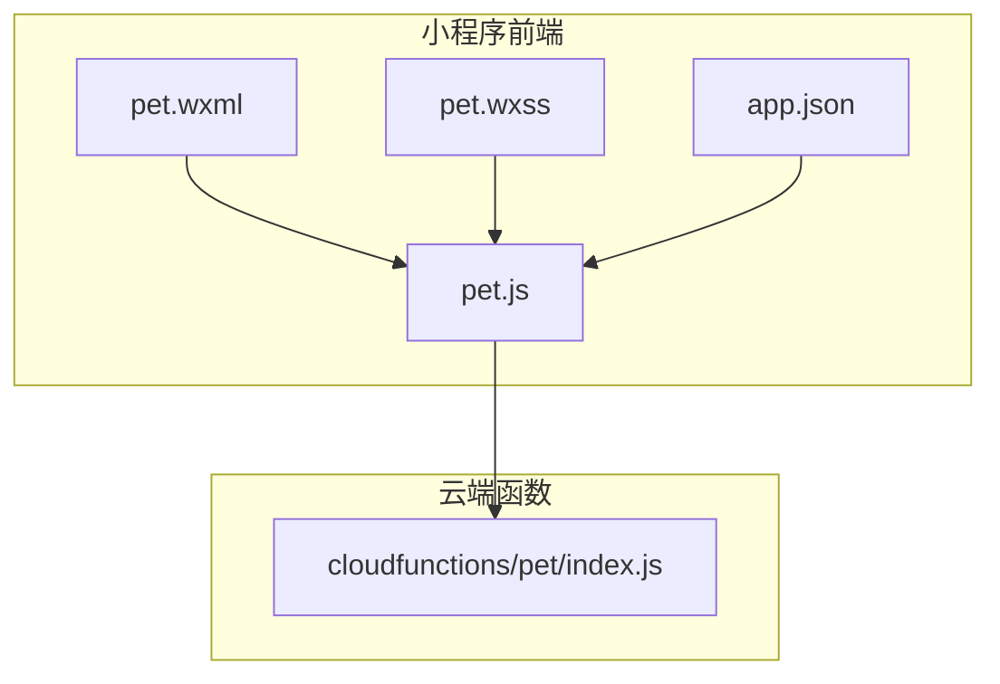
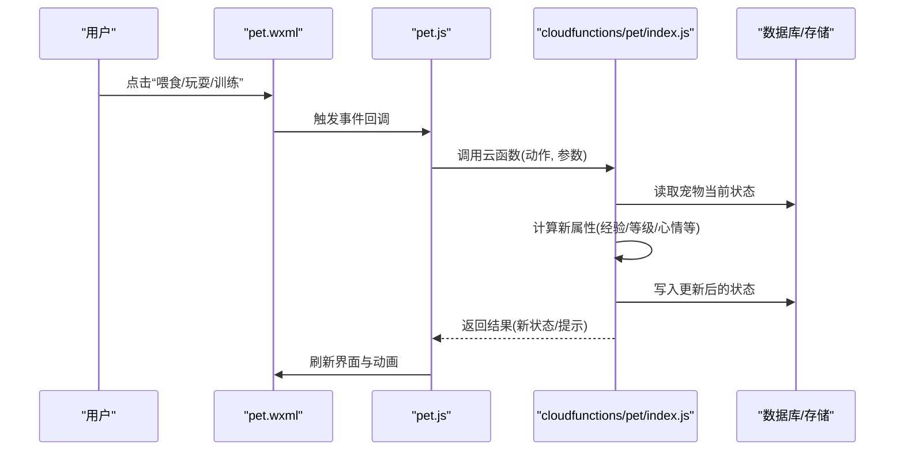
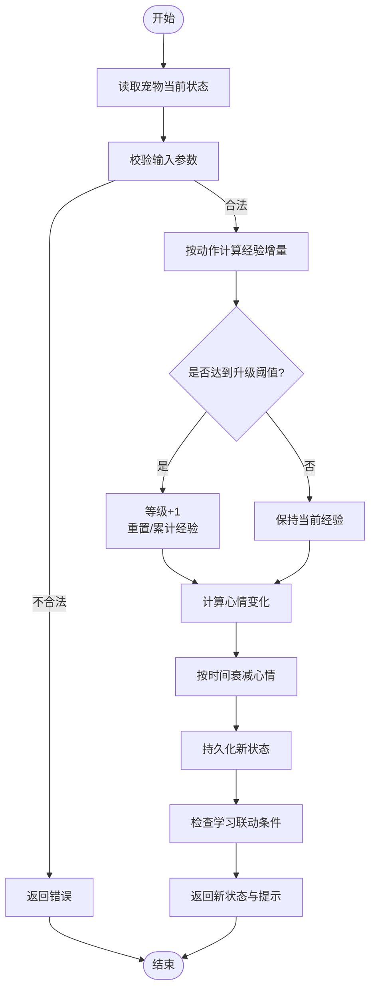
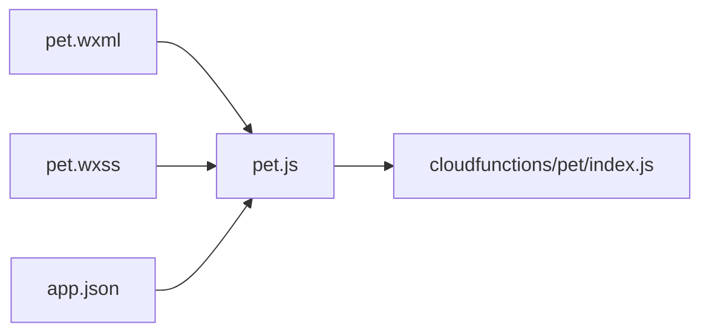

# 宠物养成系统

<cite>
**本文引用的文件**   
- [cloudfunctions/pet/index.js](file://cloudfunctions/pet/index.js)
- [miniprogram/pages/pet/pet.js](file://miniprogram/pages/pet/pet.js)
- [miniprogram/pages/pet/pet.wxml](file://miniprogram/pages/pet/pet.wxml)
- [miniprogram/pages/pet/pet.wxss](file://miniprogram/pages/pet/pet.wxss)
- [miniprogram/app.json](file://miniprogram/app.json)
</cite>

## 目录
1. [简介](#简介)
2. [项目结构](#项目结构)
3. [核心组件](#核心组件)
4. [架构总览](#架构总览)
5. [详细组件分析](#详细组件分析)
6. [依赖关系分析](#依赖关系分析)
7. [性能考虑](#性能考虑)
8. [故障排查指南](#故障排查指南)
9. [结论](#结论)
10. [附录](#附录)

## 简介
本文件面向“宠物养成系统”的玩法机制与技术实现，覆盖以下方面：
- 宠物属性设计（经验值、等级、心情值等）与状态管理
- 成长算法与互动玩法（喂食、玩耍、训练等）
- 宠物系统与学习行为的关联机制（以学习激励培养进度）
- 数据模型、云函数逻辑与小程序交互实现
- 培养策略、最佳实践与常见问题解决方案

## 项目结构
围绕宠物系统的代码主要分布在两个位置：
- 小程序前端页面：用于展示宠物状态、触发互动操作、渲染动画与反馈
- 云端函数：承载核心业务逻辑（属性计算、成长算法、持久化、与学习行为联动）

图表来源
- [miniprogram/pages/pet/pet.js](file://miniprogram/pages/pet/pet.js)
- [miniprogram/pages/pet/pet.wxml](file://miniprogram/pages/pet/pet.wxml)
- [miniprogram/pages/pet/pet.wxss](file://miniprogram/pages/pet/pet.wxss)
- [miniprogram/app.json](file://miniprogram/app.json)
- [cloudfunctions/pet/index.js](file://cloudfunctions/pet/index.js)

章节来源
- [miniprogram/pages/pet/pet.js](file://miniprogram/pages/pet/pet.js)
- [miniprogram/pages/pet/pet.wxml](file://miniprogram/pages/pet/pet.wxml)
- [miniprogram/pages/pet/pet.wxss](file://miniprogram/pages/pet/pet.wxss)
- [miniprogram/app.json](file://miniprogram/app.json)
- [cloudfunctions/pet/index.js](file://cloudfunctions/pet/index.js)

## 核心组件
- 前端交互层（pet.js / pet.wxml / pet.wxss）
  - 负责加载宠物数据、渲染界面、处理用户点击事件（如喂食、玩耍、训练）、调用云函数并更新本地视图。
- 云端服务层（cloudfunctions/pet/index.js）
  - 负责接收请求、校验参数、执行成长算法与状态更新、读写数据库、返回结果给前端。

章节来源
- [miniprogram/pages/pet/pet.js](file://miniprogram/pages/pet/pet.js)
- [cloudfunctions/pet/index.js](file://cloudfunctions/pet/index.js)

## 架构总览
整体采用“小程序前端 + 云函数”的轻量架构。前端通过统一入口发起请求，云函数集中处理业务逻辑与数据持久化，保证一致性与可维护性。

图表来源
- [miniprogram/pages/pet/pet.js](file://miniprogram/pages/pet/pet.js)
- [miniprogram/pages/pet/pet.wxml](file://miniprogram/pages/pet/pet.wxml)
- [cloudfunctions/pet/index.js](file://cloudfunctions/pet/index.js)

## 详细组件分析

### 前端交互层（pet.js / pet.wxml / pet.wxss）
- 职责
  - 初始化：拉取宠物基础信息与最近一次互动时间
  - 渲染：根据属性显示等级、经验条、心情表情、可用动作按钮
  - 交互：监听用户点击，组装参数并调用云函数
  - 反馈：根据返回结果更新界面，播放动画或提示
- 关键流程
  - 页面加载时获取宠物数据
  - 用户点击动作后，发送请求到云函数
  - 收到响应后更新本地状态并刷新视图

章节来源
- [miniprogram/pages/pet/pet.js](file://miniprogram/pages/pet/pet.js)
- [miniprogram/pages/pet/pet.wxml](file://miniprogram/pages/pet/pet.wxml)
- [miniprogram/pages/pet/pet.wxss](file://miniprogram/pages/pet/pet.wxss)

### 云端函数（cloudfunctions/pet/index.js）
- 职责
  - 接口定义：暴露统一的动作入口（如 feed/play/train）
  - 参数校验：确保必要字段存在且合法
  - 状态计算：依据当前属性与动作类型计算增量（经验、心情、等级等）
  - 数据持久化：将最新状态落库
  - 联动学习：在满足条件时触发学习相关奖励或解锁
- 关键流程
  - 接收请求 → 校验 → 读取状态 → 计算 → 写库 → 返回

章节来源
- [cloudfunctions/pet/index.js](file://cloudfunctions/pet/index.js)

### 数据模型（建议）
以下为推荐的数据模型字段说明，便于前后端对齐与扩展：
- 宠物基础信息
  - id：唯一标识
  - name：名称
  - avatar：头像资源路径
- 属性
  - level：等级（整数）
  - exp：经验值（整数）
  - mood：心情值（浮点或整数，范围建议 0-100）
  - lastInteractAt：最后互动时间戳
- 状态与配置
  - status：状态枚举（如“活跃/休眠/生病”）
  - config：扩展配置（如成长曲线系数、心情衰减率等）

章节来源
- [cloudfunctions/pet/index.js](file://cloudfunctions/pet/index.js)
- [miniprogram/pages/pet/pet.js](file://miniprogram/pages/pet/pet.js)

### 成长算法与互动玩法
- 经验与等级
  - 每次互动获得经验；达到阈值则升级，并可能提升心情上限或解锁新能力
- 心情值
  - 随时间自然衰减；喂食/玩耍/训练可恢复或波动；过低影响学习效率
- 互动动作
  - 喂食：增加心情与少量经验
  - 玩耍：中等心情恢复与经验增长
  - 训练：较高经验增长但可能降低心情，需平衡
- 学习联动
  - 当心情高于阈值或连续互动天数达标时，给予学习加速或额外经验加成

图表来源
- [cloudfunctions/pet/index.js](file://cloudfunctions/pet/index.js)

章节来源
- [cloudfunctions/pet/index.js](file://cloudfunctions/pet/index.js)

### 与学习行为的关联机制
- 目标
  - 通过宠物状态正向反馈，激励用户完成学习任务
- 机制要点
  - 心情阈值：心情高于某阈值时，学习任务可获得额外经验或解锁隐藏内容
  - 连续互动：连续多日互动解锁学习加成
  - 成就联动：达成特定互动次数或等级后，开放新的学习模块或题库

章节来源
- [cloudfunctions/pet/index.js](file://cloudfunctions/pet/index.js)

### 小程序路由与页面注册
- app.json 中需注册宠物页面，确保可通过导航进入
- 建议在自定义 TabBar 或首页快捷入口提供直达链接

章节来源
- [miniprogram/app.json](file://miniprogram/app.json)

## 依赖关系分析
- 前端依赖
  - pet.js 依赖 pet.wxml 与 pet.wxss 进行结构与样式渲染
  - 所有页面需在 app.json 中正确注册
- 后端依赖
  - cloudfunctions/pet/index.js 作为独立云函数对外暴露接口
  - 与数据库/存储服务的读写由云函数内部封装

图表来源
- [miniprogram/pages/pet/pet.js](file://miniprogram/pages/pet/pet.js)
- [miniprogram/pages/pet/pet.wxml](file://miniprogram/pages/pet/pet.wxml)
- [miniprogram/pages/pet/pet.wxss](file://miniprogram/pages/pet/pet.wxss)
- [miniprogram/app.json](file://miniprogram/app.json)
- [cloudfunctions/pet/index.js](file://cloudfunctions/pet/index.js)

章节来源
- [miniprogram/pages/pet/pet.js](file://miniprogram/pages/pet/pet.js)
- [miniprogram/pages/pet/pet.wxml](file://miniprogram/pages/pet/pet.wxml)
- [miniprogram/pages/pet/pet.wxss](file://miniprogram/pages/pet/pet.wxss)
- [miniprogram/app.json](file://miniprogram/app.json)
- [cloudfunctions/pet/index.js](file://cloudfunctions/pet/index.js)

## 性能考虑
- 减少不必要的网络请求：合并状态更新、使用防抖/节流避免重复提交
- 本地缓存：对只读的基础配置做短期缓存，降低冷启动开销
- 批量更新：将多次小幅度互动合并为一次云函数调用（服务端侧做幂等与去重）
- 图片与资源优化：宠物头像与动画资源按需加载，避免首屏阻塞

[本节为通用指导，无需源码引用]

## 故障排查指南
- 常见问题
  - 页面无法打开：检查 app.json 是否正确注册页面路径
  - 云函数调用失败：确认云函数已部署、权限配置正确、参数格式符合约定
  - 状态不同步：检查网络异常重试与本地状态回滚逻辑
  - 心情异常：核对时间衰减公式与最后互动时间戳
- 定位步骤
  - 前端：打印请求参数与响应体，观察 UI 更新是否符合预期
  - 云端：查看云函数日志，确认计算分支与写库结果
  - 数据：对比数据库记录与前端展示，定位差异点

章节来源
- [miniprogram/pages/pet/pet.js](file://miniprogram/pages/pet/pet.js)
- [cloudfunctions/pet/index.js](file://cloudfunctions/pet/index.js)

## 结论
本系统通过“前端交互 + 云端计算”的方式实现了完整的宠物养成闭环。合理的属性设计与成长算法能够持续激励用户的学习行为，形成“互动—成长—学习—再互动”的正向循环。后续可在数值平衡、个性化内容与社交分享等方面继续演进。

[本节为总结性内容，无需源码引用]

## 附录
- 开发建议
  - 统一错误码与提示文案，提升用户体验
  - 引入单元测试与集成测试，保障云函数稳定性
  - 建立数值调优文档，记录版本间成长曲线变更
- 扩展方向
  - 宠物外观与皮肤系统
  - 多人协作/竞争排行榜
  - 与课程/知识图谱更紧密的联动

[本节为补充信息，无需源码引用]