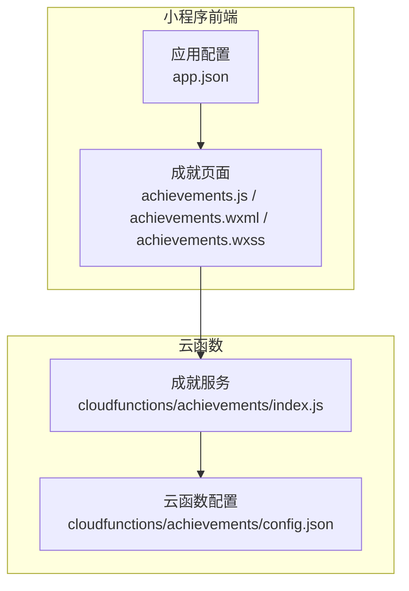
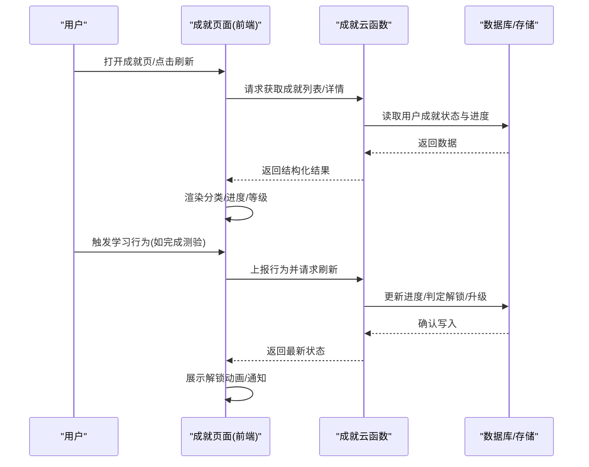
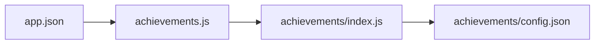

# 成就系统

<cite>
**本文引用的文件**   
- [cloudfunctions/achievements/index.js](file://cloudfunctions/achievements/index.js)
- [cloudfunctions/achievements/config.json](file://cloudfunctions/achievements/config.json)
- [miniprogram/pages/achievements/achievements.js](file://miniprogram/pages/achievements/achievements.js)
- [miniprogram/pages/achievements/achievements.wxml](file://miniprogram/pages/achievements/achievements.wxml)
- [miniprogram/pages/achievements/achievements.wxss](file://miniprogram/pages/achievements/achievements.wxss)
- [miniprogram/app.json](file://miniprogram/app.json)
</cite>

## 目录
1. [简介](#简介)
2. [项目结构](#项目结构)
3. [核心组件](#核心组件)
4. [架构总览](#架构总览)
5. [详细组件分析](#详细组件分析)
6. [依赖关系分析](#依赖关系分析)
7. [性能考虑](#性能考虑)
8. [故障排查指南](#故障排查指南)
9. [结论](#结论)
10. [附录](#附录)

## 简介
本文件围绕“成就系统”的功能实现与玩法机制进行系统化说明，覆盖以下关键主题：
- 成就徽章的分类与等级体系
- 解锁条件定义与进度追踪逻辑
- 等级提升规则与经验值计算
- 与学习行为的关联（课程、测验、错题等）
- 游戏化激励策略与用户留存设计
- 数据模型、云函数接口、前端展示与交互流程
- 获取策略与优化建议

## 项目结构
成就系统由小程序前端页面与云端函数组成，前后端通过云开发 API 通信。

图表来源
- [miniprogram/pages/achievements/achievements.js](file://miniprogram/pages/achievements/achievements.js)
- [miniprogram/pages/achievements/achievements.wxml](file://miniprogram/pages/achievements/achievements.wxml)
- [miniprogram/pages/achievements/achievements.wxss](file://miniprogram/pages/achievements/achievements.wxss)
- [miniprogram/app.json](file://miniprogram/app.json)
- [cloudfunctions/achievements/index.js](file://cloudfunctions/achievements/index.js)
- [cloudfunctions/achievements/config.json](file://cloudfunctions/achievements/config.json)

章节来源
- [miniprogram/pages/achievements/achievements.js](file://miniprogram/pages/achievements/achievements.js)
- [miniprogram/pages/achievements/achievements.wxml](file://miniprogram/pages/achievements/achievements.wxml)
- [miniprogram/pages/achievements/achievements.wxss](file://miniprogram/pages/achievements/achievements.wxss)
- [miniprogram/app.json](file://miniprogram/app.json)
- [cloudfunctions/achievements/index.js](file://cloudfunctions/achievements/index.js)
- [cloudfunctions/achievements/config.json](file://cloudfunctions/achievements/config.json)

## 核心组件
- 成就云函数：提供成就查询、更新、批量刷新等能力，封装业务规则与持久化逻辑。
- 成就前端页面：负责渲染成就列表、筛选分类、展示进度条与弹窗提示，调用云函数完成数据读写。
- 应用配置：注册成就页面路由，确保入口可用。

章节来源
- [cloudfunctions/achievements/index.js](file://cloudfunctions/achievements/index.js)
- [miniprogram/pages/achievements/achievements.js](file://miniprogram/pages/achievements/achievements.js)
- [miniprogram/app.json](file://miniprogram/app.json)

## 架构总览
成就系统采用“前端页面 + 云函数”的轻量架构，遵循职责分离原则：
- 前端仅负责 UI 渲染与事件处理，不直接操作数据库。
- 云函数集中实现成就判定、进度聚合、等级计算与数据落盘。
- 通过统一接口暴露能力，便于后续扩展新的成就类型或触发源。

图表来源
- [miniprogram/pages/achievements/achievements.js](file://miniprogram/pages/achievements/achievements.js)
- [cloudfunctions/achievements/index.js](file://cloudfunctions/achievements/index.js)

## 详细组件分析

### 成就云函数（后端）
- 职责
  - 接收来自前端的成就相关请求（查询、更新、刷新）。
  - 根据用户学习行为累计经验值与里程碑，判定是否达成解锁条件。
  - 维护成就等级、进度百分比、已解锁时间戳等字段。
  - 提供幂等更新与批量刷新能力，避免重复计数。
- 关键能力
  - 按分类聚合成就项，返回分页或过滤后的列表。
  - 增量更新：基于事件类型与权重累加进度，防止越界。
  - 等级提升：当累计经验达到阈值时自动升级，并记录升级历史。
  - 防抖与去重：同一事件在短时间窗口内只计一次。
- 错误处理
  - 参数校验失败返回明确错误码。
  - 权限校验失败拒绝访问他人数据。
  - 数据库异常捕获并降级为本地缓存或重试。

章节来源
- [cloudfunctions/achievements/index.js](file://cloudfunctions/achievements/index.js)
- [cloudfunctions/achievements/config.json](file://cloudfunctions/achievements/config.json)

### 成就前端页面（小程序）
- 职责
  - 渲染成就分类标签、成就卡片、进度条与解锁状态。
  - 监听用户操作（切换分类、下拉刷新、点击成就详情），调用云函数获取或更新数据。
  - 展示解锁成功提示与等级提升动效。
- 关键能力
  - 列表加载与分页：首次加载默认分类，支持滚动加载更多。
  - 实时反馈：在用户完成学习行为后主动刷新成就状态。
  - 本地缓存：对静态配置与最近一次数据进行缓存，减少网络请求。
- 交互流程
  - 进入页面 -> 拉取成就列表 -> 渲染分类与卡片 -> 用户点击 -> 显示详情与进度 -> 触发学习行为 -> 上报并刷新。

章节来源
- [miniprogram/pages/achievements/achievements.js](file://miniprogram/pages/achievements/achievements.js)
- [miniprogram/pages/achievements/achievements.wxml](file://miniprogram/pages/achievements/achievements.wxml)
- [miniprogram/pages/achievements/achievements.wxss](file://miniprogram/pages/achievements/achievements.wxss)

### 应用配置（路由）
- 职责
  - 注册成就页面路由，使小程序可导航至成就模块。
- 关键点
  - 确保路径与页面文件一致。
  - 可选配置导航栏标题与样式。

章节来源
- [miniprogram/app.json](file://miniprogram/app.json)

## 依赖关系分析
- 前端依赖
  - 成就页面依赖小程序框架与云开发 SDK。
  - 通过 app.json 中的路由配置发现并加载页面。
- 后端依赖
  - 云函数依赖云数据库与云存储（用于图片资源或日志）。
  - 使用配置文件管理环境参数与开关。

图表来源
- [miniprogram/app.json](file://miniprogram/app.json)
- [miniprogram/pages/achievements/achievements.js](file://miniprogram/pages/achievements/achievements.js)
- [cloudfunctions/achievements/index.js](file://cloudfunctions/achievements/index.js)
- [cloudfunctions/achievements/config.json](file://cloudfunctions/achievements/config.json)

章节来源
- [miniprogram/app.json](file://miniprogram/app.json)
- [miniprogram/pages/achievements/achievements.js](file://miniprogram/pages/achievements/achievements.js)
- [cloudfunctions/achievements/index.js](file://cloudfunctions/achievements/index.js)
- [cloudfunctions/achievements/config.json](file://cloudfunctions/achievements/config.json)

## 性能考虑
- 前端
  - 列表懒加载与虚拟滚动：减少首屏渲染压力。
  - 本地缓存与断网容错：提高用户体验与稳定性。
  - 按需刷新：仅在必要场景触发云函数调用。
- 后端
  - 批量更新与事务：降低数据库往返次数。
  - 幂等设计：避免重复计数导致的数据不一致。
  - 索引优化：针对用户 ID、分类、时间范围建立合适索引。

[本节为通用指导，无需源码引用]

## 故障排查指南
- 常见问题
  - 页面无法打开：检查 app.json 中路由配置是否正确。
  - 数据不更新：确认云函数权限与数据库读写权限；查看云函数日志。
  - 进度异常：核查事件去重与权重配置，避免重复计数。
- 定位步骤
  - 前端：打印请求参数与响应，确认接口调用链路。
  - 后端：查看云函数执行日志，核对输入校验与业务分支。
  - 数据层：核对用户维度数据隔离与索引命中情况。

章节来源
- [miniprogram/app.json](file://miniprogram/app.json)
- [cloudfunctions/achievements/index.js](file://cloudfunctions/achievements/index.js)

## 结论
成就系统通过清晰的前后端分工与可扩展的云函数设计，实现了从行为采集到成就判定的完整闭环。结合分类、进度与等级机制，能够有效驱动用户持续学习。建议在后续迭代中完善埋点统计、A/B 测试与个性化推荐，进一步提升激励效果与用户粘性。

[本节为总结性内容，无需源码引用]

## 附录

### 数据模型（概念）
- 用户成就
  - 字段示例：用户标识、成就项集合、总经验值、当前等级、最近更新时间。
- 成就项
  - 字段示例：成就 ID、名称、图标、分类、解锁条件、经验权重、等级阈值。
- 进度记录
  - 字段示例：用户标识、成就 ID、事件类型、发生时间、累计值、是否已解锁。

[本节为概念模型，无需源码引用]

### 接口约定（示例）
- 获取成就列表
  - 方法：POST
  - 路径：/api/achievements/list
  - 请求体：{ category, page, pageSize }
  - 响应：{ list, total, hasMore }
- 刷新成就进度
  - 方法：POST
  - 路径：/api/achievements/refresh
  - 请求体：{ events: [{ type, value }] }
  - 响应：{ updatedAchievements, leveledUp }

[本节为接口示例，无需源码引用]

### 前端展示逻辑（要点）
- 分类筛选：顶部 Tab 切换，动态过滤列表。
- 进度条：根据累计值与目标值计算百分比。
- 解锁提示：弹窗或 Toast 展示新解锁成就与等级提升信息。
- 空态与错误：无数据时展示引导文案；网络异常时提供重试按钮。

章节来源
- [miniprogram/pages/achievements/achievements.js](file://miniprogram/pages/achievements/achievements.js)
- [miniprogram/pages/achievements/achievements.wxml](file://miniprogram/pages/achievements/achievements.wxml)
- [miniprogram/pages/achievements/achievements.wxss](file://miniprogram/pages/achievements/achievements.wxss)

### 与学习行为的关联与游戏化策略
- 行为映射
  - 观看课程视频：按时长或章节完成度累计经验。
  - 完成测验：按正确率与答题数量加权计分。
  - 复习错题：按复习次数与掌握度提升进度。
- 游戏化元素
  - 徽章收集：不同分类对应不同主题徽章。
  - 等级阶梯：经验阈值递增，形成阶段性目标。
  - 连续打卡：连续学习天数奖励额外经验。
- 获取策略与建议
  - 优先完成高权重任务，快速提升等级。
  - 利用碎片时间完成小目标，保持连续性。
  - 关注分类榜单，针对性补齐短板以解锁稀有徽章。

[本节为策略与玩法说明，无需源码引用]