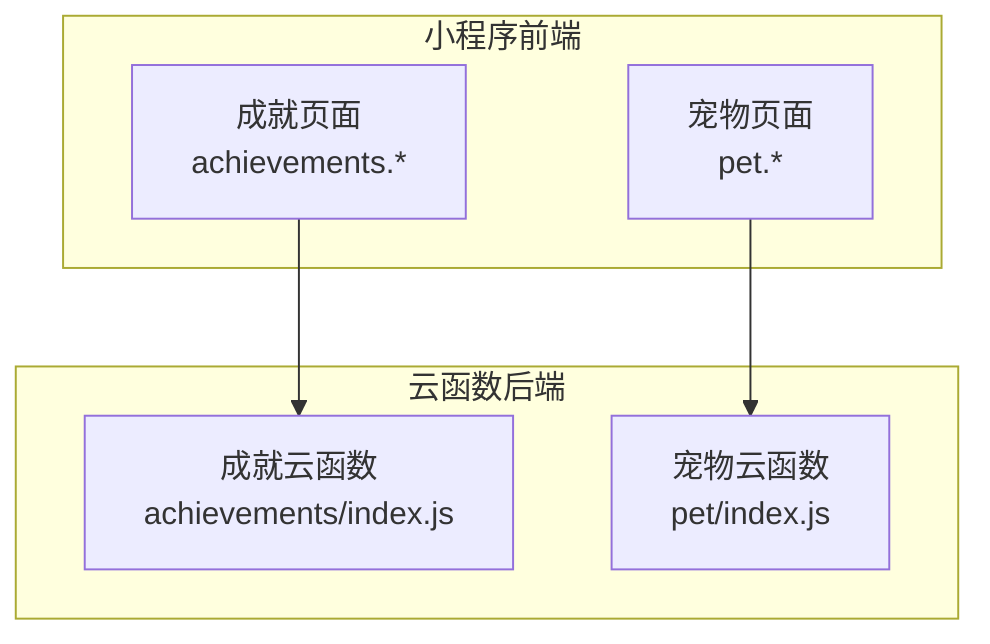
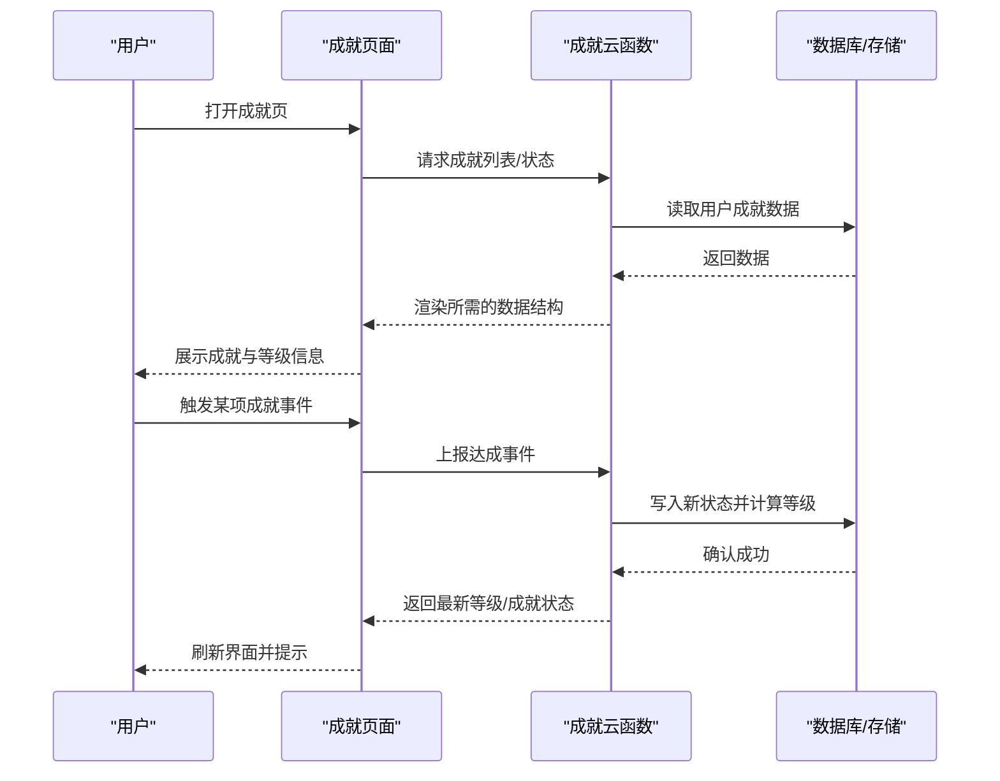
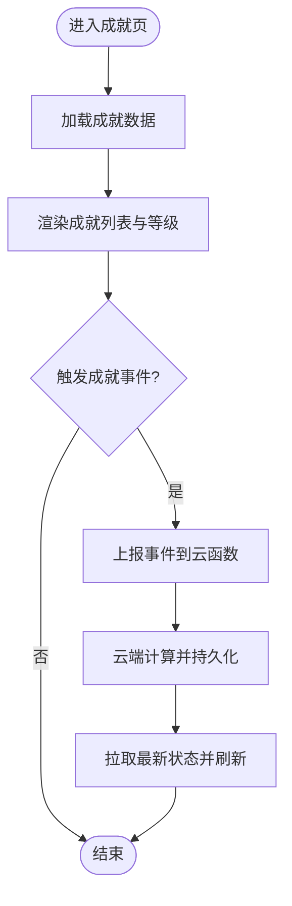
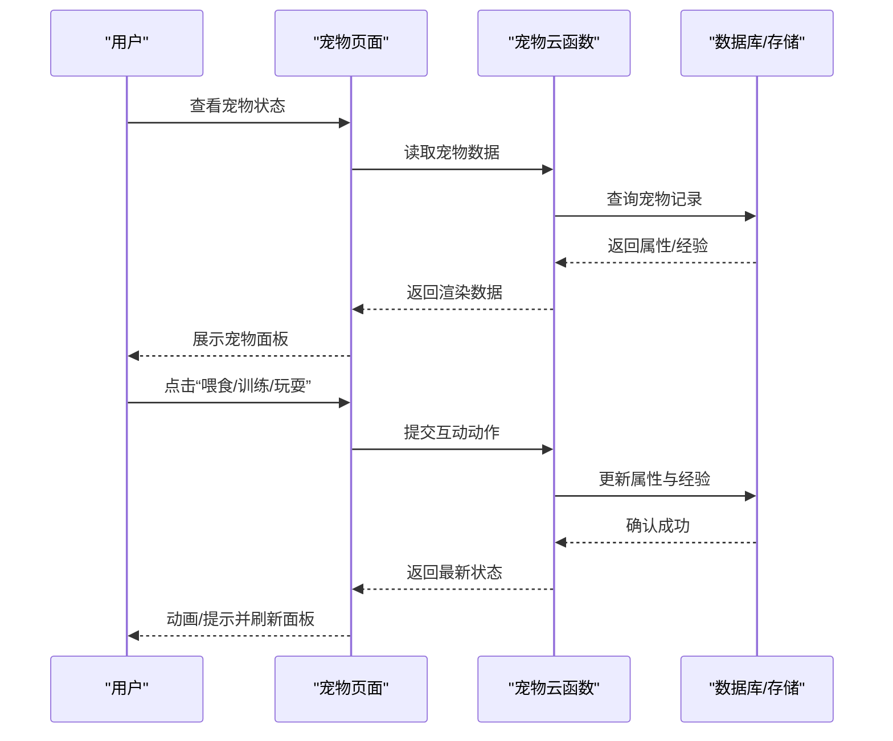
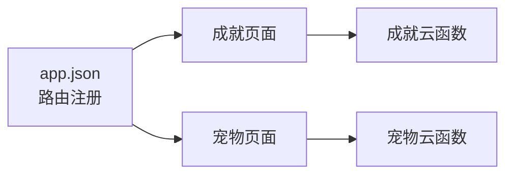

# 游戏化激励

<cite>
**本文引用的文件**   
- [cloudfunctions/achievements/index.js](file://cloudfunctions/achievements/index.js)
- [cloudfunctions/pet/index.js](file://cloudfunctions/pet/index.js)
- [miniprogram/pages/achievements/achievements.js](file://miniprogram/pages/achievements/achievements.js)
- [miniprogram/pages/achievements/achievements.wxml](file://miniprogram/pages/achievements/achievements.wxml)
- [miniprogram/pages/achievements/achievements.wxss](file://miniprogram/pages/achievements/achievements.wxss)
- [miniprogram/pages/pet/pet.js](file://miniprogram/pages/pet/pet.js)
- [miniprogram/pages/pet/pet.wxml](file://miniprogram/pages/pet/pet.wxml)
- [miniprogram/pages/pet/pet.wxss](file://miniprogram/pages/pet/pet.wxss)
- [miniprogram/app.json](file://miniprogram/app.json)
</cite>

## 目录
1. [简介](#简介)
2. [项目结构](#项目结构)
3. [核心组件](#核心组件)
4. [架构总览](#架构总览)
5. [详细组件分析](#详细组件分析)
6. [依赖关系分析](#依赖关系分析)
7. [性能与体验优化建议](#性能与体验优化建议)
8. [故障排查指南](#故障排查指南)
9. [结论](#结论)
10. [附录：玩法与策略](#附录玩法与策略)

## 简介
本文件面向“成就系统”和“宠物养成系统”的玩法与激励机制，聚焦以下目标：
- 成就徽章解锁条件、等级提升规则
- 宠物属性培养与互动玩法
- 游戏化元素如何促进学习动力与保持热情
- 高效获得成就与培养宠物的策略建议

说明：由于仓库未提供业务配置（如成就清单、宠物数值表）的具体实现细节，本文在“详细组件分析”中仅基于现有代码结构与调用路径进行客观描述；在“附录”中给出通用型策略与最佳实践，便于快速落地。

## 项目结构
围绕游戏化激励的核心模块分布如下：
- 小程序前端页面
  - 成就页：展示成就列表、状态与交互入口
  - 宠物页：展示宠物状态、属性与互动操作
- 云函数后端
  - 成就云函数：处理成就查询、更新等逻辑
  - 宠物云函数：处理宠物数据读写、成长计算等逻辑

图表来源
- [miniprogram/pages/achievements/achievements.js](file://miniprogram/pages/achievements/achievements.js)
- [miniprogram/pages/pet/pet.js](file://miniprogram/pages/pet/pet.js)
- [cloudfunctions/achievements/index.js](file://cloudfunctions/achievements/index.js)
- [cloudfunctions/pet/index.js](file://cloudfunctions/pet/index.js)

章节来源
- [miniprogram/app.json](file://miniprogram/app.json)
- [miniprogram/pages/achievements/achievements.js](file://miniprogram/pages/achievements/achievements.js)
- [miniprogram/pages/pet/pet.js](file://miniprogram/pages/pet/pet.js)
- [cloudfunctions/achievements/index.js](file://cloudfunctions/achievements/index.js)
- [cloudfunctions/pet/index.js](file://cloudfunctions/pet/index.js)

## 核心组件
- 成就系统
  - 职责：维护用户已解锁成就、累计进度、等级经验值等
  - 关键能力：查询成就列表与状态、提交达成事件、刷新等级
- 宠物养成系统
  - 职责：管理宠物基础属性、成长曲线、互动行为反馈
  - 关键能力：读取宠物状态、执行互动动作（喂食/训练/玩耍）、更新属性与经验

章节来源
- [cloudfunctions/achievements/index.js](file://cloudfunctions/achievements/index.js)
- [cloudfunctions/pet/index.js](file://cloudfunctions/pet/index.js)
- [miniprogram/pages/achievements/achievements.js](file://miniprogram/pages/achievements/achievements.js)
- [miniprogram/pages/pet/pet.js](file://miniprogram/pages/pet/pet.js)

## 架构总览
整体采用“小程序页面 + 云函数”的轻量前后端分离模式。页面负责展示与交互，云函数负责持久化与业务计算。

图表来源
- [miniprogram/pages/achievements/achievements.js](file://miniprogram/pages/achievements/achievements.js)
- [cloudfunctions/achievements/index.js](file://cloudfunctions/achievements/index.js)

## 详细组件分析

### 成就系统
- 前端呈现
  - 通过页面脚本发起网络请求获取成就数据，并在模板中渲染条目与状态
  - 样式文件控制布局与视觉层次，突出已完成与未完成差异
- 后端处理
  - 云函数接收查询与更新请求，完成权限校验、数据聚合与等级计算
  - 将结果回传至前端用于即时反馈

图表来源
- [miniprogram/pages/achievements/achievements.js](file://miniprogram/pages/achievements/achievements.js)
- [miniprogram/pages/achievements/achievements.wxml](file://miniprogram/pages/achievements/achievements.wxml)
- [miniprogram/pages/achievements/achievements.wxss](file://miniprogram/pages/achievements/achievements.wxss)
- [cloudfunctions/achievements/index.js](file://cloudfunctions/achievements/index.js)

章节来源
- [miniprogram/pages/achievements/achievements.js](file://miniprogram/pages/achievements/achievements.js)
- [miniprogram/pages/achievements/achievements.wxml](file://miniprogram/pages/achievements/achievements.wxml)
- [miniprogram/pages/achievements/achievements.wxss](file://miniprogram/pages/achievements/achievements.wxss)
- [cloudfunctions/achievements/index.js](file://cloudfunctions/achievements/index.js)

### 宠物养成系统
- 前端呈现
  - 展示宠物当前属性、经验条与可交互按钮
  - 点击互动后即时反馈，必要时二次确认或冷却提示
- 后端处理
  - 云函数根据动作类型更新对应属性与经验，并计算是否升级或解锁新外观/技能

图表来源
- [miniprogram/pages/pet/pet.js](file://miniprogram/pages/pet/pet.js)
- [miniprogram/pages/pet/pet.wxml](file://miniprogram/pages/pet/pet.wxml)
- [miniprogram/pages/pet/pet.wxss](file://miniprogram/pages/pet/pet.wxss)
- [cloudfunctions/pet/index.js](file://cloudfunctions/pet/index.js)

章节来源
- [miniprogram/pages/pet/pet.js](file://miniprogram/pages/pet/pet.js)
- [miniprogram/pages/pet/pet.wxml](file://miniprogram/pages/pet/pet.wxml)
- [miniprogram/pages/pet/pet.wxss](file://miniprogram/pages/pet/pet.wxss)
- [cloudfunctions/pet/index.js](file://cloudfunctions/pet/index.js)

## 依赖关系分析
- 页面与云函数的耦合点
  - 成就页面依赖成就云函数接口
  - 宠物页面依赖宠物云函数接口
- 路由与入口
  - 小程序路由由应用配置文件统一声明，确保页面可被正确访问

图表来源
- [miniprogram/app.json](file://miniprogram/app.json)
- [miniprogram/pages/achievements/achievements.js](file://miniprogram/pages/achievements/achievements.js)
- [miniprogram/pages/pet/pet.js](file://miniprogram/pages/pet/pet.js)
- [cloudfunctions/achievements/index.js](file://cloudfunctions/achievements/index.js)
- [cloudfunctions/pet/index.js](file://cloudfunctions/pet/index.js)

章节来源
- [miniprogram/app.json](file://miniprogram/app.json)
- [miniprogram/pages/achievements/achievements.js](file://miniprogram/pages/achievements/achievements.js)
- [miniprogram/pages/pet/pet.js](file://miniprogram/pages/pet/pet.js)
- [cloudfunctions/achievements/index.js](file://cloudfunctions/achievements/index.js)
- [cloudfunctions/pet/index.js](file://cloudfunctions/pet/index.js)

## 性能与体验优化建议
- 减少不必要的重复请求
  - 对成就列表与宠物状态做本地缓存，仅在必要时机刷新
- 合并与节流
  - 高频互动（如连续点击）使用节流，避免频繁触发云函数
- 增量更新
  - 优先返回最小可用数据，降低传输体积
- 失败重试与降级
  - 网络异常时提供友好提示与重试入口，保障主流程可用

[本节为通用建议，不直接分析具体文件]

## 故障排查指南
- 常见问题定位
  - 页面无法显示：检查路由注册与页面路径是否正确
  - 数据为空：核对云函数返回结构与前端期望字段是否一致
  - 互动无响应：确认云函数权限、参数校验与错误码
- 日志与调试
  - 在云函数中输出关键步骤日志，结合小程序控制台观察调用链
  - 对关键分支增加边界用例验证（空数据、超限输入、并发场景）

章节来源
- [miniprogram/pages/achievements/achievements.js](file://miniprogram/pages/achievements/achievements.js)
- [miniprogram/pages/pet/pet.js](file://miniprogram/pages/pet/pet.js)
- [cloudfunctions/achievements/index.js](file://cloudfunctions/achievements/index.js)
- [cloudfunctions/pet/index.js](file://cloudfunctions/pet/index.js)

## 结论
成就系统与宠物养成系统通过“可见进度+即时反馈+阶段性奖励”的游戏化机制，有效增强学习动机与持续性。配合合理的数值设计与交互节奏，可将枯燥的学习任务转化为有目标的闯关体验，从而提升完成率与留存率。

[本节为总结性内容，不直接分析具体文件]

## 附录：玩法与策略

### 成就徽章解锁条件（通用设计）
- 行为类成就
  - 连续学习天数、完成课程数量、错题复盘次数
- 质量类成就
  - 测验正确率阈值、复习间隔达标、知识图谱点亮比例
- 里程碑类成就
  - 首次通关、累计时长、跨学科探索

[本节为通用设计建议，不直接分析具体文件]

### 等级提升规则（通用设计）
- 经验获取
  - 学习时长、答题正确、复习巩固、互动行为
- 升级曲线
  - 线性或指数递增，随等级提高所需经验逐步增长
- 等级权益
  - 解锁新宠物外观、专属标签、加速道具

[本节为通用设计建议，不直接分析具体文件]

### 宠物属性培养（通用设计）
- 核心属性
  - 体力、智力、社交、专注等维度
- 成长方式
  - 喂食提升体力、训练提升智力、玩耍提升社交、冥想提升专注
- 互动反馈
  - 经验条可视化、阶段进化、表情与动作变化

[本节为通用设计建议，不直接分析具体文件]

### 互动玩法（通用设计）
- 日常任务
  - 每日签到、限时挑战、排行榜
- 社交协作
  - 组队打卡、互助复习、分享成果
- 随机惊喜
  - 掉落道具、隐藏成就、节日限定外观

[本节为通用设计建议，不直接分析具体文件]

### 高效策略（通用建议）
- 以终为始
  - 先锁定高价值成就与宠物进化目标，再倒推每日任务
- 小步快跑
  - 将大目标拆分为可量化的微目标，持续获得正反馈
- 资源分配
  - 合理分配时间到“低门槛高回报”的行为，形成复利效应
- 复盘迭代
  - 每周回顾数据，调整策略，避免无效内卷

[本节为通用设计建议，不直接分析具体文件]