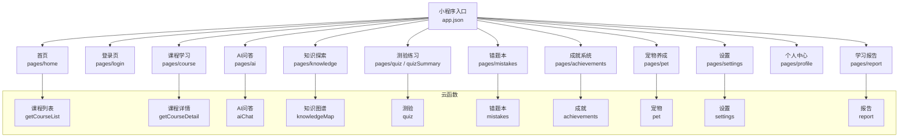
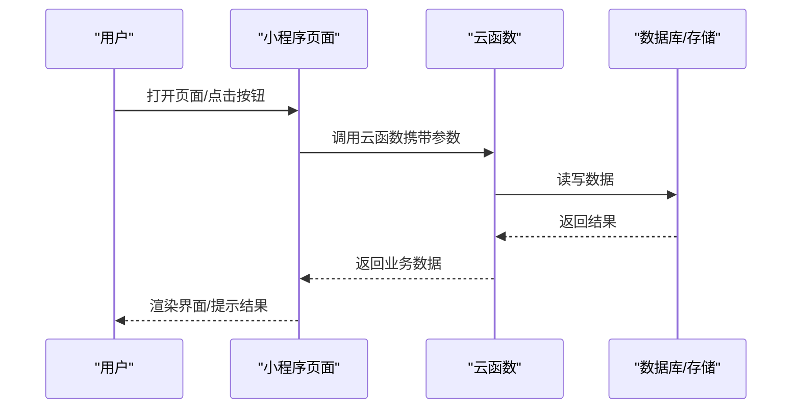
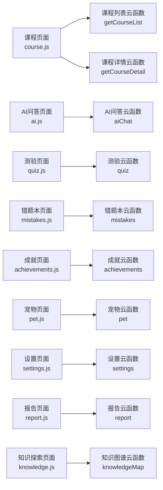
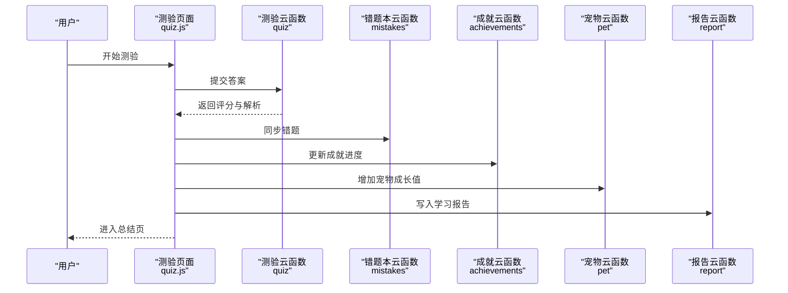

# 用户手册

<cite>
**本文引用的文件**   
- [app.json](file://miniprogram/app.json)
- [home.js](file://miniprogram/pages/home/home.js)
- [login.js](file://miniprogram/pages/login/login.js)
- [course.js](file://miniprogram/pages/course/course.js)
- [ai.js](file://miniprogram/pages/ai/ai.js)
- [knowledge.js](file://miniprogram/pages/knowledge/knowledge.js)
- [quiz.js](file://miniprogram/pages/quiz/quiz.js)
- [quizSummary.js](file://miniprogram/pages/quizSummary/quizSummary.js)
- [flashcards.js](file://miniprogram/pages/flashcards/flashcards.js)
- [achievements.js](file://miniprogram/pages/achievements/achievements.js)
- [pet.js](file://miniprogram/pages/pet/pet.js)
- [mistakes.js](file://miniprogram/pages/mistakes/mistakes.js)
- [settings.js](file://miniprogram/pages/settings/settings.js)
- [profile.js](file://miniprogram/pages/profile/profile.js)
- [report.js](file://miniprogram/pages/report/report.js)
- [index.js（成就云函数）](file://cloudfunctions/achievements/index.js)
- [index.js（AI问答云函数）](file://cloudfunctions/aiChat/index.js)
- [index.js（课程列表云函数）](file://cloudfunctions/getCourseList/index.js)
- [index.js（课程详情云函数）](file://cloudfunctions/getCourseDetail/index.js)
- [index.js（知识图谱云函数）](file://cloudfunctions/knowledgeMap/index.js)
- [index.js（测验云函数）](file://cloudfunctions/quiz/index.js)
- [index.js（错题本云函数）](file://cloudfunctions/mistakes/index.js)
- [index.js（宠物云函数）](file://cloudfunctions/pet/index.js)
- [index.js（设置云函数）](file://cloudfunctions/settings/index.js)
- [index.js（报告云函数）](file://cloudfunctions/report/index.js)
- [courselist.md](file://docs/courselist.md)
</cite>

## 目录
1. [简介](#简介)
2. [项目结构](#项目结构)
3. [核心功能概览](#核心功能概览)
4. [架构总览](#架构总览)
5. [详细操作指南](#详细操作指南)
6. [依赖与数据流分析](#依赖与数据流分析)
7. [性能与体验建议](#性能与体验建议)
8. [故障排查指南](#故障排查指南)
9. [结语](#结语)
10. [附录](#附录)

## 简介
欢迎使用生物学习小程序！本手册面向所有年龄与技术水平的用户，帮助您快速上手并完成以下目标：
- 完成新用户注册与登录
- 高效使用课程学习、AI问答、知识探索、测验练习等核心功能
- 查看学习进度、解锁成就、养成专属宠物
- 个性化设置与常见问题解答

无论您是初次接触在线学习的小学生，还是希望系统复习的初高中或大学生，都能在这里找到适合自己的学习路径。

## 项目结构
小程序采用“页面 + 云函数”的模块化组织方式：
- 前端页面位于 miniprogram/pages 下，每个功能对应一个页面目录，包含 .js/.wxml/.wxss/.json 四个文件
- 业务逻辑通过 cloudfunctions 下的云函数提供，如课程、AI问答、测验、成就、宠物、错题、设置、报告等
- 全局配置与入口在 app.json 中定义

图表来源
- [app.json](file://miniprogram/app.json)
- [home.js](file://miniprogram/pages/home/home.js)
- [login.js](file://miniprogram/pages/login/login.js)
- [course.js](file://miniprogram/pages/course/course.js)
- [ai.js](file://miniprogram/pages/ai/ai.js)
- [knowledge.js](file://miniprogram/pages/knowledge/knowledge.js)
- [quiz.js](file://miniprogram/pages/quiz/quiz.js)
- [quizSummary.js](file://miniprogram/pages/quizSummary/quizSummary.js)
- [mistakes.js](file://miniprogram/pages/mistakes/mistakes.js)
- [achievements.js](file://miniprogram/pages/achievements/achievements.js)
- [pet.js](file://miniprogram/pages/pet/pet.js)
- [settings.js](file://miniprogram/pages/settings/settings.js)
- [profile.js](file://miniprogram/pages/profile/profile.js)
- [report.js](file://miniprogram/pages/report/report.js)
- [index.js（课程列表云函数）](file://cloudfunctions/getCourseList/index.js)
- [index.js（课程详情云函数）](file://cloudfunctions/getCourseDetail/index.js)
- [index.js（AI问答云函数）](file://cloudfunctions/aiChat/index.js)
- [index.js（知识图谱云函数）](file://cloudfunctions/knowledgeMap/index.js)
- [index.js（测验云函数）](file://cloudfunctions/quiz/index.js)
- [index.js（错题本云函数）](file://cloudfunctions/mistakes/index.js)
- [index.js（成就云函数）](file://cloudfunctions/achievements/index.js)
- [index.js（宠物云函数）](file://cloudfunctions/pet/index.js)
- [index.js（设置云函数）](file://cloudfunctions/settings/index.js)
- [index.js（报告云函数）](file://cloudfunctions/report/index.js)

章节来源
- [app.json](file://miniprogram/app.json)

## 核心功能概览
- 课程学习：浏览课程列表，进入课程详情，按章节学习并记录进度
- AI问答：随时向AI提问生物学相关问题，获取即时解答
- 知识探索：通过知识图谱了解知识点关联，按需跳转深入学习
- 测验练习：基于课程生成测验，提交后查看总结与错题
- 错题本：集中回顾做错的题目，巩固薄弱点
- 成就系统：完成任务与测验获得成就，提升学习动力
- 宠物养成：通过学习行为喂养与升级你的专属宠物
- 设置与报告：个性化偏好设置，查看学习报告与统计

章节来源
- [courselist.md](file://docs/courselist.md)

## 架构总览
小程序前端负责交互与展示，后端能力由云函数提供。典型调用流程如下：

图表来源
- [course.js](file://miniprogram/pages/course/course.js)
- [ai.js](file://miniprogram/pages/ai/ai.js)
- [quiz.js](file://miniprogram/pages/quiz/quiz.js)
- [index.js（课程详情云函数）](file://cloudfunctions/getCourseDetail/index.js)
- [index.js（AI问答云函数）](file://cloudfunctions/aiChat/index.js)
- [index.js（测验云函数）](file://cloudfunctions/quiz/index.js)

## 详细操作指南

### 新用户注册与登录
- 首次打开小程序将进入登录页
- 根据页面提示完成授权与登录
- 登录后即可进入首页并使用全部功能

步骤要点
- 点击底部导航“我的”或“登录”进入登录页
- 按照提示完成微信授权登录
- 登录成功后返回首页

章节来源
- [login.js](file://miniprogram/pages/login/login.js)

### 首页与导航
- 首页聚合常用入口：课程、AI问答、知识探索、测验、错题、成就、宠物、设置
- 底部导航栏支持快速切换主要模块

章节来源
- [home.js](file://miniprogram/pages/home/home.js)
- [app.json](file://miniprogram/app.json)

### 课程学习
- 进入“课程”页面，浏览课程列表
- 点击课程卡片进入详情页，开始学习
- 学习过程中自动记录进度，支持断点续学

操作步骤
- 首页点击“课程”
- 选择感兴趣的课程
- 进入课程详情，按章节顺序学习
- 完成后返回课程列表查看进度

章节来源
- [course.js](file://miniprogram/pages/course/course.js)
- [index.js（课程列表云函数）](file://cloudfunctions/getCourseList/index.js)
- [index.js（课程详情云函数）](file://cloudfunctions/getCourseDetail/index.js)

### AI问答
- 在“AI问答”页面输入问题，获取即时解答
- 适合在学习过程中遇到疑问时快速查询

操作步骤
- 首页点击“AI问答”
- 输入问题并提交
- 等待AI回复，可继续追问

章节来源
- [ai.js](file://miniprogram/pages/ai/ai.js)
- [index.js（AI问答云函数）](file://cloudfunctions/aiChat/index.js)

### 知识探索（知识图谱）
- 通过知识图谱可视化知识点关系
- 点击节点跳转到相关课程或测验，形成闭环学习

操作步骤
- 首页点击“知识探索”
- 浏览图谱，点击感兴趣的知识节点
- 跳转到对应课程或测验进行深入学习

章节来源
- [knowledge.js](file://miniprogram/pages/knowledge/knowledge.js)
- [index.js（知识图谱云函数）](file://cloudfunctions/knowledgeMap/index.js)

### 测验练习与总结
- 在课程内或“测验”入口发起测验
- 提交后进入总结页，查看得分、解析与错题

操作步骤
- 首页点击“测验”或在课程详情页发起测验
- 逐题作答并提交
- 进入总结页查看成绩与解析
- 将错题加入错题本以便复习

章节来源
- [quiz.js](file://miniprogram/pages/quiz/quiz.js)
- [quizSummary.js](file://miniprogram/pages/quizSummary/quizSummary.js)
- [index.js（测验云函数）](file://cloudfunctions/quiz/index.js)

### 错题本
- 集中查看历史错题，支持按课程或知识点筛选
- 针对错题再次练习，强化薄弱环节

操作步骤
- 首页点击“错题本”
- 浏览错题列表，点击进入题目详情
- 重新作答或跳转至相关课程复习

章节来源
- [mistakes.js](file://miniprogram/pages/mistakes/mistakes.js)
- [index.js（错题本云函数）](file://cloudfunctions/mistakes/index.js)

### 成就系统
- 完成课程、测验、连续打卡等行为可获得成就
- 在“成就”页面查看已解锁与待解锁成就

操作步骤
- 首页点击“成就”
- 浏览成就列表，了解达成条件
- 持续学习以解锁更多成就

章节来源
- [achievements.js](file://miniprogram/pages/achievements/achievements.js)
- [index.js（成就云函数）](file://cloudfunctions/achievements/index.js)

### 宠物养成
- 通过学习行为为宠物喂食、升级与互动
- 宠物状态反映学习活跃度，增强学习动力

操作步骤
- 首页点击“宠物”
- 查看宠物当前状态与成长值
- 完成学习与测验为宠物积累成长值
- 定期上线维护宠物状态

章节来源
- [pet.js](file://miniprogram/pages/pet/pet.js)
- [index.js（宠物云函数）](file://cloudfunctions/pet/index.js)

### 设置与个性化
- 在“设置”页面调整通知、字体大小、主题等偏好
- 在“个人中心”查看个人信息与学习数据

操作步骤
- 首页点击“设置”
- 根据需要修改个人偏好
- 返回“个人中心”查看个人资料与统计数据

章节来源
- [settings.js](file://miniprogram/pages/settings/settings.js)
- [profile.js](file://miniprogram/pages/profile/profile.js)
- [index.js（设置云函数）](file://cloudfunctions/settings/index.js)

### 学习报告
- 在“报告”页面查看学习时长、测验成绩趋势、薄弱知识点等统计
- 帮助制定下一步学习计划

操作步骤
- 首页点击“报告”
- 浏览学习概览与详细指标
- 结合错题本与知识图谱制定改进计划

章节来源
- [report.js](file://miniprogram/pages/report/report.js)
- [index.js（报告云函数）](file://cloudfunctions/report/index.js)

### 实用技巧
- 碎片化学习：利用AI问答与知识图谱在零散时间查漏补缺
- 间隔复习：结合错题本与测验，周期性回顾薄弱点
- 目标驱动：设定每日学习时长与测验数量，配合成就与宠物反馈保持动力
- 循序渐进：先通读课程再做题，最后用知识图谱串联知识点

[本节为通用指导，不直接分析具体文件]

## 依赖与数据流分析

### 关键页面与云函数映射

图表来源
- [course.js](file://miniprogram/pages/course/course.js)
- [ai.js](file://miniprogram/pages/ai/ai.js)
- [quiz.js](file://miniprogram/pages/quiz/quiz.js)
- [mistakes.js](file://miniprogram/pages/mistakes/mistakes.js)
- [achievements.js](file://miniprogram/pages/achievements/achievements.js)
- [pet.js](file://miniprogram/pages/pet/pet.js)
- [settings.js](file://miniprogram/pages/settings/settings.js)
- [report.js](file://miniprogram/pages/report/report.js)
- [knowledge.js](file://miniprogram/pages/knowledge/knowledge.js)
- [index.js（课程列表云函数）](file://cloudfunctions/getCourseList/index.js)
- [index.js（课程详情云函数）](file://cloudfunctions/getCourseDetail/index.js)
- [index.js（AI问答云函数）](file://cloudfunctions/aiChat/index.js)
- [index.js（测验云函数）](file://cloudfunctions/quiz/index.js)
- [index.js（错题本云函数）](file://cloudfunctions/mistakes/index.js)
- [index.js（成就云函数）](file://cloudfunctions/achievements/index.js)
- [index.js（宠物云函数）](file://cloudfunctions/pet/index.js)
- [index.js（设置云函数）](file://cloudfunctions/settings/index.js)
- [index.js（报告云函数）](file://cloudfunctions/report/index.js)
- [index.js（知识图谱云函数）](file://cloudfunctions/knowledgeMap/index.js)

### 测验提交与总结流程

图表来源
- [quiz.js](file://miniprogram/pages/quiz/quiz.js)
- [quizSummary.js](file://miniprogram/pages/quizSummary/quizSummary.js)
- [index.js（测验云函数）](file://cloudfunctions/quiz/index.js)
- [index.js（错题本云函数）](file://cloudfunctions/mistakes/index.js)
- [index.js（成就云函数）](file://cloudfunctions/achievements/index.js)
- [index.js（宠物云函数）](file://cloudfunctions/pet/index.js)
- [index.js（报告云函数）](file://cloudfunctions/report/index.js)

## 性能与体验建议
- 网络优化：在网络不佳时优先加载文本内容，图片与视频延迟加载
- 缓存策略：对课程列表、知识图谱等静态数据做本地缓存，减少重复请求
- 分页与懒加载：长列表采用分页与滚动加载，降低首屏压力
- 错误重试：对失败的网络请求提供重试与降级提示
- 交互反馈：关键操作提供明确的成功/失败提示，避免用户困惑

[本节为通用指导，不直接分析具体文件]

## 故障排查指南
- 无法登录
  - 检查网络与微信授权是否允许
  - 退出后重新登录
- 课程无法加载
  - 确认网络连接正常
  - 尝试刷新页面或重启小程序
- AI问答无响应
  - 检查网络
  - 简化问题描述后重试
- 测验提交失败
  - 检查网络
  - 稍后再试或清除缓存后重试
- 成就/宠物未更新
  - 确保已完成相应任务
  - 退出重进或等待数据同步

章节来源
- [login.js](file://miniprogram/pages/login/login.js)
- [course.js](file://miniprogram/pages/course/course.js)
- [ai.js](file://miniprogram/pages/ai/ai.js)
- [quiz.js](file://miniprogram/pages/quiz/quiz.js)
- [achievements.js](file://miniprogram/pages/achievements/achievements.js)
- [pet.js](file://miniprogram/pages/pet/pet.js)

## 结语
感谢您使用生物学习小程序！建议从“课程学习”入手，搭配“AI问答”与“知识探索”，并通过“测验练习”与“错题本”巩固所学。坚持每日学习，解锁成就、养成宠物，让学习更有成就感。如有问题，请参考故障排查或联系技术支持。

[本节为总结性内容，不直接分析具体文件]

## 附录
- 课程清单与说明详见文档：[courselist.md](file://docs/courselist.md)

章节来源
- [courselist.md](file://docs/courselist.md)