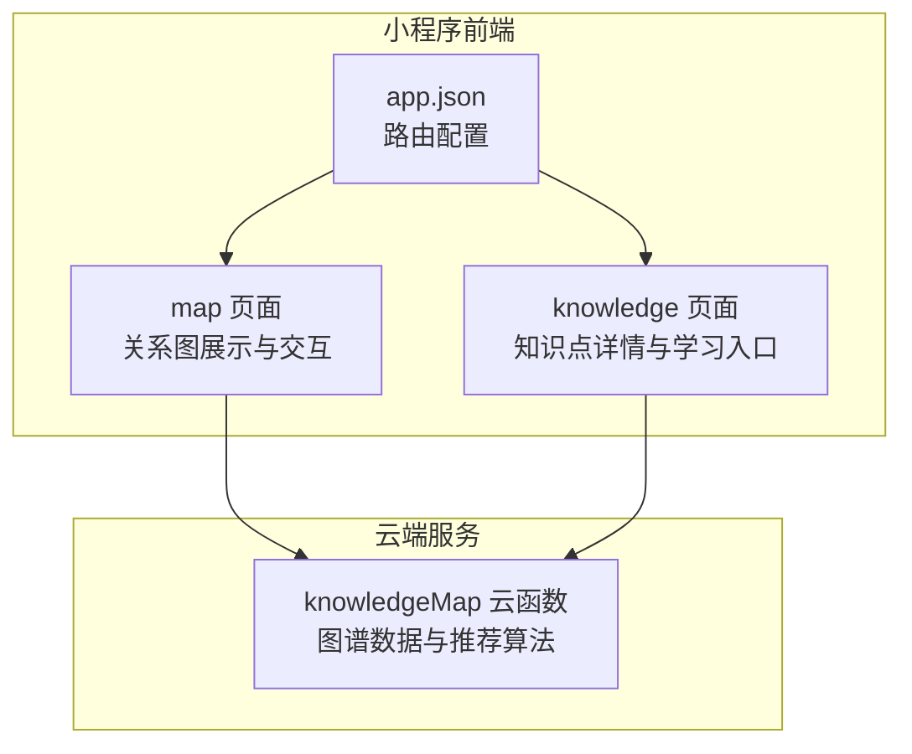
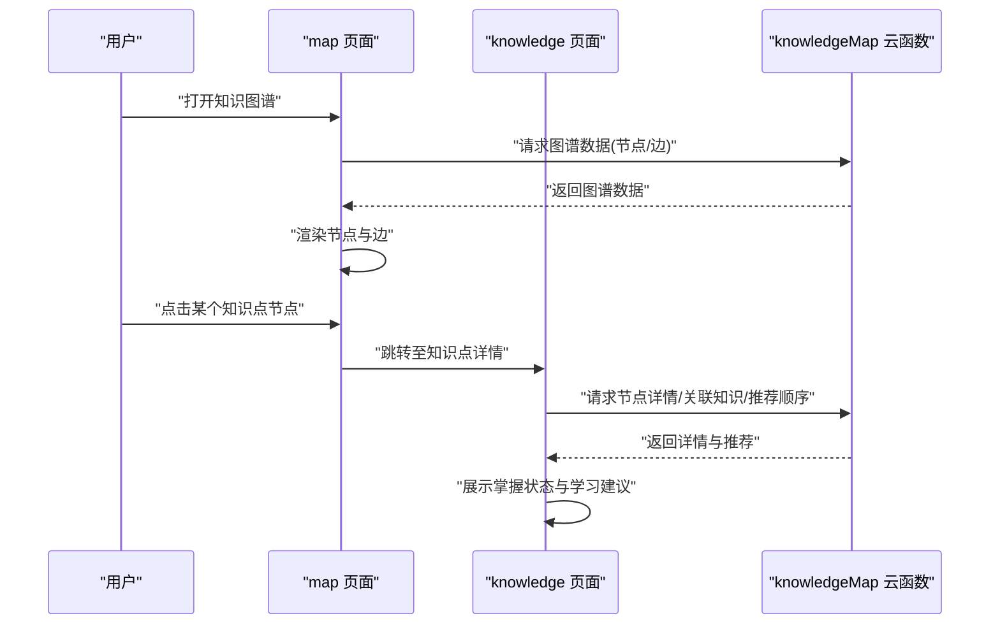
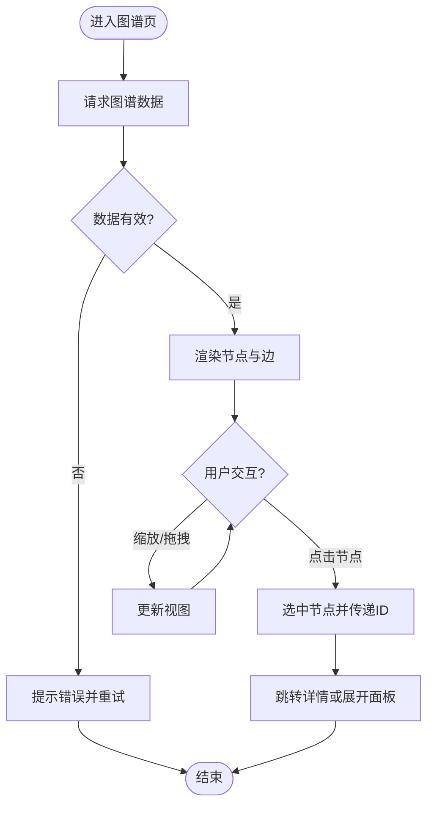
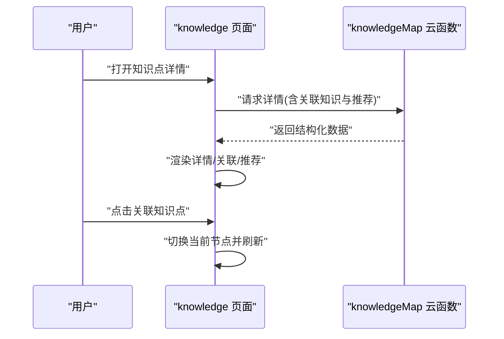
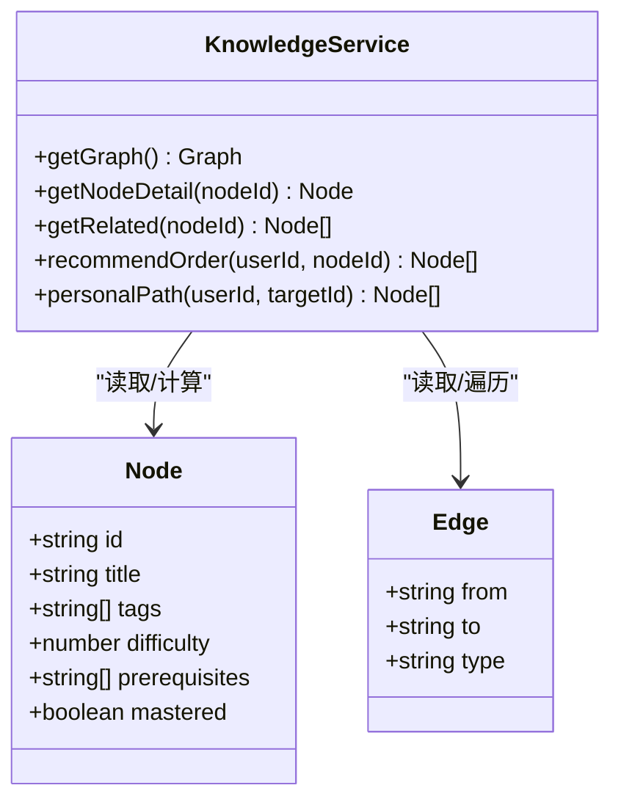
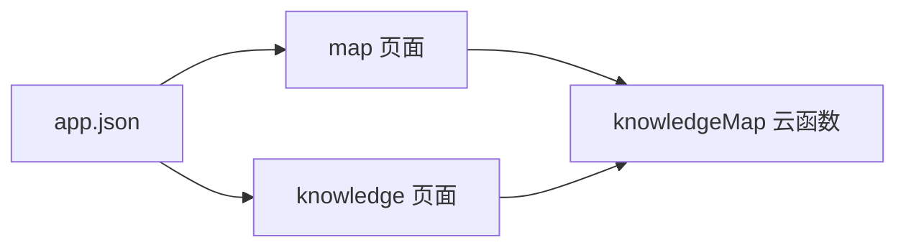

# 知识探索

<cite>
**本文引用的文件**   
- [miniprogram/pages/map/map.js](file://miniprogram/pages/map/map.js)
- [miniprogram/pages/map/map.wxml](file://miniprogram/pages/map/map.wxml)
- [miniprogram/pages/map/map.wxss](file://miniprogram/pages/map/map.wxss)
- [cloudfunctions/knowledgeMap/index.js](file://cloudfunctions/knowledgeMap/index.js)
- [miniprogram/pages/knowledge/knowledge.js](file://miniprogram/pages/knowledge/knowledge.js)
- [miniprogram/pages/knowledge/knowledge.wxml](file://miniprogram/pages/knowledge/knowledge.wxml)
- [miniprogram/app.json](file://miniprogram/app.json)
</cite>

## 目录
1. [简介](#简介)
2. [项目结构](#项目结构)
3. [核心组件](#核心组件)
4. [架构总览](#架构总览)
5. [详细组件分析](#详细组件分析)
6. [依赖关系分析](#依赖关系分析)
7. [性能与体验优化建议](#性能与体验优化建议)
8. [故障排查指南](#故障排查指南)
9. [结论](#结论)
10. [附录：学习方法与知识梳理技巧](#附录：学习方法与知识梳理技巧)

## 简介
本章节面向希望系统掌握“知识图谱与知识探索”功能的用户，涵盖以下目标：
- 如何查看知识点关系图、在图中导航学习路径
- 如何发现关联知识、构建个人知识体系
- 理解知识点掌握状态标识、推荐学习顺序与个性化学习路径生成原理
- 提供知识梳理技巧与系统性学习方法，帮助建立完整的生物学知识框架

## 项目结构
围绕“知识图谱/知识探索”功能，前端页面位于小程序 pages 下的 map 与 knowledge 模块；后端云函数为 knowledgeMap。整体交互流程为：前端渲染图谱与详情面板，调用云端接口获取图谱数据与节点详情，再根据用户掌握情况与前置依赖计算推荐学习顺序。

图表来源
- [miniprogram/pages/map/map.js](file://miniprogram/pages/map/map.js)
- [miniprogram/pages/knowledge/knowledge.js](file://miniprogram/pages/knowledge/knowledge.js)
- [cloudfunctions/knowledgeMap/index.js](file://cloudfunctions/knowledgeMap/index.js)
- [miniprogram/app.json](file://miniprogram/app.json)

章节来源
- [miniprogram/pages/map/map.js](file://miniprogram/pages/map/map.js)
- [miniprogram/pages/map/map.wxml](file://miniprogram/pages/map/map.wxml)
- [miniprogram/pages/map/map.wxss](file://miniprogram/pages/map/map.wxss)
- [miniprogram/pages/knowledge/knowledge.js](file://miniprogram/pages/knowledge/knowledge.js)
- [miniprogram/pages/knowledge/knowledge.wxml](file://miniprogram/pages/knowledge/knowledge.wxml)
- [cloudfunctions/knowledgeMap/index.js](file://cloudfunctions/knowledgeMap/index.js)
- [miniprogram/app.json](file://miniprogram/app.json)

## 核心组件
- 图谱可视化与交互（map 页面）
  - 负责加载图谱数据、渲染节点与边、支持点击/缩放/拖拽等交互，并联动右侧或底部面板展示节点详情与下一步学习建议。
- 知识点详情与学习入口（knowledge 页面）
  - 展示单个知识点的概念、关联知识点、掌握状态、推荐学习顺序与练习入口。
- 云端图谱服务（knowledgeMap 云函数）
  - 提供图谱数据查询、节点详情、关联知识列表、推荐学习顺序与个性化路径计算。

章节来源
- [miniprogram/pages/map/map.js](file://miniprogram/pages/map/map.js)
- [miniprogram/pages/knowledge/knowledge.js](file://miniprogram/pages/knowledge/knowledge.js)
- [cloudfunctions/knowledgeMap/index.js](file://cloudfunctions/knowledgeMap/index.js)

## 架构总览
下图展示了从用户操作到数据返回的端到端流程，包括图谱加载、节点选择、详情展示与推荐路径生成。

图表来源
- [miniprogram/pages/map/map.js](file://miniprogram/pages/map/map.js)
- [miniprogram/pages/knowledge/knowledge.js](file://miniprogram/pages/knowledge/knowledge.js)
- [cloudfunctions/knowledgeMap/index.js](file://cloudfunctions/knowledgeMap/index.js)

## 详细组件分析

### 图谱页面（map）
- 职责
  - 初始化并渲染图谱（节点、边、布局）。
  - 处理用户交互（点击节点、缩放、拖拽、搜索过滤等）。
  - 将选中节点信息传递给详情页面或侧边面板。
- 关键实现要点
  - 数据加载：调用云端接口获取图谱数据，缓存以减少重复请求。
  - 渲染策略：按需渲染可见区域节点，避免大图卡顿。
  - 交互反馈：高亮选中节点及其邻接边，显示简要标签。
  - 错误处理：网络异常时降级为本地缓存或提示重试。
- 典型流程图

图表来源
- [miniprogram/pages/map/map.js](file://miniprogram/pages/map/map.js)
- [miniprogram/pages/map/map.wxml](file://miniprogram/pages/map/map.wxml)
- [miniprogram/pages/map/map.wxss](file://miniprogram/pages/map/map.wxss)

章节来源
- [miniprogram/pages/map/map.js](file://miniprogram/pages/map/map.js)
- [miniprogram/pages/map/map.wxml](file://miniprogram/pages/map/map.wxml)
- [miniprogram/pages/map/map.wxss](file://miniprogram/pages/map/map.wxss)

### 知识点详情（knowledge）
- 职责
  - 展示知识点标题、描述、标签、难度、掌握状态。
  - 列出关联知识点（前置/后继/并列），并提供跳转入口。
  - 展示推荐学习顺序与个性化学习路径。
- 关键实现要点
  - 数据聚合：合并节点详情、关联知识与推荐结果。
  - 状态标识：使用统一的状态字段表示未学/学习中/已掌握等。
  - 路径生成：基于前置依赖与用户当前掌握度排序。
- 典型时序图

图表来源
- [miniprogram/pages/knowledge/knowledge.js](file://miniprogram/pages/knowledge/knowledge.js)
- [miniprogram/pages/knowledge/knowledge.wxml](file://miniprogram/pages/knowledge/knowledge.wxml)
- [cloudfunctions/knowledgeMap/index.js](file://cloudfunctions/knowledgeMap/index.js)

章节来源
- [miniprogram/pages/knowledge/knowledge.js](file://miniprogram/pages/knowledge/knowledge.js)
- [miniprogram/pages/knowledge/knowledge.wxml](file://miniprogram/pages/knowledge/knowledge.wxml)

### 云端图谱服务（knowledgeMap）
- 职责
  - 提供图谱数据查询（节点集合、边集合）。
  - 提供节点详情与关联知识列表。
  - 计算推荐学习顺序与个性化学习路径。
- 关键实现要点
  - 数据结构：节点包含 id、title、tags、difficulty、prerequisites 等；边包含 from、to、type。
  - 推荐算法：基于拓扑排序与用户掌握度加权，优先推荐无前置或前置已掌握的节点。
  - 缓存策略：热点图谱数据缓存，减少重复计算。
- 典型类图（概念映射）

图表来源
- [cloudfunctions/knowledgeMap/index.js](file://cloudfunctions/knowledgeMap/index.js)

章节来源
- [cloudfunctions/knowledgeMap/index.js](file://cloudfunctions/knowledgeMap/index.js)

## 依赖关系分析
- 前端依赖
  - map 页面依赖 knowledgeMap 云函数获取图谱数据。
  - knowledge 页面依赖 knowledgeMap 云函数获取详情与推荐。
  - app.json 定义页面路由，确保 map 与 knowledge 可被正确访问。
- 后端依赖
  - knowledgeMap 云函数可能依赖数据库/对象存储以持久化图谱与用户进度（具体实现以源码为准）。

图表来源
- [miniprogram/app.json](file://miniprogram/app.json)
- [miniprogram/pages/map/map.js](file://miniprogram/pages/map/map.js)
- [miniprogram/pages/knowledge/knowledge.js](file://miniprogram/pages/knowledge/knowledge.js)
- [cloudfunctions/knowledgeMap/index.js](file://cloudfunctions/knowledgeMap/index.js)

章节来源
- [miniprogram/app.json](file://miniprogram/app.json)
- [miniprogram/pages/map/map.js](file://miniprogram/pages/map/map.js)
- [miniprogram/pages/knowledge/knowledge.js](file://miniprogram/pages/knowledge/knowledge.js)
- [cloudfunctions/knowledgeMap/index.js](file://cloudfunctions/knowledgeMap/index.js)

## 性能与体验优化建议
- 图谱渲染
  - 分片加载与懒渲染：仅渲染可视区域内的节点与边，滚动/缩放时增量更新。
  - 节点聚合：在缩小时按层级聚合节点，放大后再展开，降低绘制压力。
  - 防抖与节流：对缩放、拖拽事件进行节流，减少频繁重绘。
- 数据请求
  - 缓存热点图谱数据与常用节点详情，设置合理过期时间。
  - 失败重试与降级：网络异常时回退到本地缓存并提示用户。
- 交互体验
  - 高亮与引导：选中节点时高亮其邻接边与相关节点，辅助快速定位。
  - 渐进式披露：默认只展示必要信息，点击后展开更多细节，避免信息过载。

[本节为通用优化建议，不直接分析具体文件]

## 故障排查指南
- 图谱无法加载
  - 检查网络连通性与云端函数可用性。
  - 确认 app.json 中 map 页面路由是否正确注册。
  - 查看控制台日志，定位请求失败原因。
- 节点详情空白或报错
  - 校验传入的节点 ID 是否有效。
  - 检查云端函数返回的数据结构是否符合预期。
- 推荐顺序不正确
  - 核查节点的 prerequisites 与用户掌握状态是否同步。
  - 验证推荐算法是否考虑了前置依赖与难度权重。

章节来源
- [miniprogram/pages/map/map.js](file://miniprogram/pages/map/map.js)
- [miniprogram/pages/knowledge/knowledge.js](file://miniprogram/pages/knowledge/knowledge.js)
- [cloudfunctions/knowledgeMap/index.js](file://cloudfunctions/knowledgeMap/index.js)
- [miniprogram/app.json](file://miniprogram/app.json)

## 结论
通过“图谱可视化+详情面板+云端推荐”的组合，用户可以高效浏览生物学知识体系、发现关联知识点、规划个性化学习路径。建议在后续迭代中持续完善数据质量、推荐算法与交互体验，以提升学习效率与成就感。

[本节为总结性内容，不直接分析具体文件]

## 附录：学习方法与知识梳理技巧
- 掌握状态标识
  - 未学：尚未开始学习的知识点。
  - 学习中：正在学习或复习中的知识点。
  - 已掌握：通过练习或测试达到掌握阈值的知识点。
- 推荐学习顺序
  - 优先满足前置依赖：只有当前置知识点已掌握时，才推荐后继知识点。
  - 难度梯度：在满足前置条件的前提下，优先推荐难度较低的节点，逐步提升。
  - 个性化调整：结合用户历史表现与薄弱点，动态调整推荐权重。
- 个性化学习路径生成原理
  - 输入：用户掌握状态、目标知识点、前置依赖关系。
  - 过程：基于拓扑排序与加权评分，生成最短且可行的学习序列。
  - 输出：按优先级排列的学习清单与可视化路径。
- 知识梳理技巧
  - 自上而下：先把握大主题与主干概念，再逐步细化分支。
  - 自下而上：从具体案例与习题出发，归纳抽象概念与规律。
  - 双向连接：在学习过程中主动建立跨主题的联系，形成网状知识结构。
- 系统性学习方法
  - 计划-执行-复盘：制定学习目标，按计划推进，定期复盘巩固。
  - 间隔重复：利用闪卡或错题本进行间隔复习，强化记忆。
  - 输出驱动：通过讲解、写作或做题检验理解深度。

[本节为方法论指导，不直接分析具体文件]