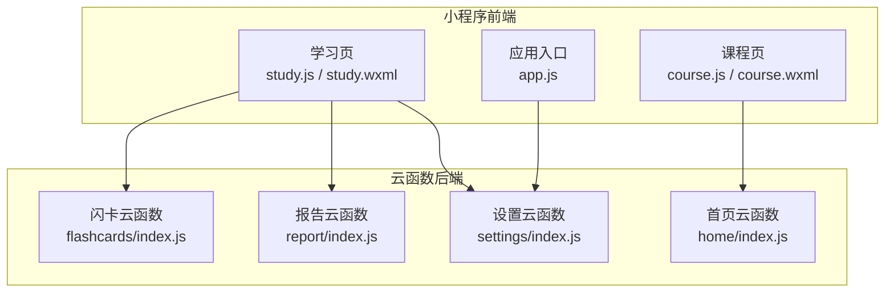
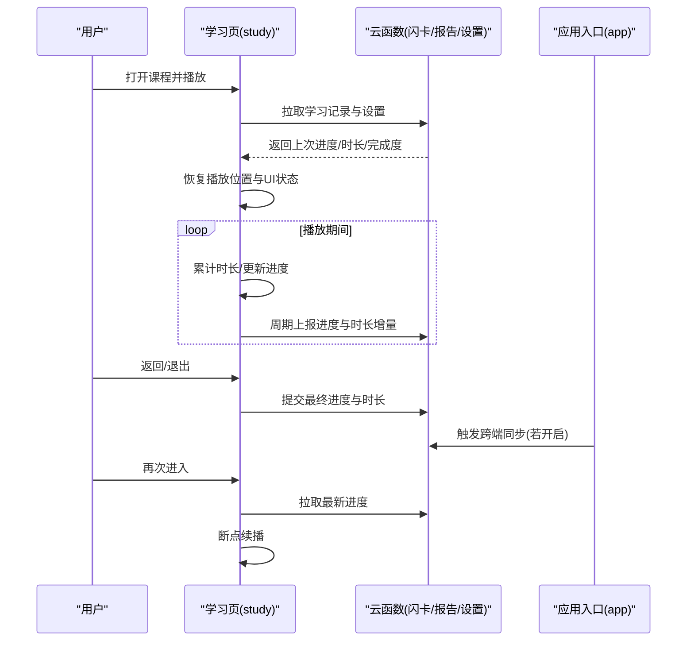
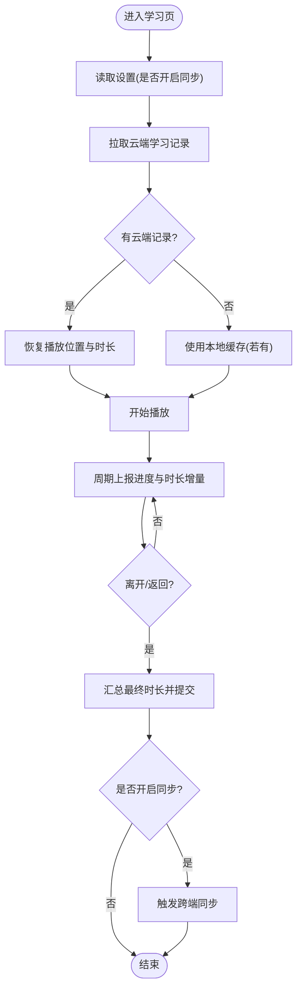
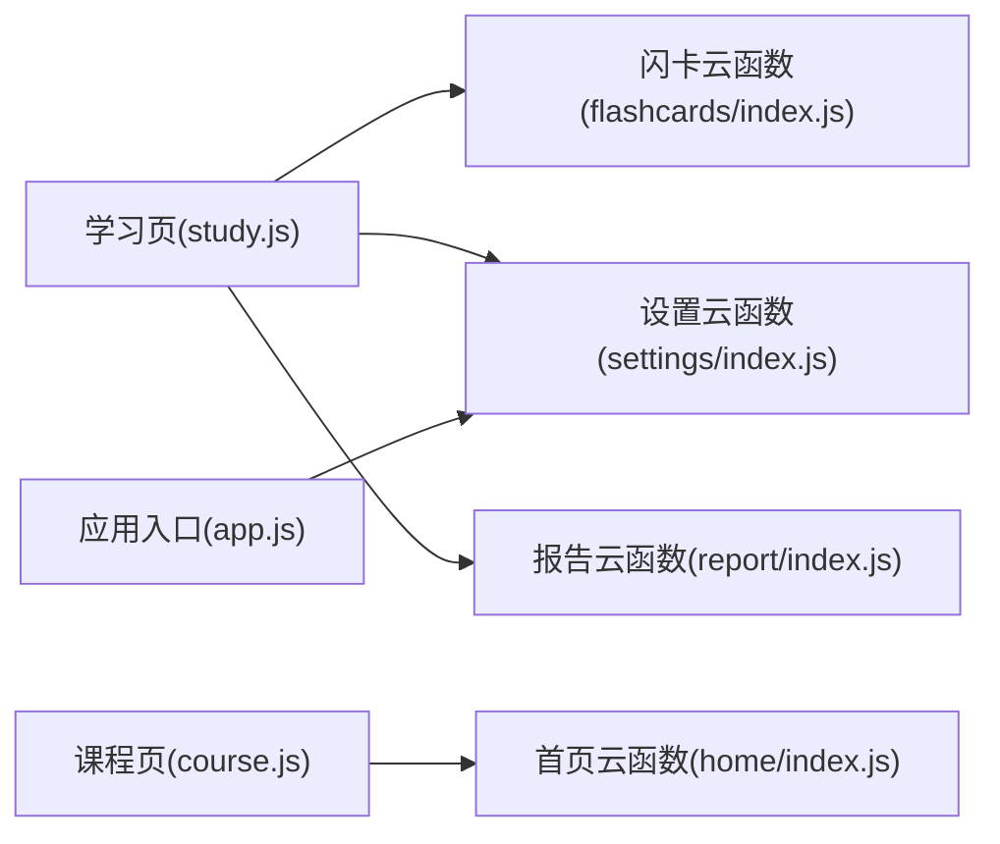

# 学习进度管理

<cite>
**本文引用的文件**   
- [miniprogram/pages/study/study.js](file://miniprogram/pages/study/study.js)
- [miniprogram/pages/study/study.wxml](file://miniprogram/pages/study/study.wxml)
- [miniprogram/pages/study/study.wxss](file://miniprogram/pages/study/study.wxss)
- [miniprogram/pages/course/course.js](file://miniprogram/pages/course/course.js)
- [miniprogram/pages/course/course.wxml](file://miniprogram/pages/course/course.wxml)
- [miniprogram/app.js](file://miniprogram/app.js)
- [cloudfunctions/flashcards/index.js](file://cloudfunctions/flashcards/index.js)
- [cloudfunctions/report/index.js](file://cloudfunctions/report/index.js)
- [cloudfunctions/settings/index.js](file://cloudfunctions/settings/index.js)
- [cloudfunctions/home/index.js](file://cloudfunctions/home/index.js)
</cite>

## 目录
1. [简介](#简介)
2. [项目结构](#项目结构)
3. [核心组件](#核心组件)
4. [架构总览](#架构总览)
5. [详细组件分析](#详细组件分析)
6. [依赖关系分析](#依赖关系分析)
7. [性能考量](#性能考量)
8. [故障排查指南](#故障排查指南)
9. [结论](#结论)
10. [附录](#附录)

## 简介
本章节面向“学习进度跟踪与管理”能力，覆盖以下目标：
- 自动进度保存与手动进度标记
- 学习时长统计与完成度百分比展示
- 多设备间的学习进度同步机制
- 断点续播的实现原理
- 进度分析工具使用指南（学习曲线、薄弱环节识别、学习计划调整建议）

该功能贯穿小程序前端页面与云函数后端，通过本地缓存与云端数据协同实现跨端一致性与可靠性。

## 项目结构
围绕学习进度的关键代码分布在小程序前端页面与云函数中：
- 学习播放页：负责播放控制、进度上报、时长统计与完成度计算
- 课程列表页：提供进入学习入口与基础课程信息
- 应用入口：初始化全局状态与登录态，支撑跨端同步
- 云函数：提供学习记录、报告、设置等云端能力

图表来源
- [miniprogram/pages/study/study.js](file://miniprogram/pages/study/study.js)
- [miniprogram/pages/study/study.wxml](file://miniprogram/pages/study/study.wxml)
- [miniprogram/pages/course/course.js](file://miniprogram/pages/course/course.js)
- [miniprogram/pages/course/course.wxml](file://miniprogram/pages/course/course.wxml)
- [miniprogram/app.js](file://miniprogram/app.js)
- [cloudfunctions/flashcards/index.js](file://cloudfunctions/flashcards/index.js)
- [cloudfunctions/report/index.js](file://cloudfunctions/report/index.js)
- [cloudfunctions/settings/index.js](file://cloudfunctions/settings/index.js)
- [cloudfunctions/home/index.js](file://cloudfunctions/home/index.js)

章节来源
- [miniprogram/pages/study/study.js](file://miniprogram/pages/study/study.js)
- [miniprogram/pages/study/study.wxml](file://miniprogram/pages/study/study.wxml)
- [miniprogram/pages/course/course.js](file://miniprogram/pages/course/course.js)
- [miniprogram/pages/course/course.wxml](file://miniprogram/pages/course/course.wxml)
- [miniprogram/app.js](file://miniprogram/app.js)
- [cloudfunctions/flashcards/index.js](file://cloudfunctions/flashcards/index.js)
- [cloudfunctions/report/index.js](file://cloudfunctions/report/index.js)
- [cloudfunctions/settings/index.js](file://cloudfunctions/settings/index.js)
- [cloudfunctions/home/index.js](file://cloudfunctions/home/index.js)

## 核心组件
- 学习页（study）
  - 职责：播放控制、进度上报、时长累计、完成度计算、断点恢复、手动标记完成
  - 关键交互：开始/暂停、拖动进度条、点击“标记完成”、返回时自动保存
- 课程页（course）
  - 职责：课程列表展示、进入学习页、加载课程元数据
- 应用入口（app）
  - 职责：全局初始化、登录态维护、跨端同步触发时机
- 云函数
  - 闪卡（flashcards）：用于学习记录与进度存储
  - 报告（report）：生成学习分析与报告
  - 设置（settings）：用户偏好与同步开关
  - 首页（home）：聚合数据与推荐

章节来源
- [miniprogram/pages/study/study.js](file://miniprogram/pages/study/study.js)
- [miniprogram/pages/study/study.wxml](file://miniprogram/pages/study/study.wxml)
- [miniprogram/pages/course/course.js](file://miniprogram/pages/course/course.js)
- [miniprogram/pages/course/course.wxml](file://miniprogram/pages/course/course.wxml)
- [miniprogram/app.js](file://miniprogram/app.js)
- [cloudfunctions/flashcards/index.js](file://cloudfunctions/flashcards/index.js)
- [cloudfunctions/report/index.js](file://cloudfunctions/report/index.js)
- [cloudfunctions/settings/index.js](file://cloudfunctions/settings/index.js)
- [cloudfunctions/home/index.js](file://cloudfunctions/home/index.js)

## 架构总览
学习进度管理的端到端流程如下：
- 前端在播放过程中周期性上报进度与时长增量
- 返回或退出时进行最终汇总并持久化到云端
- 再次进入时从云端拉取最新进度，实现断点续播
- 通过设置项控制是否开启跨端同步
- 报告云函数基于历史学习记录生成分析结果

图表来源
- [miniprogram/pages/study/study.js](file://miniprogram/pages/study/study.js)
- [miniprogram/pages/study/study.wxml](file://miniprogram/pages/study/study.wxml)
- [miniprogram/app.js](file://miniprogram/app.js)
- [cloudfunctions/flashcards/index.js](file://cloudfunctions/flashcards/index.js)
- [cloudfunctions/report/index.js](file://cloudfunctions/report/index.js)
- [cloudfunctions/settings/index.js](file://cloudfunctions/settings/index.js)

## 详细组件分析

### 学习页（study）
- 自动进度保存
  - 播放期间按固定间隔上报当前时间戳与累计时长增量，避免频繁写盘导致卡顿
  - 返回或页面销毁前执行最终汇总，确保数据一致性
- 手动进度标记
  - 提供“标记完成”操作，将对应课程或章节的完成度置为100%，并立即同步至云端
- 学习时长统计
  - 以秒为单位累计有效观看时长，忽略未播放或静音但仍在缓冲的时间段
- 完成度百分比显示
  - 根据已学习时长与课程总时长计算百分比，并在界面实时刷新
- 断点续播
  - 进入页面时优先读取云端最近一次保存的进度，若无则回退到本地缓存；恢复后继续播放

图表来源
- [miniprogram/pages/study/study.js](file://miniprogram/pages/study/study.js)
- [miniprogram/pages/study/study.wxml](file://miniprogram/pages/study/study.wxml)

章节来源
- [miniprogram/pages/study/study.js](file://miniprogram/pages/study/study.js)
- [miniprogram/pages/study/study.wxml](file://miniprogram/pages/study/study.wxml)

### 课程页（course）
- 提供课程列表与进入学习的入口
- 在进入学习页前预加载课程元数据，减少首次渲染等待
- 支持快速查看已完成课程与未完成课程

章节来源
- [miniprogram/pages/course/course.js](file://miniprogram/pages/course/course.js)
- [miniprogram/pages/course/course.wxml](file://miniprogram/pages/course/course.wxml)

### 应用入口（app）
- 初始化全局状态（如登录态、网络状态）
- 监听应用生命周期事件，必要时触发跨端同步
- 提供统一的错误处理与重试策略

章节来源
- [miniprogram/app.js](file://miniprogram/app.js)

### 云函数（flashcards / report / settings / home）
- 闪卡云函数
  - 负责学习记录的增删改查，包括进度、时长、完成度等字段
- 报告云函数
  - 基于历史学习记录生成学习曲线、薄弱知识点、计划建议等
- 设置云函数
  - 管理用户偏好，如同步开关、提醒策略等
- 首页云函数
  - 聚合用户数据，提供个性化推荐与概览

章节来源
- [cloudfunctions/flashcards/index.js](file://cloudfunctions/flashcards/index.js)
- [cloudfunctions/report/index.js](file://cloudfunctions/report/index.js)
- [cloudfunctions/settings/index.js](file://cloudfunctions/settings/index.js)
- [cloudfunctions/home/index.js](file://cloudfunctions/home/index.js)

## 依赖关系分析
- 学习页依赖云函数的闪卡与设置接口，用于读写学习记录与同步开关
- 报告云函数依赖历史学习记录，输出分析结果供前端展示
- 应用入口对设置与网络状态敏感，影响同步时机与策略

图表来源
- [miniprogram/pages/study/study.js](file://miniprogram/pages/study/study.js)
- [miniprogram/pages/course/course.js](file://miniprogram/pages/course/course.js)
- [miniprogram/app.js](file://miniprogram/app.js)
- [cloudfunctions/flashcards/index.js](file://cloudfunctions/flashcards/index.js)
- [cloudfunctions/report/index.js](file://cloudfunctions/report/index.js)
- [cloudfunctions/settings/index.js](file://cloudfunctions/settings/index.js)
- [cloudfunctions/home/index.js](file://cloudfunctions/home/index.js)

章节来源
- [miniprogram/pages/study/study.js](file://miniprogram/pages/study/study.js)
- [miniprogram/pages/course/course.js](file://miniprogram/pages/course/course.js)
- [miniprogram/app.js](file://miniprogram/app.js)
- [cloudfunctions/flashcards/index.js](file://cloudfunctions/flashcards/index.js)
- [cloudfunctions/report/index.js](file://cloudfunctions/report/index.js)
- [cloudfunctions/settings/index.js](file://cloudfunctions/settings/index.js)
- [cloudfunctions/home/index.js](file://cloudfunctions/home/index.js)

## 性能考量
- 上报频率调优：在弱网环境下降低上报频率，合并多次增量以减少请求次数
- 批量写入：将短时内的多条进度记录合并为一次提交，降低数据库压力
- 本地缓存：在网络不可用时优先落盘本地，待网络恢复后再同步
- UI渲染优化：完成度与时长更新采用节流策略，避免频繁重绘

[本节为通用指导，不直接分析具体文件]

## 故障排查指南
- 无法同步
  - 检查设置中的同步开关是否开启
  - 确认登录态有效且网络可用
  - 查看云函数日志是否有权限或参数错误
- 进度丢失
  - 核对最后一次提交的汇总是否成功
  - 检查本地缓存是否被清理
  - 对比云端与本地的时间戳，定位冲突并选择较新的版本
- 时长统计异常
  - 确认播放状态是否为实际播放而非仅缓冲
  - 检查上报间隔与累计逻辑是否正确
- 断点续播失败
  - 验证云端是否存在最近一次进度记录
  - 检查恢复逻辑是否覆盖了正确的播放位置

章节来源
- [miniprogram/pages/study/study.js](file://miniprogram/pages/study/study.js)
- [cloudfunctions/flashcards/index.js](file://cloudfunctions/flashcards/index.js)
- [cloudfunctions/settings/index.js](file://cloudfunctions/settings/index.js)

## 结论
学习进度管理通过“前端周期上报 + 最终汇总 + 云端持久化”的闭环，实现了可靠的自动保存与断点续播。配合手动标记完成与完成度展示，用户可直观掌握学习进展。在多设备场景下，借助设置开关与统一的数据模型，可实现一致的跨端体验。报告与分析能力进一步帮助用户识别薄弱环节并调整学习计划。

[本节为总结性内容，不直接分析具体文件]

## 附录

### 进度分析工具使用指南
- 学习曲线查看
  - 在报告页面选择时间范围（日/周/月），查看学习时长趋势与完成率变化
  - 结合课程维度筛选，了解不同课程的投入分布
- 薄弱环节识别
  - 依据错题与低完成率章节，系统给出薄弱知识点清单
  - 支持一键加入复习计划
- 学习计划调整建议
  - 根据历史学习节奏与剩余任务量，系统推荐每日学习时长与优先级
  - 支持手动微调目标，系统会重新计算达成概率

章节来源
- [cloudfunctions/report/index.js](file://cloudfunctions/report/index.js)
- [miniprogram/pages/study/study.js](file://miniprogram/pages/study/study.js)