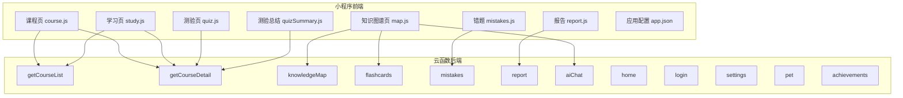
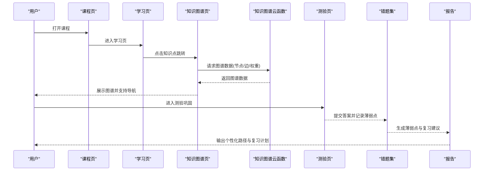
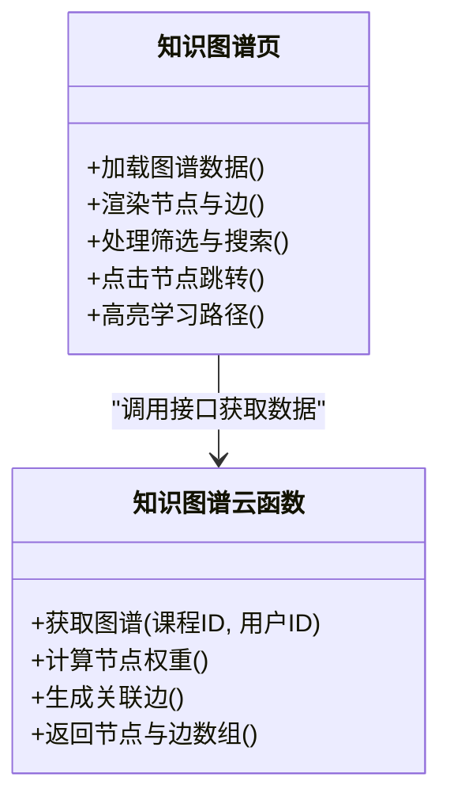
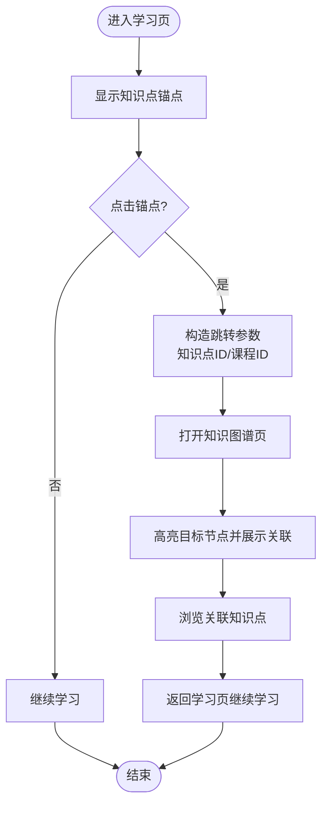
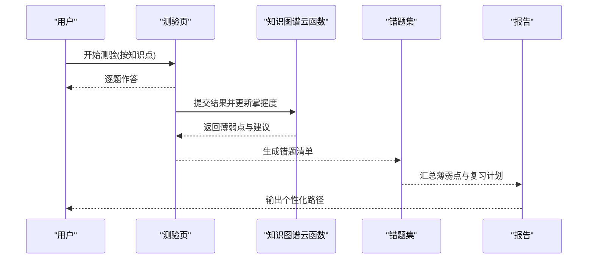
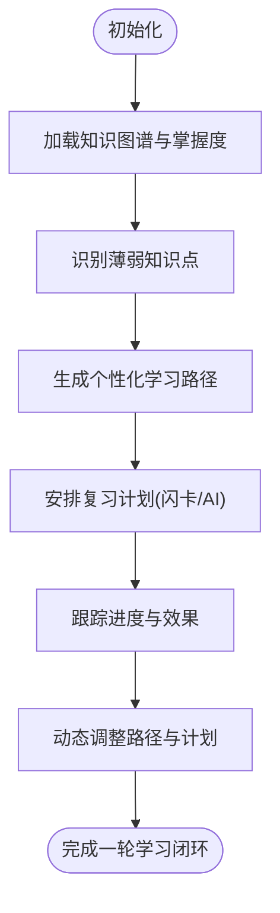
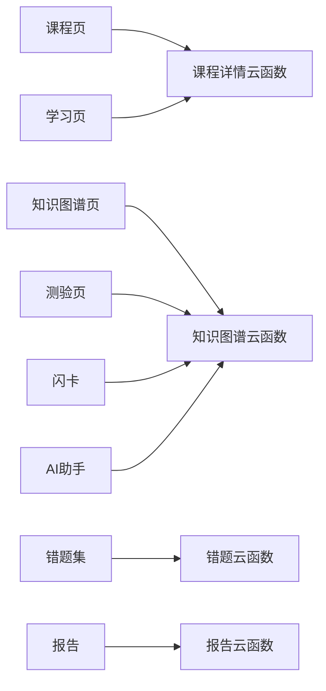

# 知识图谱集成

<cite>
**本文引用的文件**   
- [cloudfunctions/knowledgeMap/index.js](file://cloudfunctions/knowledgeMap/index.js)
- [miniprogram/pages/map/map.js](file://miniprogram/pages/map/map.js)
- [miniprogram/pages/map/map.wxml](file://miniprogram/pages/map/map.wxml)
- [miniprogram/pages/map/map.wxss](file://miniprogram/pages/map/map.wxss)
- [miniprogram/pages/course/course.js](file://miniprogram/pages/course/course.js)
- [miniprogram/pages/study/study.js](file://miniprogram/pages/study/study.js)
- [miniprogram/pages/quiz/quiz.js](file://miniprogram/pages/quiz/quiz.js)
- [miniprogram/pages/quizSummary/quizSummary.js](file://miniprogram/pages/quizSummary/quizSummary.js)
- [miniprogram/pages/mistakes/mistakes.js](file://miniprogram/pages/mistakes/mistakes.js)
- [miniprogram/pages/report/report.js](file://miniprogram/pages/report/report.js)
- [miniprogram/app.json](file://miniprogram/app.json)
- [cloudfunctions/getCourseDetail/index.js](file://cloudfunctions/getCourseDetail/index.js)
- [cloudfunctions/getCourseList/index.js](file://cloudfunctions/getCourseList/index.js)
- [cloudfunctions/flashcards/index.js](file://cloudfunctions/flashcards/index.js)
- [cloudfunctions/aiChat/index.js](file://cloudfunctions/aiChat/index.js)
- [cloudfunctions/home/index.js](file://cloudfunctions/home/index.js)
- [cloudfunctions/login/index.js](file://cloudfunctions/login/index.js)
- [cloudfunctions/settings/index.js](file://cloudfunctions/settings/index.js)
- [cloudfunctions/pet/index.js](file://cloudfunctions/pet/index.js)
- [cloudfunctions/achievements/index.js](file://cloudfunctions/achievements/index.js)
- [docs/superpowers/plans/2026-07-17-course-video-knowledge.md](file://docs/superpowers/plans/2026-07-17-course-video-knowledge.md)
- [docs/superpowers/specs/2026-07-17-course-video-knowledge-design.md](file://docs/superpowers/specs/2026-07-17-course-video-knowledge-knowledge-design.md)
</cite>

## 目录
1. [简介](#简介)
2. [项目结构](#项目结构)
3. [核心组件](#核心组件)
4. [架构总览](#架构总览)
5. [详细组件分析](#详细组件分析)
6. [依赖关系分析](#依赖关系分析)
7. [性能与体验优化](#性能与体验优化)
8. [故障排查指南](#故障排查指南)
9. [结论](#结论)
10. [附录](#附录)

## 简介
本文件面向课程学习与知识图谱的集成使用，围绕以下目标展开：
- 在课程学习中如何跳转到相关知识点
- 如何利用知识图谱进行关联学习、构建个人知识网络
- 知识点掌握状态在课程中的体现方式
- 如何通过知识图谱发现学习盲点与薄弱环节
- 基于知识图谱的个性化学习路径推荐与复习策略指导

为实现上述目标，系统采用“小程序前端 + 云函数后端”的架构。前端负责交互与可视化，后端提供课程详情、知识图谱数据、错题与复习等能力。文档将结合代码结构与业务流程，给出可操作的实践建议与排障指引。

## 项目结构
本项目为微信小程序工程，关键目录与职责如下：
- miniprogram/pages：页面逻辑与视图（课程、学习、知识图谱、测验、错题、报告等）
- cloudfunctions：云函数集合（课程列表/详情、知识图谱、错题、闪卡、AI 对话、首页、登录、设置、成就、宠物等）
- docs：产品规划与设计说明（含课程视频与知识点的集成设计）

图表来源
- [miniprogram/pages/course/course.js](file://miniprogram/pages/course/course.js)
- [miniprogram/pages/study/study.js](file://miniprogram/pages/study/study.js)
- [miniprogram/pages/map/map.js](file://miniprogram/pages/map/map.js)
- [miniprogram/pages/quiz/quiz.js](file://miniprogram/pages/quiz/quiz.js)
- [miniprogram/pages/quizSummary/quizSummary.js](file://miniprogram/pages/quizSummary/quizSummary.js)
- [miniprogram/pages/mistakes/mistakes.js](file://miniprogram/pages/mistakes/mistakes.js)
- [miniprogram/pages/report/report.js](file://miniprogram/pages/report/report.js)
- [miniprogram/app.json](file://miniprogram/app.json)
- [cloudfunctions/getCourseList/index.js](file://cloudfunctions/getCourseList/index.js)
- [cloudfunctions/getCourseDetail/index.js](file://cloudfunctions/getCourseDetail/index.js)
- [cloudfunctions/knowledgeMap/index.js](file://cloudfunctions/knowledgeMap/index.js)
- [cloudfunctions/flashcards/index.js](file://cloudfunctions/flashcards/index.js)
- [cloudfunctions/mistakes/index.js](file://cloudfunctions/mistakes/index.js)
- [cloudfunctions/report/index.js](file://cloudfunctions/report/index.js)
- [cloudfunctions/aiChat/index.js](file://cloudfunctions/aiChat/index.js)
- [cloudfunctions/home/index.js](file://cloudfunctions/home/index.js)
- [cloudfunctions/login/index.js](file://cloudfunctions/login/index.js)
- [cloudfunctions/settings/index.js](file://cloudfunctions/settings/index.js)
- [cloudfunctions/pet/index.js](file://cloudfunctions/pet/index.js)
- [cloudfunctions/achievements/index.js](file://cloudfunctions/achievements/index.js)

章节来源
- [miniprogram/app.json](file://miniprogram/app.json)
- [cloudfunctions/getCourseList/index.js](file://cloudfunctions/getCourseList/index.js)
- [cloudfunctions/getCourseDetail/index.js](file://cloudfunctions/getCourseDetail/index.js)
- [cloudfunctions/knowledgeMap/index.js](file://cloudfunctions/knowledgeMap/index.js)

## 核心组件
- 课程与学习
  - 课程列表与详情：用于加载课程大纲、视频与知识点映射，支撑从课程跳转到知识点。
  - 学习页：承载视频播放、笔记、练习与知识点跳转入口。
- 知识图谱
  - 图谱页：以图的形式展示知识点节点与边，支持筛选、高亮、导航到课程或练习。
  - 知识图谱云函数：返回节点、边、权重、标签等结构化数据，供前端渲染与交互。
- 测评与错题
  - 测验与总结：记录答题结果，更新知识点掌握度，生成薄弱点清单。
  - 错题集：聚合错误题目，按知识点分组，便于针对性复习。
- 复习与个性化
  - 闪卡：根据掌握度与遗忘曲线生成复习卡片。
  - AI 助手：基于当前知识点与薄弱项生成讲解与路径建议。
  - 报告：汇总学习进度、薄弱点与推荐路径。

章节来源
- [miniprogram/pages/course/course.js](file://miniprogram/pages/course/course.js)
- [miniprogram/pages/study/study.js](file://miniprogram/pages/study/study.js)
- [miniprogram/pages/map/map.js](file://miniprogram/pages/map/map.js)
- [cloudfunctions/knowledgeMap/index.js](file://cloudfunctions/knowledgeMap/index.js)
- [miniprogram/pages/quiz/quiz.js](file://miniprogram/pages/quiz/quiz.js)
- [miniprogram/pages/quizSummary/quizSummary.js](file://miniprogram/pages/quizSummary/quizSummary.js)
- [miniprogram/pages/mistakes/mistakes.js](file://miniprogram/pages/mistakes/mistakes.js)
- [cloudfunctions/flashcards/index.js](file://cloudfunctions/flashcards/index.js)
- [cloudfunctions/aiChat/index.js](file://cloudfunctions/aiChat/index.js)
- [cloudfunctions/report/index.js](file://cloudfunctions/report/index.js)

## 架构总览
下图展示了课程学习与知识图谱的整体交互流程：用户在课程中学习时，可通过知识点锚点跳转到知识图谱；在图谱中浏览关联知识点后，可回到课程继续学习或进入测验巩固；测验结果反馈至错题与报告，驱动个性化复习与路径推荐。

图表来源
- [miniprogram/pages/course/course.js](file://miniprogram/pages/course/course.js)
- [miniprogram/pages/study/study.js](file://miniprogram/pages/study/study.js)
- [miniprogram/pages/map/map.js](file://miniprogram/pages/map/map.js)
- [cloudfunctions/knowledgeMap/index.js](file://cloudfunctions/knowledgeMap/index.js)
- [miniprogram/pages/quiz/quiz.js](file://miniprogram/pages/quiz/quiz.js)
- [miniprogram/pages/mistakes/mistakes.js](file://miniprogram/pages/mistakes/mistakes.js)
- [miniprogram/pages/report/report.js](file://miniprogram/pages/report/report.js)

## 详细组件分析

### 知识图谱页与云函数
- 职责
  - 图谱页：渲染节点与边，支持按标签/难度/相关性筛选，点击节点跳转至课程或练习。
  - 知识图谱云函数：根据课程ID或用户上下文返回图谱数据，包含节点属性（名称、标签、难度、掌握度）、边关系（先修、关联、强化）与权重。
- 关键交互
  - 初始化：加载图谱数据，计算布局与可见范围。
  - 交互：缩放、拖拽、筛选、搜索、高亮路径。
  - 导航：点击节点跳转到课程或测验，携带知识点标识。
- 数据结构要点
  - 节点：唯一标识、名称、标签、难度、掌握度、来源课程。
  - 边：源节点、目标节点、关系类型、权重。
  - 元信息：过滤条件、排序规则、分页参数。

图表来源
- [miniprogram/pages/map/map.js](file://miniprogram/pages/map/map.js)
- [miniprogram/pages/map/map.wxml](file://miniprogram/pages/map/map.wxml)
- [miniprogram/pages/map/map.wxss](file://miniprogram/pages/map/map.wxss)
- [cloudfunctions/knowledgeMap/index.js](file://cloudfunctions/knowledgeMap/index.js)

章节来源
- [miniprogram/pages/map/map.js](file://miniprogram/pages/map/map.js)
- [miniprogram/pages/map/map.wxml](file://miniprogram/pages/map/map.wxml)
- [miniprogram/pages/map/map.wxss](file://miniprogram/pages/map/map.wxss)
- [cloudfunctions/knowledgeMap/index.js](file://cloudfunctions/knowledgeMap/index.js)

### 课程与学习页的知识点跳转
- 职责
  - 课程页：列出课程，点击进入学习页。
  - 学习页：播放视频、显示知识点锚点，支持一键跳转到知识图谱对应节点。
- 跳转流程
  - 在学习页点击知识点锚点，携带知识点ID与课程ID。
  - 打开知识图谱页，定位并高亮该节点，展示其先修与后继关系。
  - 用户可在图谱中探索关联知识点，再回跳至课程继续学习。

图表来源
- [miniprogram/pages/study/study.js](file://miniprogram/pages/study/study.js)
- [miniprogram/pages/map/map.js](file://miniprogram/pages/map/map.js)
- [cloudfunctions/getCourseDetail/index.js](file://cloudfunctions/getCourseDetail/index.js)

章节来源
- [miniprogram/pages/study/study.js](file://miniprogram/pages/study/study.js)
- [miniprogram/pages/map/map.js](file://miniprogram/pages/map/map.js)
- [cloudfunctions/getCourseDetail/index.js](file://cloudfunctions/getCourseDetail/index.js)

### 测验、错题与薄弱点发现
- 职责
  - 测验页：按知识点出题，记录答题结果与用时。
  - 测验总结：汇总正确率、耗时、薄弱知识点。
  - 错题集：按知识点分组展示错题，支持快速复习与加入闪卡。
- 薄弱点识别
  - 依据测验结果与历史表现，计算知识点掌握度与错误频次。
  - 在知识图谱中高亮薄弱节点，辅助定位学习盲点。

图表来源
- [miniprogram/pages/quiz/quiz.js](file://miniprogram/pages/quiz/quiz.js)
- [miniprogram/pages/quizSummary/quizSummary.js](file://miniprogram/pages/quizSummary/quizSummary.js)
- [miniprogram/pages/mistakes/mistakes.js](file://miniprogram/pages/mistakes/mistakes.js)
- [cloudfunctions/knowledgeMap/index.js](file://cloudfunctions/knowledgeMap/index.js)

章节来源
- [miniprogram/pages/quiz/quiz.js](file://miniprogram/pages/quiz/quiz.js)
- [miniprogram/pages/quizSummary/quizSummary.js](file://miniprogram/pages/quizSummary/quizSummary.js)
- [miniprogram/pages/mistakes/mistakes.js](file://miniprogram/pages/mistakes/mistakes.js)
- [cloudfunctions/knowledgeMap/index.js](file://cloudfunctions/knowledgeMap/index.js)

### 个性化学习路径与复习策略
- 路径推荐
  - 基于知识图谱的先修关系与掌握度，生成由易到难的渐进路径。
  - 结合错题与薄弱点，优先补齐前置知识点，再推进后续内容。
- 复习策略
  - 利用闪卡与间隔重复，针对薄弱知识点制定复习计划。
  - 通过AI助手生成讲解、类比与示例，提升理解效率。
- 报告与追踪
  - 定期生成学习报告，展示进步趋势、薄弱点变化与下一步建议。

图表来源
- [cloudfunctions/knowledgeMap/index.js](file://cloudfunctions/knowledgeMap/index.js)
- [cloudfunctions/flashcards/index.js](file://cloudfunctions/flashcards/index.js)
- [cloudfunctions/aiChat/index.js](file://cloudfunctions/aiChat/index.js)
- [cloudfunctions/report/index.js](file://cloudfunctions/report/index.js)

章节来源
- [cloudfunctions/knowledgeMap/index.js](file://cloudfunctions/knowledgeMap/index.js)
- [cloudfunctions/flashcards/index.js](file://cloudfunctions/flashcards/index.js)
- [cloudfunctions/aiChat/index.js](file://cloudfunctions/aiChat/index.js)
- [cloudfunctions/report/index.js](file://cloudfunctions/report/index.js)

## 依赖关系分析
- 前端页面依赖
  - 课程与学习页依赖课程详情云函数，用于获取课程大纲与知识点映射。
  - 知识图谱页依赖知识图谱云函数，用于获取节点与边数据。
  - 测验与错题页依赖知识图谱云函数与错题云函数，用于更新掌握度与生成错题清单。
  - 报告页依赖报告云函数，汇总学习数据并输出建议。
- 后端云函数依赖
  - 知识图谱云函数可能依赖题库与用户画像数据，以计算权重与关联边。
  - 错题与报告云函数依赖测验结果与学习行为日志。

图表来源
- [miniprogram/pages/course/course.js](file://miniprogram/pages/course/course.js)
- [miniprogram/pages/study/study.js](file://miniprogram/pages/study/study.js)
- [miniprogram/pages/map/map.js](file://miniprogram/pages/map/map.js)
- [miniprogram/pages/quiz/quiz.js](file://miniprogram/pages/quiz/quiz.js)
- [miniprogram/pages/mistakes/mistakes.js](file://miniprogram/pages/mistakes/mistakes.js)
- [miniprogram/pages/report/report.js](file://miniprogram/pages/report/report.js)
- [cloudfunctions/getCourseDetail/index.js](file://cloudfunctions/getCourseDetail/index.js)
- [cloudfunctions/knowledgeMap/index.js](file://cloudfunctions/knowledgeMap/index.js)
- [cloudfunctions/flashcards/index.js](file://cloudfunctions/flashcards/index.js)
- [cloudfunctions/aiChat/index.js](file://cloudfunctions/aiChat/index.js)
- [cloudfunctions/report/index.js](file://cloudfunctions/report/index.js)

章节来源
- [miniprogram/pages/course/course.js](file://miniprogram/pages/course/course.js)
- [miniprogram/pages/study/study.js](file://miniprogram/pages/study/study.js)
- [miniprogram/pages/map/map.js](file://miniprogram/pages/map/map.js)
- [miniprogram/pages/quiz/quiz.js](file://miniprogram/pages/quiz/quiz.js)
- [miniprogram/pages/mistakes/mistakes.js](file://miniprogram/pages/mistakes/mistakes.js)
- [miniprogram/pages/report/report.js](file://miniprogram/pages/report/report.js)
- [cloudfunctions/getCourseDetail/index.js](file://cloudfunctions/getCourseDetail/index.js)
- [cloudfunctions/knowledgeMap/index.js](file://cloudfunctions/knowledgeMap/index.js)
- [cloudfunctions/flashcards/index.js](file://cloudfunctions/flashcards/index.js)
- [cloudfunctions/aiChat/index.js](file://cloudfunctions/aiChat/index.js)
- [cloudfunctions/report/index.js](file://cloudfunctions/report/index.js)

## 性能与体验优化
- 图谱渲染
  - 对大规模节点进行分片加载与按需渲染，避免首屏卡顿。
  - 使用缓存减少重复请求，提高切换速度。
- 数据压缩
  - 对图谱数据进行字段精简与压缩传输，降低带宽占用。
- 交互优化
  - 提供筛选与搜索，缩小可视范围，提升操作响应性。
  - 懒加载与虚拟滚动，改善长列表与大图场景的体验。
- 异步与重试
  - 对网络失败进行重试与降级，保证核心功能可用。

[本节为通用性能建议，不直接分析具体文件]

## 故障排查指南
- 知识图谱无法加载
  - 检查知识图谱云函数是否返回有效节点与边数据。
  - 确认前端是否正确传递课程ID与用户上下文。
- 课程跳转失败
  - 核对课程详情页返回的知识点映射是否完整。
  - 检查跳转参数是否包含必要的知识点与课程标识。
- 测验与错题不一致
  - 确认测验结果已提交并更新至掌握度。
  - 检查错题云函数是否正确聚合错误题目并按知识点分组。
- 报告与建议不准确
  - 验证报告云函数是否汇总了足够的学习行为数据。
  - 检查个性化路径算法是否考虑了薄弱点与先修关系。

章节来源
- [cloudfunctions/knowledgeMap/index.js](file://cloudfunctions/knowledgeMap/index.js)
- [cloudfunctions/getCourseDetail/index.js](file://cloudfunctions/getCourseDetail/index.js)
- [miniprogram/pages/map/map.js](file://miniprogram/pages/map/map.js)
- [miniprogram/pages/course/course.js](file://miniprogram/pages/course/course.js)
- [miniprogram/pages/quiz/quiz.js](file://miniprogram/pages/quiz/quiz.js)
- [miniprogram/pages/mistakes/mistakes.js](file://miniprogram/pages/mistakes/mistakes.js)
- [miniprogram/pages/report/report.js](file://miniprogram/pages/report/report.js)

## 结论
通过将课程学习与知识图谱深度集成，学习者可以在课程中便捷地跳转到相关知识点，借助图谱进行关联学习与自我诊断。测验与错题机制帮助识别薄弱点，配合闪卡与AI助手形成个性化的复习策略与学习路径。整体架构清晰、扩展性强，适合持续迭代与优化。

[本节为总结性内容，不直接分析具体文件]

## 附录
- 参考设计与规划
  - 课程视频与知识点集成方案与规格说明，可作为进一步实现与优化的参考。

章节来源
- [docs/superpowers/plans/2026-07-17-course-video-knowledge.md](file://docs/superpowers/plans/2026-07-17-course-video-knowledge.md)
- [docs/superpowers/specs/2026-07-17-course-video-knowledge-design.md](file://docs/superpowers/specs/2026-07-17-course-video-knowledge-design.md)