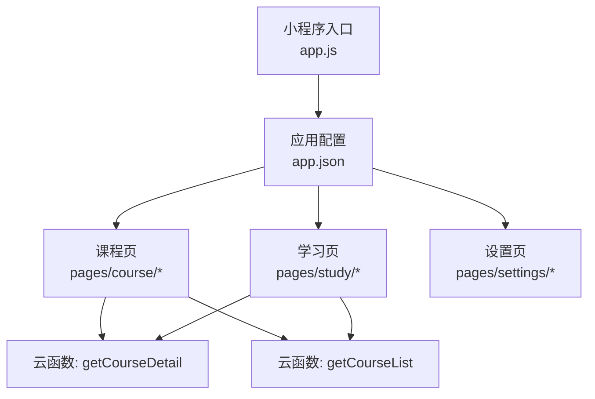
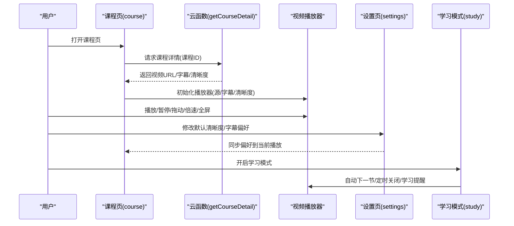
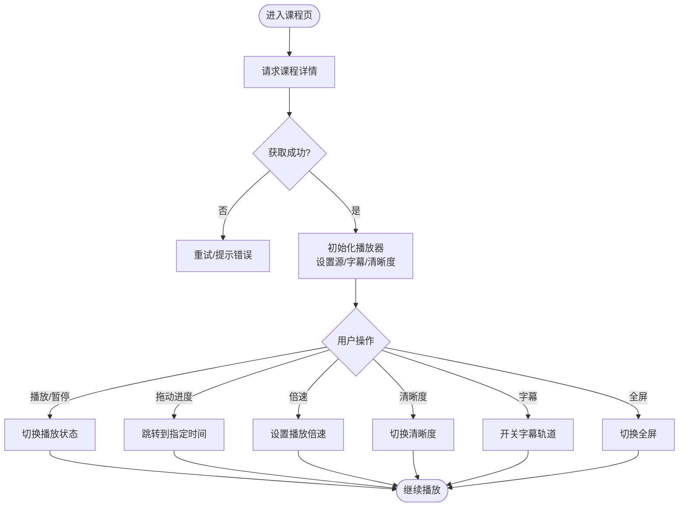
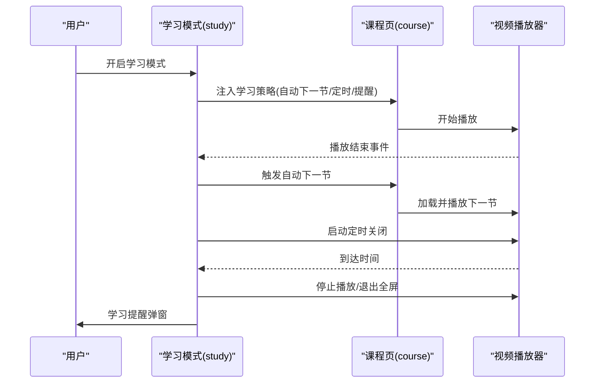
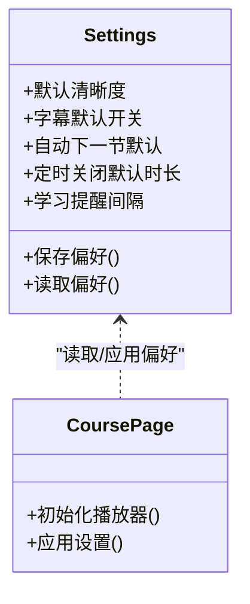
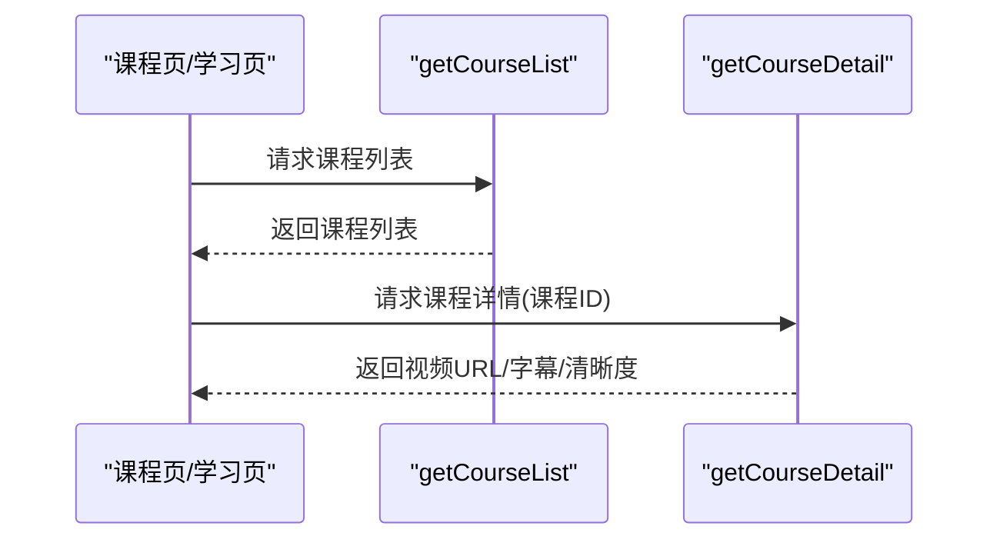
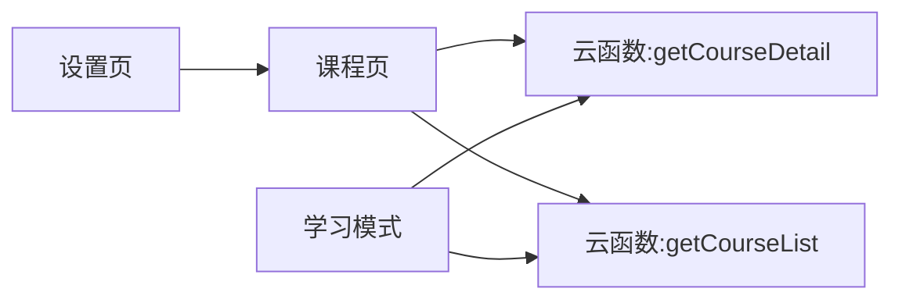

# 视频播放器

<cite>
**本文引用的文件**   
- [project.config.json](file://project.config.json)
- [app.js](file://miniprogram/app.js)
- [app.json](file://miniprogram/app.json)
- [course/course.js](file://miniprogram/pages/course/course.js)
- [course/course.wxml](file://miniprogram/pages/course/course.wxml)
- [course/course.wxss](file://miniprogram/pages/course/course.wxss)
- [study/study.js](file://miniprogram/pages/study/study.js)
- [study/study.wxml](file://miniprogram/pages/study/study.wxml)
- [settings/settings.js](file://miniprogram/pages/settings/settings.js)
- [settings/settings.wxml](file://miniprogram/pages/settings/settings.wxml)
- [cloudfunctions/getCourseDetail/index.js](file://cloudfunctions/getCourseDetail/index.js)
- [cloudfunctions/getCourseList/index.js](file://cloudfunctions/getCourseList/index.js)
</cite>

## 目录
1. [简介](#简介)
2. [项目结构](#项目结构)
3. [核心组件](#核心组件)
4. [架构总览](#架构总览)
5. [详细组件分析](#详细组件分析)
6. [依赖关系分析](#依赖关系分析)
7. [性能与体验优化建议](#性能与体验优化建议)
8. [故障排查指南](#故障排查指南)
9. [结论](#结论)
10. [附录：快捷键与手势速查](#附录快捷键与手势速查)

## 简介
本文件面向用户与开发者，系统化介绍本项目中“视频播放器”的功能与操作方式。内容覆盖播放控制（播放/暂停、进度条拖动、倍速播放）、全屏切换、字幕显示、清晰度选择等基础能力；并重点说明学习模式下的特殊功能，如自动下一节、定时关闭、学习提醒等；同时提供观看技巧（快捷键、手势）与离线缓存的使用建议。文档在技术层面给出关键实现位置与交互流程，帮助快速定位与扩展。

## 项目结构
本项目为微信小程序工程，视频播放相关页面位于 miniprogram/pages 下，云函数用于课程数据获取与详情查询。核心入口与路由配置位于 app.js 与 app.json，全局配置位于 project.config.json。

图表来源
- [app.js](file://miniprogram/app.js)
- [app.json](file://miniprogram/app.json)
- [course/course.js](file://miniprogram/pages/course/course.js)
- [study/study.js](file://miniprogram/pages/study/study.js)
- [cloudfunctions/getCourseDetail/index.js](file://cloudfunctions/getCourseDetail/index.js)
- [cloudfunctions/getCourseList/index.js](file://cloudfunctions/getCourseList/index.js)

章节来源
- [project.config.json](file://project.config.json)
- [app.js](file://miniprogram/app.js)
- [app.json](file://miniprogram/app.json)

## 核心组件
- 课程播放页（课程详情页）：承载视频播放器控件、字幕开关、清晰度切换、倍速播放、全屏切换、学习模式入口等。
- 学习模式页：聚合学习行为与辅助功能，如自动下一节、定时关闭、学习提醒等。
- 设置页：管理默认清晰度、字幕偏好、学习模式默认选项等。
- 云函数：提供课程列表与课程详情（含视频地址、字幕、清晰度档位等元数据）。

章节来源
- [course/course.js](file://miniprogram/pages/course/course.js)
- [course/course.wxml](file://miniprogram/pages/course/course.wxml)
- [study/study.js](file://miniprogram/pages/study/study.js)
- [study/study.wxml](file://miniprogram/pages/study/study.wxml)
- [settings/settings.js](file://miniprogram/pages/settings/settings.js)
- [settings/settings.wxml](file://miniprogram/pages/settings/settings.wxml)
- [cloudfunctions/getCourseDetail/index.js](file://cloudfunctions/getCourseDetail/index.js)
- [cloudfunctions/getCourseList/index.js](file://cloudfunctions/getCourseList/index.js)

## 架构总览
视频播放的数据流与控制流如下：课程页加载时调用云函数获取课程详情，解析出视频源、字幕与清晰度信息后初始化播放器；用户交互通过事件回调更新播放器状态；学习模式根据策略触发自动下一节或定时关闭；设置页持久化用户偏好。

图表来源
- [course/course.js](file://miniprogram/pages/course/course.js)
- [cloudfunctions/getCourseDetail/index.js](file://cloudfunctions/getCourseDetail/index.js)
- [settings/settings.js](file://miniprogram/pages/settings/settings.js)
- [study/study.js](file://miniprogram/pages/study/study.js)

## 详细组件分析

### 课程播放页（课程详情页）
- 职责
  - 渲染视频播放器与常用控件（播放/暂停、进度条、倍速、清晰度、字幕、全屏）。
  - 处理用户交互事件，驱动播放器状态变更。
  - 从云函数拉取课程详情，解析字幕与清晰度列表。
- 关键交互
  - 播放/暂停：点击中心或底部按钮触发。
  - 进度条拖动：拖拽滑块跳转时间。
  - 倍速播放：选择不同倍速项。
  - 清晰度选择：根据可用清晰度切换视频源。
  - 字幕显示：开关字幕轨道。
  - 全屏切换：横竖屏切换。
- 数据来源
  - 课程详情云函数返回视频地址、字幕路径、清晰度档位等元数据。
- 错误处理
  - 网络异常重试、无字幕提示、清晰度不可用降级。

图表来源
- [course/course.js](file://miniprogram/pages/course/course.js)
- [course/course.wxml](file://miniprogram/pages/course/course.wxml)
- [cloudfunctions/getCourseDetail/index.js](file://cloudfunctions/getCourseDetail/index.js)

章节来源
- [course/course.js](file://miniprogram/pages/course/course.js)
- [course/course.wxml](file://miniprogram/pages/course/course.wxml)
- [course/course.wxss](file://miniprogram/pages/course/course.wxss)
- [cloudfunctions/getCourseDetail/index.js](file://cloudfunctions/getCourseDetail/index.js)

### 学习模式（自动下一节、定时关闭、学习提醒）
- 职责
  - 在学习模式下增强播放体验：自动下一节、定时关闭、学习提醒。
- 自动下一节
  - 当当前视频播放结束，按课程顺序自动加载并播放下一节。
- 定时关闭
  - 设定倒计时，到达时间后停止播放并退出全屏或返回上一页。
- 学习提醒
  - 长时间未操作或达到学习时长阈值时弹出提醒，引导休息或继续学习。
- 与播放器联动
  - 监听播放结束事件、计时器事件、用户空闲检测。

图表来源
- [study/study.js](file://miniprogram/pages/study/study.js)
- [study/study.wxml](file://miniprogram/pages/study/study.wxml)
- [course/course.js](file://miniprogram/pages/course/course.js)

章节来源
- [study/study.js](file://miniprogram/pages/study/study.js)
- [study/study.wxml](file://miniprogram/pages/study/study.wxml)

### 设置页（默认清晰度、字幕偏好、学习模式默认）
- 职责
  - 管理用户偏好：默认清晰度、字幕是否默认开启、学习模式默认选项。
  - 将偏好持久化并在课程页加载时应用。
- 典型字段
  - 默认清晰度、字幕开关、自动下一节默认开/关、定时关闭默认时长、学习提醒间隔。
- 与课程页联动
  - 课程页初始化时读取设置，优先使用用户偏好。

图表来源
- [settings/settings.js](file://miniprogram/pages/settings/settings.js)
- [settings/settings.wxml](file://miniprogram/pages/settings/settings.wxml)
- [course/course.js](file://miniprogram/pages/course/course.js)

章节来源
- [settings/settings.js](file://miniprogram/pages/settings/settings.js)
- [settings/settings.wxml](file://miniprogram/pages/settings/settings.wxml)

### 云函数（课程列表与详情）
- 职责
  - 提供课程列表与课程详情接口，包含视频地址、字幕、清晰度档位等元数据。
- 接口要点
  - 课程列表：返回课程集合。
  - 课程详情：根据课程ID返回具体视频资源与附加信息。
- 错误处理
  - 参数校验失败、数据库查询异常、网络超时等。

图表来源
- [cloudfunctions/getCourseList/index.js](file://cloudfunctions/getCourseList/index.js)
- [cloudfunctions/getCourseDetail/index.js](file://cloudfunctions/getCourseDetail/index.js)

章节来源
- [cloudfunctions/getCourseList/index.js](file://cloudfunctions/getCourseList/index.js)
- [cloudfunctions/getCourseDetail/index.js](file://cloudfunctions/getCourseDetail/index.js)

## 依赖关系分析
- 页面与云函数
  - 课程页与学习页依赖云函数获取课程数据。
- 页面内部耦合
  - 课程页负责播放器控制与UI；学习模式页负责策略编排；设置页负责偏好管理。
- 外部依赖
  - 小程序原生播放器能力（播放/暂停、进度、倍速、全屏、字幕、清晰度切换）。

图表来源
- [course/course.js](file://miniprogram/pages/course/course.js)
- [study/study.js](file://miniprogram/pages/study/study.js)
- [settings/settings.js](file://miniprogram/pages/settings/settings.js)
- [cloudfunctions/getCourseDetail/index.js](file://cloudfunctions/getCourseDetail/index.js)
- [cloudfunctions/getCourseList/index.js](file://cloudfunctions/getCourseList/index.js)

章节来源
- [course/course.js](file://miniprogram/pages/course/course.js)
- [study/study.js](file://miniprogram/pages/study/study.js)
- [settings/settings.js](file://miniprogram/pages/settings/settings.js)
- [cloudfunctions/getCourseDetail/index.js](file://cloudfunctions/getCourseDetail/index.js)
- [cloudfunctions/getCourseList/index.js](file://cloudfunctions/getCourseList/index.js)

## 性能与体验优化建议
- 预加载与缓存
  - 在课程列表页预取下一节视频的元数据，减少等待时间。
  - 对字幕文件进行本地缓存，避免重复下载。
- 清晰度自适应
  - 根据网络质量动态切换清晰度，提升流畅度。
- 播放器复用
  - 同一会话内复用播放器实例，避免频繁销毁重建。
- 学习模式节流
  - 定时关闭与学习提醒采用节流策略，避免频繁弹窗影响体验。

[本节为通用建议，不直接分析具体文件]

## 故障排查指南
- 无法加载视频
  - 检查课程详情云函数返回的视频地址是否有效。
  - 确认网络权限与域名白名单配置。
- 字幕不显示
  - 检查字幕路径是否正确、格式是否受支持。
  - 确认字幕开关未被设置页禁用。
- 清晰度切换无效
  - 检查清晰度列表是否为空或全部不可用。
  - 确认当前网络带宽与清晰度档位匹配。
- 自动下一节未触发
  - 检查学习模式是否开启以及播放结束事件是否正常上报。
- 定时关闭未生效
  - 检查定时器是否被意外清除或页面生命周期导致中断。

章节来源
- [course/course.js](file://miniprogram/pages/course/course.js)
- [study/study.js](file://miniprogram/pages/study/study.js)
- [settings/settings.js](file://miniprogram/pages/settings/settings.js)
- [cloudfunctions/getCourseDetail/index.js](file://cloudfunctions/getCourseDetail/index.js)

## 结论
本项目围绕小程序原生播放器能力，结合云函数提供的课程数据，构建了完整的视频播放与学习模式体验。通过设置页的偏好管理与学习模式的自动化策略，用户在观看过程中可获得更智能、便捷的学习体验。建议在后续迭代中持续优化预加载、清晰度自适应与错误恢复机制，进一步提升稳定性与流畅度。

[本节为总结性内容，不直接分析具体文件]

## 附录：快捷键与手势速查
- 键盘快捷键（桌面端模拟器）
  - 空格：播放/暂停
  - 方向键左右：快进/快退
  - M：静音/取消静音
  - F：全屏切换
  - I：显示/隐藏字幕
  - R：循环播放开关
- 手势操作（移动端）
  - 单击屏幕中央：播放/暂停
  - 双击屏幕右侧：快进
  - 双击屏幕左侧：快退
  - 左右滑动：调节亮度
  - 上下滑动：调节音量
  - 双指捏合：缩放画面
- 离线缓存
  - 在课程详情页长按视频封面或点击“缓存”按钮，选择清晰度与缓存大小。
  - 缓存完成后在“我的-离线视频”中查看与管理。

[本节为概念性说明，不直接分析具体文件]