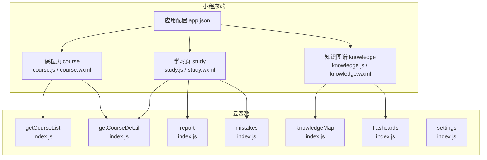
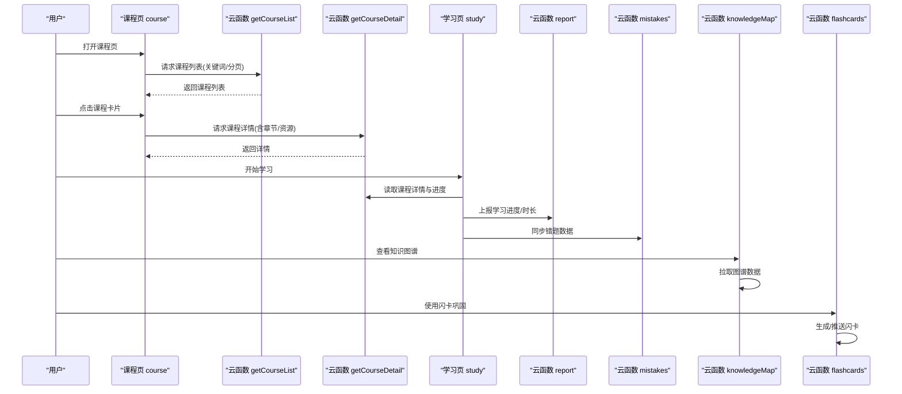
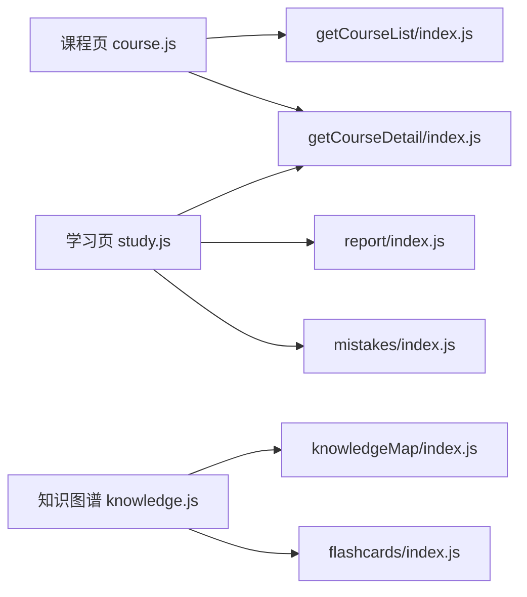

# 课程学习

<cite>
**本文引用的文件**   
- [miniprogram/pages/course/course.js](file://miniprogram/pages/course/course.js)
- [miniprogram/pages/course/course.wxml](file://miniprogram/pages/course/course.wxml)
- [miniprogram/pages/study/study.js](file://miniprogram/pages/study/study.js)
- [miniprogram/pages/study/study.wxml](file://miniprogram/pages/study/study.wxml)
- [miniprogram/pages/knowledge/knowledge.js](file://miniprogram/pages/knowledge/knowledge.js)
- [miniprogram/pages/knowledge/knowledge.wxml](file://miniprogram/pages/knowledge/knowledge.wxml)
- [cloudfunctions/getCourseList/index.js](file://cloudfunctions/getCourseList/index.js)
- [cloudfunctions/getCourseDetail/index.js](file://cloudfunctions/getCourseDetail/index.js)
- [cloudfunctions/knowledgeMap/index.js](file://cloudfunctions/knowledgeMap/index.js)
- [cloudfunctions/flashcards/index.js](file://cloudfunctions/flashcards/index.js)
- [cloudfunctions/mistakes/index.js](file://cloudfunctions/mistakes/index.js)
- [cloudfunctions/report/index.js](file://cloudfunctions/report/index.js)
- [cloudfunctions/settings/index.js](file://cloudfunctions/settings/index.js)
- [miniprogram/app.json](file://miniprogram/app.json)
</cite>

## 目录
1. [简介](#简介)
2. [项目结构](#项目结构)
3. [核心组件](#核心组件)
4. [架构总览](#架构总览)
5. [详细组件分析](#详细组件分析)
6. [依赖关系分析](#依赖关系分析)
7. [性能与体验优化建议](#性能与体验优化建议)
8. [故障排查指南](#故障排查指南)
9. [结论](#结论)
10. [附录：高效学习与时间管理](#附录高效学习与时间管理)

## 简介
本文件面向“课程学习”功能，提供从入门到进阶的完整使用指南。内容覆盖：
- 课程浏览与搜索
- 视频播放控制与章节跳转
- 学习进度跟踪与报告
- 笔记记录与错题回顾
- 学习计划管理与知识图谱辅助学习
- 高效学习技巧与时间管理建议

## 项目结构
小程序端页面与云函数分工清晰：
- 小程序端负责交互、渲染与本地状态管理
- 云函数负责数据获取、持久化与业务计算（如课程列表、详情、知识图谱、错题、报告等）

图表来源
- [miniprogram/pages/course/course.js](file://miniprogram/pages/course/course.js)
- [miniprogram/pages/study/study.js](file://miniprogram/pages/study/study.js)
- [miniprogram/pages/knowledge/knowledge.js](file://miniprogram/pages/knowledge/knowledge.js)
- [cloudfunctions/getCourseList/index.js](file://cloudfunctions/getCourseList/index.js)
- [cloudfunctions/getCourseDetail/index.js](file://cloudfunctions/getCourseDetail/index.js)
- [cloudfunctions/knowledgeMap/index.js](file://cloudfunctions/knowledgeMap/index.js)
- [cloudfunctions/flashcards/index.js](file://cloudfunctions/flashcards/index.js)
- [cloudfunctions/mistakes/index.js](file://cloudfunctions/mistakes/index.js)
- [cloudfunctions/report/index.js](file://cloudfunctions/report/index.js)
- [cloudfunctions/settings/index.js](file://cloudfunctions/settings/index.js)
- [miniprogram/app.json](file://miniprogram/app.json)

章节来源
- [miniprogram/app.json](file://miniprogram/app.json)

## 核心组件
- 课程浏览与搜索
  - 入口：课程页（course），通过云函数 getCourseList 获取课程列表，支持关键词筛选与分页加载。
  - 操作：点击课程卡片进入课程详情或开始学习。
- 视频播放与章节跳转
  - 入口：学习页（study），承载播放器与章节导航，支持暂停、倍速、全屏、进度保存与断点续播。
  - 章节：根据课程详情返回的章节列表进行跳转与顺序切换。
- 学习进度跟踪
  - 学习完成后上报 report 云函数，更新累计时长、完成度与里程碑；支持查看个人学习报告。
- 笔记记录
  - 在播放器界面添加时间戳笔记，关联当前章节与知识点，便于复习与检索。
- 错题回顾
  - 通过 mistakes 云函数汇总历史错误题目，按知识点聚合，支持导出与专项练习。
- 知识图谱辅助学习
  - 通过 knowledgeMap 云函数拉取知识节点与关系，结合 flashcards 进行间隔重复记忆。
- 学习计划管理
  - 通过 settings 云函数维护学习目标、每日计划与提醒策略，配合报告反馈动态调整。

章节来源
- [miniprogram/pages/course/course.js](file://miniprogram/pages/course/course.js)
- [miniprogram/pages/study/study.js](file://miniprogram/pages/study/study.js)
- [cloudfunctions/getCourseList/index.js](file://cloudfunctions/getCourseList/index.js)
- [cloudfunctions/getCourseDetail/index.js](file://cloudfunctions/getCourseDetail/index.js)
- [cloudfunctions/report/index.js](file://cloudfunctions/report/index.js)
- [cloudfunctions/mistakes/index.js](file://cloudfunctions/mistakes/index.js)
- [cloudfunctions/knowledgeMap/index.js](file://cloudfunctions/knowledgeMap/index.js)
- [cloudfunctions/flashcards/index.js](file://cloudfunctions/flashcards/index.js)
- [cloudfunctions/settings/index.js](file://cloudfunctions/settings/index.js)

## 架构总览
整体采用“小程序前端 + 云函数后端”的分层架构。前端页面负责用户交互与视图渲染，云函数承担数据访问与业务逻辑。关键调用路径如下：

图表来源
- [miniprogram/pages/course/course.js](file://miniprogram/pages/course/course.js)
- [miniprogram/pages/study/study.js](file://miniprogram/pages/study/study.js)
- [cloudfunctions/getCourseList/index.js](file://cloudfunctions/getCourseList/index.js)
- [cloudfunctions/getCourseDetail/index.js](file://cloudfunctions/getCourseDetail/index.js)
- [cloudfunctions/report/index.js](file://cloudfunctions/report/index.js)
- [cloudfunctions/mistakes/index.js](file://cloudfunctions/mistakes/index.js)
- [cloudfunctions/knowledgeMap/index.js](file://cloudfunctions/knowledgeMap/index.js)
- [cloudfunctions/flashcards/index.js](file://cloudfunctions/flashcards/index.js)

## 详细组件分析

### 课程浏览与搜索（课程页）
- 功能要点
  - 列表展示：课程封面、标题、难度、标签、更新时间等。
  - 搜索过滤：支持关键词匹配、分类筛选、排序与分页。
  - 进入详情：点击课程卡片后跳转到课程详情或直接进入学习页。
- 交互流程
  - 初始化时调用 getCourseList 获取数据；输入关键词或选择分类后重新请求。
  - 下拉刷新与上拉加载更多。
- 注意事项
  - 网络异常时显示重试提示。
  - 大数据量场景下启用分页与节流。

章节来源
- [miniprogram/pages/course/course.js](file://miniprogram/pages/course/course.js)
- [cloudfunctions/getCourseList/index.js](file://cloudfunctions/getCourseList/index.js)

### 视频播放控制与章节跳转（学习页）
- 功能要点
  - 播放控制：播放/暂停、快进/快退、倍速、全屏、画中画。
  - 章节导航：根据课程详情中的章节列表进行跳转，支持顺序/倒序切换。
  - 进度保存：自动保存播放位置、已学章节与学习时长，支持断点续播。
  - 笔记插入：在任意时间点添加笔记，并关联当前章节与知识点。
- 交互流程
  - 进入学习页后加载课程详情与已有进度；播放过程中定时上报进度。
  - 章节切换时重置播放器状态并恢复对应进度。
- 注意事项
  - 弱网环境下优先保证音频流畅，必要时降级画质。
  - 长时间学习需提示休息与护眼模式。

章节来源
- [miniprogram/pages/study/study.js](file://miniprogram/pages/study/study.js)
- [miniprogram/pages/study/study.wxml](file://miniprogram/pages/study/study.wxml)
- [cloudfunctions/getCourseDetail/index.js](file://cloudfunctions/getCourseDetail/index.js)
- [cloudfunctions/report/index.js](file://cloudfunctions/report/index.js)

### 学习进度跟踪与报告
- 功能要点
  - 实时统计：学习时长、完成章节数、连续学习天数。
  - 周期报告：日/周/月维度总结，包含薄弱知识点与提升建议。
  - 目标对比：与实际完成情况对比，给出达成率与下一步建议。
- 交互流程
  - 学习结束时上报 report；用户可在个人中心查看报告与趋势图。
- 注意事项
  - 数据上报需去抖与合并，避免频繁请求。
  - 离线学习可缓存进度，联网后批量同步。

章节来源
- [cloudfunctions/report/index.js](file://cloudfunctions/report/index.js)
- [cloudfunctions/mistakes/index.js](file://cloudfunctions/mistakes/index.js)

### 笔记记录与错题回顾
- 功能要点
  - 笔记：时间戳+文本+可选图片/链接，支持按课程/章节/知识点检索。
  - 错题：自动收集答题错误，按知识点聚合，支持导出与重练。
- 交互流程
  - 在学习页快速添加笔记；在错题页查看与复习。
- 注意事项
  - 笔记容量较大时需分页加载与压缩上传。
  - 错题数据定期归档，避免影响查询性能。

章节来源
- [cloudfunctions/mistakes/index.js](file://cloudfunctions/mistakes/index.js)

### 知识图谱与闪卡巩固
- 功能要点
  - 知识图谱：以节点与边表示知识点关系，支持高亮当前学习路径与推荐下一步。
  - 闪卡：基于间隔重复算法推送卡片，强化记忆。
- 交互流程
  - 进入知识图谱页拉取图谱数据；点击节点查看相关课程与闪卡。
- 注意事项
  - 图谱数据量大时按需加载子图。
  - 闪卡推送频率与难度自适应调整。

章节来源
- [miniprogram/pages/knowledge/knowledge.js](file://miniprogram/pages/knowledge/knowledge.js)
- [miniprogram/pages/knowledge/knowledge.wxml](file://miniprogram/pages/knowledge/knowledge.wxml)
- [cloudfunctions/knowledgeMap/index.js](file://cloudfunctions/knowledgeMap/index.js)
- [cloudfunctions/flashcards/index.js](file://cloudfunctions/flashcards/index.js)

### 学习计划管理
- 功能要点
  - 目标设定：每日学习时长、每周课程数量、重点知识点。
  - 提醒策略：固定时段提醒、弹性补学、周末集中复习。
  - 动态调整：根据报告反馈自动微调计划。
- 交互流程
  - 在设置中维护计划；系统根据学习行为与报告结果给出建议。
- 注意事项
  - 计划变更需保留历史记录以便复盘。
  - 提醒消息需考虑用户免打扰时段。

章节来源
- [cloudfunctions/settings/index.js](file://cloudfunctions/settings/index.js)

## 依赖关系分析
- 页面与云函数依赖
  - 课程页依赖 getCourseList 与 getCourseDetail。
  - 学习页依赖 getCourseDetail、report、mistakes。
  - 知识图谱页依赖 knowledgeMap 与 flashcards。
- 数据流向
  - 前端发起请求 -> 云函数处理 -> 返回结构化数据 -> 前端渲染与交互。
- 潜在耦合点
  - 课程详情结构与章节字段需前后端一致。
  - 进度上报字段需与报告统计口径对齐。

图表来源
- [miniprogram/pages/course/course.js](file://miniprogram/pages/course/course.js)
- [miniprogram/pages/study/study.js](file://miniprogram/pages/study/study.js)
- [miniprogram/pages/knowledge/knowledge.js](file://miniprogram/pages/knowledge/knowledge.js)
- [cloudfunctions/getCourseList/index.js](file://cloudfunctions/getCourseList/index.js)
- [cloudfunctions/getCourseDetail/index.js](file://cloudfunctions/getCourseDetail/index.js)
- [cloudfunctions/report/index.js](file://cloudfunctions/report/index.js)
- [cloudfunctions/mistakes/index.js](file://cloudfunctions/mistakes/index.js)
- [cloudfunctions/knowledgeMap/index.js](file://cloudfunctions/knowledgeMap/index.js)
- [cloudfunctions/flashcards/index.js](file://cloudfunctions/flashcards/index.js)

## 性能与体验优化建议
- 列表与详情
  - 列表分页加载、图片懒加载与缩略图缓存。
  - 详情接口返回必要字段，减少冗余传输。
- 播放体验
  - 预加载下一章节片段；弱网自动降码率。
  - 进度上报去抖合并，降低请求频率。
- 知识图谱
  - 按需加载子图，节点与边数据分页。
  - 闪卡推送采用增量更新。
- 通用
  - 错误重试与友好提示；离线缓存关键数据。
  - 埋点监控关键路径耗时与失败率。

[本节为通用指导，无需代码来源]

## 故障排查指南
- 课程列表无法加载
  - 检查网络权限与云函数部署状态；确认 getCourseList 返回格式。
- 视频无法播放或卡顿
  - 检查视频源地址与域名白名单；尝试切换清晰度或关闭硬件解码。
- 进度未同步
  - 检查 report 上报是否成功；确认去抖逻辑与网络重试。
- 知识图谱空白
  - 检查 knowledgeMap 返回的节点与边数据；确认前端渲染条件。
- 闪卡不出现
  - 检查 flashcards 推送规则与用户学习行为数据。

章节来源
- [cloudfunctions/getCourseList/index.js](file://cloudfunctions/getCourseList/index.js)
- [cloudfunctions/getCourseDetail/index.js](file://cloudfunctions/getCourseDetail/index.js)
- [cloudfunctions/report/index.js](file://cloudfunctions/report/index.js)
- [cloudfunctions/knowledgeMap/index.js](file://cloudfunctions/knowledgeMap/index.js)
- [cloudfunctions/flashcards/index.js](file://cloudfunctions/flashcards/index.js)

## 结论
本课程学习模块以“课程浏览—视频学习—进度跟踪—知识图谱—闪卡巩固—计划管理”为主线，形成闭环学习体验。通过合理的前后端职责划分与数据流设计，既保证了用户体验，也为后续扩展（如个性化推荐、智能答疑）预留了空间。

[本节为总结性内容，无需代码来源]

## 附录：高效学习与时间管理
- 番茄工作法：25分钟专注学习+5分钟休息，每4个循环长休息。
- 主动回忆：用闪卡与自测替代被动阅读，提高记忆留存。
- 间隔重复：将难点分散在不同天复习，利用遗忘曲线。
- 主题式学习：围绕一个知识点串联课程、笔记与闪卡，构建知识网络。
- 微习惯：每天固定小目标（如10分钟复习错题），持续积累。
- 环境设计：减少干扰源，固定学习时间与地点，建立仪式感。
- 复盘机制：每周回顾报告，调整计划与学习方法。

[本节为通用指导，无需代码来源]