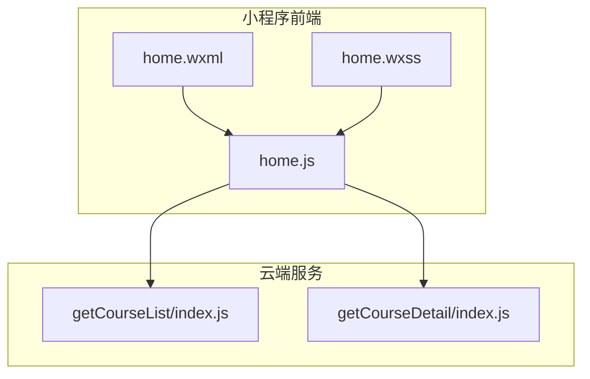
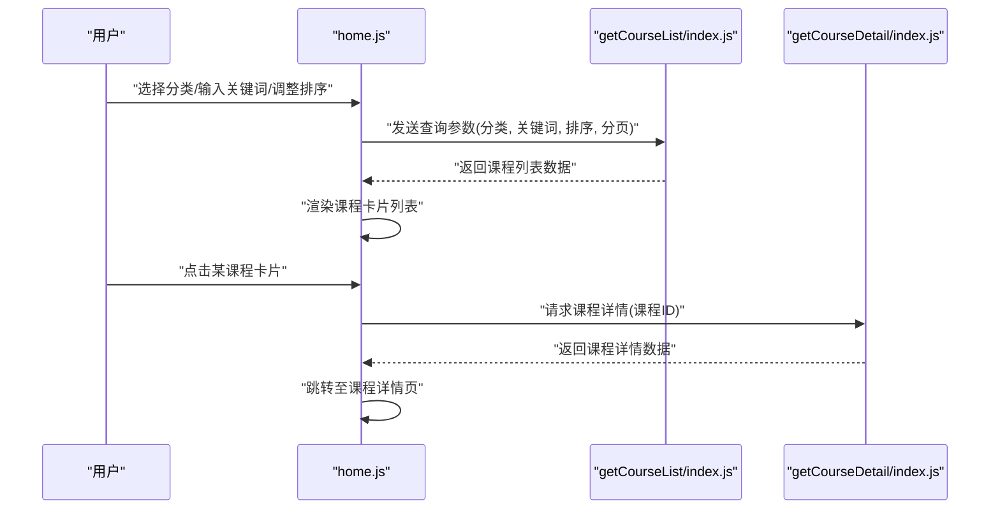
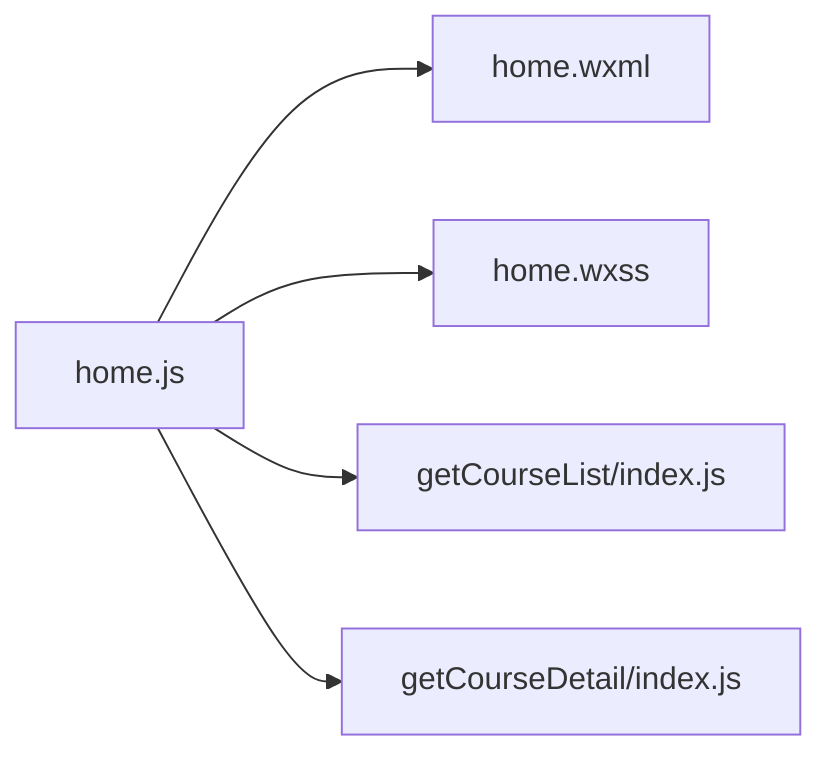

# 课程浏览与搜索

<cite>
**本文引用的文件**   
- [miniprogram/pages/home/home.js](file://miniprogram/pages/home/home.js)
- [miniprogram/pages/home/home.wxml](file://miniprogram/pages/home/home.wxml)
- [miniprogram/pages/home/home.wxss](file://miniprogram/pages/home/home.wxss)
- [cloudfunctions/getCourseList/index.js](file://cloudfunctions/getCourseList/index.js)
- [cloudfunctions/getCourseDetail/index.js](file://cloudfunctions/getCourseDetail/index.js)
- [docs/courselist.md](file://docs/courselist.md)
</cite>

## 目录
1. [简介](#简介)
2. [项目结构](#项目结构)
3. [核心组件](#核心组件)
4. [架构总览](#架构总览)
5. [详细组件分析](#详细组件分析)
6. [依赖分析](#依赖分析)
7. [性能考虑](#性能考虑)
8. [故障排查指南](#故障排查指南)
9. [结论](#结论)
10. [附录](#附录)

## 简介
本章节面向用户，说明如何在小程序中浏览与搜索课程。内容涵盖：
- 查看课程列表、使用分类筛选、关键词搜索、排序等常用操作
- 课程卡片展示的信息项（如标题、简介、难度等级、学习人数等）
- 高效查找课程的技巧
- 课程状态标识（进行中、已完成、未开始）的含义与操作方法

## 项目结构
与“课程浏览与搜索”相关的前端页面位于 miniprogram/pages/home，后端能力由云函数 getCourseList 提供；课程详情由 getCourseDetail 提供。文档 docs/courselist.md 包含课程列表相关的说明。

图表来源
- [miniprogram/pages/home/home.js](file://miniprogram/pages/home/home.js)
- [miniprogram/pages/home/home.wxml](file://miniprogram/pages/home/home.wxml)
- [miniprogram/pages/home/home.wxss](file://miniprogram/pages/home/home.wxss)
- [cloudfunctions/getCourseList/index.js](file://cloudfunctions/getCourseList/index.js)
- [cloudfunctions/getCourseDetail/index.js](file://cloudfunctions/getCourseDetail/index.js)

章节来源
- [miniprogram/pages/home/home.js](file://miniprogram/pages/home/home.js)
- [miniprogram/pages/home/home.wxml](file://miniprogram/pages/home/home.wxml)
- [miniprogram/pages/home/home.wxss](file://miniprogram/pages/home/home.wxss)
- [cloudfunctions/getCourseList/index.js](file://cloudfunctions/getCourseList/index.js)
- [cloudfunctions/getCourseDetail/index.js](file://cloudfunctions/getCourseDetail/index.js)
- [docs/courselist.md](file://docs/courselist.md)

## 核心组件
- 首页课程列表页（home）：负责渲染课程列表、承载筛选/搜索/排序交互，并调用云函数获取数据。
- 云函数 getCourseList：提供课程列表查询能力，支持按条件过滤与分页。
- 云函数 getCourseDetail：提供课程详情查询能力，用于进入课程详情页后加载完整信息。

章节来源
- [miniprogram/pages/home/home.js](file://miniprogram/pages/home/home.js)
- [cloudfunctions/getCourseList/index.js](file://cloudfunctions/getCourseList/index.js)
- [cloudfunctions/getCourseDetail/index.js](file://cloudfunctions/getCourseDetail/index.js)

## 架构总览
下图展示了从用户操作到数据返回的端到端流程：用户在首页进行筛选、搜索或排序，前端将请求参数发送至云函数 getCourseList，返回课程列表数据后渲染到页面；点击课程卡片进入详情页时，调用 getCourseDetail 获取详细信息。

图表来源
- [miniprogram/pages/home/home.js](file://miniprogram/pages/home/home.js)
- [cloudfunctions/getCourseList/index.js](file://cloudfunctions/getCourseList/index.js)
- [cloudfunctions/getCourseDetail/index.js](file://cloudfunctions/getCourseDetail/index.js)

## 详细组件分析

### 首页课程列表（home）
- 功能要点
  - 展示课程列表卡片，支持分类筛选、关键词搜索、排序切换。
  - 根据用户操作更新查询参数，重新拉取数据并刷新列表。
  - 点击课程卡片跳转到课程详情页。
- 关键交互
  - 分类筛选：在顶部或侧边选择目标分类，触发列表刷新。
  - 关键词搜索：在搜索框输入关键词，实时或提交后刷新列表。
  - 排序：切换排序方式（如热度、最新等），刷新列表。
- 数据流
  - 前端维护当前筛选/搜索/排序状态，组合为查询参数。
  - 调用云函数 getCourseList 获取结果，更新本地数据并渲染。
- 错误处理
  - 网络异常或无数据时，显示空态提示或重试入口。
  - 分页加载失败时，保留已加载数据并提示用户。

章节来源
- [miniprogram/pages/home/home.js](file://miniprogram/pages/home/home.js)
- [miniprogram/pages/home/home.wxml](file://miniprogram/pages/home/home.wxml)
- [miniprogram/pages/home/home.wxss](file://miniprogram/pages/home/home.wxss)

### 云函数：课程列表（getCourseList）
- 职责
  - 接收前端传入的分类、关键词、排序、分页等参数。
  - 执行数据库查询与过滤，返回课程列表及总数等信息。
- 典型参数
  - 分类：用于限定课程所属类别。
  - 关键词：对课程标题或简介进行模糊匹配。
  - 排序：指定排序字段与方向（如热度、创建时间）。
  - 分页：页码与每页数量。
- 返回结构
  - 课程列表数组、总数、是否还有下一页等。

章节来源
- [cloudfunctions/getCourseList/index.js](file://cloudfunctions/getCourseList/index.js)

### 云函数：课程详情（getCourseDetail）
- 职责
  - 根据课程ID返回课程详细信息，供详情页展示。
- 典型参数
  - 课程ID：唯一标识课程。
- 返回结构
  - 课程基本信息、章节/课时、学习进度、状态等。

章节来源
- [cloudfunctions/getCourseDetail/index.js](file://cloudfunctions/getCourseDetail/index.js)

### 课程卡片信息与状态
- 卡片信息项
  - 课程标题：课程名称。
  - 简介：简短描述课程主要内容。
  - 难度等级：入门/进阶/高级等。
  - 学习人数：参与学习的用户数。
  - 其他可能字段：封面图、标签、更新时间等。
- 课程状态标识
  - 未开始：尚未开始学习。
  - 进行中：已开始但未完成。
  - 已完成：已完成全部学习内容。
- 操作方法
  - 点击卡片进入课程详情页，可查看详细进度与下一步学习建议。
  - 在详情页内可进行“继续学习”、“标记完成”等操作（以实际页面为准）。

章节来源
- [miniprogram/pages/home/home.wxml](file://miniprogram/pages/home/home.wxml)
- [miniprogram/pages/home/home.js](file://miniprogram/pages/home/home.js)
- [cloudfunctions/getCourseDetail/index.js](file://cloudfunctions/getCourseDetail/index.js)

### 高效查找课程技巧
- 先分类再关键词：先选择目标分类缩小范围，再输入关键词精准定位。
- 利用排序：按“最新”快速找到新上线课程；按“热度”发现热门课程。
- 组合筛选：同时使用分类+关键词+排序，提高命中率。
- 关注状态：优先选择“进行中”的课程，便于延续学习路径。
- 收藏与历史记录：将感兴趣课程加入收藏，后续快速回看。

[本节为通用指导，不直接分析具体文件]

## 依赖分析
- 前端依赖
  - home.js 依赖 home.wxml 与 home.wxss 完成结构与样式渲染。
  - home.js 通过云开发调用 getCourseList 与 getCourseDetail。
- 后端依赖
  - getCourseList 与 getCourseDetail 各自独立，分别承担列表与详情查询。

图表来源
- [miniprogram/pages/home/home.js](file://miniprogram/pages/home/home.js)
- [miniprogram/pages/home/home.wxml](file://miniprogram/pages/home/home.wxml)
- [miniprogram/pages/home/home.wxss](file://miniprogram/pages/home/home.wxss)
- [cloudfunctions/getCourseList/index.js](file://cloudfunctions/getCourseList/index.js)
- [cloudfunctions/getCourseDetail/index.js](file://cloudfunctions/getCourseDetail/index.js)

章节来源
- [miniprogram/pages/home/home.js](file://miniprogram/pages/home/home.js)
- [miniprogram/pages/home/home.wxml](file://miniprogram/pages/home/home.wxml)
- [miniprogram/pages/home/home.wxss](file://miniprogram/pages/home/home.wxss)
- [cloudfunctions/getCourseList/index.js](file://cloudfunctions/getCourseList/index.js)
- [cloudfunctions/getCourseDetail/index.js](file://cloudfunctions/getCourseDetail/index.js)

## 性能考虑
- 分页加载：合理设置每页数量，避免一次性加载过多数据。
- 防抖搜索：关键词输入采用防抖策略，减少频繁请求。
- 缓存策略：对热点课程列表或详情做短期缓存，降低重复请求。
- 图片优化：课程封面图使用合适尺寸与压缩格式，提升首屏加载速度。
- 懒加载：仅在当前可视区域渲染卡片，减少不必要的 DOM 节点。

[本节为通用指导，不直接分析具体文件]

## 故障排查指南
- 列表为空
  - 检查筛选条件是否过严，尝试放宽分类或清空关键词。
  - 确认网络连接正常，必要时重试或切换网络环境。
- 搜索无结果
  - 尝试缩短关键词或使用同义词。
  - 确认课程是否存在于所选分类下。
- 排序无效
  - 确认当前排序选项是否被后端支持。
  - 检查是否因分页导致排序表现不一致，尝试重置页码。
- 详情无法加载
  - 核对课程ID是否正确。
  - 检查权限与登录状态，确保具备访问该课程的权限。

章节来源
- [miniprogram/pages/home/home.js](file://miniprogram/pages/home/home.js)
- [cloudfunctions/getCourseList/index.js](file://cloudfunctions/getCourseList/index.js)
- [cloudfunctions/getCourseDetail/index.js](file://cloudfunctions/getCourseDetail/index.js)

## 结论
通过首页的课程列表页与云函数配合，用户可以便捷地完成课程浏览、分类筛选、关键词搜索与排序操作。结合课程卡片信息与状态标识，用户能够快速定位感兴趣的内容并持续学习。遵循上述高效技巧与排障建议，可获得更流畅的学习体验。

[本节为总结性内容，不直接分析具体文件]

## 附录
- 参考文档
  - 课程列表相关说明见 docs/courselist.md。

章节来源
- [docs/courselist.md](file://docs/courselist.md)