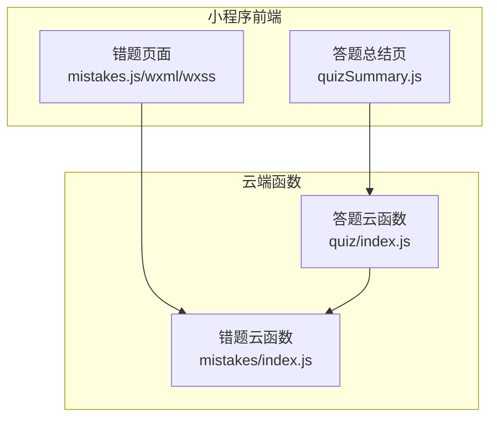
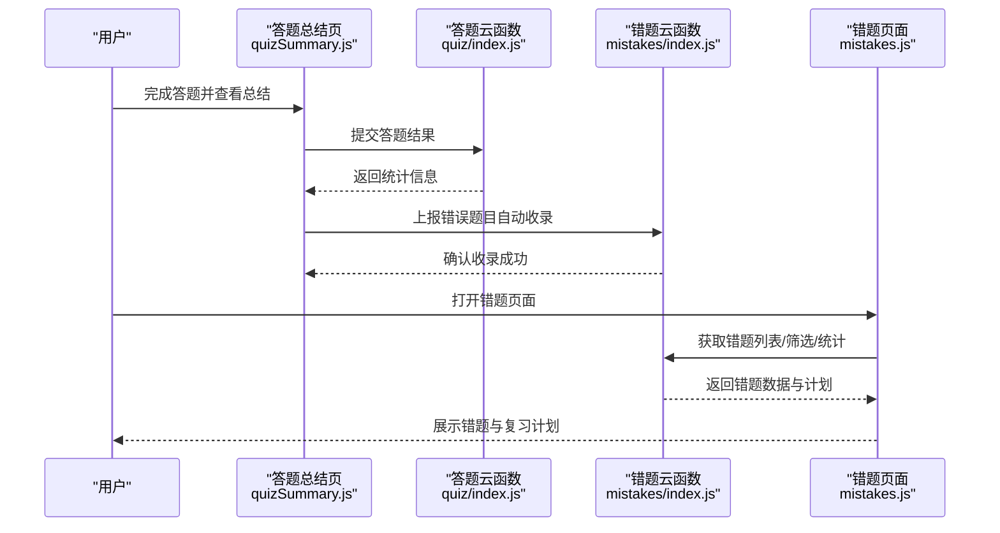
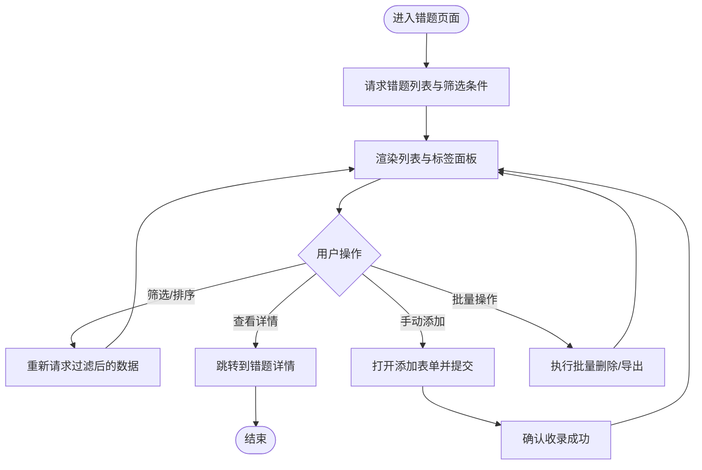
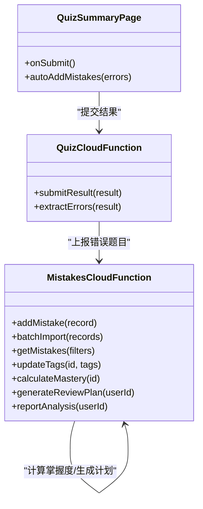
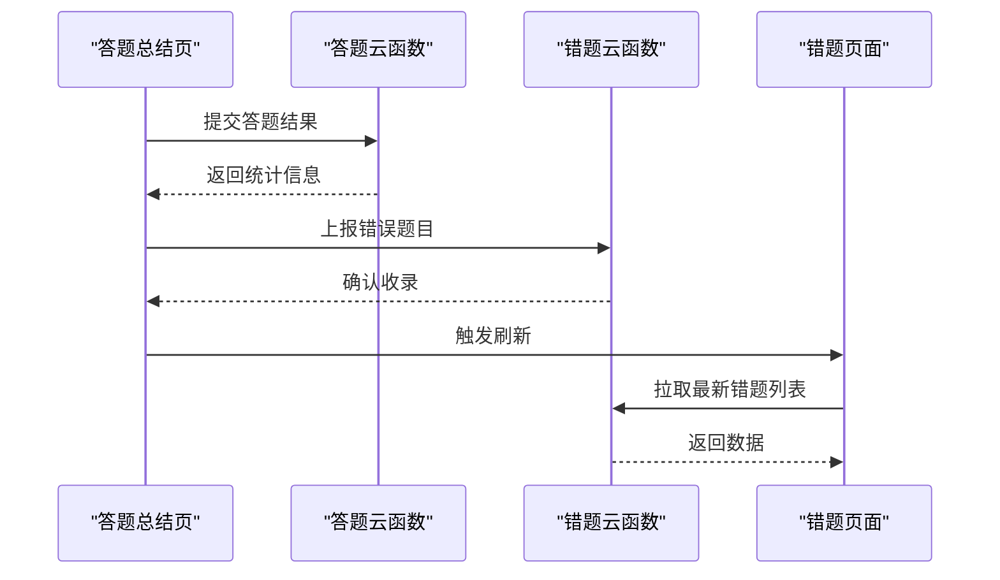
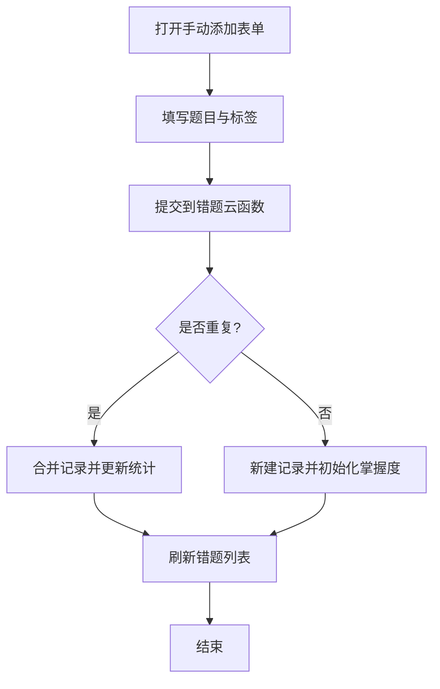
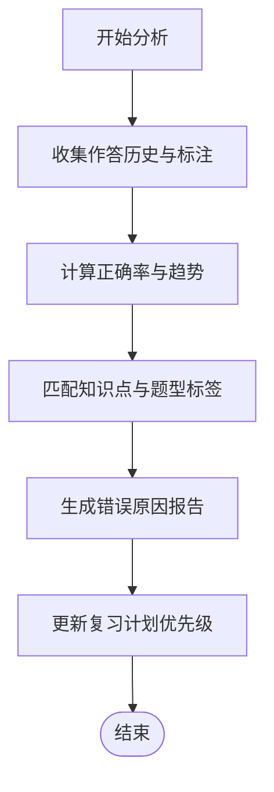
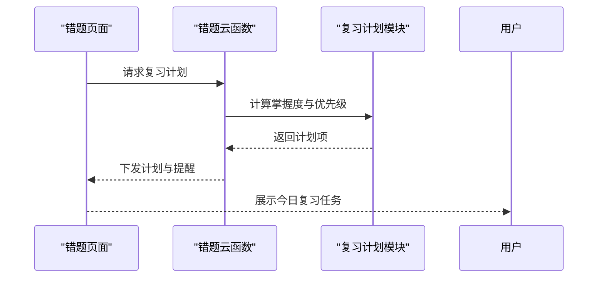
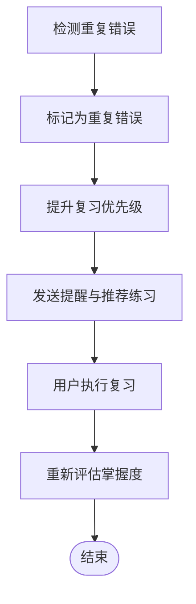
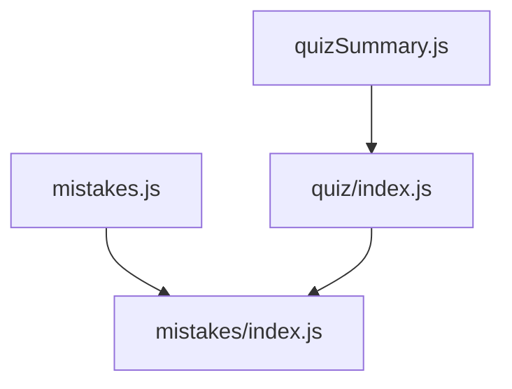

# 错题管理

<cite>
**本文引用的文件**   
- [miniprogram/pages/mistakes/mistakes.js](file://miniprogram/pages/mistakes/mistakes.js)
- [miniprogram/pages/mistakes/mistakes.wxml](file://miniprogram/pages/mistakes/mistakes.wxml)
- [miniprogram/pages/mistakes/mistakes.wxss](file://miniprogram/pages/mistakes/mistakes.wxss)
- [cloudfunctions/mistakes/index.js](file://cloudfunctions/mistakes/index.js)
- [cloudfunctions/quiz/index.js](file://cloudfunctions/quiz/index.js)
- [miniprogram/pages/quizSummary/quizSummary.js](file://miniprogram/pages/quizSummary/quizSummary.js)
</cite>

## 目录
1. [简介](#简介)
2. [项目结构](#项目结构)
3. [核心组件](#核心组件)
4. [架构总览](#架构总览)
5. [详细组件分析](#详细组件分析)
6. [依赖分析](#依赖分析)
7. [性能考虑](#性能考虑)
8. [故障排查指南](#故障排查指南)
9. [结论](#结论)
10. [附录](#附录)

## 简介
本章节面向学习者与教师，系统介绍“错题管理”功能的使用方法与设计思路。内容覆盖：
- 自动错题收录：在答题结束后，将错误题目自动归集到错题本。
- 手动添加错题：支持在学习过程中或复习时，快速标记并加入错题本。
- 错题分类标签：按知识点、题型、难度等维度进行组织，便于检索与统计。
- 错误原因分析：结合答题数据与用户标注，辅助定位薄弱点。
- 复习计划制定：基于掌握度与遗忘曲线，生成个性化复习任务。
- 掌握度评估与重复错误提醒：动态更新掌握度，对反复出错题目重点提示。
- 高效整理方法与针对性复习策略：提供可操作的流程建议，帮助用户攻克难点。

## 项目结构
错题管理涉及小程序前端页面与云端函数两个层面：
- 前端页面：错题列表、筛选与操作入口（新增、删除、导出等）。
- 云端函数：错题数据的增删改查、批量导入、统计分析与复习计划生成。
- 答题与总结页：触发自动收录与掌握度更新的入口。

**图示来源** 
- [miniprogram/pages/mistakes/mistakes.js](file://miniprogram/pages/mistakes/mistakes.js)
- [miniprogram/pages/mistakes/mistakes.wxml](file://miniprogram/pages/mistakes/mistakes.wxml)
- [miniprogram/pages/mistakes/mistakes.wxss](file://miniprogram/pages/mistakes/mistakes.wxss)
- [cloudfunctions/mistakes/index.js](file://cloudfunctions/mistakes/index.js)
- [cloudfunctions/quiz/index.js](file://cloudfunctions/quiz/index.js)
- [miniprogram/pages/quizSummary/quizSummary.js](file://miniprogram/pages/quizSummary/quizSummary.js)

**章节来源**
- [miniprogram/pages/mistakes/mistakes.js](file://miniprogram/pages/mistakes/mistakes.js)
- [miniprogram/pages/mistakes/mistakes.wxml](file://miniprogram/pages/mistakes/mistakes.wxml)
- [miniprogram/pages/mistakes/mistakes.wxss](file://miniprogram/pages/mistakes/mistakes.wxss)
- [cloudfunctions/mistakes/index.js](file://cloudfunctions/mistakes/index.js)
- [cloudfunctions/quiz/index.js](file://cloudfunctions/quiz/index.js)
- [miniprogram/pages/quizSummary/quizSummary.js](file://miniprogram/pages/quizSummary/quizSummary.js)

## 核心组件
- 错题页面（前端）
  - 负责展示错题列表、筛选与排序、分页加载、批量操作与详情跳转。
  - 通过调用云端函数完成数据读写与统计分析。
- 错题云函数（后端）
  - 提供错题的增删改查、标签管理、统计报表与复习计划生成接口。
  - 接收来自答题总结页的错误题记录，实现自动收录。
- 答题总结页（前端）
  - 在答题完成后汇总结果，并将错误题目推送至云端，触发自动收录。

**章节来源**
- [miniprogram/pages/mistakes/mistakes.js](file://miniprogram/pages/mistakes/mistakes.js)
- [cloudfunctions/mistakes/index.js](file://cloudfunctions/mistakes/index.js)
- [miniprogram/pages/quizSummary/quizSummary.js](file://miniprogram/pages/quizSummary/quizSummary.js)

## 架构总览
错题管理的整体交互流程如下：用户在答题后进入总结页，系统自动识别错误题目并写入云端；随后在错题页面中查看、筛选、复习与调整标签；云端根据掌握度与历史表现生成复习计划并返回给前端展示。

**图示来源** 
- [miniprogram/pages/quizSummary/quizSummary.js](file://miniprogram/pages/quizSummary/quizSummary.js)
- [cloudfunctions/quiz/index.js](file://cloudfunctions/quiz/index.js)
- [cloudfunctions/mistakes/index.js](file://cloudfunctions/mistakes/index.js)
- [miniprogram/pages/mistakes/mistakes.js](file://miniprogram/pages/mistakes/mistakes.js)

## 详细组件分析

### 错题页面（前端）
- 主要职责
  - 渲染错题列表与分页，支持按标签、日期、掌握度排序与筛选。
  - 提供手动添加错题入口（如从学习页或题库页跳转），以及批量删除、导出等操作。
  - 调用云端函数获取统计数据与复习计划，并在界面呈现。
- 关键交互
  - 点击错题条目进入详情，查看错误原因与解析。
  - 使用标签面板进行分组浏览与快速定位。
  - 一键加入复习计划，系统根据掌握度与间隔重复算法安排复习时间。

**图示来源** 
- [miniprogram/pages/mistakes/mistakes.js](file://miniprogram/pages/mistakes/mistakes.js)
- [miniprogram/pages/mistakes/mistakes.wxml](file://miniprogram/pages/mistakes/mistakes.wxml)
- [miniprogram/pages/mistakes/mistakes.wxss](file://miniprogram/pages/mistakes/mistakes.wxss)

**章节来源**
- [miniprogram/pages/mistakes/mistakes.js](file://miniprogram/pages/mistakes/mistakes.js)
- [miniprogram/pages/mistakes/mistakes.wxml](file://miniprogram/pages/mistakes/mistakes.wxml)
- [miniprogram/pages/mistakes/mistakes.wxss](file://miniprogram/pages/mistakes/mistakes.wxss)

### 错题云函数（后端）
- 主要职责
  - 提供错题记录的增删改查接口，支持批量导入与去重。
  - 维护错题标签体系，支持按标签聚合与统计。
  - 计算掌握度指标，生成复习计划（包含优先级、下次复习时间与提醒）。
  - 输出错误原因分析报告（基于历史作答与标注）。
- 关键能力
  - 自动收录：接收来自答题总结页的错误题记录，合并到错题库。
  - 智能提醒：对重复错误题目进行高亮与优先推荐。
  - 统计报表：按知识点、题型、难度分布输出可视化数据。

**图示来源** 
- [cloudfunctions/mistakes/index.js](file://cloudfunctions/mistakes/index.js)
- [cloudfunctions/quiz/index.js](file://cloudfunctions/quiz/index.js)
- [miniprogram/pages/quizSummary/quizSummary.js](file://miniprogram/pages/quizSummary/quizSummary.js)

**章节来源**
- [cloudfunctions/mistakes/index.js](file://cloudfunctions/mistakes/index.js)
- [cloudfunctions/quiz/index.js](file://cloudfunctions/quiz/index.js)
- [miniprogram/pages/quizSummary/quizSummary.js](file://miniprogram/pages/quizSummary/quizSummary.js)

### 自动错题收录流程
- 触发时机：答题总结页提交结果后。
- 处理步骤：
  - 前端收集错误题目清单。
  - 调用答题云函数进行结果校验与统计。
  - 将错误题目上报至错题云函数，完成入库与标签匹配。
  - 前端刷新错题列表并提示收录成功。

**图示来源** 
- [miniprogram/pages/quizSummary/quizSummary.js](file://miniprogram/pages/quizSummary/quizSummary.js)
- [cloudfunctions/quiz/index.js](file://cloudfunctions/quiz/index.js)
- [cloudfunctions/mistakes/index.js](file://cloudfunctions/mistakes/index.js)
- [miniprogram/pages/mistakes/mistakes.js](file://miniprogram/pages/mistakes/mistakes.js)

**章节来源**
- [miniprogram/pages/quizSummary/quizSummary.js](file://miniprogram/pages/quizSummary/quizSummary.js)
- [cloudfunctions/quiz/index.js](file://cloudfunctions/quiz/index.js)
- [cloudfunctions/mistakes/index.js](file://cloudfunctions/mistakes/index.js)
- [miniprogram/pages/mistakes/mistakes.js](file://miniprogram/pages/mistakes/mistakes.js)

### 手动添加错题
- 使用场景：在学习过程中发现易错点，或从其他资料摘录典型错题。
- 操作步骤：
  - 在错题页面选择“手动添加”，填写题目信息与标签。
  - 提交后由错题云函数进行去重与入库。
  - 系统自动更新相关知识点的掌握度与复习计划。

**图示来源** 
- [miniprogram/pages/mistakes/mistakes.js](file://miniprogram/pages/mistakes/mistakes.js)
- [cloudfunctions/mistakes/index.js](file://cloudfunctions/mistakes/index.js)

**章节来源**
- [miniprogram/pages/mistakes/mistakes.js](file://miniprogram/pages/mistakes/mistakes.js)
- [cloudfunctions/mistakes/index.js](file://cloudfunctions/mistakes/index.js)

### 错题分类标签与错误原因分析
- 分类标签
  - 支持按知识点、题型、难度、来源等多维标签组织错题。
  - 标签变更会触发统计与复习计划的重新计算。
- 错误原因分析
  - 基于历史作答次数、正确率变化、停留时长与标注原因，生成分析报告。
  - 对高频错误点进行提示，并给出针对性练习建议。

**图示来源** 
- [cloudfunctions/mistakes/index.js](file://cloudfunctions/mistakes/index.js)

**章节来源**
- [cloudfunctions/mistakes/index.js](file://cloudfunctions/mistakes/index.js)

### 复习计划制定与掌握度评估
- 复习计划
  - 依据掌握度与间隔重复算法，自动生成每日/每周复习任务。
  - 对重复错误题目提高优先级，并设置提醒。
- 掌握度评估
  - 综合最近作答表现、连续正确次数与错误频率，动态更新掌握度等级。
  - 掌握度达到阈值后可移出复习计划或降低优先级。

**图示来源** 
- [miniprogram/pages/mistakes/mistakes.js](file://miniprogram/pages/mistakes/mistakes.js)
- [cloudfunctions/mistakes/index.js](file://cloudfunctions/mistakes/index.js)

**章节来源**
- [miniprogram/pages/mistakes/mistakes.js](file://miniprogram/pages/mistakes/mistakes.js)
- [cloudfunctions/mistakes/index.js](file://cloudfunctions/mistakes/index.js)

### 重复错误提醒
- 触发条件：同一题目在多次复习中仍出现错误。
- 提醒方式：在错题列表中标记“重复错误”，并在复习计划中置顶。
- 干预建议：系统推荐专项练习与知识点回炉，帮助突破瓶颈。

**图示来源** 
- [cloudfunctions/mistakes/index.js](file://cloudfunctions/mistakes/index.js)

**章节来源**
- [cloudfunctions/mistakes/index.js](file://cloudfunctions/mistakes/index.js)

## 依赖分析
- 前端依赖
  - 错题页面依赖错题云函数提供的数据接口与统计服务。
  - 答题总结页依赖答题云函数进行结果处理，并间接依赖错题云函数进行自动收录。
- 后端依赖
  - 错题云函数内部可能依赖数据库与缓存以支撑高性能查询与统计。
  - 复习计划模块依赖掌握度计算与间隔重复算法。

**图示来源** 
- [miniprogram/pages/mistakes/mistakes.js](file://miniprogram/pages/mistakes/mistakes.js)
- [miniprogram/pages/quizSummary/quizSummary.js](file://miniprogram/pages/quizSummary/quizSummary.js)
- [cloudfunctions/quiz/index.js](file://cloudfunctions/quiz/index.js)
- [cloudfunctions/mistakes/index.js](file://cloudfunctions/mistakes/index.js)

**章节来源**
- [miniprogram/pages/mistakes/mistakes.js](file://miniprogram/pages/mistakes/mistakes.js)
- [miniprogram/pages/quizSummary/quizSummary.js](file://miniprogram/pages/quizSummary/quizSummary.js)
- [cloudfunctions/quiz/index.js](file://cloudfunctions/quiz/index.js)
- [cloudfunctions/mistakes/index.js](file://cloudfunctions/mistakes/index.js)

## 性能考虑
- 分页与懒加载：在错题数量较大时采用分页加载，减少首屏渲染压力。
- 索引优化：对常用筛选字段（标签、日期、掌握度）建立索引，提升查询效率。
- 缓存策略：对热点统计与复习计划进行短期缓存，降低频繁计算开销。
- 批量操作：支持批量导入与批量删除，减少网络往返与服务器负载。

[本节为通用性能建议，不直接分析具体文件]

## 故障排查指南
- 常见问题
  - 自动收录失败：检查答题总结页是否正确上报错误题目，确认云端函数返回状态。
  - 标签未生效：确认标签名称一致性与大小写敏感问题，必要时清理冗余标签。
  - 复习计划未更新：检查掌握度计算逻辑与间隔重复参数配置。
- 调试建议
  - 在前端控制台查看网络请求与响应，核对数据结构。
  - 在云端函数日志中定位错误堆栈与异常分支。
  - 对重复错误题目进行最小化复现，逐步缩小问题范围。

**章节来源**
- [miniprogram/pages/mistakes/mistakes.js](file://miniprogram/pages/mistakes/mistakes.js)
- [cloudfunctions/mistakes/index.js](file://cloudfunctions/mistakes/index.js)
- [miniprogram/pages/quizSummary/quizSummary.js](file://miniprogram/pages/quizSummary/quizSummary.js)

## 结论
错题管理通过自动收录、手动添加、标签分类、错误原因分析与智能化复习计划，形成闭环的学习改进机制。掌握度评估与重复错误提醒帮助用户聚焦薄弱环节，配合高效的整理方法与针对性复习策略，可有效提升学习效率与成绩稳定性。

[本节为总结性内容，不直接分析具体文件]

## 附录
- 使用建议
  - 每日固定时间复习错题，保持节奏感。
  - 定期清理已掌握的错题，避免干扰注意力。
  - 利用标签与统计报表，制定阶段性学习目标。
- 最佳实践
  - 为每个错题补充错误原因与知识点标签，增强后续分析质量。
  - 对重复错误题目进行专项练习，并结合解析加深理解。
  - 关注掌握度变化趋势，及时调整复习强度与方法。

[本节为概念性指导，不直接分析具体文件]