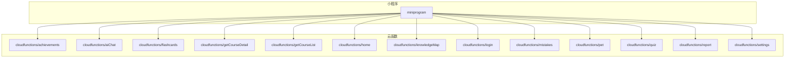
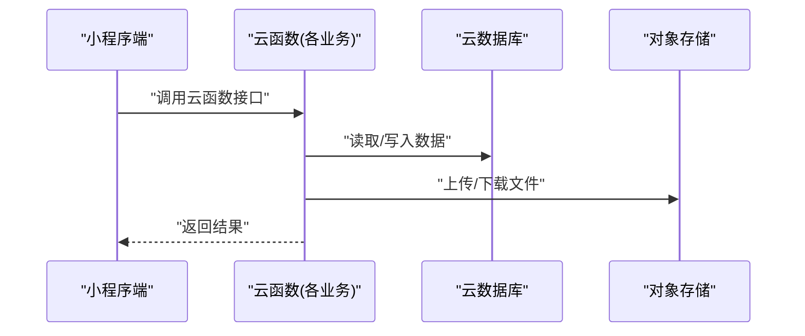
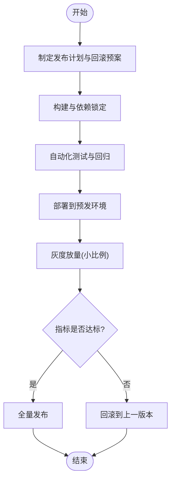

# 云函数部署

<cite>
**本文引用的文件**   
- [project.config.json](file://project.config.json)
- [cloudfunctions/achievements/config.json](file://cloudfunctions/achievements/config.json)
- [cloudfunctions/achievements/index.js](file://cloudfunctions/achievements/index.js)
- [cloudfunctions/achievements/package.json](file://cloudfunctions/achievements/package.json)
- [cloudfunctions/aiChat/config.json](file://cloudfunctions/aiChat/config.json)
- [cloudfunctions/aiChat/index.js](file://cloudfunctions/aiChat/index.js)
- [cloudfunctions/aiChat/package.json](file://cloudfunctions/aiChat/package.json)
- [cloudfunctions/flashcards/config.json](file://cloudfunctions/flashcards/config.json)
- [cloudfunctions/flashcards/index.js](file://cloudfunctions/flashcards/index.js)
- [cloudfunctions/flashcards/package.json](file://cloudfunctions/flashcards/package.json)
- [cloudfunctions/getCourseDetail/config.json](file://cloudfunctions/getCourseDetail/config.json)
- [cloudfunctions/getCourseDetail/index.js](file://cloudfunctions/getCourseDetail/index.js)
- [cloudfunctions/getCourseDetail/package.json](file://cloudfunctions/getCourseDetail/package.json)
- [cloudfunctions/getCourseList/config.json](file://cloudfunctions/getCourseList/config.json)
- [cloudfunctions/getCourseList/index.js](file://cloudfunctions/getCourseList/index.js)
- [cloudfunctions/getCourseList/package.json](file://cloudfunctions/getCourseList/package.json)
- [cloudfunctions/home/config.json](file://cloudfunctions/home/config.json)
- [cloudfunctions/home/index.js](file://cloudfunctions/home/index.js)
- [cloudfunctions/home/package.json](file://cloudfunctions/home/package.json)
- [cloudfunctions/knowledgeMap/config.json](file://cloudfunctions/knowledgeMap/config.json)
- [cloudfunctions/knowledgeMap/index.js](file://cloudfunctions/knowledgeMap/index.js)
- [cloudfunctions/knowledgeMap/package.json](file://cloudfunctions/knowledgeMap/package.json)
- [cloudfunctions/login/config.json](file://cloudfunctions/login/config.json)
- [cloudfunctions/login/index.js](file://cloudfunctions/login/index.js)
- [cloudfunctions/login/package.json](file://cloudfunctions/login/package.json)
- [cloudfunctions/mistakes/config.json](file://cloudfunctions/mistakes/config.json)
- [cloudfunctions/mistakes/index.js](file://cloudfunctions/mistakes/index.js)
- [cloudfunctions/mistakes/package.json](file://cloudfunctions/mistakes/package.json)
- [cloudfunctions/pet/config.json](file://cloudfunctions/pet/config.json)
- [cloudfunctions/pet/index.js](file://cloudfunctions/pet/index.js)
- [cloudfunctions/pet/package.json](file://cloudfunctions/pet/package.json)
- [cloudfunctions/quiz/config.json](file://cloudfunctions/quiz/config.json)
- [cloudfunctions/quiz/index.js](file://cloudfunctions/quiz/index.js)
- [cloudfunctions/quiz/package.json](file://cloudfunctions/quiz/package.json)
- [cloudfunctions/report/config.json](file://cloudfunctions/report/config.json)
- [cloudfunctions/report/index.js](file://cloudfunctions/report/index.js)
- [cloudfunctions/report/package.json](file://cloudfunctions/report/package.json)
- [cloudfunctions/settings/config.json](file://cloudfunctions/settings/config.json)
- [cloudfunctions/settings/index.js](file://cloudfunctions/settings/index.js)
- [cloudfunctions/settings/package.json](file://cloudfunctions/settings/package.json)
</cite>

## 目录
1. [简介](#简介)
2. [项目结构](#项目结构)
3. [核心组件](#核心组件)
4. [架构总览](#架构总览)
5. [详细组件分析](#详细组件分析)
6. [依赖与权限模型](#依赖与权限模型)
7. [版本管理与灰度发布](#版本管理与灰度发布)
8. [本地调试与打包上传](#本地调试与打包上传)
9. [监控、日志与分析](#监控日志与分析)
10. [性能优化建议](#性能优化建议)
11. [备份恢复与数据迁移](#备份恢复与数据迁移)
12. [故障排查指南](#故障排查指南)
13. [结论](#结论)

## 简介
本文件面向开发者，提供本项目中所有业务云函数的完整部署文档。内容覆盖：
- 云函数清单与职责
- 本地调试、打包与上传流程
- 版本控制与灰度发布策略
- 依赖包管理、内存配置与执行超时
- 权限模型（数据库、存储桶）
- 监控指标、日志收集与分析方法
- 冷启动优化、内存使用与并发控制
- 备份恢复机制与数据迁移策略
- 最佳实践与常见问题解答

## 项目结构
仓库采用“小程序 + 云开发”的常见组织方式。云函数位于 cloudfunctions 目录下，每个功能域一个子目录，包含入口文件 index.js、依赖声明 package.json、以及可选的配置 config.json。小程序端位于 miniprogram 目录，通过云调用访问对应云函数。

**图表来源**
- [project.config.json](file://project.config.json)
- [cloudfunctions/achievements/index.js](file://cloudfunctions/achievements/index.js)
- [cloudfunctions/aiChat/index.js](file://cloudfunctions/aiChat/index.js)
- [cloudfunctions/flashcards/index.js](file://cloudfunctions/flashcards/index.js)
- [cloudfunctions/getCourseDetail/index.js](file://cloudfunctions/getCourseDetail/index.js)
- [cloudfunctions/getCourseList/index.js](file://cloudfunctions/getCourseList/index.js)
- [cloudfunctions/home/index.js](file://cloudfunctions/home/index.js)
- [cloudfunctions/knowledgeMap/index.js](file://cloudfunctions/knowledgeMap/index.js)
- [cloudfunctions/login/index.js](file://cloudfunctions/login/index.js)
- [cloudfunctions/mistakes/index.js](file://cloudfunctions/mistakes/index.js)
- [cloudfunctions/pet/index.js](file://cloudfunctions/pet/index.js)
- [cloudfunctions/quiz/index.js](file://cloudfunctions/quiz/index.js)
- [cloudfunctions/report/index.js](file://cloudfunctions/report/index.js)
- [cloudfunctions/settings/index.js](file://cloudfunctions/settings/index.js)

**章节来源**
- [project.config.json](file://project.config.json)

## 核心组件
- 云函数入口：每个云函数目录下的 index.js 为运行时入口，负责处理请求、鉴权、读写数据库或对象存储等。
- 依赖声明：package.json 声明 Node.js 运行环境与第三方依赖；package-lock.json 锁定依赖版本，保证构建可重复。
- 可选配置：config.json 用于存放该云函数所需的运行时配置项（如环境变量、资源配额等），由平台在部署时注入。

典型云函数清单（按功能域）：
- achievements：成就相关逻辑
- aiChat：AI 对话能力
- flashcards：闪卡学习
- getCourseDetail：课程详情查询
- getCourseList：课程列表查询
- home：首页聚合数据
- knowledgeMap：知识图谱展示
- login：登录与用户态管理
- mistakes：错题集
- pet：宠物系统
- quiz：测验与答题
- report：报告生成
- settings：设置与偏好

**章节来源**
- [cloudfunctions/achievements/index.js](file://cloudfunctions/achievements/index.js)
- [cloudfunctions/achievements/package.json](file://cloudfunctions/achievements/package.json)
- [cloudfunctions/aiChat/index.js](file://cloudfunctions/aiChat/index.js)
- [cloudfunctions/aiChat/package.json](file://cloudfunctions/aiChat/package.json)
- [cloudfunctions/flashcards/index.js](file://cloudfunctions/flashcards/index.js)
- [cloudfunctions/flashcards/package.json](file://cloudfunctions/flashcards/package.json)
- [cloudfunctions/getCourseDetail/index.js](file://cloudfunctions/getCourseDetail/index.js)
- [cloudfunctions/getCourseDetail/package.json](file://cloudfunctions/getCourseDetail/package.json)
- [cloudfunctions/getCourseList/index.js](file://cloudfunctions/getCourseList/index.js)
- [cloudfunctions/getCourseList/package.json](file://cloudfunctions/getCourseList/package.json)
- [cloudfunctions/home/index.js](file://cloudfunctions/home/index.js)
- [cloudfunctions/home/package.json](file://cloudfunctions/home/package.json)
- [cloudfunctions/knowledgeMap/index.js](file://cloudfunctions/knowledgeMap/index.js)
- [cloudfunctions/knowledgeMap/package.json](file://cloudfunctions/knowledgeMap/package.json)
- [cloudfunctions/login/index.js](file://cloudfunctions/login/index.js)
- [cloudfunctions/login/package.json](file://cloudfunctions/login/package.json)
- [cloudfunctions/mistakes/index.js](file://cloudfunctions/mistakes/index.js)
- [cloudfunctions/mistakes/package.json](file://cloudfunctions/mistakes/package.json)
- [cloudfunctions/pet/index.js](file://cloudfunctions/pet/index.js)
- [cloudfunctions/pet/package.json](file://cloudfunctions/pet/package.json)
- [cloudfunctions/quiz/index.js](file://cloudfunctions/quiz/index.js)
- [cloudfunctions/quiz/package.json](file://cloudfunctions/quiz/package.json)
- [cloudfunctions/report/index.js](file://cloudfunctions/report/index.js)
- [cloudfunctions/report/package.json](file://cloudfunctions/report/package.json)
- [cloudfunctions/settings/index.js](file://cloudfunctions/settings/index.js)
- [cloudfunctions/settings/package.json](file://cloudfunctions/settings/package.json)

## 架构总览
小程序通过云调用发起对云函数的请求，云函数在云端执行并访问数据库与对象存储等资源。整体交互如下：

**图表来源**
- [cloudfunctions/home/index.js](file://cloudfunctions/home/index.js)
- [cloudfunctions/getCourseList/index.js](file://cloudfunctions/getCourseList/index.js)
- [cloudfunctions/getCourseDetail/index.js](file://cloudfunctions/getCourseDetail/index.js)
- [cloudfunctions/quiz/index.js](file://cloudfunctions/quiz/index.js)
- [cloudfunctions/report/index.js](file://cloudfunctions/report/index.js)

## 详细组件分析
以下对各云函数进行要点说明，重点包括：职责边界、输入输出约定、依赖与配置、错误处理与幂等性建议。为避免泄露实现细节，本节不直接粘贴代码，仅给出路径引用与行为描述。

### 成就(achievements)
- 职责：记录与查询用户成就进度、解锁状态等。
- 输入输出：以用户维度为主键，支持批量更新与分页查询。
- 依赖与配置：参考 [cloudfunctions/achievements/package.json](file://cloudfunctions/achievements/package.json)、[cloudfunctions/achievements/config.json](file://cloudfunctions/achievements/config.json)。
- 错误处理：对并发解锁场景需做幂等校验，避免重复计数。
- 性能建议：热点成就缓存、批量写入合并。

**章节来源**
- [cloudfunctions/achievements/index.js](file://cloudfunctions/achievements/index.js)
- [cloudfunctions/achievements/package.json](file://cloudfunctions/achievements/package.json)
- [cloudfunctions/achievements/config.json](file://cloudfunctions/achievements/config.json)

### AI对话(aiChat)
- 职责：对接外部大模型或内部推理服务，完成对话上下文组装与流式响应。
- 输入输出：消息历史、系统提示、温度参数等；返回结构化对话片段。
- 依赖与配置：参考 [cloudfunctions/aiChat/package.json](file://cloudfunctions/aiChat/package.json)、[cloudfunctions/aiChat/config.json](file://cloudfunctions/aiChat/config.json)。
- 错误处理：网络重试、超时降级、敏感词过滤。
- 性能建议：会话上下文裁剪、流式传输减少首字节延迟。

**章节来源**
- [cloudfunctions/aiChat/index.js](file://cloudfunctions/aiChat/index.js)
- [cloudfunctions/aiChat/package.json](file://cloudfunctions/aiChat/package.json)
- [cloudfunctions/aiChat/config.json](file://cloudfunctions/aiChat/config.json)

### 闪卡(flashcards)
- 职责：闪卡创建、复习调度、记忆曲线计算。
- 输入输出：卡片集合、复习计划、掌握度评分。
- 依赖与配置：参考 [cloudfunctions/flashcards/package.json](file://cloudfunctions/flashcards/package.json)、[cloudfunctions/flashcards/config.json](file://cloudfunctions/flashcards/config.json)。
- 错误处理：并发复习冲突、数据一致性校验。
- 性能建议：批量拉取、惰性加载、索引优化。

**章节来源**
- [cloudfunctions/flashcards/index.js](file://cloudfunctions/flashcards/index.js)
- [cloudfunctions/flashcards/package.json](file://cloudfunctions/flashcards/package.json)
- [cloudfunctions/flashcards/config.json](file://cloudfunctions/flashcards/config.json)

### 课程详情(getCourseDetail)
- 职责：根据课程ID获取详情，含元数据、章节、视频信息等。
- 输入输出：courseId -> 课程详情对象。
- 依赖与配置：参考 [cloudfunctions/getCourseDetail/package.json](file://cloudfunctions/getCourseDetail/package.json)、[cloudfunctions/getCourseDetail/config.json](file://cloudfunctions/getCourseDetail/config.json)。
- 错误处理：不存在、权限不足、资源未就绪。
- 性能建议：详情页缓存、按需字段投影。

**章节来源**
- [cloudfunctions/getCourseDetail/index.js](file://cloudfunctions/getCourseDetail/index.js)
- [cloudfunctions/getCourseDetail/package.json](file://cloudfunctions/getCourseDetail/package.json)
- [cloudfunctions/getCourseDetail/config.json](file://cloudfunctions/getCourseDetail/config.json)

### 课程列表(getCourseList)
- 职责：分页、筛选、排序的课程列表查询。
- 输入输出：查询条件 -> 列表与总数。
- 依赖与配置：参考 [cloudfunctions/getCourseList/package.json](file://cloudfunctions/getCourseList/package.json)、[cloudfunctions/getCourseList/config.json](file://cloudfunctions/getCourseList/config.json)。
- 错误处理：非法参数、越界分页。
- 性能建议：复合索引、游标分页、热门课程预取。

**章节来源**
- [cloudfunctions/getCourseList/index.js](file://cloudfunctions/getCourseList/index.js)
- [cloudfunctions/getCourseList/package.json](file://cloudfunctions/getCourseList/package.json)
- [cloudfunctions/getCourseList/config.json](file://cloudfunctions/getCourseList/config.json)

### 首页(home)
- 职责：聚合推荐、公告、活动入口等首页数据。
- 输入输出：用户标签/地区 -> 首页聚合数据。
- 依赖与配置：参考 [cloudfunctions/home/package.json](file://cloudfunctions/home/package.json)、[cloudfunctions/home/config.json](file://cloudfunctions/home/config.json)。
- 错误处理：多源聚合失败回退默认数据。
- 性能建议：多级缓存、异步并行聚合。

**章节来源**
- [cloudfunctions/home/index.js](file://cloudfunctions/home/index.js)
- [cloudfunctions/home/package.json](file://cloudfunctions/home/package.json)
- [cloudfunctions/home/config.json](file://cloudfunctions/home/config.json)

### 知识图谱(knowledgeMap)
- 职责：知识点关系图数据组装与可视化所需结构。
- 输入输出：学科/主题 -> 节点与边集合。
- 依赖与配置：参考 [cloudfunctions/knowledgeMap/package.json](file://cloudfunctions/knowledgeMap/package.json)、[cloudfunctions/knowledgeMap/config.json](file://cloudfunctions/knowledgeMap/config.json)。
- 错误处理：大图数据分片、懒加载。
- 性能建议：邻接表设计、按需展开。

**章节来源**
- [cloudfunctions/knowledgeMap/index.js](file://cloudfunctions/knowledgeMap/index.js)
- [cloudfunctions/knowledgeMap/package.json](file://cloudfunctions/knowledgeMap/package.json)
- [cloudfunctions/knowledgeMap/config.json](file://cloudfunctions/knowledgeMap/config.json)

### 登录(login)
- 职责：用户登录态建立、令牌签发与刷新。
- 输入输出：凭证 -> 会话信息。
- 依赖与配置：参考 [cloudfunctions/login/package.json](file://cloudfunctions/login/package.json)、[cloudfunctions/login/config.json](file://cloudfunctions/login/config.json)。
- 错误处理：密码校验、账号锁定、风控拦截。
- 性能建议：会话缓存、短过期+刷新机制。

**章节来源**
- [cloudfunctions/login/index.js](file://cloudfunctions/login/index.js)
- [cloudfunctions/login/package.json](file://cloudfunctions/login/package.json)
- [cloudfunctions/login/config.json](file://cloudfunctions/login/config.json)

### 错题集(mistakes)
- 职责：错题入库、去重、复习提醒。
- 输入输出：题目ID/用户ID -> 错题列表与统计。
- 依赖与配置：参考 [cloudfunctions/mistakes/package.json](file://cloudfunctions/mistakes/package.json)、[cloudfunctions/mistakes/config.json](file://cloudfunctions/mistakes/config.json)。
- 错误处理：并发插入去重、软删除兼容。
- 性能建议：批量写入、定时汇总。

**章节来源**
- [cloudfunctions/mistakes/index.js](file://cloudfunctions/mistakes/index.js)
- [cloudfunctions/mistakes/package.json](file://cloudfunctions/mistakes/package.json)
- [cloudfunctions/mistakes/config.json](file://cloudfunctions/mistakes/config.json)

### 宠物(pet)
- 职责：宠物养成、成长值、互动事件。
- 输入输出：用户ID/动作 -> 宠物状态变更。
- 依赖与配置：参考 [cloudfunctions/pet/package.json](file://cloudfunctions/pet/package.json)、[cloudfunctions/pet/config.json](file://cloudfunctions/pet/package.json)。
- 错误处理：状态机校验、防刷。
- 性能建议：增量更新、事件驱动。

**章节来源**
- [cloudfunctions/pet/index.js](file://cloudfunctions/pet/index.js)
- [cloudfunctions/pet/package.json](file://cloudfunctions/pet/package.json)
- [cloudfunctions/pet/config.json](file://cloudfunctions/pet/config.json)

### 测验(quiz)
- 职责：题库抽取、答题提交、成绩计算。
- 输入输出：试卷ID/答案 -> 得分与解析。
- 依赖与配置：参考 [cloudfunctions/quiz/package.json](file://cloudfunctions/quiz/package.json)、[cloudfunctions/quiz/config.json](file://cloudfunctions/quiz/package.json)。
- 错误处理：乱序防作弊、答案校验。
- 性能建议：题池分层、结果缓存。

**章节来源**
- [cloudfunctions/quiz/index.js](file://cloudfunctions/quiz/index.js)
- [cloudfunctions/quiz/package.json](file://cloudfunctions/quiz/package.json)
- [cloudfunctions/quiz/config.json](file://cloudfunctions/quiz/config.json)

### 报告(report)
- 职责：学习报告生成、导出与分享。
- 输入输出：时间范围/维度 -> 报告数据。
- 依赖与配置：参考 [cloudfunctions/report/package.json](file://cloudfunctions/report/package.json)、[cloudfunctions/report/config.json](file://cloudfunctions/report/config.json)。
- 错误处理：大数据量分批、任务队列。
- 性能建议：异步生成、对象存储直链。

**章节来源**
- [cloudfunctions/report/index.js](file://cloudfunctions/report/index.js)
- [cloudfunctions/report/package.json](file://cloudfunctions/report/package.json)
- [cloudfunctions/report/config.json](file://cloudfunctions/report/config.json)

### 设置(settings)
- 职责：用户偏好、主题、通知开关等。
- 输入输出：键值对配置。
- 依赖与配置：参考 [cloudfunctions/settings/package.json](file://cloudfunctions/settings/package.json)、[cloudfunctions/settings/config.json](file://cloudfunctions/settings/config.json)。
- 错误处理：配置校验、默认值回退。
- 性能建议：热配置缓存、增量同步。

**章节来源**
- [cloudfunctions/settings/index.js](file://cloudfunctions/settings/index.js)
- [cloudfunctions/settings/package.json](file://cloudfunctions/settings/package.json)
- [cloudfunctions/settings/config.json](file://cloudfunctions/settings/config.json)

## 依赖与权限模型
- 依赖包管理
  - 每个云函数独立维护 package.json 与 package-lock.json，确保依赖版本稳定与可重现构建。
  - 建议在 CI 中执行依赖安装与校验，禁止将 node_modules 提交到仓库。
- 内存与超时
  - 通过云函数配置（如 config.json 或平台控制台）设置内存大小与执行超时，结合函数负载选择合理档位。
  - 长耗时任务应拆分为异步任务或消息队列触发。
- 权限模型
  - 数据库访问：遵循最小权限原则，按集合粒度授权，区分读/写权限。
  - 对象存储：按目录或前缀授权，限制上传/下载范围。
  - 身份与会话：登录云函数负责签发短期令牌，其他函数校验令牌并绑定用户上下文。
- 安全加固
  - 输入校验、白名单过滤、敏感信息不落盘。
  - 对外部依赖进行漏洞扫描与版本升级策略。

**章节来源**
- [cloudfunctions/achievements/package.json](file://cloudfunctions/achievements/package.json)
- [cloudfunctions/aiChat/package.json](file://cloudfunctions/aiChat/package.json)
- [cloudfunctions/flashcards/package.json](file://cloudfunctions/flashcards/package.json)
- [cloudfunctions/getCourseDetail/package.json](file://cloudfunctions/getCourseDetail/package.json)
- [cloudfunctions/getCourseList/package.json](file://cloudfunctions/getCourseList/package.json)
- [cloudfunctions/home/package.json](file://cloudfunctions/home/package.json)
- [cloudfunctions/knowledgeMap/package.json](file://cloudfunctions/knowledgeMap/package.json)
- [cloudfunctions/login/package.json](file://cloudfunctions/login/package.json)
- [cloudfunctions/mistakes/package.json](file://cloudfunctions/mistakes/package.json)
- [cloudfunctions/pet/package.json](file://cloudfunctions/pet/package.json)
- [cloudfunctions/quiz/package.json](file://cloudfunctions/quiz/package.json)
- [cloudfunctions/report/package.json](file://cloudfunctions/report/package.json)
- [cloudfunctions/settings/package.json](file://cloudfunctions/settings/package.json)

## 版本管理与灰度发布
- 版本策略
  - 语义化版本号：主版本（破坏性变更）、次版本（向后兼容新增）、修订号（缺陷修复）。
  - 每次发布打 tag 并保留变更记录，便于回滚与审计。
- 灰度发布
  - 基于环境隔离：dev/test/staging/prod 四套环境。
  - 基于流量切分：通过网关或路由层按用户ID哈希或百分比将请求分发至不同版本。
  - 观察期：关键指标（错误率、P95/P99 延迟、成功率）达标后全量切换。
- 回滚策略
  - 一键回滚到上一稳定版本，保持数据兼容与幂等。
  - 若存在数据迁移，需具备反向迁移或双写过渡方案。

[本图为概念流程图，无需图表来源]

## 本地调试与打包上传
- 本地调试
  - 使用云开发 CLI 或 IDE 插件进行本地模拟运行，覆盖正常路径与异常分支。
  - 准备最小数据集与 mock 外部依赖，验证边界条件。
- 打包上传
  - 清理无关文件，仅保留必要依赖与源码。
  - 执行构建脚本，生成产物后上传至云平台。
  - 上传后在控制台查看部署日志与基础指标。
- 配置与环境
  - 通过 config.json 或平台环境变量注入密钥与地址，避免硬编码。
  - 不同环境分离配置，严禁将生产凭据提交到仓库。

**章节来源**
- [project.config.json](file://project.config.json)
- [cloudfunctions/achievements/config.json](file://cloudfunctions/achievements/config.json)
- [cloudfunctions/aiChat/config.json](file://cloudfunctions/aiChat/config.json)
- [cloudfunctions/flashcards/config.json](file://cloudfunctions/flashcards/config.json)
- [cloudfunctions/getCourseDetail/config.json](file://cloudfunctions/getCourseDetail/config.json)
- [cloudfunctions/getCourseList/config.json](file://cloudfunctions/getCourseList/config.json)
- [cloudfunctions/home/config.json](file://cloudfunctions/home/config.json)
- [cloudfunctions/knowledgeMap/config.json](file://cloudfunctions/knowledgeMap/config.json)
- [cloudfunctions/login/config.json](file://cloudfunctions/login/config.json)
- [cloudfunctions/mistakes/config.json](file://cloudfunctions/mistakes/config.json)
- [cloudfunctions/pet/config.json](file://cloudfunctions/pet/config.json)
- [cloudfunctions/quiz/config.json](file://cloudfunctions/quiz/config.json)
- [cloudfunctions/report/config.json](file://cloudfunctions/report/config.json)
- [cloudfunctions/settings/config.json](file://cloudfunctions/settings/config.json)

## 监控、日志与分析
- 监控指标
  - 调用次数、成功/失败率、平均/分位延迟、冷启动次数、内存峰值、CPU 使用率。
  - 针对热点函数设置告警阈值，异常自动通知。
- 日志收集
  - 统一日志格式，包含 traceId、userId、耗时、错误码与堆栈摘要。
  - 分级输出（info/warn/error），避免在生产打印大量 debug 信息。
- 分析定位
  - 结合链路追踪定位跨函数调用瓶颈。
  - 对慢查询与高内存函数进行专项优化。

[本节为通用指导，无需章节来源]

## 性能优化建议
- 冷启动优化
  - 精简依赖体积，移除无用模块。
  - 复用连接与客户端实例，避免重复初始化。
  - 预热策略：定时轻量调用维持活跃实例。
- 内存使用
  - 按需分配内存档位，避免过大浪费与过小 OOM。
  - 流式处理大对象，避免一次性加载到内存。
- 并发控制
  - 数据库与外部 API 限流与重试退避。
  - 批量操作合并，减少往返次数。
- 数据访问
  - 合理使用索引与投影，减少不必要字段传输。
  - 热点数据缓存，降低数据库压力。

[本节为通用指导，无需章节来源]

## 备份恢复与数据迁移
- 备份策略
  - 定期全量备份与增量快照，保留多份副本。
  - 对象存储开启版本控制与生命周期管理。
- 恢复演练
  - 定期在隔离环境演练恢复流程，验证 RTO/RPO。
- 数据迁移
  - 双写过渡：新旧结构并存，逐步迁移存量数据。
  - 幂等与补偿：迁移任务具备重试与幂等保障。
  - 回滚方案：保留旧结构兼容窗口，支持快速回切。

[本节为通用指导，无需章节来源]

## 故障排查指南
- 常见问题
  - 依赖缺失或版本冲突：检查 package.json 与 lock 文件一致性。
  - 权限不足：核对数据库与对象存储 ACL 策略。
  - 超时与内存溢出：调整内存与超时，拆分任务。
  - 外部依赖不稳定：增加重试与熔断降级。
- 排查步骤
  - 查看云函数日志与错误堆栈。
  - 复现最小用例，定位问题边界。
  - 对比灰度与全量差异，缩小影响面。
  - 必要时回滚到上一稳定版本。

**章节来源**
- [cloudfunctions/login/index.js](file://cloudfunctions/login/index.js)
- [cloudfunctions/quiz/index.js](file://cloudfunctions/quiz/index.js)
- [cloudfunctions/report/index.js](file://cloudfunctions/report/index.js)

## 结论
通过规范的版本管理、灰度发布与完善的监控日志体系，配合严格的依赖与权限治理，可以显著提升云函数的稳定性与可维护性。建议持续优化冷启动与资源利用率，完善备份恢复与迁移策略，形成从开发到运维的闭环质量保障。