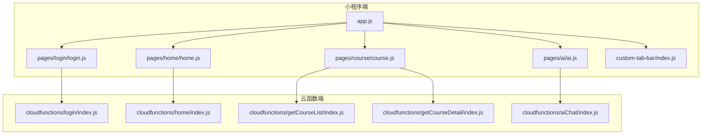
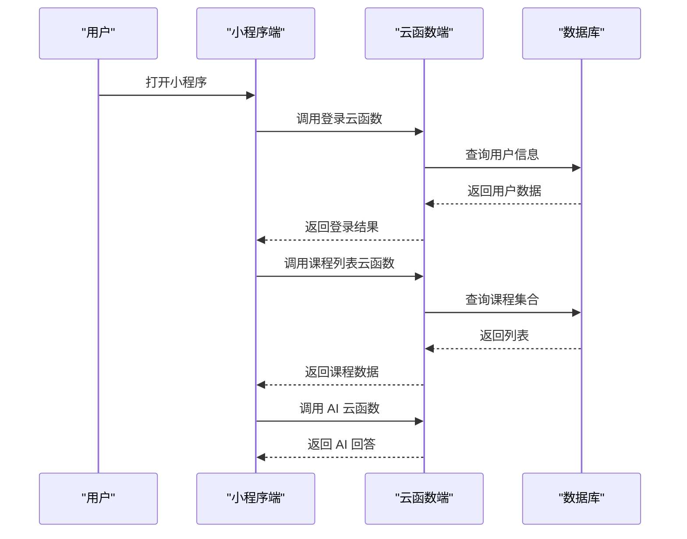
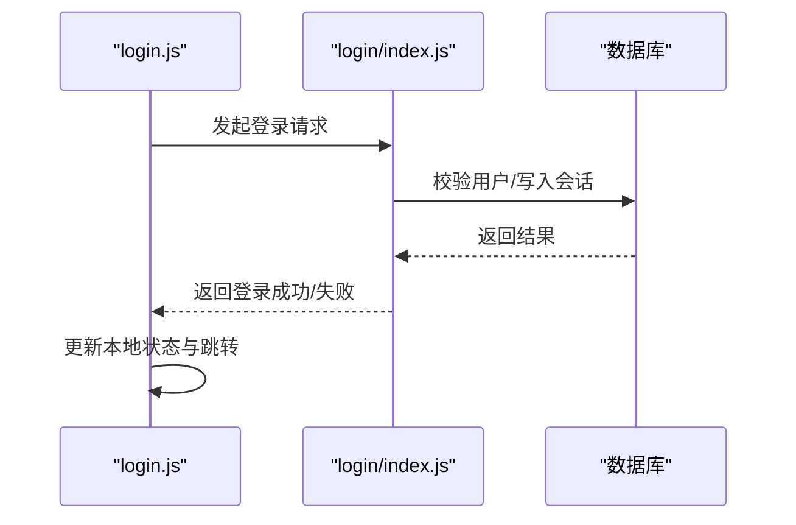
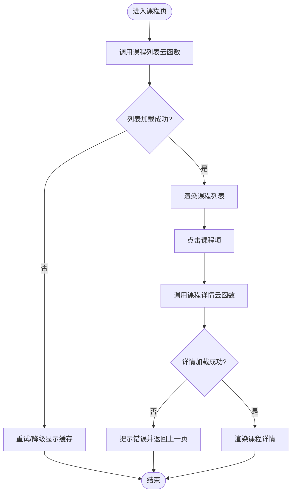
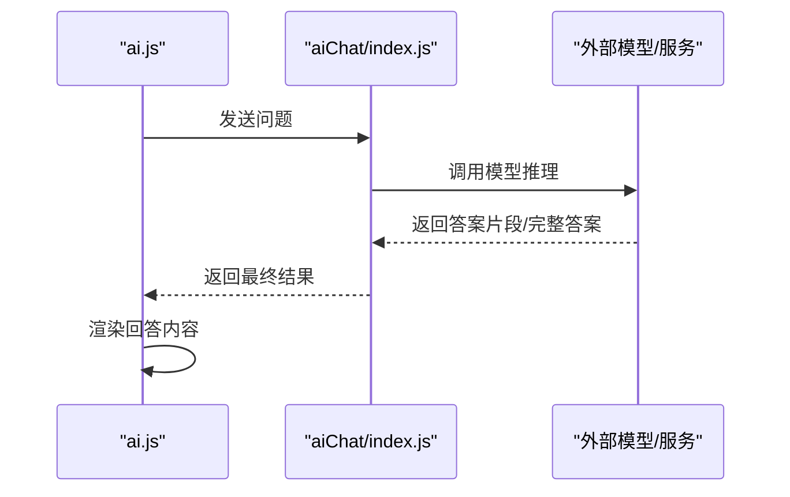
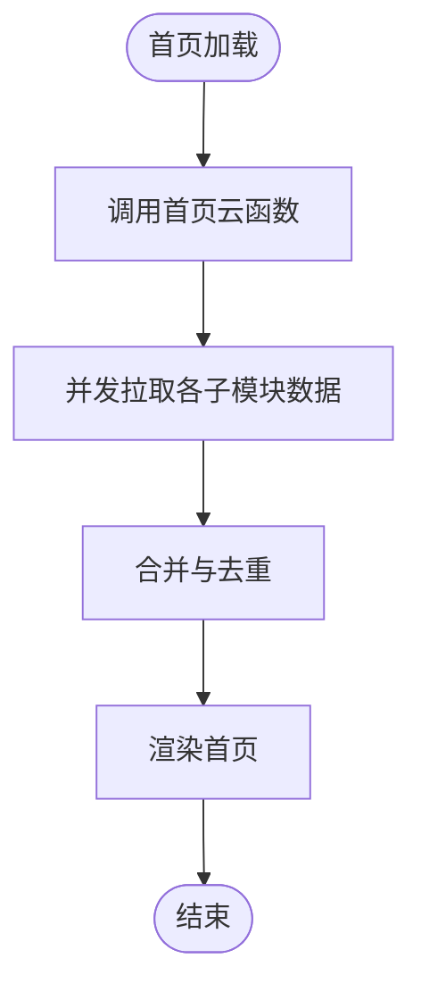
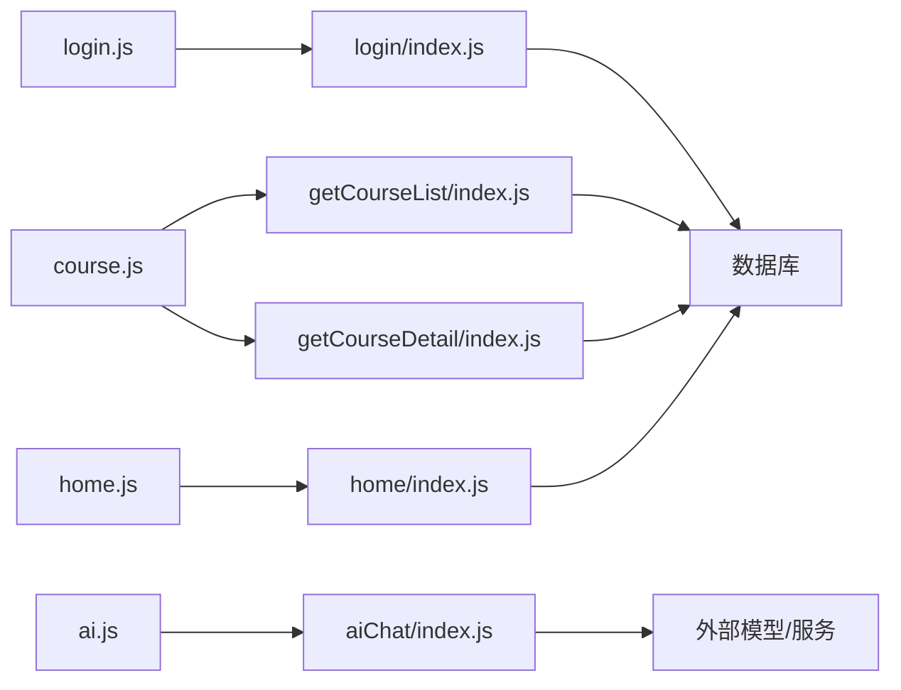

# 故障排查

<cite>
**本文引用的文件**   
- [miniprogram/app.js](file://miniprogram/app.js)
- [miniprogram/pages/login/login.js](file://miniprogram/pages/login/login.js)
- [cloudfunctions/login/index.js](file://cloudfunctions/login/index.js)
- [miniprogram/pages/course/course.js](file://miniprogram/pages/course/course.js)
- [cloudfunctions/getCourseList/index.js](file://cloudfunctions/getCourseList/index.js)
- [cloudfunctions/getCourseDetail/index.js](file://cloudfunctions/getCourseDetail/index.js)
- [miniprogram/pages/ai/ai.js](file://miniprogram/pages/ai/ai.js)
- [cloudfunctions/aiChat/index.js](file://cloudfunctions/aiChat/index.js)
- [miniprogram/pages/home/home.js](file://miniprogram/pages/home/home.js)
- [cloudfunctions/home/index.js](file://cloudfunctions/home/index.js)
- [miniprogram/custom-tab-bar/index.js](file://miniprogram/custom-tab-bar/index.js)
</cite>

## 目录
1. [简介](#简介)
2. [项目结构](#项目结构)
3. [核心组件](#核心组件)
4. [架构总览](#架构总览)
5. [详细组件分析](#详细组件分析)
6. [依赖关系分析](#依赖关系分析)
7. [性能考虑](#性能考虑)
8. [故障排查指南](#故障排查指南)
9. [结论](#结论)
10. [附录](#附录)

## 简介
本指南面向运维与开发团队，聚焦小程序端与云函数端的常见问题定位与解决，覆盖登录失败、课程加载缓慢、AI问答无响应等典型场景。文档提供日志分析方法（小程序控制台、云函数运行日志、数据库操作日志）、性能瓶颈定位方法（页面渲染、网络请求、数据库查询）、错误码含义与处理策略、系统健康检查方法与自动化检测脚本建议，以及紧急故障处理流程与回滚策略，帮助快速恢复服务并提升稳定性。

## 项目结构
本项目采用“小程序前端 + 云函数后端”的架构：
- 小程序端负责页面渲染、用户交互与数据展示，通过 wx.cloud.callFunction 调用云函数。
- 云函数端承载业务逻辑与数据库访问，返回结构化结果给小程序端。
- 关键入口包括应用初始化、登录流程、课程列表与详情、AI 对话、首页聚合数据等。

图表来源
- [miniprogram/app.js](file://miniprogram/app.js)
- [miniprogram/pages/login/login.js](file://miniprogram/pages/login/login.js)
- [miniprogram/pages/home/home.js](file://miniprogram/pages/home/home.js)
- [miniprogram/pages/course/course.js](file://miniprogram/pages/course/course.js)
- [miniprogram/pages/ai/ai.js](file://miniprogram/pages/ai/ai.js)
- [miniprogram/custom-tab-bar/index.js](file://miniprogram/custom-tab-bar/index.js)
- [cloudfunctions/login/index.js](file://cloudfunctions/login/index.js)
- [cloudfunctions/home/index.js](file://cloudfunctions/home/index.js)
- [cloudfunctions/getCourseList/index.js](file://cloudfunctions/getCourseList/index.js)
- [cloudfunctions/getCourseDetail/index.js](file://cloudfunctions/getCourseDetail/index.js)
- [cloudfunctions/aiChat/index.js](file://cloudfunctions/aiChat/index.js)

章节来源
- [miniprogram/app.js](file://miniprogram/app.js)
- [miniprogram/pages/login/login.js](file://miniprogram/pages/login/login.js)
- [miniprogram/pages/home/home.js](file://miniprogram/pages/home/home.js)
- [miniprogram/pages/course/course.js](file://miniprogram/pages/course/course.js)
- [miniprogram/pages/ai/ai.js](file://miniprogram/pages/ai/ai.js)
- [miniprogram/custom-tab-bar/index.js](file://miniprogram/custom-tab-bar/index.js)
- [cloudfunctions/login/index.js](file://cloudfunctions/login/index.js)
- [cloudfunctions/home/index.js](file://cloudfunctions/home/index.js)
- [cloudfunctions/getCourseList/index.js](file://cloudfunctions/getCourseList/index.js)
- [cloudfunctions/getCourseDetail/index.js](file://cloudfunctions/getCourseDetail/index.js)
- [cloudfunctions/aiChat/index.js](file://cloudfunctions/aiChat/index.js)

## 核心组件
- 应用初始化与全局状态管理：负责小程序启动、环境配置、全局变量与基础能力初始化。
- 登录模块：小程序端发起登录，云函数完成鉴权与用户信息获取。
- 课程模块：课程列表与详情加载，涉及分页、缓存与错误重试。
- AI 问答模块：小程序端发送消息，云函数调用外部模型或内部逻辑后返回结果。
- 首页聚合：汇总多源数据，注意并发与超时控制。
- 自定义 TabBar：用于导航与状态同步，影响页面切换体验。

章节来源
- [miniprogram/app.js](file://miniprogram/app.js)
- [miniprogram/pages/login/login.js](file://miniprogram/pages/login/login.js)
- [miniprogram/pages/course/course.js](file://miniprogram/pages/course/course.js)
- [miniprogram/pages/ai/ai.js](file://miniprogram/pages/ai/ai.js)
- [miniprogram/pages/home/home.js](file://miniprogram/pages/home/home.js)
- [miniprogram/custom-tab-bar/index.js](file://miniprogram/custom-tab-bar/index.js)

## 架构总览
整体为前后端分离的云原生架构：小程序作为客户端，云函数作为服务端，数据库在云端存储。关键交互路径如下：
- 登录：小程序调用登录云函数，完成身份校验并建立会话。
- 课程：小程序调用课程列表与详情云函数，读取数据库并返回结构化数据。
- AI：小程序将用户输入发送至 AI 云函数，云函数处理后返回答案。
- 首页：聚合多个云函数结果，进行合并与展示。

图表来源
- [miniprogram/pages/login/login.js](file://miniprogram/pages/login/login.js)
- [cloudfunctions/login/index.js](file://cloudfunctions/login/index.js)
- [miniprogram/pages/course/course.js](file://miniprogram/pages/course/course.js)
- [cloudfunctions/getCourseList/index.js](file://cloudfunctions/getCourseList/index.js)
- [cloudfunctions/getCourseDetail/index.js](file://cloudfunctions/getCourseDetail/index.js)
- [miniprogram/pages/ai/ai.js](file://miniprogram/pages/ai/ai.js)
- [cloudfunctions/aiChat/index.js](file://cloudfunctions/aiChat/index.js)

## 详细组件分析

### 登录模块
- 职责：小程序端收集用户授权信息，调用登录云函数；云函数完成鉴权与用户信息写入或更新。
- 关键点：
  - 小程序端需正确处理登录态与错误提示。
  - 云函数需保证幂等性与异常捕获，避免重复写入。
  - 数据库操作需记录必要审计字段。

图表来源
- [miniprogram/pages/login/login.js](file://miniprogram/pages/login/login.js)
- [cloudfunctions/login/index.js](file://cloudfunctions/login/index.js)

章节来源
- [miniprogram/pages/login/login.js](file://miniprogram/pages/login/login.js)
- [cloudfunctions/login/index.js](file://cloudfunctions/login/index.js)

### 课程模块（列表与详情）
- 职责：加载课程列表与详情，支持分页、缓存与错误重试。
- 关键点：
  - 列表接口应限制返回字段与数量，避免大对象传输。
  - 详情接口需校验权限与资源存在性。
  - 对慢查询增加超时与降级策略。

图表来源
- [miniprogram/pages/course/course.js](file://miniprogram/pages/course/course.js)
- [cloudfunctions/getCourseList/index.js](file://cloudfunctions/getCourseList/index.js)
- [cloudfunctions/getCourseDetail/index.js](file://cloudfunctions/getCourseDetail/index.js)

章节来源
- [miniprogram/pages/course/course.js](file://miniprogram/pages/course/course.js)
- [cloudfunctions/getCourseList/index.js](file://cloudfunctions/getCourseList/index.js)
- [cloudfunctions/getCourseDetail/index.js](file://cloudfunctions/getCourseDetail/index.js)

### AI 问答模块
- 职责：接收用户问题，调用 AI 云函数生成回答，流式或一次性返回。
- 关键点：
  - 长耗时任务需设置合理超时与进度反馈。
  - 云函数需限流与熔断，防止外部模型不稳定导致雪崩。
  - 错误需分类并给出友好提示。

图表来源
- [miniprogram/pages/ai/ai.js](file://miniprogram/pages/ai/ai.js)
- [cloudfunctions/aiChat/index.js](file://cloudfunctions/aiChat/index.js)

章节来源
- [miniprogram/pages/ai/ai.js](file://miniprogram/pages/ai/ai.js)
- [cloudfunctions/aiChat/index.js](file://cloudfunctions/aiChat/index.js)

### 首页聚合模块
- 职责：聚合课程、成就、学习统计等多源数据。
- 关键点：
  - 使用并发调用减少首屏时间，但需控制并发度。
  - 对慢接口设置超时与降级，优先展示可用数据。
  - 错误隔离，单个接口失败不影响其他数据展示。

图表来源
- [miniprogram/pages/home/home.js](file://miniprogram/pages/home/home.js)
- [cloudfunctions/home/index.js](file://cloudfunctions/home/index.js)

章节来源
- [miniprogram/pages/home/home.js](file://miniprogram/pages/home/home.js)
- [cloudfunctions/home/index.js](file://cloudfunctions/home/index.js)

### 自定义 TabBar
- 职责：统一导航与状态同步，影响页面切换流畅度。
- 关键点：
  - 避免在 TabBar 中执行重型逻辑。
  - 懒加载页面，按需初始化。
  - 监听页面生命周期，及时释放资源。

章节来源
- [miniprogram/custom-tab-bar/index.js](file://miniprogram/custom-tab-bar/index.js)

## 依赖关系分析
- 小程序端依赖云函数提供的 API，云函数依赖数据库与可能的第三方服务。
- 关键耦合点：
  - 登录态与会话管理贯穿所有受保护接口。
  - 课程与 AI 模块对外部服务稳定性敏感。
  - 首页聚合对并发与超时控制要求高。

图表来源
- [miniprogram/pages/login/login.js](file://miniprogram/pages/login/login.js)
- [miniprogram/pages/course/course.js](file://miniprogram/pages/course/course.js)
- [miniprogram/pages/ai/ai.js](file://miniprogram/pages/ai/ai.js)
- [miniprogram/pages/home/home.js](file://miniprogram/pages/home/home.js)
- [cloudfunctions/login/index.js](file://cloudfunctions/login/index.js)
- [cloudfunctions/getCourseList/index.js](file://cloudfunctions/getCourseList/index.js)
- [cloudfunctions/getCourseDetail/index.js](file://cloudfunctions/getCourseDetail/index.js)
- [cloudfunctions/aiChat/index.js](file://cloudfunctions/aiChat/index.js)
- [cloudfunctions/home/index.js](file://cloudfunctions/home/index.js)

章节来源
- [miniprogram/pages/login/login.js](file://miniprogram/pages/login/login.js)
- [miniprogram/pages/course/course.js](file://miniprogram/pages/course/course.js)
- [miniprogram/pages/ai/ai.js](file://miniprogram/pages/ai/ai.js)
- [miniprogram/pages/home/home.js](file://miniprogram/pages/home/home.js)
- [cloudfunctions/login/index.js](file://cloudfunctions/login/index.js)
- [cloudfunctions/getCourseList/index.js](file://cloudfunctions/getCourseList/index.js)
- [cloudfunctions/getCourseDetail/index.js](file://cloudfunctions/getCourseDetail/index.js)
- [cloudfunctions/aiChat/index.js](file://cloudfunctions/aiChat/index.js)
- [cloudfunctions/home/index.js](file://cloudfunctions/home/index.js)

## 性能考虑
- 页面渲染优化
  - 减少首屏数据量，按需加载与懒渲染。
  - 避免在 setData 中传递过大对象，拆分更新。
  - 合理使用骨架屏与占位图提升感知速度。
- 网络请求优化
  - 合并接口与批量查询，减少往返次数。
  - 设置合理的超时与重试策略，避免抖动放大。
  - 对热点数据启用缓存与版本控制。
- 数据库查询优化
  - 选择必要字段，避免全表扫描与大对象返回。
  - 使用索引与分页，限制单次返回条数。
  - 对慢查询增加监控与告警。

[本节为通用指导，不直接分析具体文件]

## 故障排查指南

### 常见故障与诊断步骤
- 登录失败
  - 现象：小程序提示登录失败或无法进入主页。
  - 排查要点：
    - 小程序端是否成功获取用户授权与临时凭证。
    - 云函数是否返回错误码与错误信息。
    - 数据库是否存在用户记录或写入失败。
  - 处理步骤：
    - 查看小程序控制台的网络请求与错误堆栈。
    - 查看云函数运行日志，确认鉴权逻辑与数据库操作。
    - 若为权限问题，检查云函数权限配置与数据库读写权限。
    - 重试登录并观察是否偶发失败，必要时增加重试与退避。
  - 参考实现位置：
    - [miniprogram/pages/login/login.js](file://miniprogram/pages/login/login.js)
    - [cloudfunctions/login/index.js](file://cloudfunctions/login/index.js)

- 课程加载缓慢
  - 现象：课程列表或详情加载时间长，出现卡顿或超时。
  - 排查要点：
    - 云函数响应时间与数据库查询耗时。
    - 返回数据大小与字段冗余。
    - 小程序端渲染开销与 setData 频率。
  - 处理步骤：
    - 查看云函数日志中的耗时与 SQL 执行计划。
    - 优化查询条件与索引，限制返回字段。
    - 在小程序端增加分页与懒加载，减少单次渲染压力。
    - 对热点数据启用缓存，降低重复查询。
  - 参考实现位置：
    - [miniprogram/pages/course/course.js](file://miniprogram/pages/course/course.js)
    - [cloudfunctions/getCourseList/index.js](file://cloudfunctions/getCourseList/index.js)
    - [cloudfunctions/getCourseDetail/index.js](file://cloudfunctions/getCourseDetail/index.js)

- AI 问答无响应
  - 现象：发送问题后长时间无结果或报错。
  - 排查要点：
    - 云函数是否调用外部模型成功。
    - 外部服务是否限流或不可用。
    - 小程序端是否设置了足够超时与进度提示。
  - 处理步骤：
    - 查看云函数日志，确认外部调用状态码与错误信息。
    - 增加重试与熔断机制，避免雪崩。
    - 在小程序端增加超时与降级提示，引导用户重试。
  - 参考实现位置：
    - [miniprogram/pages/ai/ai.js](file://miniprogram/pages/ai/ai.js)
    - [cloudfunctions/aiChat/index.js](file://cloudfunctions/aiChat/index.js)

- 首页数据聚合异常
  - 现象：首页部分数据缺失或加载失败。
  - 排查要点：
    - 并发接口是否超时或失败。
    - 错误隔离是否生效，未影响其他数据。
  - 处理步骤：
    - 查看云函数日志，定位慢接口与错误码。
    - 调整并发度与超时阈值，增加降级策略。
    - 在小程序端展示可用数据，隐藏失败模块并提示重试。
  - 参考实现位置：
    - [miniprogram/pages/home/home.js](file://miniprogram/pages/home/home.js)
    - [cloudfunctions/home/index.js](file://cloudfunctions/home/index.js)

### 日志分析方法
- 小程序控制台日志
  - 查看 Network 面板，关注请求 URL、状态码、响应体与耗时。
  - 查看 Console 面板的错误堆栈与警告信息。
  - 针对特定页面添加调试断点，逐步定位问题。
- 云函数运行日志
  - 在云开发控制台查看函数执行日志，关注入参、出参与异常信息。
  - 对关键路径增加结构化日志，便于检索与分析。
  - 结合 Trace ID 关联小程序端与云函数端日志。
- 数据库操作日志
  - 查看慢查询与错误日志，识别性能瓶颈与权限问题。
  - 对高频查询增加索引与分页，减少锁竞争。
  - 记录审计字段，便于追踪数据变更。

[本节为通用指导，不直接分析具体文件]

### 错误码含义与处理方式
- 网络错误
  - 现象：请求超时、连接失败、DNS 解析错误。
  - 处理：重试与退避，提示用户检查网络，降级到缓存数据。
- 权限错误
  - 现象：403/401 或云函数权限不足。
  - 处理：检查云函数与数据库权限配置，重新授权。
- 业务逻辑错误
  - 现象：参数校验失败、资源不存在、状态不一致。
  - 处理：返回明确错误信息与修复建议，前端友好提示。

[本节为通用指导，不直接分析具体文件]

### 系统健康检查与自动化检测
- 健康检查方法
  - 定期调用首页与登录接口，验证可用性。
  - 监控云函数平均耗时与错误率，设置阈值告警。
  - 检查数据库连接池与慢查询指标。
- 自动化检测脚本建议
  - 编写定时任务，周期性触发关键接口并记录结果。
  - 集成告警平台，当错误率或延迟超过阈值时通知运维。
  - 输出报告包含成功率、P95/P99 耗时与错误分布。

[本节为通用指导，不直接分析具体文件]

### 紧急故障处理流程与回滚策略
- 处理流程
  - 发现与上报：监控告警或用户反馈触发工单。
  - 定位与评估：查看日志与指标，确定影响范围与根因。
  - 应急措施：开启降级、限流或熔断，恢复核心功能。
  - 修复与验证：发布修复版本，灰度验证后再全量上线。
  - 复盘与改进：总结根因，完善监控与预案。
- 回滚策略
  - 保留上一稳定版本，一键回滚至历史版本。
  - 数据库变更需具备可逆迁移或备份恢复方案。
  - 回滚后进行回归测试与健康检查，确保服务稳定。

[本节为通用指导，不直接分析具体文件]

## 结论
通过系统化日志分析、性能优化与标准化故障处理流程，可有效缩短问题定位与恢复时间。建议持续完善监控与告警体系，强化云函数与数据库的可观测性，并在关键路径实施降级与熔断策略，以提升整体系统的稳定性与用户体验。

## 附录
- 常用命令与工具
  - 小程序开发者工具：Console、Network、Performance 面板。
  - 云开发控制台：云函数日志、数据库日志、监控报表。
- 参考实现位置
  - 登录流程：[miniprogram/pages/login/login.js](file://miniprogram/pages/login/login.js)、[cloudfunctions/login/index.js](file://cloudfunctions/login/index.js)
  - 课程模块：[miniprogram/pages/course/course.js](file://miniprogram/pages/course/course.js)、[cloudfunctions/getCourseList/index.js](file://cloudfunctions/getCourseList/index.js)、[cloudfunctions/getCourseDetail/index.js](file://cloudfunctions/getCourseDetail/index.js)
  - AI 模块：[miniprogram/pages/ai/ai.js](file://miniprogram/pages/ai/ai.js)、[cloudfunctions/aiChat/index.js](file://cloudfunctions/aiChat/index.js)
  - 首页聚合：[miniprogram/pages/home/home.js](file://miniprogram/pages/home/home.js)、[cloudfunctions/home/index.js](file://cloudfunctions/home/index.js)
  - 应用初始化与导航：[miniprogram/app.js](file://miniprogram/app.js)、[miniprogram/custom-tab-bar/index.js](file://miniprogram/custom-tab-bar/index.js)