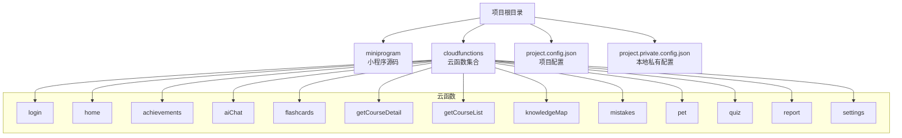
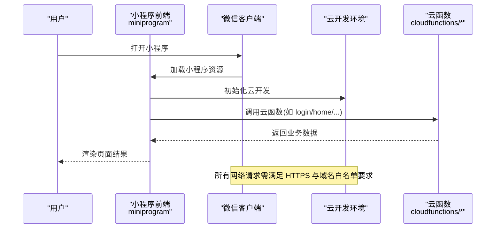
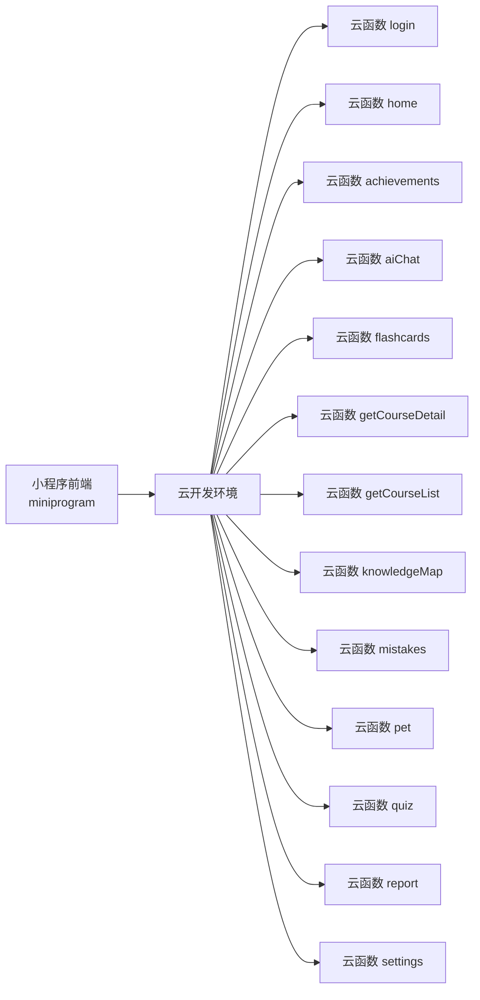

# 环境配置

<cite>
**本文引用的文件**   
- [project.config.json](file://project.config.json)
- [project.private.config.json](file://project.private.config.json)
- [miniprogram/app.json](file://miniprogram/app.json)
- [cloudfunctions/login/config.json](file://cloudfunctions/login/config.json)
- [cloudfunctions/home/config.json](file://cloudfunctions/home/config.json)
- [cloudfunctions/achievements/config.json](file://cloudfunctions/achievements/config.json)
- [cloudfunctions/aiChat/config.json](file://cloudfunctions/aiChat/config.json)
- [cloudfunctions/flashcards/config.json](file://cloudfunctions/flashcards/config.json)
- [cloudfunctions/getCourseDetail/config.json](file://cloudfunctions/getCourseDetail/config.json)
- [cloudfunctions/getCourseList/config.json](file://cloudfunctions/getCourseList/config.json)
- [cloudfunctions/knowledgeMap/config.json](file://cloudfunctions/knowledgeMap/config.json)
- [cloudfunctions/mistakes/config.json](file://cloudfunctions/mistakes/config.json)
- [cloudfunctions/pet/config.json](file://cloudfunctions/pet/config.json)
- [cloudfunctions/quiz/config.json](file://cloudfunctions/quiz/config.json)
- [cloudfunctions/report/config.json](file://cloudfunctions/report/config.json)
- [cloudfunctions/settings/config.json](file://cloudfunctions/settings/config.json)
</cite>

## 更新摘要
**所做更改**   
- 更新了项目基础库版本要求，从3.16.2升级到3.17.0
- 新增了基础库版本升级带来的兼容性说明和性能优化改进
- 更新了开发工具配置要求和环境初始化步骤
- 增强了多环境切换时的基础库版本管理指导

## 目录
1. [简介](#简介)
2. [项目结构](#项目结构)
3. [核心组件](#核心组件)
4. [架构总览](#架构总览)
5. [详细组件分析](#详细组件分析)
6. [依赖分析](#依赖分析)
7. [性能考虑](#性能考虑)
8. [故障排查指南](#故障排查指南)
9. [结论](#结论)
10. [附录](#附录)

## 简介
本环境配置文档面向生产环境的生物学习小程序部署与运维，覆盖以下关键主题：
- 微信小程序开发者工具配置要点
- 云开发环境初始化与权限模型
- 域名绑定、HTTPS 与 SSL 证书要求
- project.config.json 关键参数说明（应用标识、编译与上传相关）
- 各云函数 config.json 的配置项含义（权限、环境变量、依赖管理）
- 多环境（开发、测试、生产）差异与切换方法
- 安全策略与合规建议
- 运维检查清单与常见问题排查

**更新** 本项目已升级至微信小程序基础库版本3.17.0，带来了与新微信平台功能的兼容性和性能优化改进。

## 项目结构
仓库采用"小程序前端 + 云函数后端"的常见结构。根目录包含项目级配置文件与私有配置；小程序代码位于 miniprogram 目录；云函数位于 cloudfunctions 目录，每个云函数拥有独立的 config.json、index.js 与 package.json。

**图表来源**
- [project.config.json](file://project.config.json)
- [project.private.config.json](file://project.private.config.json)
- [miniprogram/app.json](file://miniprogram/app.json)
- [cloudfunctions/login/config.json](file://cloudfunctions/login/config.json)
- [cloudfunctions/home/config.json](file://cloudfunctions/home/config.json)
- [cloudfunctions/achievements/config.json](file://cloudfunctions/achievements/config.json)
- [cloudfunctions/aiChat/config.json](file://cloudfunctions/aiChat/config.json)
- [cloudfunctions/flashcards/config.json](file://cloudfunctions/flashcards/config.json)
- [cloudfunctions/getCourseDetail/config.json](file://cloudfunctions/getCourseDetail/config.json)
- [cloudfunctions/getCourseList/config.json](file://cloudfunctions/getCourseList/config.json)
- [cloudfunctions/knowledgeMap/config.json](file://cloudfunctions/knowledgeMap/config.json)
- [cloudfunctions/mistakes/config.json](file://cloudfunctions/mistakes/config.json)
- [cloudfunctions/pet/config.json](file://cloudfunctions/pet/config.json)
- [cloudfunctions/quiz/config.json](file://cloudfunctions/quiz/config.json)
- [cloudfunctions/report/config.json](file://cloudfunctions/report/config.json)
- [cloudfunctions/settings/config.json](file://cloudfunctions/settings/config.json)

**章节来源**
- [project.config.json](file://project.config.json)
- [project.private.config.json](file://project.private.config.json)
- [miniprogram/app.json](file://miniprogram/app.json)

## 核心组件
- 项目级配置
  - project.config.json：定义小程序 AppID、基础库版本、打包与上传相关选项等。
  - project.private.config.json：存放本地调试所需的私有信息（如本地 AppID、自定义域名等），不应提交到版本库。
- 小程序入口与全局配置
  - miniprogram/app.json：声明页面路由、窗口样式、底部 TabBar、网络白名单等。
- 云函数配置
  - 每个云函数目录下的 config.json：用于声明该云函数的运行环境与权限范围。

**更新** 项目基础库版本已从3.16.2升级到3.17.0，需要确保所有开发环境和生产环境都使用相同的基础库版本以获得最佳兼容性和性能。

**章节来源**
- [project.config.json](file://project.config.json)
- [project.private.config.json](file://project.private.config.json)
- [miniprogram/app.json](file://miniprogram/app.json)
- [cloudfunctions/login/config.json](file://cloudfunctions/login/config.json)
- [cloudfunctions/home/config.json](file://cloudfunctions/home/config.json)
- [cloudfunctions/achievements/config.json](file://cloudfunctions/achievements/config.json)
- [cloudfunctions/aiChat/config.json](file://cloudfunctions/aiChat/config.json)
- [cloudfunctions/flashcards/config.json](file://cloudfunctions/flashcards/config.json)
- [cloudfunctions/getCourseDetail/config.json](file://cloudfunctions/getCourseDetail/config.json)
- [cloudfunctions/getCourseList/config.json](file://cloudfunctions/getCourseList/config.json)
- [cloudfunctions/knowledgeMap/config.json](file://cloudfunctions/knowledgeMap/config.json)
- [cloudfunctions/mistakes/config.json](file://cloudfunctions/mistakes/config.json)
- [cloudfunctions/pet/config.json](file://cloudfunctions/pet/config.json)
- [cloudfunctions/quiz/config.json](file://cloudfunctions/quiz/config.json)
- [cloudfunctions/report/config.json](file://cloudfunctions/report/config.json)
- [cloudfunctions/settings/config.json](file://cloudfunctions/settings/config.json)

## 架构总览
下图展示了小程序端通过云开发调用云函数的整体流程，以及 HTTPS 与安全域名的关系。

**图表来源**
- [miniprogram/app.json](file://miniprogram/app.json)
- [cloudfunctions/login/config.json](file://cloudfunctions/login/config.json)
- [cloudfunctions/home/config.json](file://cloudfunctions/home/config.json)

## 详细组件分析

### 项目级配置（project.config.json）
- 作用
  - 指定小程序 AppID、基础库版本、打包与上传相关选项、云开发环境 ID 等。
- 关键参数说明（按类别）
  - 应用标识与环境
    - appid：小程序唯一标识，必须与微信公众平台一致。
    - setting：基础库版本、ES6 转 ES5、增强编译、分包优化等开关。
    - compileType：构建类型（小程序/小游戏）。
    - cloudfunctionRoot：云函数根目录路径。
    - libVersion：基础库版本号。**更新** 当前项目使用基础库版本3.17.0，提供了与新微信平台功能的兼容性和性能优化改进。
    - condition：调试器条件启动配置（便于快速定位问题）。
  - 上传与发布
    - uploadWithDependencies：是否随包上传依赖。
    - packNpmManually：是否手动管理 npm 依赖。
    - es6Enabled：是否启用 ES6 转 ES5。
    - minified：是否压缩混淆。
    - urlCheck：是否开启域名校验（生产环境建议开启）。
    - urlDomainList / urlRegex：合法域名白名单（仅对 HTTP 请求生效；云开发内部调用不受此限制）。
  - 其他
    - description、projectname、appname：项目元信息。
    - appid 与 environmentId：确保与微信公众平台和云开发控制台一致。
- 注意事项
  - 生产环境务必开启域名校验与 HTTPS 强制跳转。
  - 云函数根目录需与实际目录名一致，避免上传失败。
  - 若使用分包，请确认 subpackages 配置正确且主包体积符合限制。
  - **新增** 基础库版本3.17.0引入了新的API兼容性和性能优化，建议在所有环境中保持一致的版本以避免兼容性问题。

**章节来源**
- [project.config.json](file://project.config.json)

### 本地私有配置（project.private.config.json）
- 作用
  - 存放本地调试所需但不宜提交的敏感或差异化配置，例如本地 AppID、自定义调试域名等。
- 建议
  - 将敏感信息放入此文件，并在 .gitignore 中忽略。
  - 不同开发者可维护各自的私有配置，避免冲突。
  - **新增** 在基础库版本升级时，确保本地开发环境与项目配置中的基础库版本保持一致。

**章节来源**
- [project.private.config.json](file://project.private.config.json)

### 小程序全局配置（miniprogram/app.json）
- 作用
  - 声明页面路由、窗口样式、TabBar、网络白名单、插件与第三方服务域名等。
- 关键项
  - pages：页面路径数组。
  - window：全局窗口行为（导航栏、背景色等）。
  - tabBar：底部导航配置。
  - networkTimeout：各类网络请求超时时间。
  - permission：需要授权的接口列表。
  - requiredPrivateInfos：隐私接口声明。
  - sitemapLocation：站点地图位置。
- 注意
  - 若涉及外部 HTTP 域名，需在服务器侧完成 HTTPS 与 ICP 备案，并在平台后台添加域名白名单。
  - 云开发内部调用无需在此处配置域名白名单。
  - **新增** 基础库版本3.17.0可能带来一些新的API行为变化，建议在升级后进行全面的功能测试。

**章节来源**
- [miniprogram/app.json](file://miniprogram/app.json)

### 云函数配置（cloudfunctions/*/config.json）
- 通用字段说明
  - timeout：函数执行超时时间（秒）。
  - memorySize：内存大小（MB）。
  - envVariables：环境变量键值对，用于注入数据库连接串、密钥等。
  - dependencies：npm 依赖声明（通常由 package.json 管理，此处为可选补充）。
  - permissions：权限范围，控制云函数访问数据库、存储、短信等资源的范围。
- 典型云函数示例
  - login：登录鉴权、会话管理。
  - home：首页聚合数据。
  - achievements、flashcards、quiz、report、settings、mistakes、pet、aiChat、knowledgeMap、getCourseList、getCourseDetail：各自业务领域的数据读写与计算。
- 安全建议
  - 最小权限原则：仅在 permissions 中开放必要能力。
  - 环境变量隔离：不同环境使用不同的环境变量前缀或命名空间，避免泄露。
  - 超时与内存：根据实际负载调优，避免频繁触发限流或 OOM。

**章节来源**
- [cloudfunctions/login/config.json](file://cloudfunctions/login/config.json)
- [cloudfunctions/home/config.json](file://cloudfunctions/home/config.json)
- [cloudfunctions/achievements/config.json](file://cloudfunctions/achievements/config.json)
- [cloudfunctions/aiChat/config.json](file://cloudfunctions/aiChat/config.json)
- [cloudfunctions/flashcards/config.json](file://cloudfunctions/flashcards/config.json)
- [cloudfunctions/getCourseDetail/config.json](file://cloudfunctions/getCourseDetail/config.json)
- [cloudfunctions/getCourseList/config.json](file://cloudfunctions/getCourseList/config.json)
- [cloudfunctions/knowledgeMap/config.json](file://cloudfunctions/knowledgeMap/config.json)
- [cloudfunctions/mistakes/config.json](file://cloudfunctions/mistakes/config.json)
- [cloudfunctions/pet/config.json](file://cloudfunctions/pet/config.json)
- [cloudfunctions/quiz/config.json](file://cloudfunctions/quiz/config.json)
- [cloudfunctions/report/config.json](file://cloudfunctions/report/config.json)
- [cloudfunctions/settings/config.json](file://cloudfunctions/settings/config.json)

### 多环境差异与切换方法
- 环境划分
  - 开发环境：本地调试、快速迭代。
  - 测试环境：集成测试、灰度验证。
  - 生产环境：线上正式流量。
- 差异点
  - AppID：不同环境对应的小程序 AppID 不同。
  - 云开发环境 ID：不同环境使用独立的环境 ID。
  - 域名与证书：生产环境必须使用已备案的 HTTPS 域名与有效证书。
  - 环境变量：云函数 envVariables 中的数据库地址、密钥等需区分环境。
  - 功能开关：可通过环境变量或配置中心控制特性开关。
  - **新增** 基础库版本：所有环境应使用相同的基础库版本（当前为3.17.0）以确保兼容性。
- 切换方法
  - 在 project.config.json 中修改 appid 与 environmentId，并重新上传/发布。
  - 在云函数 config.json 的 envVariables 中更新对应环境变量。
  - 在微信公众平台后台配置不同环境的域名白名单与 HTTPS 设置。
  - 使用 project.private.config.json 保存本地调试差异，避免污染公共配置。
  - **新增** 升级基础库版本后，需要在所有环境中同步更新libVersion配置，并进行全面测试。

[本节为概念性说明，不直接分析具体文件]

### 域名绑定与 HTTPS/SSL 证书
- 域名要求
  - 必须为已备案的域名。
  - 必须支持 HTTPS，且证书链完整、未过期。
- 配置步骤
  - 在微信公众平台后台添加业务域名、socket 域名与下载域名。
  - 在服务器或 CDN 上部署 SSL 证书，并确保 443 端口正常响应。
  - 小程序内发起的外部 HTTP 请求将被拒绝，需统一走 HTTPS。
- 注意事项
  - 云开发内部调用不受域名白名单限制，但仍建议使用 HTTPS 最佳实践。
  - 子域名需逐一添加到白名单或使用通配符策略（视平台规则而定）。

[本节为概念性说明，不直接分析具体文件]

### 安全策略与合规
- 权限最小化
  - 云函数 permissions 仅开放必要能力。
  - 数据库与存储遵循最小可见范围。
- 输入校验与输出脱敏
  - 云函数层面对入参进行严格校验。
  - 敏感字段不在日志中打印。
- 密钥管理
  - 使用环境变量注入密钥，禁止硬编码。
  - 定期轮换密钥与证书。
- 传输安全
  - 全站 HTTPS，启用 HSTS（如适用）。
  - 合理设置 Cookie 属性（Secure、HttpOnly、SameSite）。

[本节为概念性说明，不直接分析具体文件]

### 基础库版本升级指南
- 版本要求
  - **更新** 当前项目使用微信小程序基础库版本3.17.0，相比之前的3.16.2版本带来了重要的兼容性改进和性能优化。
- 升级影响
  - API兼容性：新版本可能引入新的API或废弃旧API，需要进行兼容性测试。
  - 性能优化：3.17.0版本在渲染性能和内存管理方面有所改进。
  - 新功能支持：支持最新的微信平台和云开发功能。
- 升级步骤
  - 更新 project.config.json 中的 libVersion 配置为3.17.0。
  - 在开发者工具中切换到对应的基础库版本进行测试。
  - 进行全面的功能测试，特别是涉及新API的代码路径。
  - 在生产环境部署前，确保所有环境都使用相同的版本。
- 回滚策略
  - 如果升级后出现问题，可以临时回退到3.16.2版本进行问题定位。
  - 建议在测试环境充分验证后再推广到生产环境。

**章节来源**
- [project.config.json](file://project.config.json)

## 依赖分析
- 模块耦合
  - 小程序前端通过云开发 SDK 调用云函数，低耦合、高内聚。
  - 各云函数职责单一，彼此独立，便于扩展与维护。
- 外部依赖
  - 微信小程序运行时与云开发服务端。
  - 第三方服务（如 AI 聊天、报表导出）通过云函数间接调用。
- 风险点
  - 过度权限：云函数权限过大导致数据泄露风险。
  - 域名未备案或未启用 HTTPS：导致网络请求失败。
  - 环境变量泄露：导致密钥外泄。
  - **新增** 基础库版本不一致：不同环境使用不同版本可能导致兼容性问题。

**图表来源**
- [miniprogram/app.json](file://miniprogram/app.json)
- [cloudfunctions/login/config.json](file://cloudfunctions/login/config.json)
- [cloudfunctions/home/config.json](file://cloudfunctions/home/config.json)
- [cloudfunctions/achievements/config.json](file://cloudfunctions/achievements/config.json)
- [cloudfunctions/aiChat/config.json](file://cloudfunctions/aiChat/config.json)
- [cloudfunctions/flashcards/config.json](file://cloudfunctions/flashcards/config.json)
- [cloudfunctions/getCourseDetail/config.json](file://cloudfunctions/getCourseDetail/config.json)
- [cloudfunctions/getCourseList/config.json](file://cloudfunctions/getCourseList/config.json)
- [cloudfunctions/knowledgeMap/config.json](file://cloudfunctions/knowledgeMap/config.json)
- [cloudfunctions/mistakes/config.json](file://cloudfunctions/mistakes/config.json)
- [cloudfunctions/pet/config.json](file://cloudfunctions/pet/config.json)
- [cloudfunctions/quiz/config.json](file://cloudfunctions/quiz/config.json)
- [cloudfunctions/report/config.json](file://cloudfunctions/report/config.json)
- [cloudfunctions/settings/config.json](file://cloudfunctions/settings/config.json)

**章节来源**
- [miniprogram/app.json](file://miniprogram/app.json)
- [cloudfunctions/login/config.json](file://cloudfunctions/login/config.json)
- [cloudfunctions/home/config.json](file://cloudfunctions/home/config.json)
- [cloudfunctions/achievements/config.json](file://cloudfunctions/achievements/config.json)
- [cloudfunctions/aiChat/config.json](file://cloudfunctions/aiChat/config.json)
- [cloudfunctions/flashcards/config.json](file://cloudfunctions/flashcards/config.json)
- [cloudfunctions/getCourseDetail/config.json](file://cloudfunctions/getCourseDetail/config.json)
- [cloudfunctions/getCourseList/config.json](file://cloudfunctions/getCourseList/config.json)
- [cloudfunctions/knowledgeMap/config.json](file://cloudfunctions/knowledgeMap/config.json)
- [cloudfunctions/mistakes/config.json](file://cloudfunctions/mistakes/config.json)
- [cloudfunctions/pet/config.json](file://cloudfunctions/pet/config.json)
- [cloudfunctions/quiz/config.json](file://cloudfunctions/quiz/config.json)
- [cloudfunctions/report/config.json](file://cloudfunctions/report/config.json)
- [cloudfunctions/settings/config.json](file://cloudfunctions/settings/config.json)

## 性能考虑
- 云函数
  - 合理设置 timeout 与 memorySize，避免冷启动过长与内存不足。
  - 复用数据库连接与缓存对象，减少重复初始化开销。
  - 批量操作与分页查询，降低单次处理压力。
- 小程序前端
  - 合理使用分包与懒加载，缩短首屏时间。
  - 图片与静态资源走 CDN，启用压缩与缓存。
  - **新增** 利用基础库3.17.0的性能优化改进，特别是在渲染和内存管理方面。
- 网络
  - 合并请求、减少往返次数。
  - 启用 gzip 与 HTTP/2（如适用）。

[本节为通用指导，不直接分析具体文件]

## 故障排查指南
- 无法调用云函数
  - 检查 project.config.json 中的 environmentId 是否正确。
  - 确认云函数已上传并部署成功。
  - 查看云函数日志定位错误堆栈。
- 域名报错或请求失败
  - 确认域名已备案且 HTTPS 可用。
  - 检查微信公众平台后台的域名白名单是否包含目标域名。
  - 浏览器或抓包工具验证证书链完整性。
- 权限不足
  - 核对云函数 config.json 的 permissions 是否包含所需能力。
  - 检查数据库与存储的安全规则。
- 环境变量未生效
  - 确认云函数 config.json 的 envVariables 已正确配置。
  - 重启或重新部署云函数使变更生效。
- 本地与线上不一致
  - 对比 project.private.config.json 与 project.config.json 的差异。
  - 使用相同的基础库版本与 Node 版本进行复现。
  - **新增** 基础库版本不一致：确保所有环境都使用3.17.0版本，避免因版本差异导致的兼容性问题。
- 基础库相关问题
  - **新增** API兼容性错误：检查是否使用了3.17.0版本中已废弃的API。
  - **新增** 性能回归：对比升级前后的性能指标，必要时调整代码实现。
  - **新增** 新功能异常：针对3.17.0版本的新功能进行专项测试和验证。

**章节来源**
- [project.config.json](file://project.config.json)
- [project.private.config.json](file://project.private.config.json)
- [miniprogram/app.json](file://miniprogram/app.json)
- [cloudfunctions/login/config.json](file://cloudfunctions/login/config.json)
- [cloudfunctions/home/config.json](file://cloudfunctions/home/config.json)
- [cloudfunctions/achievements/config.json](file://cloudfunctions/achievements/config.json)
- [cloudfunctions/aiChat/config.json](file://cloudfunctions/aiChat/config.json)
- [cloudfunctions/flashcards/config.json](file://cloudfunctions/flashcards/config.json)
- [cloudfunctions/getCourseDetail/config.json](file://cloudfunctions/getCourseDetail/config.json)
- [cloudfunctions/getCourseList/config.json](file://cloudfunctions/getCourseList/config.json)
- [cloudfunctions/knowledgeMap/config.json](file://cloudfunctions/knowledgeMap/config.json)
- [cloudfunctions/mistakes/config.json](file://cloudfunctions/mistakes/config.json)
- [cloudfunctions/pet/config.json](file://cloudfunctions/pet/config.json)
- [cloudfunctions/quiz/config.json](file://cloudfunctions/quiz/config.json)
- [cloudfunctions/report/config.json](file://cloudfunctions/report/config.json)
- [cloudfunctions/settings/config.json](file://cloudfunctions/settings/config.json)

## 结论
通过规范化的项目配置、严格的域名与 HTTPS 策略、最小权限的云函数权限模型以及完善的多环境管理，可以显著提升生物学习小程序在生产环境的稳定性与安全性。随着基础库版本升级到3.17.0，项目获得了更好的兼容性和性能优化。建议在上线前完成全面的检查清单与回归测试，确保各项配置与策略均已到位，并特别关注基础库版本的一致性和兼容性测试。

[本节为总结性内容，不直接分析具体文件]

## 附录

### 生产环境部署检查清单
- 项目配置
  - AppID 与云开发环境 ID 与线上一致。
  - 域名校验与 HTTPS 强制跳转已开启。
  - 分包与资源压缩已启用。
  - **新增** 基础库版本统一为3.17.0，所有环境保持一致。
- 域名与证书
  - 域名已备案，证书链完整且未过期。
  - 微信公众平台后台已添加业务域名与 socket 域名。
- 云函数
  - 所有云函数已上传并部署。
  - permissions 遵循最小权限原则。
  - envVariables 已按环境隔离配置。
- 安全与合规
  - 无敏感信息硬编码。
  - 日志不包含敏感字段。
  - 已完成安全扫描与渗透测试（如适用）。
- 监控与告警
  - 云函数错误率与延迟阈值已配置。
  - 小程序崩溃与异常上报已接入。
- **新增** 基础库版本管理
  - 所有开发、测试、生产环境均使用3.17.0版本。
  - 已完成基础库升级后的兼容性测试。
  - 已验证新版本的性能优化效果。

[本节为通用清单，不直接分析具体文件]

### 基础库版本升级检查清单
- 升级前准备
  - 备份当前稳定版本代码。
  - 制定详细的升级计划和回滚方案。
  - 通知相关团队成员版本变更信息。
- 升级过程
  - 更新 project.config.json 中的 libVersion 为3.17.0。
  - 在开发者工具中切换到3.17.0基础库版本。
  - 清理项目缓存并重新编译。
- 测试验证
  - 功能测试：验证所有核心功能正常运行。
  - 兼容性测试：检查是否有API弃用警告。
  - 性能测试：对比升级前后的性能指标。
  - 回归测试：确保没有引入新的bug。
- 部署上线
  - 先在测试环境部署验证。
  - 逐步推广到生产环境。
  - 监控上线后的系统表现和用户反馈。

[本节为新增内容，提供基础库版本升级的具体操作指导]