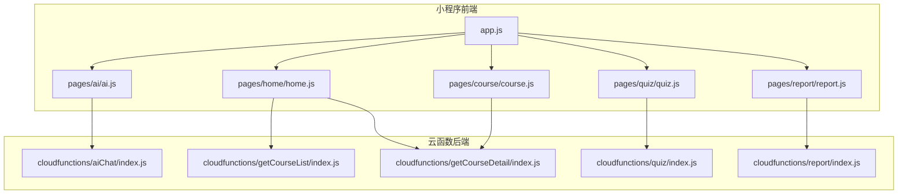
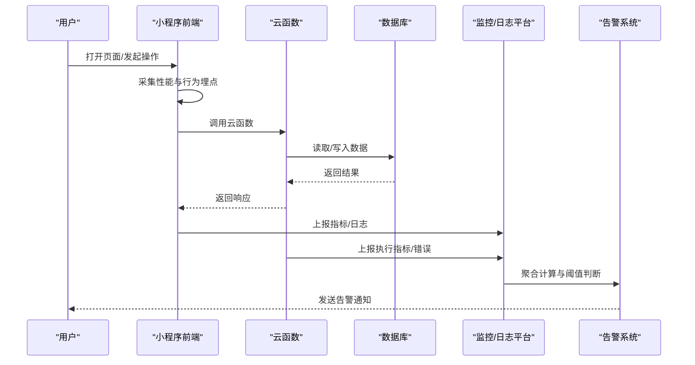
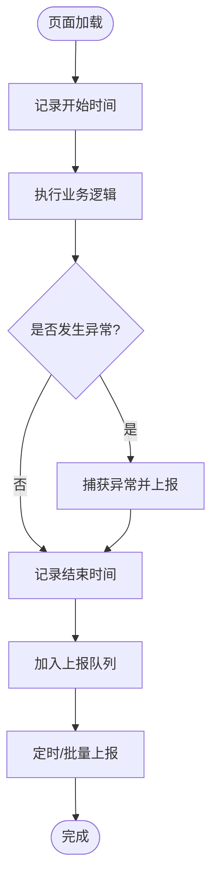
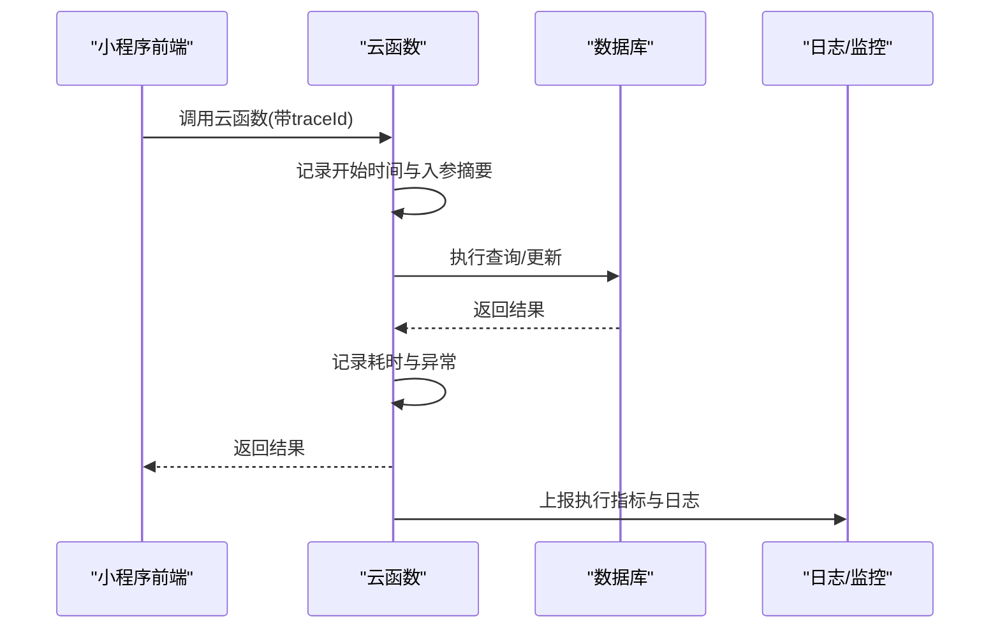
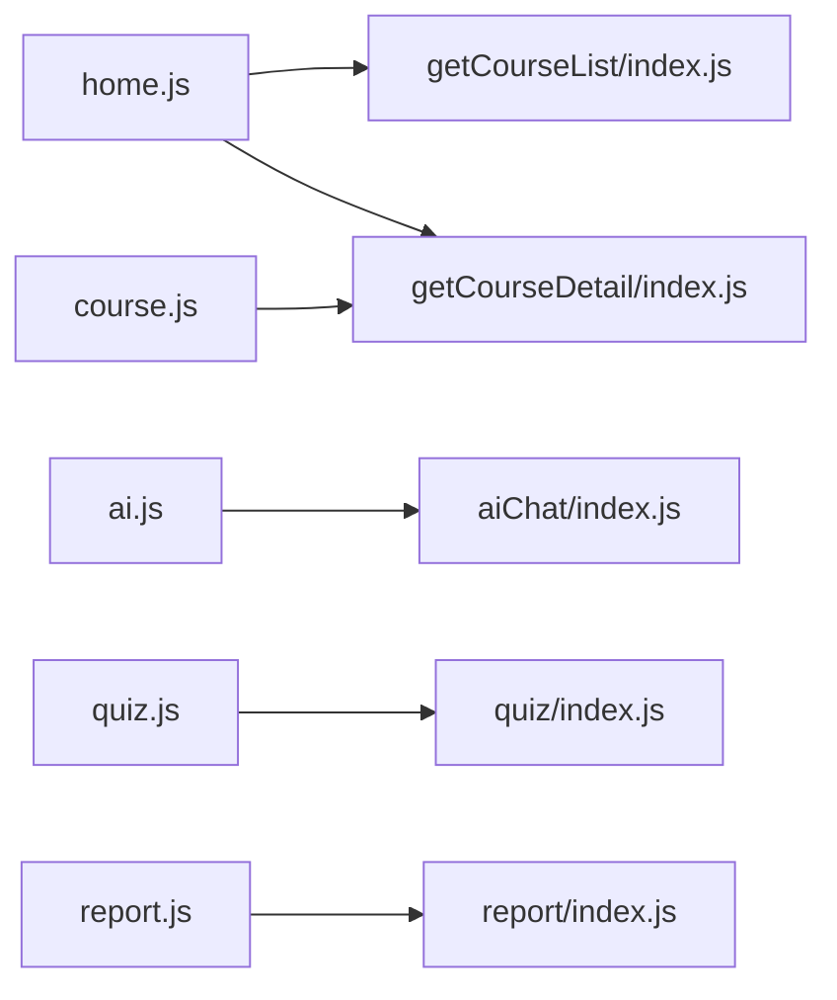

# 监控告警

<cite>
**本文引用的文件**   
- [app.js](file://miniprogram/app.js)
- [home.js](file://miniprogram/pages/home/home.js)
- [ai.js](file://miniprogram/pages/ai/ai.js)
- [course.js](file://miniprogram/pages/course/course.js)
- [quiz.js](file://miniprogram/pages/quiz/quiz.js)
- [report.js](file://miniprogram/pages/report/report.js)
- [index.js（云函数：aiChat）](file://cloudfunctions/aiChat/index.js)
- [index.js（云函数：getCourseList）](file://cloudfunctions/getCourseList/index.js)
- [index.js（云函数：getCourseDetail）](file://cloudfunctions/getCourseDetail/index.js)
- [index.js（云函数：quiz）](file://cloudfunctions/quiz/index.js)
- [index.js（云函数：report）](file://cloudfunctions/report/index.js)
</cite>

## 目录
1. [引言](#引言)
2. [项目结构](#项目结构)
3. [核心组件](#核心组件)
4. [架构总览](#架构总览)
5. [详细组件分析](#详细组件分析)
6. [依赖关系分析](#依赖关系分析)
7. [性能考虑](#性能考虑)
8. [故障排查指南](#故障排查指南)
9. [结论](#结论)
10. [附录](#附录)

## 引言
本文件面向运维与研发团队，系统化说明生物学习小程序的监控与告警方案。内容覆盖：
- 前端性能监控、用户行为追踪与错误日志收集
- 云函数执行监控、数据库查询监控与API调用监控
- 关键业务指标配置（用户活跃度、课程完成率、AI问答成功率等）
- 告警规则（错误率阈值、响应时间、资源使用）
- 可视化展示与报表生成
- 通知渠道（邮件、短信、企业微信）
- 监控面板使用指南与告警处理流程

## 项目结构
本项目采用“小程序前端 + 云函数后端”的常见架构。前端位于 miniprogram 目录，包含页面与全局入口；后端以云函数形式提供能力，如 AI 对话、课程列表/详情、测验与报告等。

图表来源
- [app.js](file://miniprogram/app.js)
- [home.js](file://miniprogram/pages/home/home.js)
- [ai.js](file://miniprogram/pages/ai/ai.js)
- [course.js](file://miniprogram/pages/course/course.js)
- [quiz.js](file://miniprogram/pages/quiz/quiz.js)
- [report.js](file://miniprogram/pages/report/report.js)
- [index.js（云函数：aiChat）](file://cloudfunctions/aiChat/index.js)
- [index.js（云函数：getCourseList）](file://cloudfunctions/getCourseList/index.js)
- [index.js（云函数：getCourseDetail）](file://cloudfunctions/getCourseDetail/index.js)
- [index.js（云函数：quiz）](file://cloudfunctions/quiz/index.js)
- [index.js（云函数：report）](file://cloudfunctions/report/index.js)

章节来源
- [app.js](file://miniprogram/app.js)
- [home.js](file://miniprogram/pages/home/home.js)
- [ai.js](file://miniprogram/pages/ai/ai.js)
- [course.js](file://miniprogram/pages/course/course.js)
- [quiz.js](file://miniprogram/pages/quiz/quiz.js)
- [report.js](file://miniprogram/pages/report/report.js)
- [index.js（云函数：aiChat）](file://cloudfunctions/aiChat/index.js)
- [index.js（云函数：getCourseList）](file://cloudfunctions/getCourseList/index.js)
- [index.js（云函数：getCourseDetail）](file://cloudfunctions/getCourseDetail/index.js)
- [index.js（云函数：quiz）](file://cloudfunctions/quiz/index.js)
- [index.js（云函数：report）](file://cloudfunctions/report/index.js)

## 核心组件
- 前端应用入口与生命周期
  - 负责初始化全局状态、埋点开关、错误捕获与上报策略。
  - 建议在全局启动时开启性能采集与异常上报，并统一设置上报队列与重试策略。
- 页面级监控
  - 首页、AI、课程、测验、报告等页面在加载、交互、网络请求前后记录耗时与事件。
- 云函数监控
  - 对每个云函数入口进行入参校验、执行计时、异常捕获与结果统计。
- 数据层监控
  - 对数据库读写操作进行耗时、失败次数与慢查询标记。
- 指标与告警
  - 定义关键指标口径与阈值，结合平台或自建系统实现可视化与告警。

章节来源
- [app.js](file://miniprogram/app.js)
- [home.js](file://miniprogram/pages/home/home.js)
- [ai.js](file://miniprogram/pages/ai/ai.js)
- [course.js](file://miniprogram/pages/course/course.js)
- [quiz.js](file://miniprogram/pages/quiz/quiz.js)
- [report.js](file://miniprogram/pages/report/report.js)
- [index.js（云函数：aiChat）](file://cloudfunctions/aiChat/index.js)
- [index.js（云函数：getCourseList）](file://cloudfunctions/getCourseList/index.js)
- [index.js（云函数：getCourseDetail）](file://cloudfunctions/getCourseDetail/index.js)
- [index.js（云函数：quiz）](file://cloudfunctions/quiz/index.js)
- [index.js（云函数：report）](file://cloudfunctions/report/index.js)

## 架构总览
下图展示了从前端到云函数的端到端监控链路，包括埋点采集、指标计算与告警触发。

图表来源
- [home.js](file://miniprogram/pages/home/home.js)
- [ai.js](file://miniprogram/pages/ai/ai.js)
- [course.js](file://miniprogram/pages/course/course.js)
- [quiz.js](file://miniprogram/pages/quiz/quiz.js)
- [report.js](file://miniprogram/pages/report/report.js)
- [index.js（云函数：aiChat）](file://cloudfunctions/aiChat/index.js)
- [index.js（云函数：getCourseList）](file://cloudfunctions/getCourseList/index.js)
- [index.js（云函数：getCourseDetail）](file://cloudfunctions/getCourseDetail/index.js)
- [index.js（云函数：quiz）](file://cloudfunctions/quiz/index.js)
- [index.js（云函数：report）](file://cloudfunctions/report/index.js)

## 详细组件分析

### 前端性能监控与错误日志
- 页面生命周期埋点
  - 在页面 onLoad/onShow 记录开始时间，在 onUnload/onHide 记录结束时间，计算页面停留时长与首屏耗时。
- 网络请求监控
  - 对 wx.request 或云函数调用进行包装，记录请求路径、方法、状态码、耗时与错误信息。
- 异常捕获
  - 全局 try/catch 包裹关键逻辑，捕获未处理异常并上报。
- 上报策略
  - 本地缓存+批量上报，弱网退避重试，避免阻塞主流程。

图表来源
- [home.js](file://miniprogram/pages/home/home.js)
- [ai.js](file://miniprogram/pages/ai/ai.js)
- [course.js](file://miniprogram/pages/course/course.js)
- [quiz.js](file://miniprogram/pages/quiz/quiz.js)
- [report.js](file://miniprogram/pages/report/report.js)

章节来源
- [home.js](file://miniprogram/pages/home/home.js)
- [ai.js](file://miniprogram/pages/ai/ai.js)
- [course.js](file://miniprogram/pages/course/course.js)
- [quiz.js](file://miniprogram/pages/quiz/quiz.js)
- [report.js](file://miniprogram/pages/report/report.js)

### 用户行为追踪
- 关键事件
  - 登录成功、进入课程、开始答题、提交答案、查看错题、完成测验、AI 提问与回复等。
- 事件属性
  - 用户标识、页面路径、设备信息、网络类型、耗时、结果码等。
- 隐私合规
  - 仅采集必要字段，支持匿名化与去标识化，遵循最小化原则。

章节来源
- [home.js](file://miniprogram/pages/home/home.js)
- [ai.js](file://miniprogram/pages/ai/ai.js)
- [course.js](file://miniprogram/pages/course/course.js)
- [quiz.js](file://miniprogram/pages/quiz/quiz.js)
- [report.js](file://miniprogram/pages/report/report.js)

### 云函数执行监控
- 入口封装
  - 在每个云函数入口记录入参摘要、执行开始时间、异常信息与返回结果摘要。
- 指标统计
  - QPS、P50/P90/P99 延迟、错误率、超时次数、内存/CPU 峰值（由平台提供）。
- 慢调用定位
  - 对超过阈值的调用输出堆栈与关键上下文，便于快速定位瓶颈。

图表来源
- [index.js（云函数：aiChat）](file://cloudfunctions/aiChat/index.js)
- [index.js（云函数：getCourseList）](file://cloudfunctions/getCourseList/index.js)
- [index.js（云函数：getCourseDetail）](file://cloudfunctions/getCourseDetail/index.js)
- [index.js（云函数：quiz）](file://cloudfunctions/quiz/index.js)
- [index.js（云函数：report）](file://cloudfunctions/report/index.js)

章节来源
- [index.js（云函数：aiChat）](file://cloudfunctions/aiChat/index.js)
- [index.js（云函数：getCourseList）](file://cloudfunctions/getCourseList/index.js)
- [index.js（云函数：getCourseDetail）](file://cloudfunctions/getCourseDetail/index.js)
- [index.js（云函数：quiz）](file://cloudfunctions/quiz/index.js)
- [index.js（云函数：report）](file://cloudfunctions/report/index.js)

### 数据库查询监控
- 指标维度
  - 读/写次数、平均耗时、慢查询数量、锁等待、连接池使用率。
- 告警策略
  - 慢查询阈值、错误率突增、连接池耗尽等。
- 优化建议
  - 索引优化、分页与限流、热点数据缓存。

章节来源
- [index.js（云函数：getCourseList）](file://cloudfunctions/getCourseList/index.js)
- [index.js（云函数：getCourseDetail）](file://cloudfunctions/getCourseDetail/index.js)
- [index.js（云函数：quiz）](file://cloudfunctions/quiz/index.js)
- [index.js（云函数：report）](file://cloudfunctions/report/index.js)

### API 调用监控
- 覆盖范围
  - 小程序到云函数的所有接口，以及云函数内部对第三方服务的调用（如有）。
- 关键指标
  - 成功率、延迟分布、错误分类（网络、鉴权、参数、业务）、重试与降级情况。
- 可观测性
  - 全链路 traceId 贯穿前端与云函数，便于问题定位。

章节来源
- [home.js](file://miniprogram/pages/home/home.js)
- [ai.js](file://miniprogram/pages/ai/ai.js)
- [course.js](file://miniprogram/pages/course/course.js)
- [quiz.js](file://miniprogram/pages/quiz/quiz.js)
- [report.js](file://miniprogram/pages/report/report.js)
- [index.js（云函数：aiChat）](file://cloudfunctions/aiChat/index.js)
- [index.js（云函数：getCourseList）](file://cloudfunctions/getCourseList/index.js)
- [index.js（云函数：getCourseDetail）](file://cloudfunctions/getCourseDetail/index.js)
- [index.js（云函数：quiz）](file://cloudfunctions/quiz/index.js)
- [index.js（云函数：report）](file://cloudfunctions/report/index.js)

### 关键业务指标与配置
- 用户活跃度
  - DAU/WAU/MAU、活跃会话数、人均访问时长、留存率。
- 课程完成率
  - 课程开始数、完成数、完成率、平均完成时长。
- AI 问答成功率
  - 成功回答数/总提问数、平均响应时间、失败原因分布。
- 测验相关
  - 参与人数、正确率、平均用时、错题分布。
- 配置建议
  - 按日/周/月粒度聚合，保留原始日志用于下钻分析。

章节来源
- [home.js](file://miniprogram/pages/home/home.js)
- [ai.js](file://miniprogram/pages/ai/ai.js)
- [course.js](file://miniprogram/pages/course/course.js)
- [quiz.js](file://miniprogram/pages/quiz/quiz.js)
- [report.js](file://miniprogram/pages/report/report.js)
- [index.js（云函数：report）](file://cloudfunctions/report/index.js)

### 告警规则配置
- 错误率阈值
  - 云函数整体错误率 > 1%（持续5分钟），或某接口错误率 > 5%。
- 响应时间监控
  - P95 延迟 > 1s，或 P99 延迟 > 3s。
- 资源使用告警
  - CPU/内存使用率 > 80%，连接池耗尽，磁盘空间不足。
- 业务告警
  - 课程完成率骤降 > 20%，AI 成功率 < 90%，DAU 环比下降 > 30%。
- 告警降噪
  - 合并相似告警、静默期、分级（提示/警告/严重）。

章节来源
- [index.js（云函数：aiChat）](file://cloudfunctions/aiChat/index.js)
- [index.js（云函数：getCourseList）](file://cloudfunctions/getCourseList/index.js)
- [index.js（云函数：getCourseDetail）](file://cloudfunctions/getCourseDetail/index.js)
- [index.js（云函数：quiz）](file://cloudfunctions/quiz/index.js)
- [index.js（云函数：report）](file://cloudfunctions/report/index.js)

### 可视化展示与报表生成
- 监控面板
  - 概览：QPS、错误率、延迟分布、资源使用。
  - 业务：活跃度、完成率、AI 成功率、测验表现。
  - 下钻：按页面/接口/用户分群/地域。
- 报表
  - 日报/周报/月报自动生成，导出 PDF/CSV。
  - 自定义看板与订阅推送。

章节来源
- [report.js](file://miniprogram/pages/report/report.js)
- [index.js（云函数：report）](file://cloudfunctions/report/index.js)

### 告警通知渠道配置
- 邮件
  - 收件人分组、模板变量、附件（报表）。
- 短信
  - 紧急告警通道，限制频率，防骚扰。
- 企业微信
  - 机器人 webhook，支持富文本与卡片消息。
- 通知策略
  - 按级别路由不同渠道，升级策略与确认闭环。

[本节为通用配置说明，不直接分析具体文件]

### 监控面板使用指南与告警处理流程
- 面板使用
  - 选择时间窗口、筛选维度、对比基线、查看趋势与异常点。
- 处理流程
  - 发现告警 -> 初步定位（前端/云函数/数据库）-> 恢复服务 -> 根因分析与改进 -> 复盘归档。
- 值班与升级
  - 明确责任人、SLA 目标、升级路径与沟通机制。

[本节为通用流程说明，不直接分析具体文件]

## 依赖关系分析
- 前端与云函数耦合点
  - 通过统一的接口约定与 traceId 传递，确保可观测性与问题定位。
- 云函数与数据库
  - 高频读接口需关注缓存与索引；写接口需关注事务与幂等。
- 外部依赖
  - 若涉及第三方服务，需增加熔断与降级策略。

图表来源
- [home.js](file://miniprogram/pages/home/home.js)
- [ai.js](file://miniprogram/pages/ai/ai.js)
- [course.js](file://miniprogram/pages/course/course.js)
- [quiz.js](file://miniprogram/pages/quiz/quiz.js)
- [report.js](file://miniprogram/pages/report/report.js)
- [index.js（云函数：getCourseList）](file://cloudfunctions/getCourseList/index.js)
- [index.js（云函数：getCourseDetail）](file://cloudfunctions/getCourseDetail/index.js)
- [index.js（云函数：aiChat）](file://cloudfunctions/aiChat/index.js)
- [index.js（云函数：quiz）](file://cloudfunctions/quiz/index.js)
- [index.js（云函数：report）](file://cloudfunctions/report/index.js)

章节来源
- [home.js](file://miniprogram/pages/home/home.js)
- [ai.js](file://miniprogram/pages/ai/ai.js)
- [course.js](file://miniprogram/pages/course/course.js)
- [quiz.js](file://miniprogram/pages/quiz/quiz.js)
- [report.js](file://miniprogram/pages/report/report.js)
- [index.js（云函数：getCourseList）](file://cloudfunctions/getCourseList/index.js)
- [index.js（云函数：getCourseDetail）](file://cloudfunctions/getCourseDetail/index.js)
- [index.js（云函数：aiChat）](file://cloudfunctions/aiChat/index.js)
- [index.js（云函数：quiz）](file://cloudfunctions/quiz/index.js)
- [index.js（云函数：report）](file://cloudfunctions/report/index.js)

## 性能考虑
- 前端
  - 减少首屏体积、按需加载、图片与静态资源压缩、懒加载。
- 云函数
  - 合理拆分函数、避免长事务、批量化 IO、引入缓存。
- 数据库
  - 索引设计、分页与游标、冷热分离、读写分离。
- 监控开销
  - 采样上报、异步落盘、控制日志量，避免影响主流程。

[本节为通用指导，不直接分析具体文件]

## 故障排查指南
- 快速定位
  - 通过 traceId 串联前端与云函数日志，定位失败节点。
- 常见问题
  - 网络超时、鉴权失败、参数校验错误、数据库慢查询、内存溢出。
- 回滚与恢复
  - 灰度发布、功能开关、自动回滚策略。
- 复盘改进
  - 根因分析、容量规划、代码与配置优化。

章节来源
- [index.js（云函数：aiChat）](file://cloudfunctions/aiChat/index.js)
- [index.js（云函数：getCourseList）](file://cloudfunctions/getCourseList/index.js)
- [index.js（云函数：getCourseDetail）](file://cloudfunctions/getCourseDetail/index.js)
- [index.js（云函数：quiz）](file://cloudfunctions/quiz/index.js)
- [index.js（云函数：report）](file://cloudfunctions/report/index.js)

## 结论
通过在前端与云函数两端完善埋点与监控，建立统一的指标体系与告警策略，可实现对用户体验与系统稳定性的全面保障。配合可视化面板与多渠道通知，运维团队能够快速发现问题、高效处置并持续优化。

## 附录
- 术语表
  - QPS、P50/P90/P99、DAU、SLA、traceId 等。
- 参考链接
  - 平台监控文档、云函数最佳实践、小程序性能优化指南。

[本节为补充信息，不直接分析具体文件]