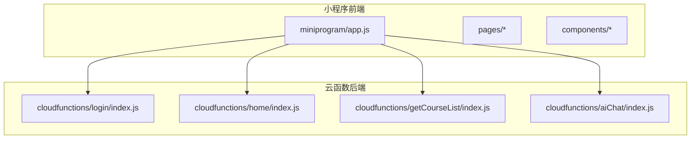
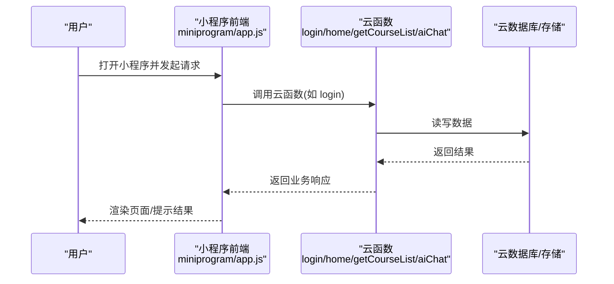
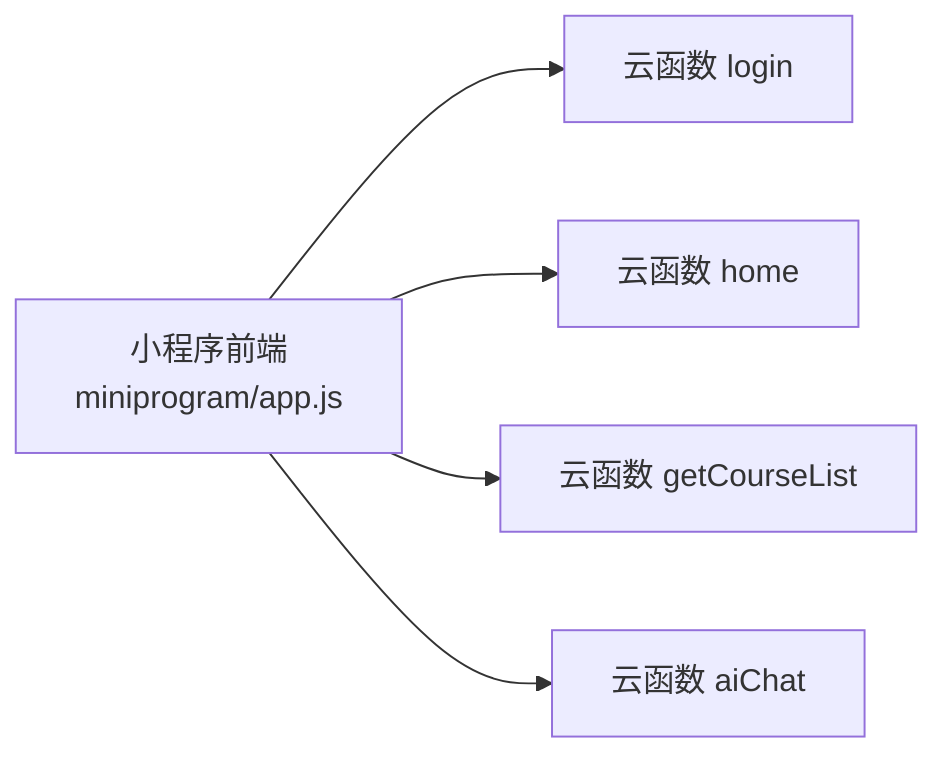

# 部署运维

<cite>
**本文引用的文件**   
- [project.config.json](file://project.config.json)
- [miniprogram/app.js](file://miniprogram/app.js)
- [cloudfunctions/login/index.js](file://cloudfunctions/login/index.js)
- [cloudfunctions/home/index.js](file://cloudfunctions/home/index.js)
- [cloudfunctions/getCourseList/index.js](file://cloudfunctions/getCourseList/index.js)
- [cloudfunctions/aiChat/index.js](file://cloudfunctions/aiChat/index.js)
</cite>

## 目录
1. [简介](#简介)
2. [项目结构](#项目结构)
3. [核心组件](#核心组件)
4. [架构总览](#架构总览)
5. [详细组件分析](#详细组件分析)
6. [依赖分析](#依赖分析)
7. [性能考虑](#性能考虑)
8. [故障排查指南](#故障排查指南)
9. [结论](#结论)
10. [附录](#附录)

## 简介
本文件面向生产环境的生物学习小程序，提供完整的部署与运维手册。内容覆盖云函数部署配置、环境变量管理、域名与安全策略、监控告警、日志收集、性能分析与容量规划、备份恢复、版本管理与回滚策略等，帮助运维团队稳定、高效地交付和运行服务。

## 项目结构
仓库采用“小程序前端 + 云函数后端”的常见形态：
- miniprogram：小程序前端代码（页面、组件、全局入口）
- cloudfunctions：按功能划分的云函数集合（登录、首页、课程列表、AI 对话等）
- docs：产品与设计文档
- project.config.json：微信开发者工具工程配置

图表来源
- [miniprogram/app.js](file://miniprogram/app.js)
- [cloudfunctions/login/index.js](file://cloudfunctions/login/index.js)
- [cloudfunctions/home/index.js](file://cloudfunctions/home/index.js)
- [cloudfunctions/getCourseList/index.js](file://cloudfunctions/getCourseList/index.js)
- [cloudfunctions/aiChat/index.js](file://cloudfunctions/aiChat/index.js)

章节来源
- [project.config.json](file://project.config.json)
- [miniprogram/app.js](file://miniprogram/app.js)

## 核心组件
- 小程序入口与基础能力
  - app.js：初始化小程序、注册全局状态、加载必要插件或配置
- 关键云函数
  - login：用户登录与会话建立
  - home：首页数据聚合
  - getCourseList：课程列表查询
  - aiChat：AI 对话接口

章节来源
- [miniprogram/app.js](file://miniprogram/app.js)
- [cloudfunctions/login/index.js](file://cloudfunctions/login/index.js)
- [cloudfunctions/home/index.js](file://cloudfunctions/home/index.js)
- [cloudfunctions/getCourseList/index.js](file://cloudfunctions/getCourseList/index.js)
- [cloudfunctions/aiChat/index.js](file://cloudfunctions/aiChat/index.js)

## 架构总览
整体为“小程序前端调用云函数”的无服务器架构。小程序通过云开发 SDK 直接调用云函数；云函数可访问数据库、存储、缓存等云资源。

图表来源
- [miniprogram/app.js](file://miniprogram/app.js)
- [cloudfunctions/login/index.js](file://cloudfunctions/login/index.js)
- [cloudfunctions/home/index.js](file://cloudfunctions/home/index.js)
- [cloudfunctions/getCourseList/index.js](file://cloudfunctions/getCourseList/index.js)
- [cloudfunctions/aiChat/index.js](file://cloudfunctions/aiChat/index.js)

## 详细组件分析

### 小程序端部署要点
- 工程配置
  - 使用 project.config.json 指定 AppID、环境 ID、上传路径、构建选项等
  - 建议区分开发与生产环境的环境变量与构建产物
- 运行时初始化
  - app.js 中完成 SDK 初始化、全局错误捕获、埋点上报等
- 安全与域名
  - 在微信公众平台配置合法域名白名单（如需外部 API）
  - 开启 HTTPS 强制与证书校验
  - 对敏感逻辑尽量下沉到云函数处理

章节来源
- [project.config.json](file://project.config.json)
- [miniprogram/app.js](file://miniprogram/app.js)

### 云函数通用部署流程
- 本地准备
  - 安装依赖：在每个云函数目录下执行依赖安装
  - 检查 package.json 与依赖锁定文件一致性
- 上传与发布
  - 使用开发者工具“上传并部署：云端安装依赖”
  - 或使用 CLI 批量部署脚本，实现自动化流水线
- 版本与回滚
  - 每次发布前打标签（Git tag），记录云函数版本
  - 保留历史版本快照，支持一键回滚

章节来源
- [cloudfunctions/login/package.json](file://cloudfunctions/login/package.json)
- [cloudfunctions/home/package.json](file://cloudfunctions/home/package.json)
- [cloudfunctions/getCourseList/package.json](file://cloudfunctions/getCourseList/package.json)
- [cloudfunctions/aiChat/package.json](file://cloudfunctions/aiChat/package.json)

### 环境变量与配置管理
- 推荐做法
  - 将不同环境的配置（如第三方密钥、超时时间、开关）放入云函数环境变量
  - 在云函数启动时读取环境变量，避免硬编码
- 安全建议
  - 不将密钥提交至代码库
  - 使用平台提供的密钥管理服务或加密存储
  - 最小权限原则分配云资源访问权限

章节来源
- [cloudfunctions/login/index.js](file://cloudfunctions/login/index.js)
- [cloudfunctions/home/index.js](file://cloudfunctions/home/index.js)
- [cloudfunctions/getCourseList/index.js](file://cloudfunctions/getCourseList/index.js)
- [cloudfunctions/aiChat/index.js](file://cloudfunctions/aiChat/index.js)

### 域名绑定与安全配置
- 小程序侧
  - 在公众平台设置 request/uploadFile/downloadFile 域名白名单
  - 启用 HTTPS 与 HSTS（若自托管后端）
- 云函数侧
  - 仅暴露必要接口，鉴权统一在云函数内校验
  - 限制调用频率与并发上限，防止滥用

章节来源
- [project.config.json](file://project.config.json)
- [miniprogram/app.js](file://miniprogram/app.js)

### 监控告警与日志收集
- 指标采集
  - 云函数维度：调用次数、成功率、P95/P99 耗时、错误率
  - 业务维度：登录成功数、课程列表命中率、AI 对话轮次
- 告警规则
  - 错误率阈值、慢请求比例、冷启动异常、内存/CPU 峰值
- 日志规范
  - 结构化日志（JSON），包含 traceId、userId、functionName、costTime、status
  - 分级输出（info/warn/error），避免打印敏感信息

章节来源
- [cloudfunctions/login/index.js](file://cloudfunctions/login/index.js)
- [cloudfunctions/home/index.js](file://cloudfunctions/home/index.js)
- [cloudfunctions/getCourseList/index.js](file://cloudfunctions/getCourseList/index.js)
- [cloudfunctions/aiChat/index.js](file://cloudfunctions/aiChat/index.js)

### 性能分析与优化
- 云函数
  - 减少冷启动：合理拆分函数、预热关键路径
  - 连接复用：数据库/缓存连接池
  - 异步化：I/O 密集任务异步处理
- 小程序
  - 首屏优化：按需加载、分包、图片压缩
  - 网络优化：合并请求、缓存热点数据
- 观测手段
  - 接入性能埋点，统计 TTI、FCP、LCP 等指标

章节来源
- [miniprogram/app.js](file://miniprogram/app.js)
- [cloudfunctions/home/index.js](file://cloudfunctions/home/index.js)
- [cloudfunctions/getCourseList/index.js](file://cloudfunctions/getCourseList/index.js)

### 备份恢复与容灾
- 数据备份
  - 定时全量+增量备份数据库与对象存储
  - 跨地域复制与保留策略（RPO/RTO）
- 恢复演练
  - 定期演练恢复流程，验证完整性与可用性
- 灰度与回滚
  - 灰度发布：小流量切流，观察指标后放量
  - 快速回滚：基于版本标签一键切换

章节来源
- [cloudfunctions/login/index.js](file://cloudfunctions/login/index.js)
- [cloudfunctions/home/index.js](file://cloudfunctions/home/index.js)
- [cloudfunctions/getCourseList/index.js](file://cloudfunctions/getCourseList/index.js)
- [cloudfunctions/aiChat/index.js](file://cloudfunctions/aiChat/index.js)

### 版本管理与发布流程
- 分支策略
  - main 保护分支，feature 分支开发，release 预发
- 变更控制
  - 代码评审、自动化测试、制品签名
- 发布清单
  - 更新依赖、迁移脚本、配置项、回滚预案

章节来源
- [project.config.json](file://project.config.json)
- [cloudfunctions/login/package.json](file://cloudfunctions/login/package.json)
- [cloudfunctions/home/package.json](file://cloudfunctions/home/package.json)
- [cloudfunctions/getCourseList/package.json](file://cloudfunctions/getCourseList/package.json)
- [cloudfunctions/aiChat/package.json](file://cloudfunctions/aiChat/package.json)

### 成本优化与容量规划
- 成本优化
  - 根据 QPS 与延迟目标选择合适规格与自动扩缩容策略
  - 冷热数据分层存储，降低存储成本
  - 清理无用依赖，减小包体，缩短冷启动
- 容量规划
  - 压测基线：确定单实例吞吐与并发上限
  - 弹性策略：CPU/内存/队列长度触发扩容
  - 峰值预留：大促/活动前扩容与限流降级预案

章节来源
- [cloudfunctions/home/index.js](file://cloudfunctions/home/index.js)
- [cloudfunctions/getCourseList/index.js](file://cloudfunctions/getCourseList/index.js)
- [cloudfunctions/aiChat/index.js](file://cloudfunctions/aiChat/index.js)

## 依赖分析
- 模块耦合
  - 小程序通过云函数解耦业务逻辑，前后端职责清晰
- 外部依赖
  - 第三方 SDK（如 AI 服务）应通过环境变量注入，避免硬编码
- 潜在风险
  - 循环依赖应避免
  - 大依赖包导致冷启动变慢，需评估必要性

图表来源
- [miniprogram/app.js](file://miniprogram/app.js)
- [cloudfunctions/login/index.js](file://cloudfunctions/login/index.js)
- [cloudfunctions/home/index.js](file://cloudfunctions/home/index.js)
- [cloudfunctions/getCourseList/index.js](file://cloudfunctions/getCourseList/index.js)
- [cloudfunctions/aiChat/index.js](file://cloudfunctions/aiChat/index.js)

章节来源
- [miniprogram/app.js](file://miniprogram/app.js)
- [cloudfunctions/login/index.js](file://cloudfunctions/login/index.js)
- [cloudfunctions/home/index.js](file://cloudfunctions/home/index.js)
- [cloudfunctions/getCourseList/index.js](file://cloudfunctions/getCourseList/index.js)
- [cloudfunctions/aiChat/index.js](file://cloudfunctions/aiChat/index.js)

## 性能考虑
- 云函数
  - 控制单次处理时长，必要时拆分为多步任务
  - 使用连接池与缓存命中降低数据库压力
- 小程序
  - 首屏资源懒加载，骨架屏提升感知速度
  - 列表虚拟化与分页加载
- 网络
  - 合理设置超时与重试退避策略
  - 失败快速失败与降级策略

[本节为通用指导，无需源码引用]

## 故障排查指南
- 常见问题定位
  - 登录失败：检查鉴权链路、会话有效期、错误码
  - 课程列表空：检查缓存命中、数据库索引、分页参数
  - AI 对话超时：检查第三方服务健康、超时与重试配置
- 排障步骤
  - 查看云函数日志与错误堆栈
  - 关联 traceId 追踪端到端请求
  - 对比最近变更（代码/配置/依赖）
- 应急措施
  - 快速回滚到上一稳定版本
  - 临时降级非核心功能，保障主流程可用

章节来源
- [cloudfunctions/login/index.js](file://cloudfunctions/login/index.js)
- [cloudfunctions/home/index.js](file://cloudfunctions/home/index.js)
- [cloudfunctions/getCourseList/index.js](file://cloudfunctions/getCourseList/index.js)
- [cloudfunctions/aiChat/index.js](file://cloudfunctions/aiChat/index.js)

## 结论
通过标准化的部署流程、完善的监控与日志体系、严格的版本与回滚策略，以及持续的成本优化与容量规划，可确保生物学习小程序在生产环境的高可用与高扩展性。建议结合业务增长曲线定期复盘指标与容量，持续改进系统韧性。

[本节为总结性内容，无需源码引用]

## 附录
- 术语
  - RPO：恢复点目标
  - RTO：恢复时间目标
  - P95/P99：延迟分位值
- 参考实践
  - 灰度发布与蓝绿部署
  - 混沌工程与故障演练
  - 可观测性三支柱：日志、指标、链路追踪

[本节为概念性内容，无需源码引用]