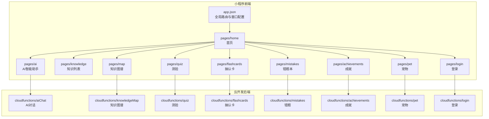
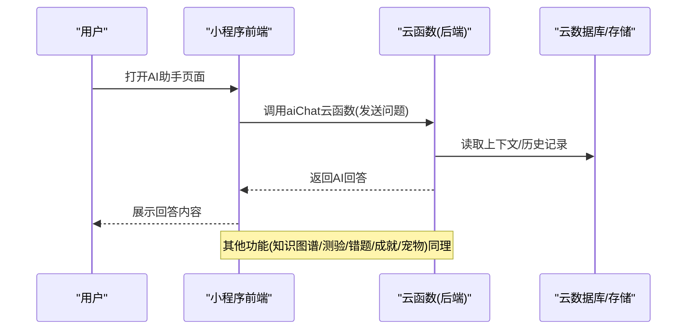
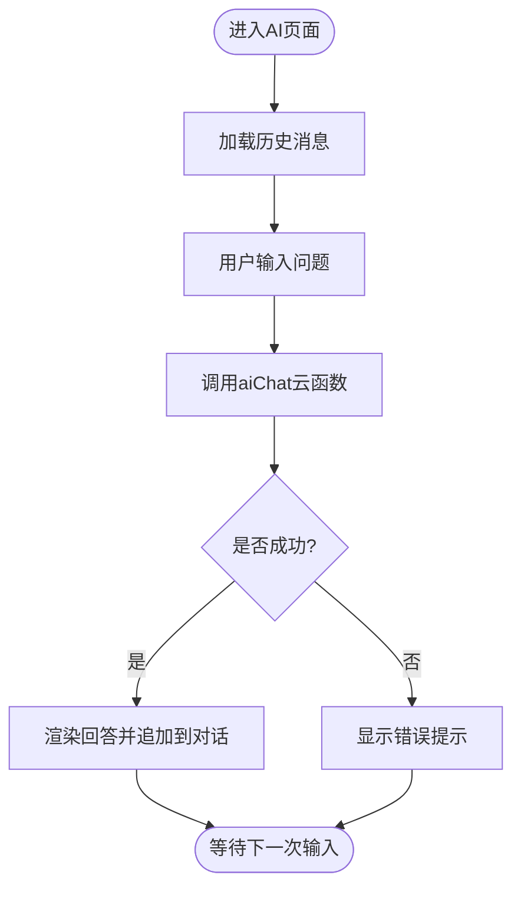
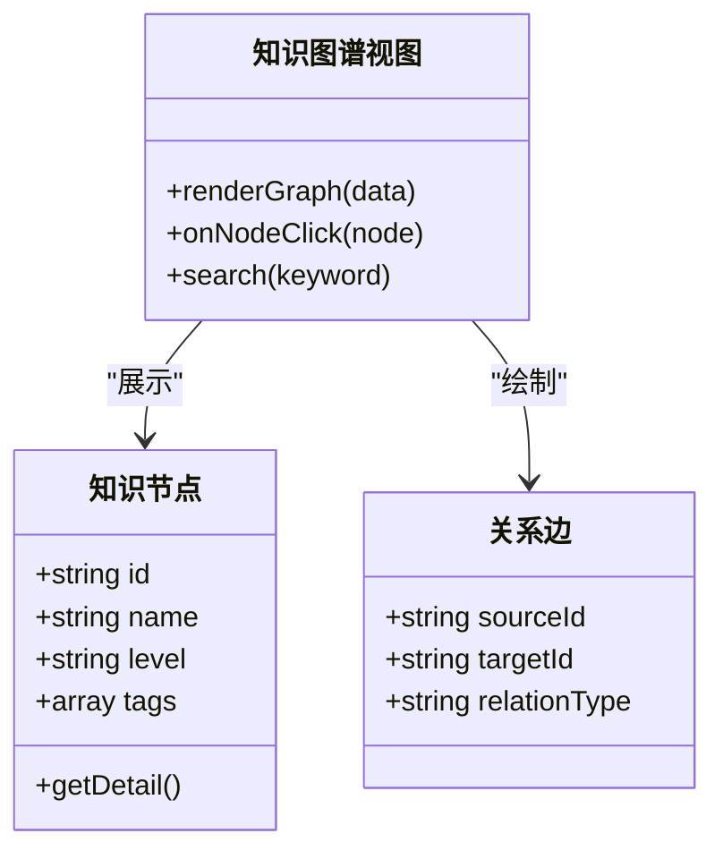
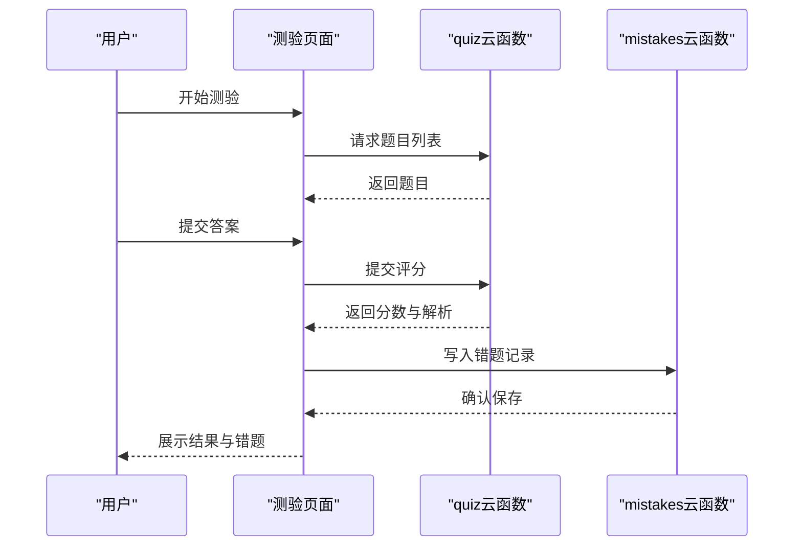
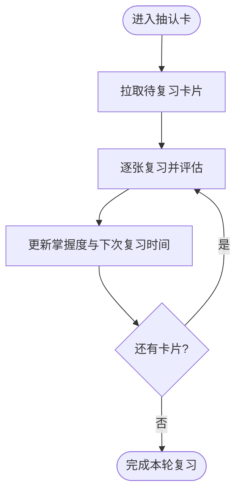
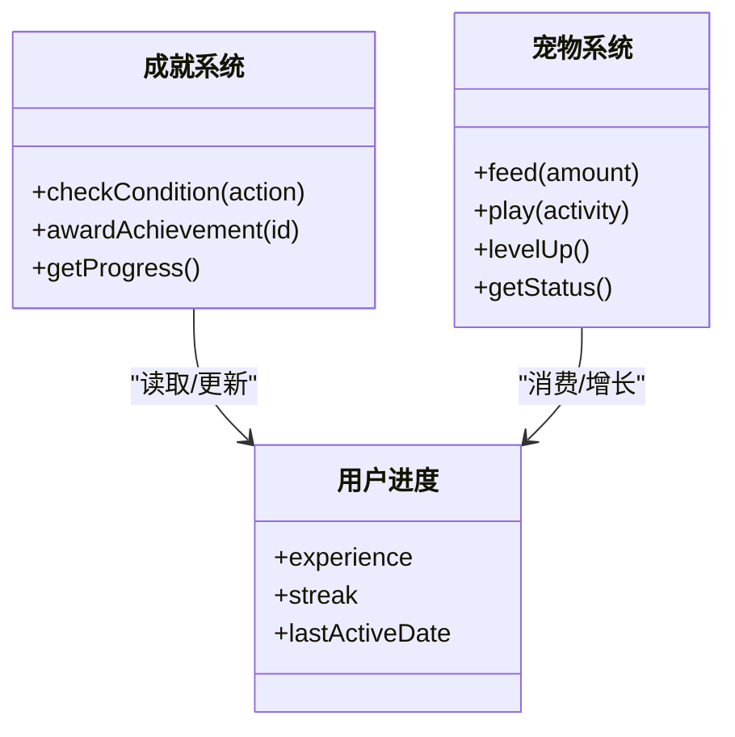
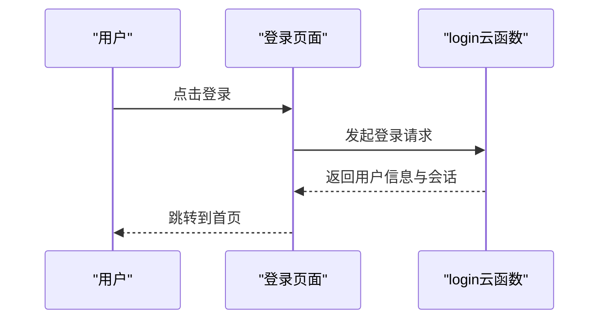
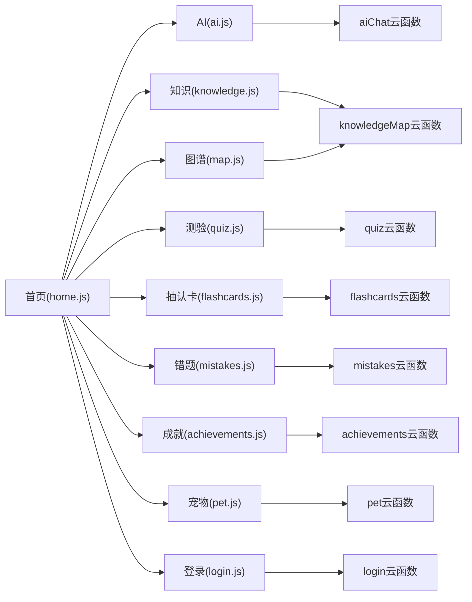

# 项目概述

<cite>
**本文引用的文件**   
- [project.config.json](file://project.config.json)
- [app.js](file://miniprogram/app.js)
- [app.json](file://miniprogram/app.json)
- [home.js](file://miniprogram/pages/home/home.js)
- [ai.js](file://miniprogram/pages/ai/ai.js)
- [knowledge.js](file://miniprogram/pages/knowledge/knowledge.js)
- [map.js](file://miniprogram/pages/map/map.js)
- [quiz.js](file://miniprogram/pages/quiz/quiz.js)
- [flashcards.js](file://miniprogram/pages/flashcards/flashcards.js)
- [mistakes.js](file://miniprogram/pages/mistakes/mistakes.js)
- [achievements.js](file://miniprogram/pages/achievements/achievements.js)
- [pet.js](file://miniprogram/pages/pet/pet.js)
- [login.js](file://miniprogram/pages/login/login.js)
- [index.js](file://cloudfunctions/aiChat/index.js)
- [index.js](file://cloudfunctions/knowledgeMap/index.js)
- [index.js](file://cloudfunctions/quiz/index.js)
- [index.js](file://cloudfunctions/flashcards/index.js)
- [index.js](file://cloudfunctions/mistakes/index.js)
- [index.js](file://cloudfunctions/achievements/index.js)
- [index.js](file://cloudfunctions/pet/index.js)
- [index.js](file://cloudfunctions/login/index.js)
</cite>

## 目录
1. [简介](#简介)
2. [项目结构](#项目结构)
3. [核心组件](#核心组件)
4. [架构总览](#架构总览)
5. [详细组件分析](#详细组件分析)
6. [依赖关系分析](#依赖关系分析)
7. [性能与体验考量](#性能与体验考量)
8. [故障排查指南](#故障排查指南)
9. [结论](#结论)
10. [附录：快速开始](#附录快速开始)

## 简介
本项目是一个面向生物学科学习的微信小程序，采用“小程序 + 云开发”的轻量技术栈，围绕“AI智能助手、知识图谱、游戏化学习”三大核心能力，构建沉浸式、可追踪、可反馈的学习闭环。通过课程学习、知识地图导航、错题本、抽认卡、闯关测验、成就系统与虚拟宠物等模块，帮助学习者建立系统化的知识结构，提升学习效率与兴趣。

教育意义与学习理念：
- 以知识图谱为骨架，串联知识点之间的关联，促进结构化理解与迁移应用。
- 借助AI智能助手提供即时答疑、个性化提示与学习路径建议，降低认知负荷。
- 引入游戏化机制（成就、宠物养成、闯关测验），增强内在动机与持续学习动力。
- 通过错题本与学习报告形成“学-练-测-评-改”的闭环，强化记忆与反思。

整体价值：
- 将复杂生物学概念可视化、互动化，使抽象知识更易理解。
- 利用云端能力实现数据同步与个性化推荐，支持多端一致体验。
- 低门槛部署与使用，适合学生自学与教师辅助教学场景。

## 项目结构
仓库采用“前端小程序 + 后端云函数”的分层组织方式：
- miniprogram：小程序前端页面与资源，包含首页、AI助手、知识图谱、测验、错题、成就、宠物等页面。
- cloudfunctions：按功能划分的云函数集合，对应登录、AI对话、知识图谱、测验、抽认卡、错题、成就、宠物等能力。
- docs：产品文档与设计说明。
- prototype：原型页面。
- project.config.json：微信开发者工具工程配置。

图表来源
- [app.json](file://miniprogram/app.json)
- [home.js](file://miniprogram/pages/home/home.js)
- [ai.js](file://miniprogram/pages/ai/ai.js)
- [knowledge.js](file://miniprogram/pages/knowledge/knowledge.js)
- [map.js](file://miniprogram/pages/map/map.js)
- [quiz.js](file://miniprogram/pages/quiz/quiz.js)
- [flashcards.js](file://miniprogram/pages/flashcards/flashcards.js)
- [mistakes.js](file://miniprogram/pages/mistakes/mistakes.js)
- [achievements.js](file://miniprogram/pages/achievements/achievements.js)
- [pet.js](file://miniprogram/pages/pet/pet.js)
- [login.js](file://miniprogram/pages/login/login.js)
- [index.js](file://cloudfunctions/aiChat/index.js)
- [index.js](file://cloudfunctions/knowledgeMap/index.js)
- [index.js](file://cloudfunctions/quiz/index.js)
- [index.js](file://cloudfunctions/flashcards/index.js)
- [index.js](file://cloudfunctions/mistakes/index.js)
- [index.js](file://cloudfunctions/achievements/index.js)
- [index.js](file://cloudfunctions/pet/index.js)
- [index.js](file://cloudfunctions/login/index.js)

章节来源
- [project.config.json](file://project.config.json)
- [app.js](file://miniprogram/app.js)
- [app.json](file://miniprogram/app.json)

## 核心组件
- AI智能助手：基于云函数的对话服务，提供即时问答、学习提示与路径建议。
- 知识图谱：以节点与边表示知识点及其关系，支持浏览、检索与跳转学习。
- 游戏化学习：成就系统、虚拟宠物与测验闯关，驱动持续学习与正向反馈。
- 测评与复习：测验、错题本与抽认卡，形成“学-练-测-评-改”闭环。
- 用户与数据：登录鉴权、学习进度与偏好设置，支撑个性化体验。

章节来源
- [ai.js](file://miniprogram/pages/ai/ai.js)
- [knowledge.js](file://miniprogram/pages/knowledge/knowledge.js)
- [map.js](file://miniprogram/pages/map/map.js)
- [quiz.js](file://miniprogram/pages/quiz/quiz.js)
- [flashcards.js](file://miniprogram/pages/flashcards/flashcards.js)
- [mistakes.js](file://miniprogram/pages/mistakes/mistakes.js)
- [achievements.js](file://miniprogram/pages/achievements/achievements.js)
- [pet.js](file://miniprogram/pages/pet/pet.js)
- [login.js](file://miniprogram/pages/login/login.js)

## 架构总览
系统采用前后端分离的云原生架构：小程序负责交互与展示，云函数承载业务逻辑与数据访问，统一通过云开发API进行通信。

图表来源
- [ai.js](file://miniprogram/pages/ai/ai.js)
- [index.js](file://cloudfunctions/aiChat/index.js)

## 详细组件分析

### AI智能助手
- 职责：接收用户提问，调用AI对话云函数，渲染对话流并维护会话上下文。
- 关键流程：页面初始化加载历史 -> 用户输入 -> 调用云函数 -> 解析响应 -> 更新UI。
- 错误处理：网络异常、权限不足、内容安全校验失败等需友好提示并重试。

图表来源
- [ai.js](file://miniprogram/pages/ai/ai.js)
- [index.js](file://cloudfunctions/aiChat/index.js)

章节来源
- [ai.js](file://miniprogram/pages/ai/ai.js)
- [index.js](file://cloudfunctions/aiChat/index.js)

### 知识图谱
- 职责：展示知识点节点与关系边，支持点击跳转详情、搜索与筛选。
- 关键流程：获取图谱数据 -> 渲染节点/边 -> 交互事件处理 -> 联动课程/测验入口。
- 数据模型：节点包含标识、名称、层级、标签；边包含源节点、目标节点、关系类型。

图表来源
- [knowledge.js](file://miniprogram/pages/knowledge/knowledge.js)
- [map.js](file://miniprogram/pages/map/map.js)
- [index.js](file://cloudfunctions/knowledgeMap/index.js)

章节来源
- [knowledge.js](file://miniprogram/pages/knowledge/knowledge.js)
- [map.js](file://miniprogram/pages/map/map.js)
- [index.js](file://cloudfunctions/knowledgeMap/index.js)

### 测验与错题本
- 职责：生成测验题目、记录作答结果、汇总错题并推送针对性练习。
- 关键流程：选择主题/难度 -> 拉取题目 -> 作答提交 -> 计算得分 -> 写入错题 -> 生成报告。
- 数据模型：题目包含题干、选项、正确答案、知识点标签；错题包含题号、错误原因、掌握度。

图表来源
- [quiz.js](file://miniprogram/pages/quiz/quiz.js)
- [mistakes.js](file://miniprogram/pages/mistakes/mistakes.js)
- [index.js](file://cloudfunctions/quiz/index.js)
- [index.js](file://cloudfunctions/mistakes/index.js)

章节来源
- [quiz.js](file://miniprogram/pages/quiz/quiz.js)
- [mistakes.js](file://miniprogram/pages/mistakes/mistakes.js)
- [index.js](file://cloudfunctions/quiz/index.js)
- [index.js](file://cloudfunctions/mistakes/index.js)

### 抽认卡
- 职责：基于艾宾浩斯遗忘曲线或间隔重复策略，推送卡片复习。
- 关键流程：选择主题 -> 拉取卡片 -> 翻转查看 -> 评估掌握度 -> 安排下次复习时间。
- 数据模型：卡片包含正面、背面、上次复习时间、掌握等级、下次复习时间。

图表来源
- [flashcards.js](file://miniprogram/pages/flashcards/flashcards.js)
- [index.js](file://cloudfunctions/flashcards/index.js)

章节来源
- [flashcards.js](file://miniprogram/pages/flashcards/flashcards.js)
- [index.js](file://cloudfunctions/flashcards/index.js)

### 成就与宠物
- 职责：通过达成学习目标解锁成就、喂养与升级虚拟宠物，形成正向激励。
- 关键流程：触发行为（学习/测验/复习） -> 计算经验值 -> 发放成就 -> 宠物成长。
- 数据模型：成就包含条件、奖励、状态；宠物包含等级、经验值、心情、健康值。

图表来源
- [achievements.js](file://miniprogram/pages/achievements/achievements.js)
- [pet.js](file://miniprogram/pages/pet/pet.js)
- [index.js](file://cloudfunctions/achievements/index.js)
- [index.js](file://cloudfunctions/pet/index.js)

章节来源
- [achievements.js](file://miniprogram/pages/achievements/achievements.js)
- [pet.js](file://miniprogram/pages/pet/pet.js)
- [index.js](file://cloudfunctions/achievements/index.js)
- [index.js](file://cloudfunctions/pet/index.js)

### 登录与用户管理
- 职责：完成微信授权登录、创建/更新用户资料、维护会话状态。
- 关键流程：发起登录 -> 调用登录云函数 -> 获取用户标识 -> 持久化本地状态。

图表来源
- [login.js](file://miniprogram/pages/login/login.js)
- [index.js](file://cloudfunctions/login/index.js)

章节来源
- [login.js](file://miniprogram/pages/login/login.js)
- [index.js](file://cloudfunctions/login/index.js)

## 依赖关系分析
- 前端依赖：小程序页面通过云开发API调用对应云函数，页面间通过全局状态与路由参数传递上下文。
- 后端依赖：各云函数独立部署，按功能域划分，避免耦合；共享云数据库与对象存储。
- 外部依赖：AI对话可能依赖大模型接口（由云函数封装），测验与抽认卡依赖题库与算法逻辑。

图表来源
- [home.js](file://miniprogram/pages/home/home.js)
- [ai.js](file://miniprogram/pages/ai/ai.js)
- [knowledge.js](file://miniprogram/pages/knowledge/knowledge.js)
- [map.js](file://miniprogram/pages/map/map.js)
- [quiz.js](file://miniprogram/pages/quiz/quiz.js)
- [flashcards.js](file://miniprogram/pages/flashcards/flashcards.js)
- [mistakes.js](file://miniprogram/pages/mistakes/mistakes.js)
- [achievements.js](file://miniprogram/pages/achievements/achievements.js)
- [pet.js](file://miniprogram/pages/pet/pet.js)
- [login.js](file://miniprogram/pages/login/login.js)
- [index.js](file://cloudfunctions/aiChat/index.js)
- [index.js](file://cloudfunctions/knowledgeMap/index.js)
- [index.js](file://cloudfunctions/quiz/index.js)
- [index.js](file://cloudfunctions/flashcards/index.js)
- [index.js](file://cloudfunctions/mistakes/index.js)
- [index.js](file://cloudfunctions/achievements/index.js)
- [index.js](file://cloudfunctions/pet/index.js)
- [index.js](file://cloudfunctions/login/index.js)

章节来源
- [home.js](file://miniprogram/pages/home/home.js)
- [ai.js](file://miniprogram/pages/ai/ai.js)
- [knowledge.js](file://miniprogram/pages/knowledge/knowledge.js)
- [map.js](file://miniprogram/pages/map/map.js)
- [quiz.js](file://miniprogram/pages/quiz/quiz.js)
- [flashcards.js](file://miniprogram/pages/flashcards/flashcards.js)
- [mistakes.js](file://miniprogram/pages/mistakes/mistakes.js)
- [achievements.js](file://miniprogram/pages/achievements/achievements.js)
- [pet.js](file://miniprogram/pages/pet/pet.js)
- [login.js](file://miniprogram/pages/login/login.js)

## 性能与体验考量
- 首屏优化：按需加载页面与懒加载图片，减少初始包体。
- 网络优化：云函数侧缓存热点数据，合并请求，避免频繁往返。
- 渲染优化：列表分页与虚拟滚动，控制DOM节点数量。
- 离线与弱网：关键数据本地缓存，失败重试与降级策略。
- 用户体验：清晰的状态反馈、错误提示与引导文案，保持操作一致性。

## 故障排查指南
- 登录失败：检查微信授权与云函数登录接口权限，确认用户标识是否正确持久化。
- AI无响应：核对网络连通性、云函数日志与内容安全策略，必要时重试或切换网络。
- 知识图谱不显示：验证图谱数据完整性与节点/边格式，检查渲染事件绑定。
- 测验无法提交：确认题目ID与答案格式，检查云函数评分逻辑与错题写入。
- 抽认卡未更新：检查掌握度计算与下次复习时间更新逻辑，确认数据同步。
- 成就/宠物异常：核对触发条件与经验值累计规则，检查状态一致性。

章节来源
- [login.js](file://miniprogram/pages/login/login.js)
- [ai.js](file://miniprogram/pages/ai/ai.js)
- [knowledge.js](file://miniprogram/pages/knowledge/knowledge.js)
- [map.js](file://miniprogram/pages/map/map.js)
- [quiz.js](file://miniprogram/pages/quiz/quiz.js)
- [mistakes.js](file://miniprogram/pages/mistakes/mistakes.js)
- [flashcards.js](file://miniprogram/pages/flashcards/flashcards.js)
- [achievements.js](file://miniprogram/pages/achievements/achievements.js)
- [pet.js](file://miniprogram/pages/pet/pet.js)

## 结论
本项目以“知识图谱+AI+游戏化”为核心，构建了系统化、可追踪、可持续的生物学习平台。通过小程序与云开发的结合，既保证了易用性与跨端一致性，又实现了灵活扩展与低成本运维。未来可在题库质量、AI能力与个性化推荐方面持续迭代，进一步提升学习效果与用户粘性。

## 附录：快速开始
- 环境要求
  - 安装微信开发者工具（稳定版）。
  - 准备已开通云开发能力的微信小程序账号。
- 安装步骤
  - 克隆或下载仓库至本地。
  - 使用微信开发者工具导入项目根目录。
  - 在开发者工具中配置小程序AppID与云开发环境ID。
  - 上传并部署所有云函数（cloudfunctions下每个子目录为一个云函数）。
  - 编译并预览小程序。
- 基本使用方法
  - 首页进入各功能模块：AI助手、知识图谱、测验、抽认卡、错题本、成就、宠物。
  - 首次使用需完成登录授权。
  - 根据提示完成基础学习路径，逐步解锁更多功能。

章节来源
- [project.config.json](file://project.config.json)
- [app.js](file://miniprogram/app.js)
- [app.json](file://miniprogram/app.json)